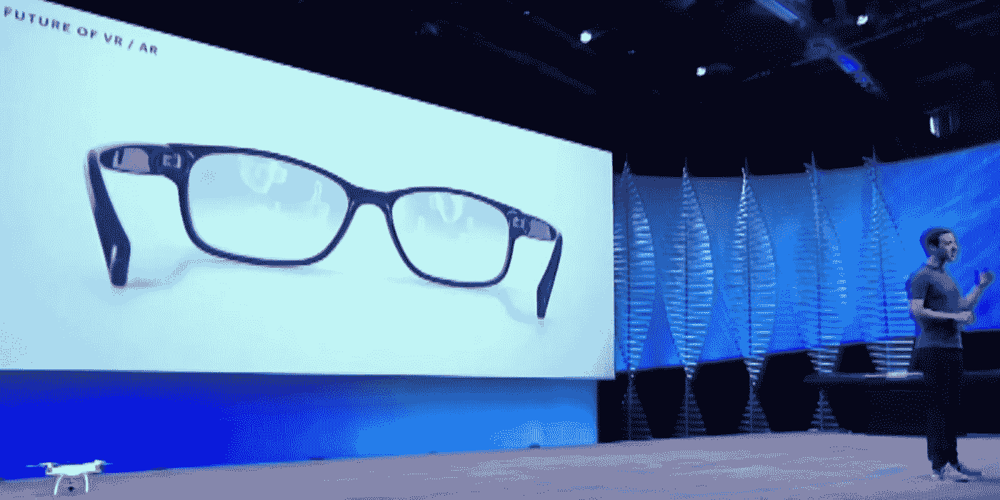
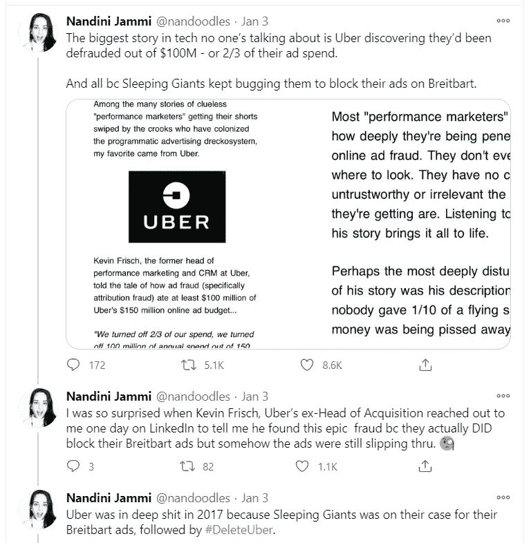
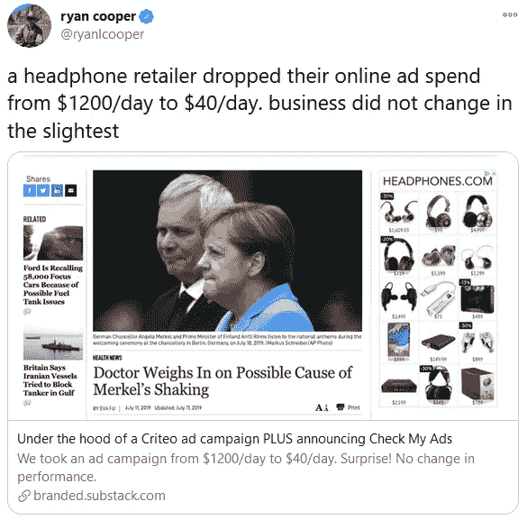

# 脸书:智能眼镜，哑数据

> 原文：<https://medium.datadriveninvestor.com/facebook-smart-glasses-dumb-data-73da55ea0c5a?source=collection_archive---------25----------------------->

## 不管你喜不喜欢，眼镜就要来了。

脸书一直在考虑 2020 年，但时间不长。

在一篇题为“不要回头看”的帖子中，该社交网络立即通过吹嘘其 2020 年的成功来违背标题的承诺。

值得注意的是，人们更多地使用虚拟现实，这增强了脸书对其即将推出的 Horizon 平台的愿景。

# 智能眼镜

接下来，他们展望了 2021 年。头条新闻是脸书煞费苦心传达的一副“智能互联网眼镜”，不提供增强现实。正如在《高科技》中提到的。去年，它们很可能是雷朋制造的。

这款眼镜将“宜早不宜迟”推出，很难知道是否真的有人向脸书索要过这样的设备。哦，太好了，我们不用拿着手机就可以直播脸书的暴动了。腾出手来进行抢劫和战斗。

那么，我们对眼镜了解多少？

脸书的硬件主管安德鲁·博斯沃思告诉彭博:

> *“我们对具体提供哪些功能讳莫如深。*
> 
> *我们对此感到兴奋，但不想过度宣传。*
> 
> 我们甚至没有称之为增强现实，我们只是称之为“智能眼镜”。”

嗯，我开窍了。

问题是，你和我对这些公司的了解足以知道这里在玩什么。

大型科技公司将继续发布智能眼镜，直到我们都屈服并戴上它们。尽管智能眼镜让你看起来像个书呆子(或“眼镜洞”，谷歌眼镜佩戴者的难忘绰号)，但它提供了一种将现实世界和数字世界结合起来的方式。

就目前的情况来看，一天中会有这样的时刻，当你和我把目光从屏幕上移开时(现在不要这样做)，无论多短暂，我们都不在线。见鬼，前几天我甚至停下来看了一棵树。

从大的技术角度来看，这些时刻的投资回报率可以忽略不计。这种低效率是不能容忍的。

但是，如果脸书(或谷歌，或苹果)能“看到”你所看到的，会怎么样呢？

如果他们可以告诉你关于那棵树的一切，而你不需要问，会怎么样？

如果他们可以应用一个“酷”的过滤器，直接从眼镜上传一张树的照片给你，会怎么样？

他们还会知道你在哪里，你的朋友是否去过那里，以及附近发生了什么。

所有这些数据都可以添加到你的社交档案中。像这样看树的人也看【此处插入广义】。

如果你想知道这一切，你可以拿起你的手机。毕竟，即使在你本该不在线的时候，你仍然会被跟踪。他们知道你在哪里，即使他们看不到你所看到的。

但你会伸手拿起手机，指向一棵树，阅读结果，然后点击其他内容的概率是多少？不是 100%，这还不够。

尽管我言过其实，但我是在遵循一个现有的逻辑得出一个潜在的极端结论。

我们正在远离基于 cookie 的跟踪，这将消除确定性匹配的有利途径。代替 cookies，我们被告知期待更多的概率匹配。

**简单来说，用确定性匹配，1 + 1 = 2。**

您知道这个人是谁，因为您在跨会话、设备和平台跟踪他们。因此，如果我在笔记本电脑上使用谷歌 Chrome，然后在手机上使用谷歌地图，由于我的用户 ID，谷歌在两个会话中都知道是我。Cookies 还被用来跟踪我的浏览行为，我访问了哪些网站等等。

脸书甚至获得了一项专利技术，可以根据“意外行为”锁定用户的账户。因此，该人将有帐户登录，但脸书会检测到他们没有以相同的方式作为'真正的'帐户持有人，并锁定他们。

**用概率匹配，1 + x = y.**

统计建模用于根据设备和会话是同一个人的可能性，将它们分组到一个松散的用户“ID”中。这对于扩大受众很有用，因为较低的置信区间意味着你倾向于瞄准更广泛的群体来获得你想要的结果。这也意味着使用基于行为的策略，专注于“意图信号”,而不仅仅是用同样的攻击性广告追随同样的人。

两者都有优点，但确定性建模是大型科技公司的基础。他们非常非常想知道你是谁，你在做什么。低于 100%意味着还有改进的空间。

原因显而易见。

在网络分析中，客户和销售之间的每一次额外点击都会降低最终转化率。即使是购物路上最简单的弯路，也会让一些人永远偏离正道。

脸书痛苦地意识到这一点。在过去(2019 年)，品牌可以在脸书上做广告，但他们必须派人去他们的网站才能完成销售。每当这种情况发生时，很多人都会改变主意，决定不买。

瞧，我们现在在脸书有了可以即时结账的商店。

对于大型科技公司来说，这些都是轻而易举的胜利，但它们只是朝着最终目标迈出的一步。这些公司需要保持增长，他们知道如果他们更接近客户的日常节奏，他们可以从广告中赚更多的钱。另请参阅:智能家居设备、健身追踪器、智能城市等等。

回到眼镜上，然后。很能说明问题的是，脸书在接受彭博采访时说:

> *“如果你有合适的技术，它就能让开。”*
> 
> *——安德鲁·博斯沃思，脸书*

这是真的，因为它是有关的。古老的格言“眼不见，心不烦”来到，嗯，记住。具有讽刺意味的是，通过直接对准我们的视野，我们将不再意识到大技术在我们日常生活中的存在。

当你拿起手机或在浏览器中输入地址时，你会意识到这些活动。如果您考虑数据的去向，您甚至会意识到其隐藏的后果。

脸书与雷朋的合作也很有启发性。人们把快照眼镜视为一种噱头，而不是一种有用的工具。雷朋将设计更吸引人的眼镜，但它们的作用也将解除用户的武装。

## 你会戴一副脸书品牌的眼镜吗？绝对不行。

## **你会戴一副内置脸书的雷朋眼镜吗？见上文。**

但是有些人会给他们机会。你可以确信，即使他们不这么做，脸书也会继续发布这些产品，直到我们让步。

苹果和谷歌也将很快发布智能眼镜。他们牢牢地盯着奖品。

# 哑数据

有一个持续的神话，即在线广告是超针对性的，准确的，可靠的。它吸引了那些想知道他们投资了什么和得到了什么回报的高管。谷歌和脸书都很乐意代表高管进行这些计算，并向他们展示他们想看到的东西。

仅谷歌一家每年就从在线销售广告中获利超过 1000 亿美元。

事实上，自称为“效果营销”的世界并不像它看起来那样。广告欺诈猖獗，跟踪远不如报道的准确，我们对哪些广告真正有效知之甚少。当然，你可以花钱在谷歌上站在人们面前，但你是在为无论如何都会发生的销售买单吗？谷歌标记自己的作业，所以它当然会说你的投资获得了巨大的回报。

越来越多的人意识到了这一点。

大型科技公司多年来一直参与诈骗。[最近的泄密](https://theintercept.com/2020/12/24/facebook-ad-targeting-small-business/)显示，至少从 2016 年开始，脸书的领导团队就一直在谈论他们广告工具的缺陷。

> *“超过一半的时间里，我们向广告客户的目标受众之外的人展示广告。”—脸书内部电子邮件*

他们将用于兴趣定位的数据描述为“垃圾”和“糟糕透顶”。作为回应，脸书称这些邮件被“断章取义”。

啊，是的，在上下文中,“垃圾”意味着“好”和“糟透了”,这是一个愉快的表达感情的词语。

2020 年 12 月，脸书的“广告诚信负责人”离开了这个总是费力不讨好的任务。

这个问题当然不仅限于脸书。我们在谷歌以及像 Criteo 这样的展示广告公司看到了同样的挫折。

优步决定审计他们 2017 年的广告支出，发现他们 1.5 亿美元的广告预算中有 1 亿美元被浪费了。

另一个故事是关于一个耳机零售商将他们的预算从 1200 美元/天减少到 40 美元/天，对他们的销售没有影响。

人们很难避免这样一种感觉，即在线广告即将面临清算。许多人通过兜售品牌需要不断增加支出来竞争的谎言来中饱私囊。有一个很好的审计这些账户的业务线，以节省品牌的钱，而不减少他们的销售。

脸书非常清楚它的数据是“垃圾”(他们的说法)，但他们肯定在想:如果我们可以用垃圾数据赚这么多钱，当数据好的时候我们能赚多少钱？

这些智能眼镜将为脸书带来实现这一飞跃所需的智能数据。

[*报名参加 hi，tech。时事通讯。*](https://hitech.substack.com/)