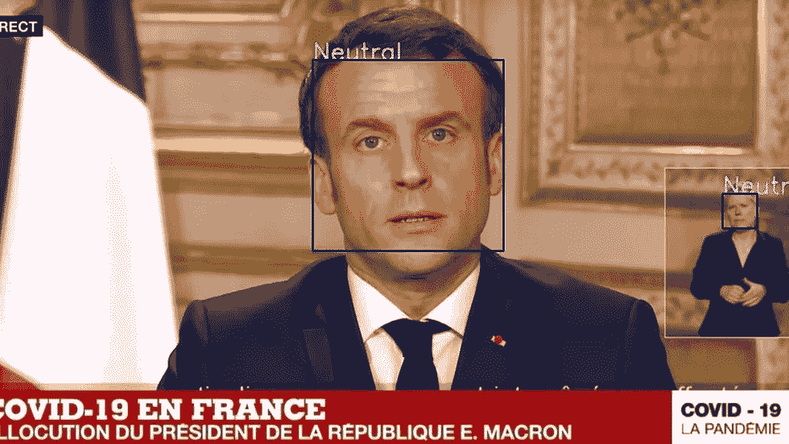
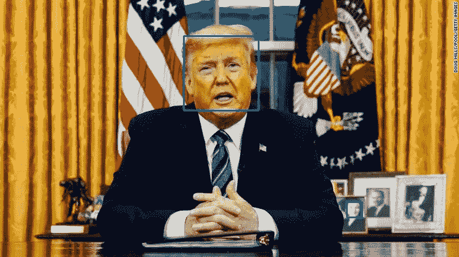
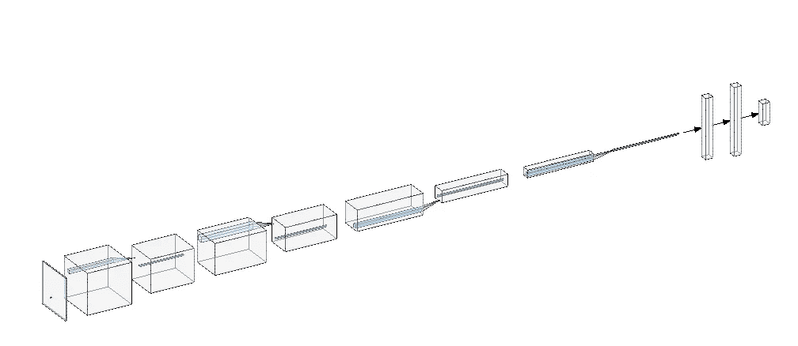
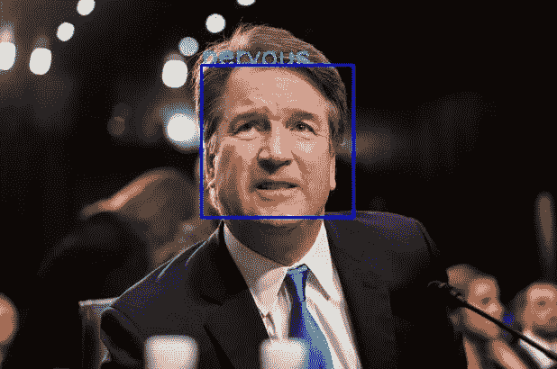
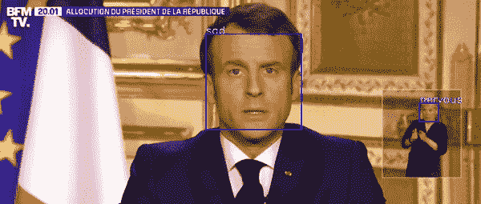
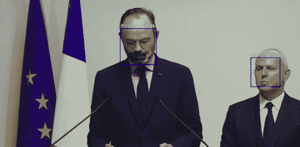

# 面部表情识别:世界领导人在告诉我们冠状病毒的真相吗？

> 原文：<https://medium.datadriveninvestor.com/facial-expression-recognition-are-the-world-leaders-telling-us-the-truth-about-the-coronavirus-b975ad810da8?source=collection_archive---------1----------------------->



(rights: own image)

> 让我们来分析一下世界领导人在公开声明中的表情。

最近，多位世界领导人对冠状病毒的威胁采取了立场。虽然大多数人认为冠状病毒是一种实际的危险，但其他一些人确实怀疑它的可信度，并想知道高层是否对我们隐瞒了真相。

在这篇文章中，我们将使用在 Kaggle 数据集上训练的自定义 CNN 来分析他们的面部表情(架构如下所示)，希望我们能够从中了解更多情况。

## 第 1 部分:人脸检测

我们应用于人脸检测的方法是 haarCascade，这是一种使用弱分类器和我们称之为 Haar 模式的增强技术。

下面是源代码和示例图片(图 1)(你可以在 [github repo](https://github.com/miki998/FacialExpressionRecognition) 中找到)

```
face_clf = cv2.CascadeClassifier('haarcascade_frontalface_default.xml')
font = cv2.FONT_HERSHEY_SIMPLEXdef process_image(path2file):
  img = cv2.imread(path2file)
  gray = cv2.cvtColor(img, cv2.COLOR_BGR2GRAY)
  faces = face_clf.detectMultiScale(gray, 1.3, 5)for (x, y, w, h) in faces:
  fc = gray[y:y+h, x:x+w]
  cv2.rectangle(img,(x,y),(x+w,y+h),(255,0,0),2)cv2.imwrite(path2file[:-4]+'out.jpg',img) #This is somehow hardcoded
```



fig.1 (rights: [source](https://edition.cnn.com/2020/03/12/politics/donald-trump-coronavirus-europe-travel/index.html))

## 第二部分:面部表情推断

首先，让我们介绍一下我们正在使用的 FER(面部表情识别)模型。神经网络的目标是将一张脸分为 7 类，代表不同的情绪(0 =愤怒，1 =厌恶，2 =恐惧，3 =快乐，4 =悲伤，5 =惊讶，6 =中性)。这是它粗略的架构。

*   尺寸为(48x48x1)的输入图层:灰度
*   4 个过滤器卷积(3×3)或(5×5 ),每个卷积后都有一个最大池(2×2)
*   2 个尺寸为 256 和 512 的完全连接层(按此顺序)
*   大小为(7x1)的输出层，用于情感的 7 个标签



fig.1 (rights: own image)

激活函数也是 ReLu，除了输出激活函数是 Softmax(很适合分类，给出 1 个概率的总和)。

备注:

*   CNN 的计算量不是很大，因为增加了漏失层，加上输入大小不是很大。
*   由于比较浅，培训时间也不会很长。
*   过滤器不大，一直只用(3x3)和(5x5)，没有(7x7)也没有(9x9)这对推理和训练时间有帮助。

下面是 CNN 的实现代码(图 2)。

fig.2 (rights: own image)

## 第 3 部分:表达式编码

现在，从这些基本的情绪中，我们可以找到数据集来训练我们的网络，我们将结合这些简单的情绪来创建任意更复杂的情绪，以便将它们应用到我们现有的图片上。我们想出的复杂情绪有‘自信’、‘紧张’、‘好玩’、‘中性’。我们用两种最可能的基本情绪来定义它们。

以下是我们用来将一幅图像与一种复杂的情绪联系起来的规则:

*   自信:[开心，中立]
*   紧张:[恐惧，任何]
*   中立:[中立，任何]

请记住，这些类别是任意定义的，由于主观性和数据的缺乏，这些复杂的情绪很难用受过训练的 CNN 来确定。

这是一个映射到复杂情绪的基本表达的例子(图 3)。



fig.3 (rights: [source](https://nypost.com/2018/09/17/senators-delay-kavanaugh-vote-set-public-hearing-with-accuser/))

## 第 4 部分:结果和分析

埃马纽埃尔·马克龙总统先生的例子(视频 1)



vid.1 (rights: own gif)

爱德华·菲利普总理先生的例子(视频 2)



vid.2 (rights: own gif)

vid.1 和 vid.2 的这两个演讲都是我们谈论对抗冠状病毒的措施的演讲。

如你所知，我们看到大多数时候法国的两位领导人在他们的演讲中都带着明显的“悲伤”和“紧张”。这两个人都是百分百认真的，显然都认为冠状病毒是一种威胁。从这个简单的分析中，我们确实看到，至少在这个特定的案例中，共谋的想法似乎是无效的。

可以进一步进行更深入的分析，以查明与给定说明相匹配的特定时刻。

你可以联系我以获得我所使用的准确的源代码。非常感谢您的阅读！如果你喜欢，请看看我的其他文章，因为你可能会发现有趣的话题！

你可以在这里找到我的博客，那里有其他的文章和产品。