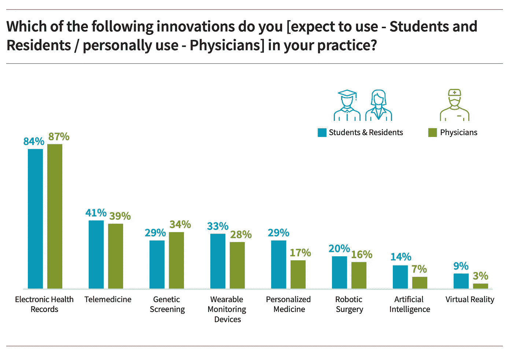
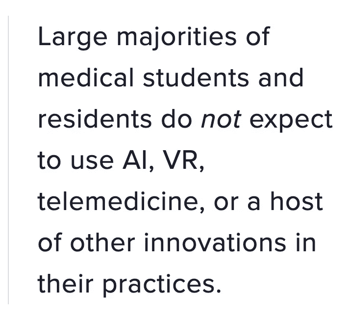
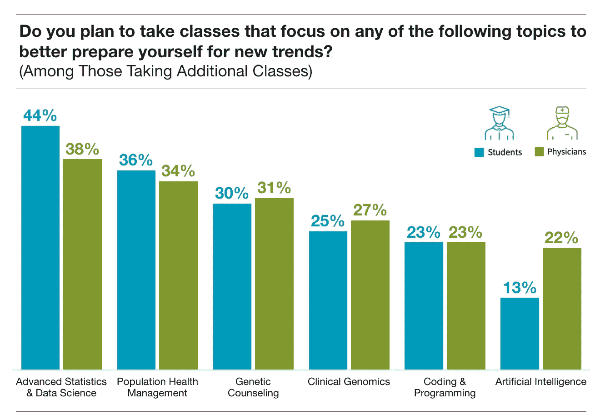
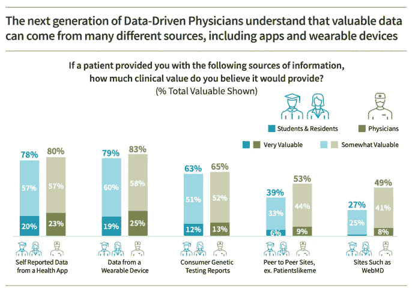
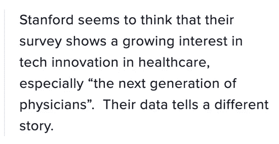

# 核实斯坦福 2020 年健康趋势报告

> 原文：<https://medium.datadriveninvestor.com/fact-checking-stanfords-2020-health-trends-report-8644d40008b?source=collection_archive---------9----------------------->

本月早些时候，斯坦福大学发布了年度健康趋势报告，标题是“数据驱动医生的崛起”前言描述了“一个正在经历翻天覆地变化的医疗保健行业，这是由成熟的数字健康市场、加速数据共享的新健康法律以及医学中人工智能的监管牵引推动的。”

 [## 医疗保健的未来正在被一场大型技术入侵所塑造|数据驱动型投资者

### 过去十年，全球经济的所有部门都经历了大规模的数字颠覆，而卫生部门现在…

www.datadriveninvestor.com](https://www.datadriveninvestor.com/2018/11/02/the-future-of-healthcare-is-being-shaped-by-a-big-tech-invasion/) 

为了衡量医生对这一技术健康地震的反应，斯坦福大学进行了“对 523 名美国医生和 210 名医学学生和住院医生的全面调查”。他们的结论(我强调):

> *我们的发现可以归结为一个中心思想:* ***医生期望新技术在近期内改变患者护理*** *，以及* ***他们正在积极准备将健康数据以及利用这些数据的技术整合到临床环境中*** *。换句话说，我们正在见证数据驱动型医生的崛起。*

毫无疑问，健康和医学技术正在迅速改变。但是医生们真的接受了这种变化吗？

让我们来看看这份报告的“一个中心思想”:

1.  “医生期望新技术在短期内改变患者护理”
2.  医生“正在积极准备将健康数据以及利用这些数据的技术整合到临床环境中”

看看斯坦福的调查数据是否支持它。

# 1 —“医生期望新技术在短期内改变患者护理”

在一个名为“未来医生工具包”的部分，斯坦福大学询问了学生和医生对我们的期望，或者在他们的实践中正在使用的创新。

正如我们从下图中看到的，大多数执业医师都在使用电子病历，在联邦政府数十亿美元的补贴后，这并不奇怪。或许也不足为奇的是，大多数执业医生(还)没有使用人工智能、虚拟现实、可穿戴设备、个性化医疗甚至远程医疗——更不用说机器人手术了。

更令人惊讶的是:**大多数居民和医学生也不希望使用这些技术**、**、**。大多数被调查的受训者并不期望“新技术在短期内改变病人护理”，他们根本不*也不*期望使用这些新技术！

*   86%的受访学生和居民不期望在实践中使用人工智能。
*   几乎 75%的人不期望使用基因筛查或个性化药物。
*   59%的人甚至不希望使用相对平淡的“远程医疗”。

# 2 —医生“正在积极准备将健康数据以及利用健康数据的技术整合到临床环境中”

为了测试这一命题，斯坦福大学的调查询问了受访者是否“目前正在寻找额外的培训或课程，以更好地为医疗保健创新做准备？”

根据调查，47%的医生(不清楚是否包括住院医生)回答是。医学生的比例是 73%。

因此，我们至少可以说，大多数医学生对为创新做准备感兴趣，而只有大约一半的“医生”感兴趣。

在那些说他们计划参加额外课程的人中，最受欢迎的话题是统计学、人口健康管理和遗传咨询(在下图中，我结合了学生和医生的数据):

# 我不认为这些数据意味着斯坦福认为他们意味着什么

那么，从斯坦福自己的数据中，我们能得出什么结论呢？我们能说医生们正在拥抱技术变革并为之“积极准备”吗？不尽然:根据他们自己的数据，大多数接受调查的医生不使用或不期望使用任何提到的创新——除了电子病历。大多数执业医师也不打算参加任何课程来为创新做准备。

一个亮点是，几乎四分之三的医科学生表示，他们确实计划参加课程，为新趋势做准备(相比之下，他们更资深的同事中大约有一半)。

但鉴于相当大一部分学生和居民不希望使用人工智能、基因筛查、虚拟现实或其他许多潜在创新，我们不得不怀疑:他们认为自己在为哪些新趋势做准备？

当要求学生、住院医生和主治医生重视各种创新数据源时，另一个令人担忧的迹象出现了:

尽管图的标题表明“下一代”将会发现这些新的数据来源的价值。。。数据显示，学生和居民更少(而不是更多)重视这些创新资源。每一组中的绝大多数人都没有将这些资源评为“非常有价值”。

斯坦福似乎认为，他们的调查显示出人们对医疗保健领域的技术创新越来越感兴趣，尤其是“下一代医生”。**他们的数据讲述了一个不同的故事:**

1.  执业医师、住院医师和学生都没有使用或期望使用我们这个时代最具潜在变革性的技术，包括人工智能、虚拟现实和远程医疗。
2.  虽然大多数医学生都对为技术创新做准备的课程感兴趣，特别是在数据科学方面，但他们实际上比年长的医生更不太可能重视创新的数据来源。

我的怀疑是，这些实习医生继续认为“健康数据”和“健康创新”是他们认为将在实践中使用的唯一 IT 创新的同义词:EHR。他们认识到，他们需要数据科学技能来使用所有的 EHR 数据，但他们显然不希望使用非 EHR 创新，或来自他们的数据。

这是否表明对将改变医疗保健的技术力量的无知令人担忧？还是对人工智能和其他创新的炒作持健康的怀疑态度？时间会证明一切。

*本文原载于*[*future health . live*](https://www.futurehealth.live/)*。*