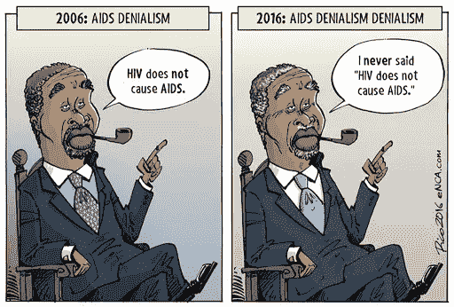

# 事实否认主义

> 原文：<https://medium.datadriveninvestor.com/facts-denialism-ee68d1452c99?source=collection_archive---------34----------------------->

## 人类摒弃伤害性事实和真相的能力。

Photo By [New Scientist](https://www.newscientist.com/round-up/living-in-denial/)

作为人类，我们倾向于忽视阻碍我们基础的事实。我们一直在寻找创新的方法来隐藏我们真实的感受和想法。例如，我们知道封锁被解除，病例增加。我们知道为了我们的安全，我们需要呆在室内，然而许多人对此一无所知，被发现在街上不戴口罩或在拥挤的地区闲逛。比如特朗普不顾专家建议，无视在公共场合戴口罩。

病毒传播更迅速的原因之一是，人们不愿意不顾明显的健康风险而选择事实。尽管出于安全原因，一个人应该保持社交距离或被孤立，但许多人并不想这样做，这种拒绝是如此不幸。由于未能遵守规范，人们表现出对科学或事实的更大排斥。

 [## 气候变化是地球重置内部恒温器的方式吗？数据驱动的投资者

### 气候变化怀疑论者喜欢指出，在其漫长的历史中，地球经历过以前的温度…

www.datadriveninvestor.com](https://www.datadriveninvestor.com/2019/06/07/is-climate-change-earths-way-of-resetting-its-internal-thermostat/) 

这比我们认识到的更普遍。

例如，全球变暖被许多人认为是一个神话。尽管有佐证，许多人否认不稳定的现实和原因。在这个问题上，人类一直拒绝接受，因为它要么被认为是假的，要么不值得回应。例如，唐纳德·特朗普曾经说过，“全球变暖的概念是由中国人创造的，是为了让美国制造业失去竞争力”。

*Climate Change Denialist* [*Photo By Ethos*](http://www.ethos.org.au/online-resources/engage-mail/climate-change-denialism)

人们甚至拒绝正统的、历史的和科学的事件，如进化论或声称艾滋病不存在。关于宗教和种族身份、政治或时事的问题被否认，仅仅是因为这与我们的立场不一致。因此，潜意识里，我们经常经历*动机推理*。

根据[卫报](https://www.theguardian.com/world/2008/nov/27/south-africa-aids-mbeki)的报道，南非是世界上艾滋病流行最严重的国家之一。90 年代末，塔博·姆贝基总统不愿意实施相关的预防政策，并拒绝科学共识。他受到否认艾滋病的彼得·杜斯伯格的影响，导致 33 万人死亡。再比如麻疹。绝大多数人如此易受其影响的原因是，反疫苗接种情绪仍然是一个普遍问题。疫苗的安全性和有效性因长期以来导致自闭症的阴谋而被否认。

Photo By [ENCA](https://www.enca.com/cartoon/rico-hivaids-denialism-last-decade)

尽管有科学的相关证据和后果，但让人害怕某样东西就是这么简单。

没有人想被贴上“否认主义者”或“拒绝承认”的标签。它包含了一个负面的内涵。一个人肯定会否认处于否认状态，因为这是侮辱。然而，否认根植于人类的本性。从短期来看，它可能是适应性的，因为它让我们的大脑有时间以自己的速度适应压力或不确定的信息。然而，长期不承认事实是不健康的。

否认事实是自然的，无处不在。然而，用逻辑论证和科学共识挑战否定论者可以显著降低它。揭露否认者散布的荒谬主张和错误信息以接受现实是至关重要的。

否认主义是一种自我欺骗。作为一个外行，我知道的不比专家多。尽管如此，我真诚地相信所有的解决方案都要求我们谦逊地承认我们的局限性，并在证据要求时放弃我们的先入之见。我们需要学会接受新的信息，重新评估自己的位置，分别改变自己的想法。事实和科学是真实的，不愿意接受它们是危险的。唯一能推翻迄今为止的科学共识的是额外的和更深入的科学。

**进入专家视角—** [**订阅 DDI 英特尔**](https://datadriveninvestor.com/ddi-intel)