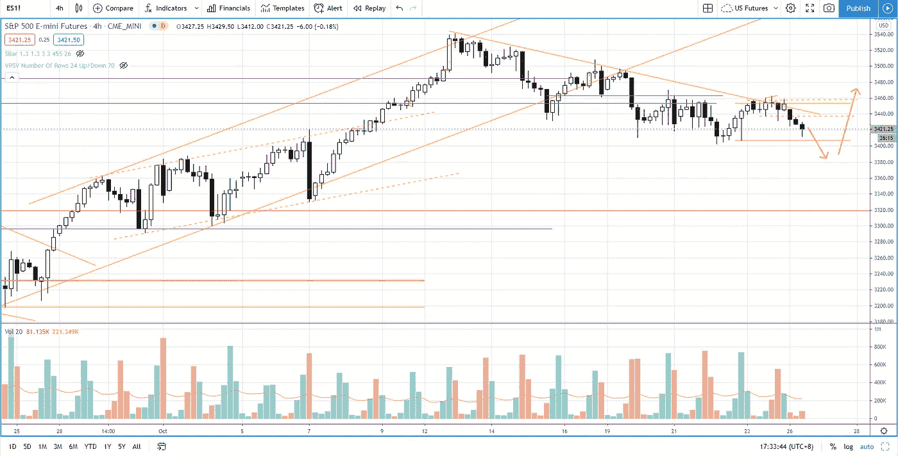

# 阻力区的失败——标准普尔 500 市场何去何从？

> 原文：<https://medium.datadriveninvestor.com/failure-at-the-resistance-zone-where-is-s-p-500-market-heading-c14b22d50c83?source=collection_archive---------22----------------------->

标准普尔 500 在 3450-3460 之间的阻力区失败。关注市场前景情景，找出股市走向。

在上周五的市场分析中的[看跌场景中提到了失败案例。观看视频，了解 2020 年 10 月 26 日交易时段标准普尔 500 指数期货的**每日市场分析。在这段视频中，你将看到上一个交易日的市场回顾，以及三分钟时间内的交易回顾(包括进场、出场和背后的理由)，内容是如何从阻力区的拒绝中获利。展望未来，我将涵盖偏见，要注意的关键水平，我稍后的交易计划。**](https://www.youtube.com/watch?v=l5tLwh76VFI)

## 时间戳

*   [1:18](https://www.youtube.com/watch?v=db8udFYU9ko&t=78s) 市场回顾
*   [3:05](https://www.youtube.com/watch?v=db8udFYU9ko&t=185s) 行业回顾
*   [9:16](https://www.youtube.com/watch?v=db8udFYU9ko&t=556s) 当前市场前景
*   [9:40](https://www.youtube.com/watch?v=db8udFYU9ko&t=580s) 阻力区
*   [11:11](https://www.youtube.com/watch?v=db8udFYU9ko&t=671s) 支撑区

如果你还没有看我在上一期的[每日市场分析视频](https://www.youtube.com/watch?v=l5tLwh76VFI)，以便更好地了解市场回顾和交易回顾。

**偏向** —中性(日内交易)；看涨(长期)

**关键点位** —阻力:3490–3500，3460；支持:3380–3400

**潜在设置** —在关键级别寻找潜在反转。

# 资源

**每周市场展望&最佳交易建议**直达您的收件箱:[https://www.tradeprecise.com/](https://www.tradeprecise.com/)

**职业免费**制图平台:创建账户→[www.TradingView.com](https://bit.ly/2U2Femd)

**非美国居民？** ( **、新加波**、澳洲、纽西兰、欧洲等……):[点击此处，存款 2000 新币](https://ji.hn/sgtiger)即可获得**免费股票(价值 100++ &美元)老虎经纪公司的欢迎礼物**

美国居民？[点击此处，当您存入 1500 美元](https://ji.hn/ustradeup)时，就有机会在 TradeUP 上获得一份**免费的 AMZN 股票(价值 3000++美元** ) & **欢迎礼物**

**无限制访问媒体文章** —加入以下:[https://priceactiontrading.medium.com/membership](https://priceactiontrading.medium.com/membership)

# 进一步阅读

 [## ARK Invest 的 Cathie Wood 预测基因组股表现优于特斯拉？

### 方舟投资公司的首席执行官凯西·伍德预测，最大的上涨惊喜可能来自基因组股票，尤其是…

medium.com](https://medium.com/datadriveninvestor/ark-invests-cathie-wood-predicts-genomic-stocks-outperform-tesla-b67f3c4bbc68)  [## 凯西·伍德警告市场即将调整——标准普尔 500 价格走势分析

### 在 2020 年 12 月 18 日对彭博的采访中，方舟投资公司的首席执行官兼首席信息官凯西·伍德警告说…

medium.com](https://medium.com/datadriveninvestor/cathie-wood-warns-market-correction-soon-price-action-analysis-on-s-p-500-7e621e013310)  [## DDOG、MDB、净价行为分析——大规模行动即将到来？[内部关键级别]

### 了解为什么会有潜在的大规模迁移，以及 DDOG、MDB 和 NET 的关键扩展级别。

medium.com](https://medium.com/datadriveninvestor/ddog-mdb-net-price-action-analysis-massive-move-coming-key-levels-inside-b229d18e65ec) 

Photo by Author — Ming Jong Tey

Photo by Author — Ming Jong Tey

披露:如果您点击本文中的链接进行购买或开立账户，并将所需金额存入推荐的经纪人账户，我们将免费为您赚取佣金。

免责声明:本演示中的信息仅用于教育目的，不应作为投资建议。