# 人工智能中的偏见——公平与偏见

> 原文：<https://medium.datadriveninvestor.com/fairness-and-bias-in-artificial-intelligence-c7fbfe880df?source=collection_archive---------12----------------------->

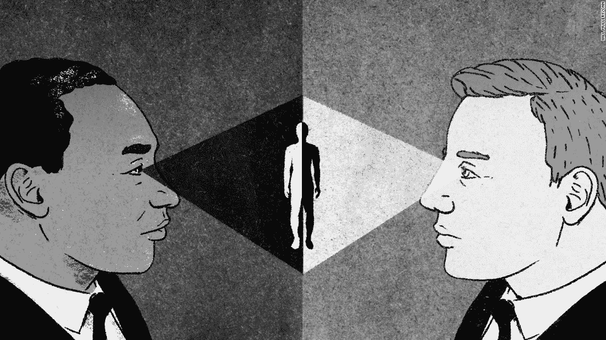

***艾中的偏见***

## **报道偏差**

> ***报告偏差*** *当数据集中捕获的事件、属性和/或结果的频率不能准确反映其真实频率时，就会出现报告偏差。这种偏见可能会出现，因为人们倾向于记录不寻常或特别难忘的情况，认为普通情况可以“不言而喻”。*[*@谷歌*](https://developers.google.com/machine-learning/crash-course/production-ml-systems)

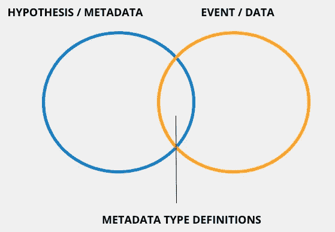

# 用统计熵解释报告偏差

## **案例研究 1**

> *使用移动摄像机或数码相机作为测速枪检测器来检测车辆的速度变化。为了检测速度，首先检测车辆，然后计算图像的振幅。*

***参考文章***

***【光流估计】***[http://www . cs . Toronto . edu/~ fleet/research/Papers/Flow chapter 05 . pdf](http://www.cs.toronto.edu/~fleet/research/Papers/flowChapter05.pdf)

## **案例研究 2**

> *仪表板摄像头安装在车辆内部，用于检测变道错误。为了检测运动，首先检测车辆，然后评估视频中图像的图形。*

***参考文章***

***【一篇关于感知压力问卷的论文参考司机用 dash cam】***【https://www.ncbi.nlm.nih.gov/pmc/articles/PMC5981243/ 

***1。问题解释:事件频率的捕获***

*案例研究 1:(使用像素值阈值捕获事件频率)*

[使用 OpenVINO 的车辆检测](https://github.com/nscalo/ai-in-business/raw/main/Courses/Production-ML-Systems/far_entrance.0.gif)

[使用光流估计和包围盒的车辆检测](https://github.com/nscalo/ai-in-business/raw/main/Courses/Production-ML-Systems/output_annotated_330.gif)

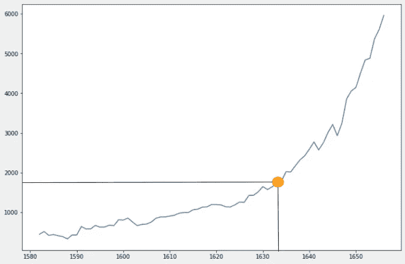

> 在上面的两个示例视频中，每个边界框内的点数是在一组帧上计算的。相同的曲线图用于示出在选定频率下的帧 1633。

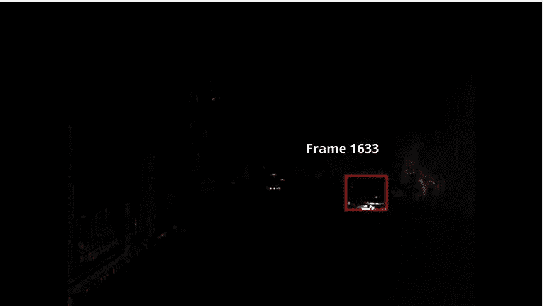

> 挑战在于将颗粒计数的信息图转换成可用的统计数据，例如距离和速度，甚至显示统计熵的直接影响的参数。

## —如何从指数图中提取参数

下面的示例代码从边界框矩形内的点提取正值。

```
def get_lookback_frame(points, lookback_frames):
 **# shift points by 1 frame**
    return points.shift(1).rolling(window=lookback_frames).min()def get_long_signal(points, lookback_frame):
 **# calculate the steadily increasing part of the evaluating graph**
    long = (points > lookback_frame).astype(np.int64)
    return longdef filter_signal(points, lookback_signal):
    return points * lookback_signal
```

下面的示例代码查找速度等参数中的异常值:

```
**# Outlier Detection**
def get_return_lookback(points, lookback_frame):
 **# evaluate log returns of lookback and current ones**
    return np.log(points) - np.log(lookback_frame)def get_signal_returns(signal, lookback_returns):
    **# multiply the signal to lookback_returns**
    return signal * lookback_returns
```

## 记录从跟踪器中找到的每个阈值点的返回

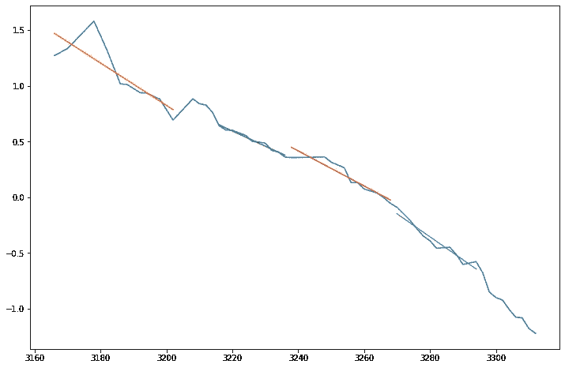

*日志返回与本问题中统计熵相匹配的结果。*

*从线性回归拟合计算残差将为我们提供速度异常值。*

*要估计距离，log returns 是一个足够好的指标，因为它在稳步下降。*

*案例研究 2:(使用 PSQs 捕获事件频率)*

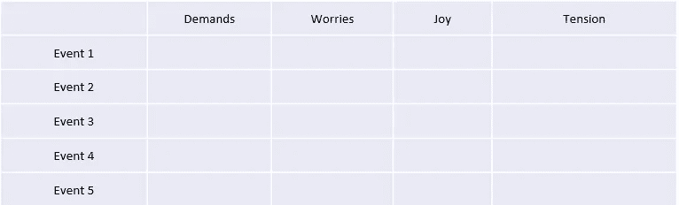

*在 PSQs 评估中，应用了相同的技术。在这种情况下，计数在整个间隔内或多或少是相同的，这意味着该表必须被转换成类似 PCA 的转换。*

## **自动化偏置**

**自动化偏差**是一种倾向，倾向于由自动化系统生成的结果，而不是由非自动化系统生成的结果，而不考虑每个系统的错误率。[@谷歌](https://developers.google.com/machine-learning/crash-course/production-ml-systems)

**②*。问题解释:视频推断***

**案例分析 1** **(测速枪探测器)**

[使用 OpenVINO 进行车辆检测](https://github.com/nscalo/ai-in-business/raw/main/Courses/Production-ML-Systems/far_entrance.0.gif)

[使用光流估计和包围盒的车辆检测](https://github.com/nscalo/ai-in-business/raw/main/Courses/Production-ML-Systems/output_annotated_330.gif)

如你所见，上面的视频演示了边界框图像中的光流检测。检测到的点在阈值上被过滤，该阈值发出要通过分析管道发送的数据。所分析的数据用于确定视频的统计参数。

那么为什么会存在自动化偏差呢？当具有单个原始模型的一个软件可以用于确定有助于优化视频特征的统计属性时，存在自动化偏差。

## **选择偏差**

**选择偏差**发生在数据集的样本选择方式不能反映其真实分布的情况下。选择偏差可以有许多不同的形式:[@谷歌](https://developers.google.com/machine-learning/crash-course/production-ml-systems)

***3。问题解释:评估一个图形***

**覆盖偏差**:数据不是以有代表性的方式选取的。[@谷歌](https://developers.google.com/machine-learning/crash-course/production-ml-systems)

**案例研究 1:(测速枪探测器)**

*   ***【正确】:*** 按置信区间收集测速仪内部节点出现的顺序
*   ***【错误】:*** 在不形成包围盒出现顺序的情况下，从 n 帧的检测到的盒子中进行粒子计数
*   ***【正确】:*** 使用正确阈值收集的外观顺序连接两个相邻帧
*   ***【错误】:*** 通过选择错误的像素阈值对帧进行粒子计数

**根据基于光流相位的方法测量这些边界框内的粒子数。**

**收集的数据并不具有代表性，但它们会转化为可用的统计数据。**

```
viz = pd.DataFrame(columns=['vehicle', 'count', 'frame', 'nodes']) frame = 0 
for n, t in zip(nodes, threshold):     
frame += 1     
map_n = list(map(lambda k: str(k), n))     
for i, j in zip(n, t):         
    viz = viz.append({'vehicle': i, 'count': j, 'frame': frame, 'nodes': "-".join(map_n)}, ignore_index=True)
```

**无响应偏差**:(或参与偏差):由于数据收集过程中的参与差距，数据最终不具有代表性。[@谷歌](https://developers.google.com/machine-learning/crash-course/production-ml-systems)

**案例研究 1:(测速枪探测器)**

> 车辆检测中可能出现参与差距，因为一些边界框可能由于深度学习错误而未被检测到，这种情况不太可能发生。另一个原因是当车辆顺序移动时，边界框切换置信区间或置信阈值，这意味着它们改变了它们在检测中出现的顺序。这在从一组车辆中检测特定车辆时引入了参与偏差。

**解释包围盒检测的代码:**

```
def draw_boxes(out_write_npy, zone, frame, result, args, width, height):     
    for box in result[0][0]: 
        # Output shape is 1x1x100x7         
        conf = box[2]         # comparison of confidence threshold    
        if conf >= args.pt:             
            xmin = int(box[3] * width)             
            ymin = int(box[4] * height)             
            xmax = int(box[5] * width)             
            ymax = int(box[6] * height)             
            # draw bounding box rectangles             
            cv2.rectangle(frame, (xmin, ymin), (xmax, ymax), args.c, args.th)                  
return frame
```

**显示包围盒参与偏差的代码:**

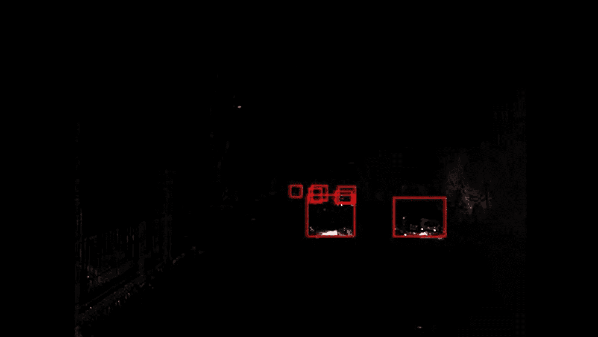

```
**# distance arrays to collect distances** 
dist = [] 
node_length = len(_input[0]) # initial node length referring to frame 0 
nodes = [list(range(node_length))] # collected nodes, starts from node_length of first frame 
# iterate up frame (n - 1) 
for i in range(len(_input)-1):     
    d = []    **# loop through a cycle of next frame and the current frame** 
    for k in range(len(_input[i+1])):         
        for j in range(len(_input[i])):             
        **# norm of distances between each bounding box rectangles** d.append(np.sqrt(np.sum(np.square(np.array(_input[i][j]) - np.array(_input[i+1][k])))/4))     
        dist.append(d)     
        n = np.zeros(len(_input[i+1])).astype(np.int64) # initialising the nodes to zeros to explore findability     
    for k,x in enumerate(d):         
   ** # a comparison of distance to its threshold which is assumed to be PI  **       
    if (x <= np.pi):             
        n[int(k/len(_input[i]))] = int(nodes[i][k%len(_input[i])]) else:             
        if (int(k/len(_input[i])) >= len(_input[i])):                 
            **# increment the node_length to enable detection** 
            node_length += 1                         
            n[int(k/len(_input[i]))] = node_length - 1          
    nodes.append(n.tolist())
```

> 上述代码导致在流量中收集节点。这种偏差可以通过向深度学习模型引入定制层来避免，这导致 SoftMax 检测。模型的训练必须通过不断的验证，因为 SoftMax 层可能需要至少二维向量。

**固定了参与偏差的代码:**

**解决方案 1:自定义图层**

**解决方案 2:通过将节点连接到边界框来消除参与偏差**

[](https://www.datadriveninvestor.com/2020/11/19/how-machine-learning-and-artificial-intelligence-changing-the-face-of-ecommerce/) [## 机器学习和人工智能如何改变电子商务的面貌？|数据驱动…

### 电子商务开发公司，现在，整合先进的客户体验到一个新的水平…

www.datadriveninvestor.com](https://www.datadriveninvestor.com/2020/11/19/how-machine-learning-and-artificial-intelligence-changing-the-face-of-ecommerce/) 

用与边界框匹配的节点重画边界框

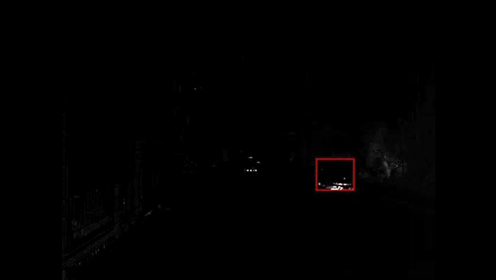

**采样偏差**:数据采集期间未使用适当的随机化。

> 在上面显示的这个实验中，我们考虑来自边界框的数据样本，而不是整个数据，这使得我们对数据应用统计测试

当您通过光流估计方法从包围盒中收集点的数量时，包围盒的样本被考虑，而不是整个学习数据，这使得我们将训练集引入到收集的点中。

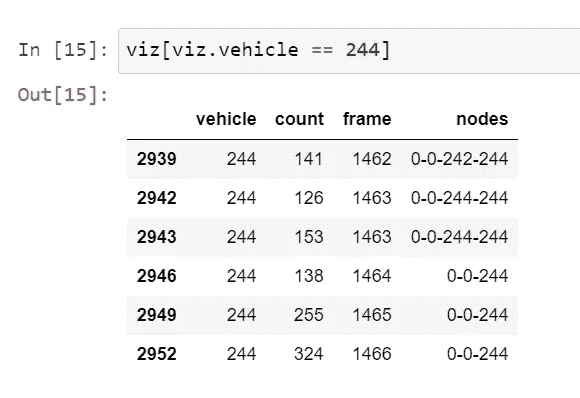

## **群体归因偏差**

**群体归因偏差**是一种将个体的真实情况推广到他们所属的整个群体的倾向。这种偏见的两个主要表现是: [@Google](https://developers.google.com/machine-learning/crash-course/production-ml-systems)

***4。问题说明:称量组件***

*   **群体内偏好**:对你也属于*的群体成员*的偏好，或者对你们也共有的特征的偏好。

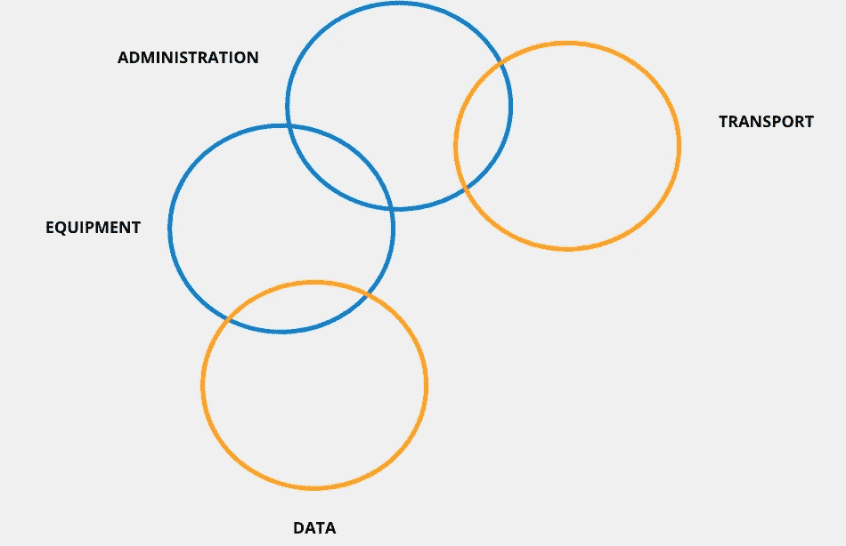

## **用静态 DEA 解释问题**


```
s = cvx.Variable(service_data.values.shape[0]) 
p = cvx.Variable(privilege_data.values.shape[0]) service = cvx.matmul(s, service_data.values[:,0]) 
privilege = cvx.matmul(p, privilege_data.values[:,0]) **# SPECTRUM** 
GAMMA_SHAPE=5e1 
GAMMA_SCALE=1e25 
NORMAL_CENTER=1e20 
NORMAL_STD=5e19  
dmu_s = np.random.gamma(GAMMA_SHAPE, GAMMA_SCALE, service_data.values.shape[0]) 
dmu_p = np.random.normal(NORMAL_CENTER, NORMAL_STD, privilege_data.values.shape[0]) **# objective function** 
objective = cvx.Maximize(service) **# constraints** 
constraints = [cvx.matmul(s, dmu_s) - cvx.matmul(p, dmu_p) <= 0, privilege == 1, s >= 0, p >= 0] **# use cvxpy to solve the objective** 
problem = cvx.Problem(objective, constraints).solve(verbose=False, solver=cvx.SCS, max_iters=500)
```

> DEA 问题是一个高度静态的模型，这意味着无论你给它提供什么样的决策单元，它都会产生相同的输出，但会随着所提供的数据而变化。

解决方案是:

*   *****【你的归属】*** :或者，你将不得不全部改变数据。**

****群体外同质偏见**:对你不属于的*群体中的个体成员抱有刻板印象的倾向*，或者认为他们的特征更加一致。**

*   ***这是一个类似的问题，当您均衡 DMU(输入和输出)时，效率会降低到一个总和。***

## ****隐性偏见****

**当基于自己的心智模型和个人经验做出不一定更普遍适用的假设时，就会出现隐性偏见。[@谷歌](https://developers.google.com/machine-learning/crash-course/production-ml-systems)**

*****5。问题解释:信念与观察的比较*****

*   *****确认偏差*** *:模型构建者无意识地以肯定预先存在的信念和假设的方式处理数据***
*   *****实验者的偏见*** *:模型构建者可能实际上一直在训练一个模型，直到它产生一个与他们最初的假设一致的结果***

**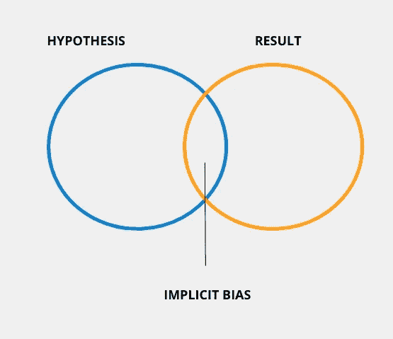**

# **参考**

**[](https://developers.google.com/machine-learning/crash-course/fairness/types-of-bias) [## 公平:偏见的类型|机器学习速成班

developers.google.com](https://developers.google.com/machine-learning/crash-course/fairness/types-of-bias) 

## 获得专家观点— [订阅 DDI 英特尔](https://datadriveninvestor.com/ddi-intel)**