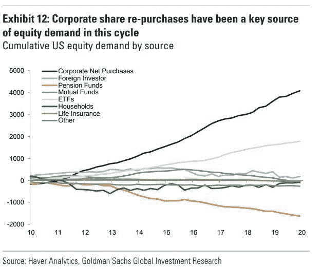

# 堕落天使、违约和救助

> 原文：<https://medium.datadriveninvestor.com/fallen-angels-defaults-and-bailouts-2673fa3ce0ff?source=collection_archive---------10----------------------->

后病毒时代的经济将不同于危机前的版本。每一次重大危机都会带来商业环境、监管和商业模式的变化，重塑经济并重置竞争游戏，为新的赢家和输家创造条件。

冠状病毒带来了全球 GDP 的骤降；它让邮轮和航空公司濒临破产，零售商和餐馆、酒店，甚至石油公司突然陷入困境。全球市场在可能持续数月甚至数年的疫情中努力保持稳定，这使得新兴市场可能是最不确定的，因为冠状病毒发出的冲击波传播速度比疫情本身还要快。

全球化创造了全球供应链的大规模集中化，国际货币体系建立在美元流动性的基础上。如果这个高度集中的系统中有一部分崩溃了，整个结构就会崩溃。疫情揭示了已经存在的裂缝。供应链的中断和随之而来的流动性危机被这个新疫情推到了风口浪尖。经济增长只是廉价债务的产物。自 2000 年以来，全球增长一直依赖于异常的债务扩张。维持现状的唯一方法是将越来越多的债务堆积在一起，而不是通过强劲的全球生产率。

1981 年全球债务为 14 万亿美元。2020 年全球债务达到惊人的 265 万亿美元。因此，在过去的 39 年里，债务增加了 19 倍，债务成本从 20%降到了 0%。

全球化的脆弱性因疫情的额外压力以及供应链的中断而被放大。这个系统已经非常脆弱。现在有三分之一的人口处于社会孤立状态，损害是显而易见的。

**我们是如何走到这一步的？**

**2008 年的全球金融危机**主要是房地产和银行业危机，通过传染效应蔓延到工业领域。不过，大多数服务行业仍未受到伤害。这一次，所有行业都受到了影响，尤其是服务业、旅游业、餐饮业和无数小企业:如果它们不得不关闭两个月，它们的现金流就会枯竭，无法生存。这在历史上可能是独一无二的。根据慕尼黑 Ifo 研究所的估计，这样的关闭导致两个月后经济产出损失 7-11 %,三个月后高达 20%。下降幅度将由限制的持续时间决定。总而言之，经济将在今年上半年经历一次残酷的下跌。如果世界各地的政府采取明智的行动，我们将在今年下半年看到稳定。

 [## 危机？风投适应的 3 种方式|数据驱动的投资者

### 当我写这篇文章的时候，一场全球性的危机正在发生。这不是第一次，也不会是最后一次。很多事情已经…

www.datadriveninvestor.com](https://www.datadriveninvestor.com/2020/03/22/crisis-3-ways-vcs-adapt/) 

作为一个社会和一家公司，你必须为危机和挫折做好准备。显而易见的是经理们的短期思维，他们让公司负债累累，为股票回购融资。简直是疏忽大意。不仅仅是经理们，到处都缺乏个人责任感。

自 2009 年以来，股票购买的第一名是股票回购:

*来源图表:高盛研究*

事实是，我们在短期内吸取教训，但从长远来看，我们会忘记它们。我们在这里看到的是，由于人为的低利率和短期资本市场，出现了一波股票回购潮，这是我们经历的这波牛市的主要驱动力之一。与此同时，那些购买垃圾债券、奖金暴涨的人正在接受纾困。美国航空公司希望获得 500 亿美元的救助——他们花了 450 亿美元回购股票。

*资料来源:美国消费者新闻与商业频道*

我们整个社会已经忘记了如何承担责任。我们已经忘记了生活是由挫折组成的，你必须为困难时期留有安全余量。我们生活在一个被宠坏的社会里，人们认为他们有权享受美好的生活。这个权利在现实中是不存在的。每当下雨时不断向中央银行和政府求救将逐渐让我们失去自由和繁荣。

多年的宽松货币和金融杠杆带来了高利润和持久的牛市。但关于操作杠杆的事情是，它是一把锋利的刀，可以双向切割。其严重程度很容易受到指数级冲击的影响，这仅仅是因为我们正在谈论的数字的大小。据贝莱德**称，美国公司债券市场规模超过 10 万亿美元，是 20 年前的 5 倍。**

这是一个巨大的数字——尤其是如果(更多)降级将要发生的话。这张图表显示了降级问题的严重程度(BBB 级占所有投资级公司债务的 50%)。

*来源图表:彭博*

Mohammad El-Erian: *结果是* ***公司债务的增长明显快于收益增长和现金余额，导致评级大幅下调，目前投资级市场中有一半的评级为 AAA，而 2001 年时这一比例还不到五分之一。在最底层的公司中，有三分之一已经被评为 AAA 级，因此被降级为垃圾级的风险更大。***

杠杆贷款市场大幅下跌，这可能会导致更多公司破产，并对发放贷款的贷款人产生后续影响，由于页岩油行业的繁荣，这些贷款人主要是美国银行。

*资料来源:彭博*

穆罕默德·埃尔-埃利安:*市场中的突然抛售以一种令人讨厌的方式暴露了脆弱性，这些脆弱性呈现出破坏性的生命，而* ***则有可能通过自我反馈循环放大最初的冲击。重要的是要记住，在这种背景下，大量美国投资级公司债务就像一把达摩克利斯剑一样悬在高收益市场上。考虑到冠状病毒导致的不可避免的全球经济放缓，许多国家现在面临着更高的降级风险。下降到垃圾级的幅度越大，资金短缺的风险就越高，这将使金融和经济方面的一切变得更糟。***

德意志银行(Deutsche Bank)的数据显示，今年 3 月，创纪录的 900 亿美元债务降至垃圾级。美国银行警告称，今年的总额可能达到 2000 亿美元:

*来源:金融时报*

高盛(Goldman Sachs)估计，未来 6 个月，约 5500 亿美元的 IG 债券将成为堕落天使:

来源:高盛研究

穆罕默德·埃尔-埃利安:*越来越多的“堕落天使”出现的可能性正值****1.2 万亿美元高收益市场的长期结构性缺陷——即相对于未偿债券的数量，专门投资者的基数较小——更加明显*** *。流动性压力可能会因缺乏愿意进入垃圾领域的资金而加剧，这是由信贷息差突然飙升和交易环境不太友好造成的。企业和投资者都必须应对冠状病毒的经济和金融影响，这种病毒在吸走债券市场流动性的同时，加大了信贷风险。遏制这些溢出的时间越长，信用降级的程度越大，违约的威胁就越大——金融市场污染经济的可能性也就越大。*

为堕落天使寻找买家可能具有挑战性。6.7 万亿美元的投资级债券市场远远大于 1.2 万亿美元的高收益债券市场(Ice 数据服务)。

迄今为止，美联储的计划要么针对投资级公司债，要么针对小企业。这就忽略了一个主要的公司债务类别:高收益债券。这一类别现在可能还包括抵押贷款债券，即由高风险贷款支持的债券。

下图显示了最近在信贷市场上，美联储支持的资产类别(IG)和非美联储支持的资产类别(HY)之间的表现差异:

*来源:华尔街日报*

债务最终会造成系统的脆弱性。这使得整个系统更容易受到冲击和非线性级联效应的影响——反馈回路失控。正如埃尔-埃利安所指出的，堕落天使不是一个简单的阶跃函数事件。指令和法规意味着从 IG 到 HY 的大规模降级将造成大规模的被迫抛售，因为**IG 的大多数持有人不能合法拥有 HY paper。** **这将导致市场出现更多降级和流动性紧缩，从而引发一个具有威胁性后果的反馈循环。**

尽管存在所有负面因素，做空经济和美元仍将是一种无利可图的努力，因为市场很可能会接受这个奇怪的新金融世界，接受它的时间比任何试图从下一次大做空中获利的人保持理智的时间都长。正如华尔街流行的一句话:“牛赚钱，熊赚钱，猪被宰。”

我们过度负债的服务型经济还能承受一场大规模的社会距离风暴多久？我不知道这个问题的答案，但我可以告诉你，信贷市场会比任何人都先找到答案。

*原载于*[*www.trading-manifesto.com*](http://www.trading-manifesto.com/)