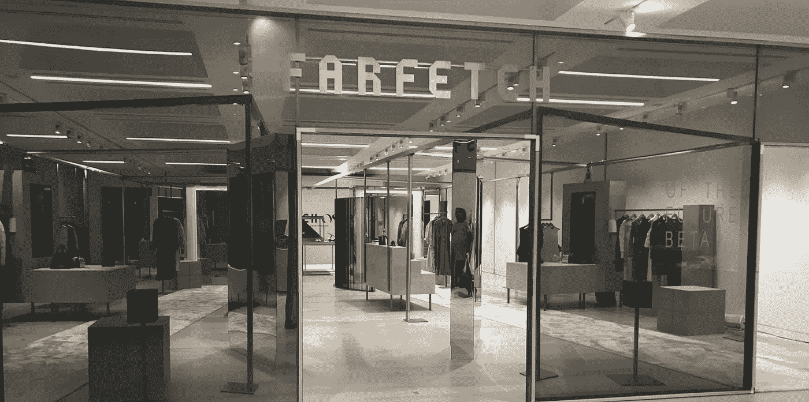
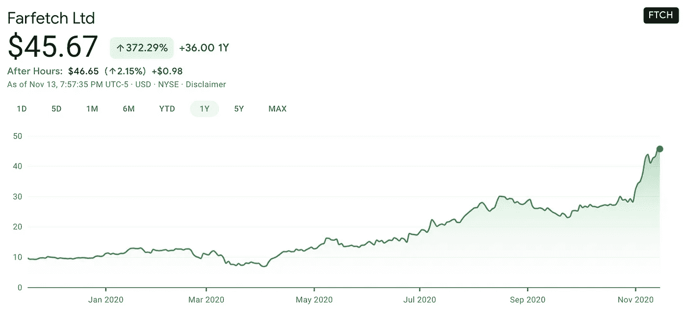

# farfetch——假期的热门股票

> 原文：<https://medium.datadriveninvestor.com/farfetch-a-top-stock-for-the-holidays-f913c7d01b28?source=collection_archive---------14----------------------->

## 以下是假日季的最佳股票选择

# 法尔费奇(FTCH)

世界各地的人们都在为假日购物季做准备，绝大多数人将依靠互联网进行购物。随着人们避开拥挤的商场和购物中心，电子商务正从 Covid 看到一个大繁荣。Farfetch 将在未来几个季度和几年受益于这一购物趋势。

Farfetch 是一家总部位于伦敦的奢侈品电子商务公司，支持 1000 多个全球品牌。他们有 4000 多名员工，大多数都在美国以外。根据 LinkedIn 的数据，他们在美国只有大约 200 名员工，所以他们主要集中在欧洲、南美和亚洲。他们的网站和应用程序在世界各地以多种语言运行，使这个品牌在美国市场以外很受欢迎。

亚洲市场对奢侈品牌和商品有着极大的需求，Farfetch 在这一市场中处于有利地位。2017 年，JD.com 向 Farfetch 投资 3.97 亿美元，帮助其在中国扩大规模。这种合作关系帮助 Farfetch 自 2017 年以来实现了扩张，并在多年内实现了惊人的收入增长。

## 在线奢侈品的加速发展

> “我们看到的是奢侈品在线应用的长期趋势正在加速，而这个行业仍未被充分渗透。在过去的 13 年里，Farfetch 平台在奢侈品行业最终数字化的预期下开发的功能使 Farfetch 在今天抓住了这个机会。我们最近宣布与阿里巴巴和历峰的合作伙伴关系使我们能够抓住机遇，将奢侈品行业带入下一代，并在未来多年推动持续增长和市场份额。”— José Neves，Farfetch 创始人、董事长兼首席执行官

## FARFETCH 收入增长

*   2017 年:3.86 亿美元
*   2018 年:6.02 亿美元(同比增长 55%)
*   2019 年:10.2 亿美元(同比增长 69%)
*   2020 年:Q1+Q2 = 6.96 亿美元
*   2020 年第三季度:4.38 亿美元(同比增长 71%)
*   2020 财年预计收入:16 亿美元

从 2017 年到 2020 年，Farfetch 的收入增长非常令人印象深刻，并且继续以惊人的速度增长。你可以看到，从 2018 年到 2020 年，该公司的规模翻了一番。他们正受益于目前的多重趋势:人们在国内购物，亚洲奢侈品支出增加。他们通过与 JD.com 和其他国家的战略伙伴关系向亚洲扩张，这帮助他们快速成长。

在[推特上关注我](https://twitter.com/james_carter89)。

# 最近的第三季度数据

2020 年 11 月 12 日

*   2020 年第 3 季度商品总价值和数字平台 GMV 增长率加快，同比分别增长 62%和 60%，分别达到 7.98 亿美元和 6.74 亿美元的历史新高
*   2020 年第三季度收入同比增长 71%，达到 4.38 亿美元
*   2020 年第 3 季度毛利和数字平台订单贡献同比分别增长 82%和 98%
*   宣布与阿里巴巴和历峰建立全球合作伙伴关系，加速奢侈品行业的数字化；战略合作伙伴将向 Farfetch 有限公司和新 Farfetch 中国合资公司投资 11.5 亿美元

# 新的伙伴关系

早在 2017 年，JD.com 就向 Farfetch 投资了 3.97 亿美元，以帮助加快向中国的扩张。这使京东成为最大的股东之一和战略合作伙伴，以帮助增长。最近，对 Farfetch 的一项新投资成为头条新闻。阿里巴巴、历峰和 Artemis 目前已向 Farfetch 投资 11.5 亿美元，以帮助推动其在亚洲的扩张。

> 这次合作是奢侈品行业从实体店向电子商务和中国转移的一部分。— Farfetch 首席执行官何塞·内维斯

随着消费者选择网上购物，越来越多的实体零售商关闭，我们看到了世界范围内的巨大转变。Farfetch 将从这一转变中受益匪浅，这也是他们获得 11.5 亿美元投资的原因。Farfetch 出售 3000 多个小型独立品牌的奢侈品，以及大多数人熟悉的主要奢侈品品牌。

# Farfetch 股票(FTCH)

Farfetch 的股票在过去 12 个月中表现非常好，在此期间股价上涨了 372%。

*   市值 145 亿美元
*   PS 比率 10.80
*   80%的分析师对 Farfetch 的评级为买入

在接下来的 12 个月里，我估计 Farfetch 的股价将在 60-75 美元之间。我拥有 Farfetch 的股票和看涨期权。

在这里订阅我的[时事通讯](https://jamescarter.substack.com/)。

# 其他顶级股票

查看我关于 Etsy、Cloudflare 和 Twilio 等顶级股票的其他文章。

[Etsy (ETSY)文章此处](https://medium.com/datadriveninvestor/investing-ideas-on-etsy-83b83a8a05aa)

[Cloudflare (NET)文章此处](https://medium.com/datadriveninvestor/investing-in-cloudflare-net-e88a284f4afb)

[Twilio (TWLO)文章此处](https://scale89.medium.com/investing-in-twilio-78f062b66519)

# 摘要

Farfetch 是一家快速发展的电子商务公司，随着在全球的扩张，它有着巨大的发展潜力。在过去的 3 年中，他们证明了他们可以以超过 50%的年增长率增长，这使他们进入了高增长类别。他们已经表明，他们可以在过去 3 年中增加收入增长，这是非常罕见的。Farfetch 可以通过与阿里巴巴和其他公司的新合作关系继续向亚洲扩张，这将有助于他们更快地扩张。他们受益于电子商务和 Covid 居家订单的持续趋势。消费者越来越依赖电子商务来购买所有商品，这将在未来 12-18 个月内使 Farfetch 受益更多季度。

# 关于我:詹姆斯·卡特的 89 级

我在技术领域工作了 8 年，在初创公司和大型企业中担任销售、营销和发展角色。我在高增长团队工作，向北美领先的公司销售软件。这些年来，我成为了一名优秀的员工，并去了各个办公室培训其他人如何销售软件和发展团队。现在，我是一名全职投资者和独立作家，与他人分享我的想法。我在追随 13 年前开始的投资热情。感谢你支持我作为一名作家的工作，我希望你能在我的研究、文章和对技术的观点中找到价值。

[订阅这里:](https://jamescarter.substack.com/)【https://jamescarter.substack.com/】T2

## [关注我的推特](https://twitter.com/james_carter89) : @james_carter89

*披露:我拥有 Farfetch (FTCH)的股票和看涨期权。本文代表我的想法，不是理财建议。*