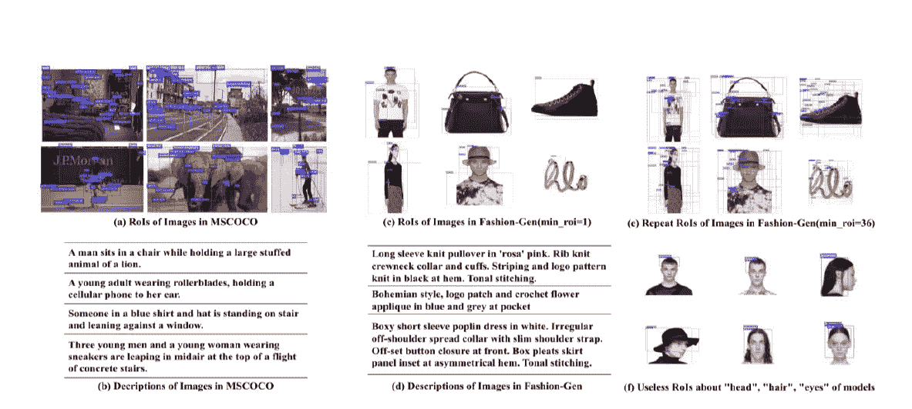
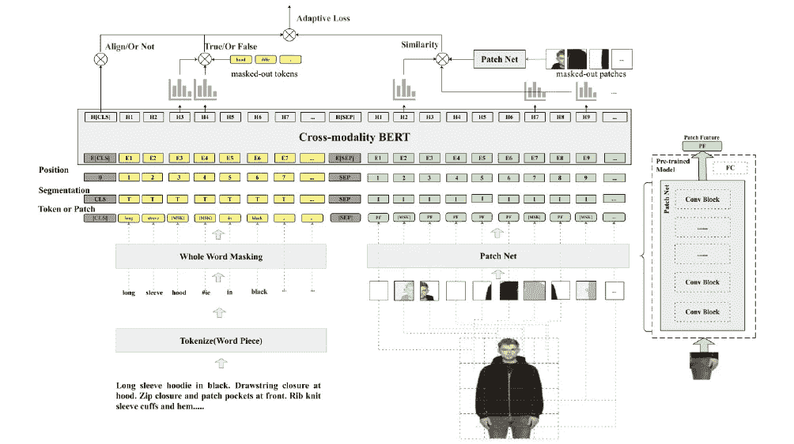
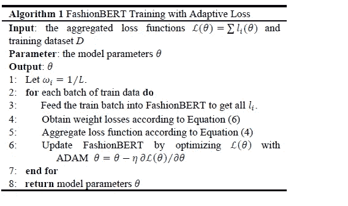

# FashionBERT:用于跨模态检索的具有自适应损失的文本和图像匹配

> 原文：<https://medium.datadriveninvestor.com/fashionbert-text-and-image-matching-with-adaptive-loss-for-cross-modal-retrieval-5145157a674f?source=collection_archive---------13----------------------->

*作者:高德宏、金林波、、邱明辉、、易伟、、*

在这篇文章中，我们解决的文本和图像匹配的跨模式检索的时装业。与一般领域的匹配不同，服装匹配要求更加关注服装图像和文本中的细粒度信息。先驱方法从图像中检测感兴趣区域(即 RoI ),并使用 RoI 嵌入作为图像表示。一般来说，感兴趣区域倾向于代表时尚图像中的“对象级”信息，而时尚文本则倾向于描述更详细的信息，例如风格、属性。因此，对于时尚文本和图像匹配来说，ROI 不够细粒度。为此，我们提出了 FashionBERT，它利用补丁作为图像特征。利用预先训练的 BERT 模型作为主干网络，FashionBERT 学习文本和图像的高级表示。同时，在 FashionBERT 模型中，我们提出了一种自适应损失来权衡多任务学习。两个任务(即，文本和图像匹配和跨模态检索)被合并以评估 FashionBERT。在公共数据集上的实验表明，FashionBERT 在性能上比基线和最先进的方法有显著的提高。在实践中，FashionBERT 应用于一个具体的跨模态检索应用程序。我们给出了详细的匹配性能和推理效率分析。

*你可以通过* [*点击这里*](https://arxiv.org/ftp/arxiv/papers/2005/2005.09801.pdf) *下载完整版论文。*

 [## 商业价值和人工智能的 5 个原则|数据驱动的投资者

### 提取商业价值很难。我是说真的很难...说到高级分析，这一过程甚至…

www.datadriveninvestor.com](https://www.datadriveninvestor.com/2020/07/07/5-principles-for-business-value-and-artificial-intelligence/) 

# 1)简介

在过去的十年中，互联网上出现了大量的多媒体数据(包括图像、视频、音频和文本)。为了有效地从这些多模态数据中寻找重要的信息，多媒体检索成为一项重要的技术，并得到了世界范围内研究者的广泛研究。近年来，跨模态检索的研究越来越受到关注，跨模态检索是以一种类型的数据作为查询，检索另一种类型的相关数据。跨通道检索的关键是学习有意义的跨通道匹配[40]。

跨模态匹配，尤其是文本和图像匹配，有着悠久的研究历史。早期的方法通常将视觉和文本模态表示投射到共享的嵌入式子空间中，用于跨模态相似性计算，或者将它们融合以学习匹配分数，例如，基于 CCA 的方法[14，25，44]和基于 VSE 的方法[10，11，18，41]。最近，预训练技术已经成功地应用于计算机视觉(CV) [1，2]和自然语言处理(NLP) [8，46]。一些研究人员受到启发，采用预先训练的 BERT 模型作为主干网络来学习跨模态信息表示[19，34]。所提出的方法已经在几个下游任务上取得了有希望的性能，例如跨模态检索[40]、图像字幕[1]和视觉问题回答[2]。然而，这些研究都集中在文本和图像匹配的一般领域。在本文中，我们关注的是服装行业的文本和图像匹配[47]，主要指服装、鞋类、配饰、化妆品等。

***Figure 1: Comparison of text and image in the general and fashion domains. (a) and (b) are the RoIs and descriptions of MSCOCO Images from the general domain. © and (b) are the relatively-rare RoIs and fine-grained descriptions of Fashion-Gen Images from the fashion domain. (e) and (f) are large amount of the repeated and useless RoIs detected from fashion images.***

这些先驱匹配方法的主要挑战是如何从图像中提取语义信息，并将这些信息集成到 BERT 模型中。如图 1(a)所示，所有当前方法从图像中检测 ROI[48](https://www.alibabacloud.com/blog/i.e.,)，并将这些 ROI 视为“图像表征”。这种 RoI 方法在时尚领域中效果不佳，因为可以从时尚图像中检测到相对罕见的 RoI。如图 1(b)所示，我们显示了不同类别的时尚一代图像的检测到的感兴趣区域，其中检测到的感兴趣区域的最小数量被设置为来自图像的一个。我们发现从一幅 MSCOCO [49]图像中平均可以检测到 19.8 个 ROI，但是从一幅 Fashion-Gen [50]图像中只能检测到 6.4 个 ROI。这是因为通常时尚图像仅包含一个或两个具有平坦背景的对象(例如，外套和/或裤子)。我们可以设置要检测的最小 RoI 数量，但在此设置下，大量检测到的 RoI 会重复，因为它们仅聚焦在相同的对象上，如图 1(e)所示。这些重复的 ROI 将产生相似的特征，并且对后面的建模贡献很小。同时，我们发现时装图像中的一些感兴趣区域对于文本和图像的匹配毫无用处，例如，关于身体部位(头、头发、手等)的感兴趣区域。)中模特的时装形象如图 1(f)所示。这些 ROI 与时尚产品无关，无法与描述建立联系。相反，大多数时尚文本描述了产品的精细信息(例如，“圆领”、“露肩”、“高领”)。偶尔，一些描述包含抽象风格，例如“艺术风格”和“波西米亚风格”，如图 1(d)所示。时尚图像中的感兴趣区域可以指示主要的时尚对象，但是不能区分这些细粒度的属性或风格。因此，时尚文本和图像与这种“对象级”ROI 和细粒度描述的匹配更加困难。

本文提出 FashionBERT 来解决上述问题。受自拍思想[38]的启发，我们首先引入面片法提取图像令牌。每个时装图像被分割成具有相同像素的小块，我们假设这些小块作为图像标记。补丁显示原始像素信息，因此与对象级 ROI 相比，包含更多的滞留信息。此外，分裂面片本质上是不重复和有序的，非常适合作为 BERT 模型的序列输入。FashionBERT 的训练过程是一个标准的多任务学习过程(即掩蔽语言建模、掩蔽补丁建模和文本与图像对齐，这将在后面的部分中描述)。我们提出了一个自适应算法来平衡每个任务的学习。自适应算法将每个任务的损失权重的确定视为一个新的优化问题，并将在每个批处理步骤中估计损失权重。

我们用两个任务评估 FashionBERT，文本&图像对齐分类和跨模态检索(包括图像到文本和文本到图像检索)。实验在公开的时尚产品数据集(Fashion-Gen)上进行。结果表明，FashionBERT 明显优于 SOTA 和其他先驱方法。我们还在电子商务网站中应用 FashionBERT。本文的主要贡献总结如下:

1)我们展示了时尚领域中文本和图像匹配的困难，并提出 FashionBERT 来解决这些问题。
2)提出了提取图像特征的补丁方法，以及平衡 FashionBERT 多任务学习的自适应算法。补丁方法和自适应算法是任务无关的，可以直接应用于其他任务。
3)我们在公共数据集上对 FashionBERT 进行了广泛的实验。实验显示了 FashionBERT 在时尚领域的文本和图像匹配方面的强大能力。

***Figure 2: our FashionBERT framework for text and image matching. We cut each fashion image into patches and treat these patches as “image tokens”. After the interaction of text tokens and image patches in BERT, three tasks with adaptive loss weights are proposed to train the entire FashionBERT model.***

4) FashionBERT 目前已在实践中得到应用。我们给出了 FashionBERT 在跨模态检索中的具体应用。同时，我们详细分析了匹配性能和推理效率。

# 2)方法论

在本节中，我们将简要回顾 BERT 语言模型，然后描述我们如何提取图像特征以及 FashionBERT 如何联合建模图像和文本数据。

## 2.1 伯特

[8]介绍的 BERT 模型是一种基于注意力的双向语言模型。以记号(即单词块)作为输入，BERT 用多层变换编码器处理记号的嵌入[39]。当在大型语言语料库上进行预训练时，BERT 已被证明对于自然语言处理任务的变体中的迁移学习非常有效。

最初的 BERT 模型侧重于单模态文本数据的编码。在跨模态场景中，扩展的 BERT 模型将多模态数据作为输入，并允许它们在变换器模块内交互。

## 2.2 时尚伯特

FashionBERT 的概述如图 2 所示。它由四部分组成，文本表示、图像表示、匹配主干和具有自适应损失的 FashionBERT 训练。

**文本表示:**与【8】类似，首先根据单词块将输入文本标记化为标记序列【42】。在我们的 FashionBERT 模型中采用了相同的 BERT 词汇表。我们使用标准的 BERT 预处理方法来处理输入文本。最后，将词块嵌入、位置嵌入和切分嵌入的总和作为文本表示。分段(即图 2 中的“T”和“I”)用于区分文本和图像输入。

**图像表示:**与 RoI 方法不同，我们将每幅图像切割成具有相同像素的小块，如图 2 所示。我们将每个补丁视为一个“图像令牌”。对于每个面片，面片网络的输出被视为面片特征。可以选择任何预先训练的图像模型(例如，InceptionV3 [36]和 ResNeXt-101 [43])作为补丁网络的主干。这些斑块在自然界中是有序的。补片的空间位置用于位置嵌入。面片特征的总和、位置嵌入和分割嵌入被视为面片表示。

**匹配主干:**文本令牌序列和图像补丁序列的拼接由 FashionBERT 输入组成。类似于 BERT，特殊记号[CLS]和单独记号[SEP]分别被添加在第一位置以及文本记号序列和图像补片序列之间。

采用预训练的标准 BERT 作为 FashionBERT 的匹配骨干网络。文本标记和图像补丁的信息因此在多个自我注意层中自由地相互作用。FashionBERT 输出每个令牌或补丁的最终表示。

**具有自适应损失的 FashionBERT 训练:**我们开发三个任务来训练 FashionBERT。详情请参考[链接](https://arxiv.org/ftp/arxiv/papers/2005/2005.09801.pdf)。

*我们在 Algorithm.1(下图)中举例说明 FashionBERT 的训练过程。*

# 3)总结

本文主要研究时尚领域跨模态检索中的文本和图像匹配问题。我们提出 FashionBERT 来解决时尚领域的匹配问题。FashionBERT 将图像分割成小块。图像补丁和文本标记作为 BERT 主干的输入。为了权衡每个任务的学习，我们提出了自动确定损失权重的自适应损失算法。结合两个任务来评估 FashionBERT，并在 Fashion-Gen 数据集上进行广泛的实验。主要结论是:1)与对象级 RoI 方法相比，patch 方法在匹配时尚文本和图像方面显示出优势；2)通过适应性损失，FashionBERT 在训练过程中将注意力转移到不同的任务上。

相比一般领域的搭配，时尚领域还有进一步提升的空间。在未来，1)为了更好地理解时尚图像的语义，我们试图构建更细粒度的训练任务(例如，标记级和补丁级对齐)，以迫使 FashionBERT 学习更多细节信息。2)我们尝试将 FashionBERT 匹配秘密可视化。这将有助于理解 FashionBERT 内部工作原理，并做出进一步的改进。3)我们正在尝试模型简化、知识提炼的方法来进一步加快在线推理的速度。

请参考[链接](https://arxiv.org/ftp/arxiv/papers/2005/2005.09801.pdf)了解更多关于我们的实验设置和主要实验结果的细节。

## 感谢

作者要感谢 Alibaba PAI 团队提供的实验环境和他们的建设性意见。本工作得到了中国博士后科学基金的部分资助(№2019M652038)。本材料中表达的任何观点、发现和结论或建议都是作者的，不一定反映主办方的观点。

## 参考

[1] Peter Anderson, Xiaodong He, Chris Buehler, Damien Teney, Mark Johnson, Stephen Gould and Lei Zhang, 2018\. Bottom-Up and Top-Down Attention for Image Captioning and Visual Question Answering. In Proceedings of IEEE Conference of Computer Vision and Pattern Recognition.
[2] Stanislaw Antol, Aishwarya Agrawal, Jiasen Lu, Margaret Mitchell, Dhruv Batra, C. Lawrence Zitnick and Devi Parikh, 2015\. VQA: Visual Question Answering. In Proceedings of International Conference on Computer Vision.
[3] Stephen Boyd and Lieven Vandenberghe. 2004\. Convex Optimization. Cambridge University Press, New York, NY USA.
[4] Huizhong Chen, Andrew Gallagher and Bernd Girod, 2012\. Describing clothing by semantic attributes. In Proceedings of European Conference on Computer Vision, 609–623.
[5] Daoyuan Chen, Yaliang Li, Minghui Qiu, Zhen Wang, Bofang Li, Bolin Ding, Hongbo Deng, Jun Huang, Wei Lin and Jingren Zhou, 2020\. AdaBERT: Task-Adaptive BERT Compression with Differentiable Neural Architecture Search. arXiv preprint arXiv:2001.04246.
[6] Yiming Cui, Wanxiang Che, Ting Liu, Bing Qin, Ziqing Yang, Shijin Wang and Guoping Hu, 2019\. Pre-Training with Whole Word Masking for Chinese BERT. arXiv. preprint arXiv:1906.08101.
[7] Jia Deng, Wei Dong, Richard Socher, Li-Jia Li, Kai Li and Li Fei-Fei, 2009\. ImageNet: A large-scale hierarchical image database. In 2009 IEEE Conference on Computer Vision and Pattern Recognition. 248–255.
[8] Jacob Devlin, Ming-Wei Chang, Kenton Lee and Kristina Toutanova, 2018\. BERT: Pre-training of Deep Bidirectional Transformers for Language Understanding. arXiv. preprint arXiv:1810.04805.
[9] Jeff Donahue, Yangqing Jia, Oriol Vinyals, Judy Hoffman, Ning Zhang, Eric Tzeng and Trevor Darrell, 2013\. DeCAF: A Deep Convolutional Activation Feature for Generic Visual Recognition. arXiv:1310.1531.
[10] Fartash Faghri, David J. Fleet, Jamie Ryan Kiros and Sanja Fidler, 2017\. VSE++: Improving Visual-Semantic Embeddings with Hard Negatives. arXiv preprint arXiv:1707.05612.
[11] Andrea Frome, Greg S Corrado, Jon Shlens, Samy Bengio, Jeff Dean, Marc’Aurelio Ranzato and Tomas Mikolov, 2013\. DeViSE: A Deep Visual-Semantic Embedding Model. In Proceedings of Advances in Neural Information Processing Systems.
[12] Ross Girshick, Jeff Donahue, Trevor Darrell and Jitendra Malik, 2014\. Rich feature hierarchies for accurate object detection and semantic segmentation. In Proceedings of IEEE Conference of Computer Vision and Pattern Recognition.
[13] Ross 13\. Fast r-cnn. In Proceedings of IEEE International Conference on Computer Vision.
[14] David R. Hardoon, Sandor Szedmak and John Shawe-Taylor, 2004\. Canonical Correlation Analysis: An overview with Application to Learning Methods. Neural Computation. Vol.16(12), 2639–2664.
[15] Herve Jégou, Matthijs Douze and Cordelia Schmid, 2011\. Product Quantization for Nearest Neighbor Search. In IEEE Transactions on Pattern Analysis and Machine Intelligence, Vol. 33(1), 117–128.
[16] Xiaoqi Jiao, Yichun Yin, Lifeng Shang, Xin Jiang, Xiao Chen, Linlin Li, Fang Wang and Qun Liu, 2019\. TinyBERT: Distilling BERT for Natural Language Understanding. arXiv preprint arXiv:1909.10351.
[17] Zhenzhong Lan, Mingda Chen, Sebastian Goodman, Kevin Gimpel, Piyush Sharma and Radu Soricut, 2019\. ALBERT: A Lite BERT for Self-supervised Learning of Language Representations. arXiv preprint arXiv:1909.11942.
[18] Kuang-Huei Lee, Xi Chen, Gang Hua, Houdong Hu and Xiaodong He, 2018\. Stacked Cross Attention for Image-Text Matching. In Proceedings of European Conference on Computer Vision.
[19] Gen Li, Nan Duan, Yuejian Fang, Ming Gong, Daxin Jiang and Ming Zhou, 2019\. Unicoder-VL: A Universal Encoder for Vision and Language by Cross-modal Pre-training. In Proceedings of Association for the Advancement of Artificial Intelligence.
[20] Si Liu, Zheng Song, Guangcan Liu, Changsheng Xu, Hanqing Lu and Shuicheng Yan, 2012\. Street-to-shop: Cross-scenario clothing retrieval via parts alignment and auxiliary set. In Proceedings of IEEE Conference of Computer Vision and Pattern Recognition. 3330–3337.
[21] Ziwei Liu, Ping Luo, Shi Qiu, Xiaogang Wang and Xiaoou Tang, 2016\. Deepfashion: Powering robust clothes recognition and retrieval with rich annotations. In Proceedings of IEEE Conference of Computer Vision and Pattern Recognition. 1096–1104.
[22] Jonathan Long, Evan Shelhamer and Trevor Darrell, 2015\. Fully Convolutional Networks for Semantic Segmentation. In Proceedings of IEEE Conference of Computer Vision and Pattern Recognition.
[23] Jiasen Lu, Dhruv Batra, Devi Parikh and Stefan Lee, 2019\. Vilbert: Pretraining task-agnostic visiolinguistic representations for vision-and-language tasks. arXiv preprint arXiv:1908.02265.
[24] M Hadi Kiapour, Kota Yamaguchi, Alexander C Berg, and Tamara L Berg, 2014\. Hipster wars: Discovering elements of fashion styles. In Proceedings of European Conference on Computer Vision. 472–488.
[25] Tae-Kyun Kim, Josef Kitter and Roberto Cipolla, 2007\. Discriminative Learning and Recognition of Image Set Classes Using Canonical Correlations. IEEE Transactions on Pattern Analysis and Machine Intelligence, 29(6):1005–1018.
[26] Nikita Kitaev, Łukasz Kaiser, Anselm Levskaya, 2020\. Reformer: The Efficient Transformer. In The International Conference on Learning Representations.
[27] Ranjay Krishna, Yuke Zhu, Oliver Groth, Justin Johnson, Kenji Hata, Joshua Kravitz, Stephanie Chen, Yannis Kalantidis, Li-Jia Li, David A. Shamma, Michael S. Bernstein and Fei-Fei Li, 2016\. Visual Genome: Connecting Language and Vision Using Crowdsourced Dense Image Annotations. arXiv preprint arXiv:1602.07332.
[28] Alex Krizhevsky, Ilya Sutskever and Geoffrey E. Hinton, 2012\. ImageNet Classification with Deep Convolutional Neural Networks. In Proceedings of Annual Conference on Neural Information Processing Systems.
[29] Ishan Misra, C Lawrence Zitnick and Martial Hebert, 2016\. Shuffle and learn: unsupervised learning using temporal order verification. In Proceedings of European Conference on Computer Vision, 527–544.
[30] Jeffrey Pennington, Richard Socher and Christopher Manning, 2014\. Glove: Global vectors for word representation. In Proceedings of conference on Empirical Methods in Natural Language Processing.
[31] Alec Radford, Karthik Narasimhan, Tim Salimans and Ilya Sutskever, 2018\. Improving language understanding by generative pre-training.
[32] Jie Shao, Leiquan Wang, Zhicheng Zhao Fei Su and Anni Cai, 2016\. Deep canonical correlation analysis with progressive and hypergraph learning for cross-modal retrieval. Neurocomputing, 214:618–628.
[33] Karen Simonyan and Andrew Zisserman, 2014\. Very Deep Convolutional Networks for Large-Scale Image Recognition. arXiv:1409.1556.
[34] Weijie Su, Xizhou Zhu, Yue Cao, Bin Li, Lewei Lu, Furu Wei and Jifeng Dai, 2019\. VL-BERT: Pre-training of Generic Visual-Linguistic Representations. arXiv. preprint arXiv:1908.08530.
[35] Chen Sun, Austin Myers, Carl Vondrick, Kevin Murphy and Cordelia Schmid, 2019\. Videobert: A joint model for video and language representation learning. arXiv preprint arXiv:1904.01766.
[36] Christian Szegedy, Vincent Vanhoucke, Sergey Ioffe, Jonathon Shlens and Zbigniew Wojna, 2016\. Rethinking the Inception Architecture for Computer Vision. arXiv preprint arXiv:1512.00567.
[37] Lorenzo Torresani, Martin Szummer and Andrew Fitzgibbon, 2010\. Efficient object category recognition using classemes. ECCV, 776–789.
[38] Trieu H. Trinh, Minh-Thang Luong and Quoc V. Le, 2019\. Selfie: Self-supervised Pretraining for Image Embedding. arXiv preprint arXiv:1906.02940.
[39] Ashish Vaswani, Noam Shazeer, Niki Parmar, Jakob Uszkoreit, Llion Jones, Aidan N. Gomez, Lukasz Kaiser and Illia Polosukhin, 2017\. Attention Is All You Need. arXiv, preprint arXiv:1706.03762.
[40] Nam Vo, Lu Jiang, Chen Sun, Kevin Murphy, Li-Jia Li, Li Fei-Fei and James Hays, 2019\. Composing Text and Image for Image Retrieval — An Empirical Odyssey. In Proceedings of IEEE Conference of Computer Vision and Pattern Recognition.
[41] Yaxiong Wang, Hao Yang, Xueming Qian, Lin Ma, Jing Lu, Biao Li and Xin Fan, 2019\. Position Focused Attention Network for Image-Text Matching. In Proceedings of International Joint Conference on Artificial Intelligence.
[42] Yonghui Wu, Mike Schuster, Zhifeng Chen, Quoc V Le, Mohammad Norouzi and et al. 2016\. Google’s neural machine translation system: Bridging the gap between human and machine translation. arXiv preprint arXiv:1609.08144.
[43] Saining Xie, Ross Girshick, Piotr Dollár, Zhuowen Tu and Kaiming He, 2016\. Aggregated Residual Transformations for Deep Neural Networks. arXiv preprint arXiv:1611.05431.
[44] Fei Yan and Krystian Mikolajczyk, 2015\. Deep Correlation for Matching Images and Text. In Proceedings of IEEE Conference of Computer Vision and Pattern Recognition.
[45] Artem Babenko Yandex, and Victor Lempitsky, 2016\. Efficient Indexing of Billion-Scale Datasets of Deep Descriptors. In IEEE Conference on Computer Vision and Pattern Recognition. 2055–2063.
[46] Zhilin Yang, Zihang Dai, Yiming Yang, Jaime Carbonell, and Quoc VLe, 2019\. Xlnet: Generalized autoregressive pretraining for language understanding. arXiv preprint arXiv:1906.08237.
[47] [https://en.wikipedia.org/wiki/Fashion](https://en.wikipedia.org/wiki/Fashion)
[48] [https://github.com/peteanderson80/bottom-up-attention](https://github.com/peteanderson80/bottom-up-attention)
[49] [http://cocodataset.org](http://cocodataset.org/)
[50] [https://fashion-gen.com/](https://fashion-gen.com/)

# 原始来源:

 [## FashionBERT:用于跨模态检索的具有自适应损失的文本和图像匹配

### 德宏 2020 年 7 月 8 日 733 由德宏高、金林波、、邱明辉、、易伟、、和在本…

www.alibabacloud.com](https://www.alibabacloud.com/blog/fashionbert-text-and-image-matching-with-adaptive-loss-for-cross-modal-retrieval_596391) 

**进入专家视图—** [**订阅 DDI 英特尔**](https://datadriveninvestor.com/ddi-intel)