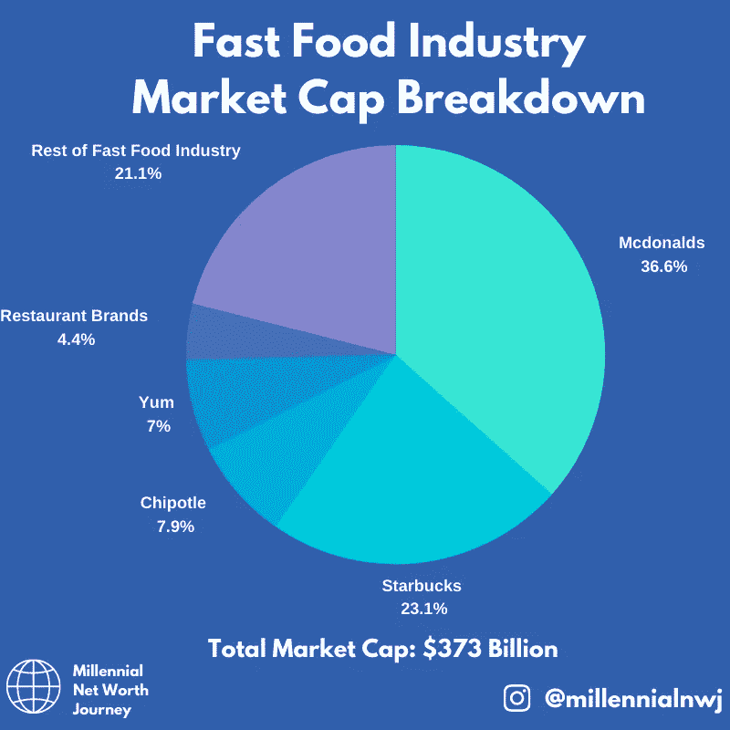
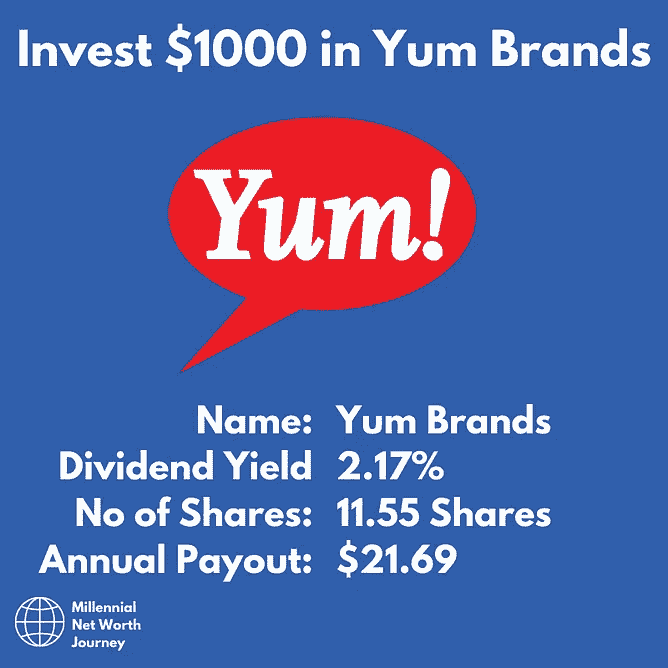
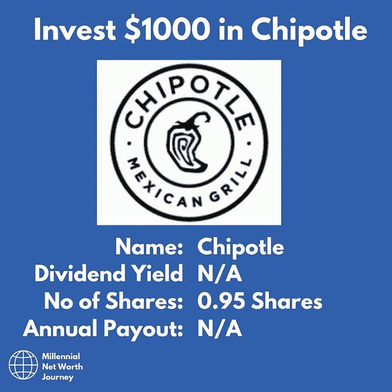
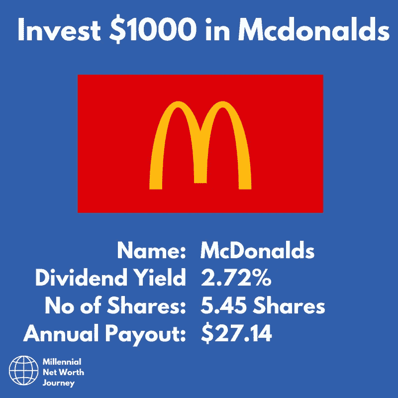
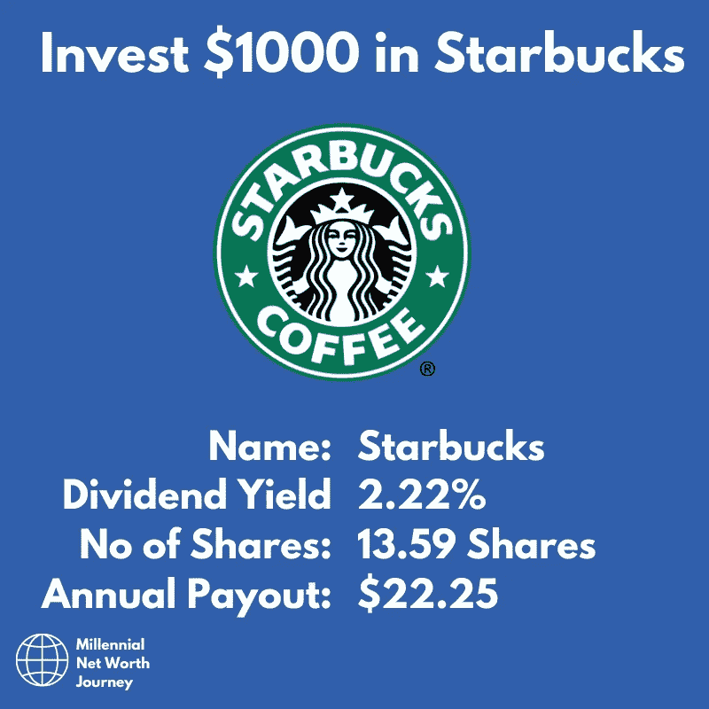
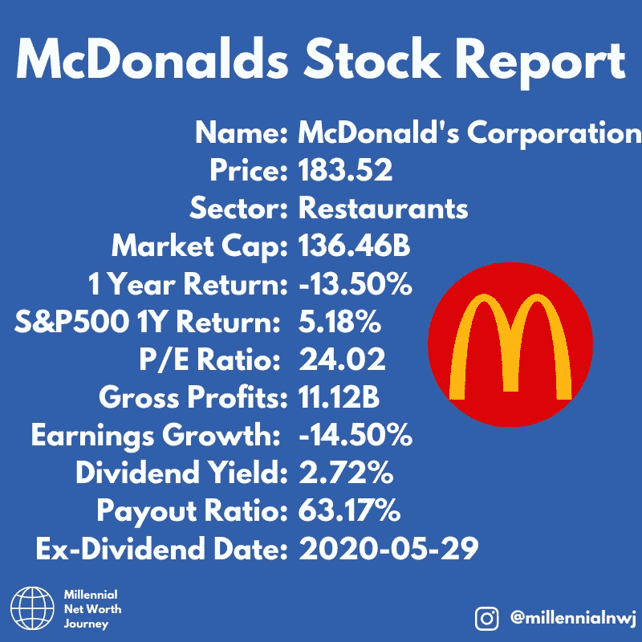
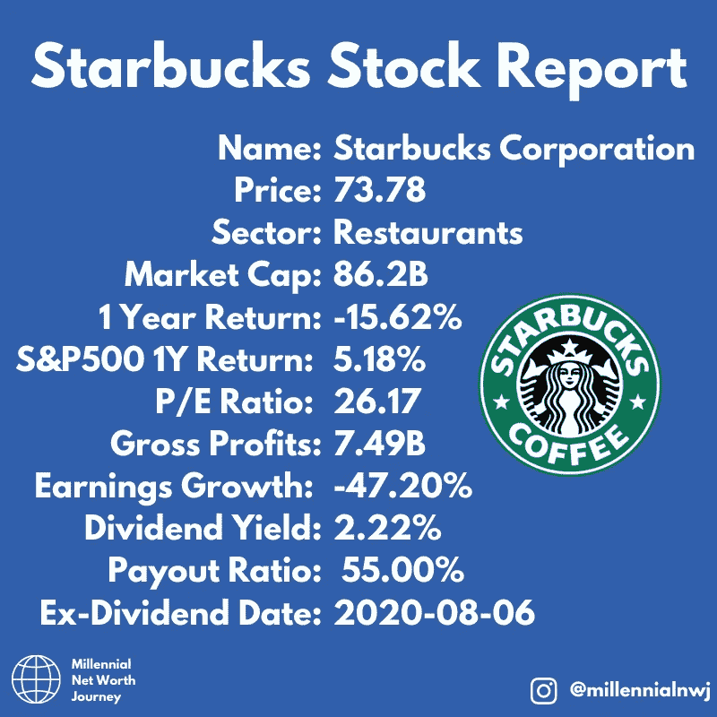
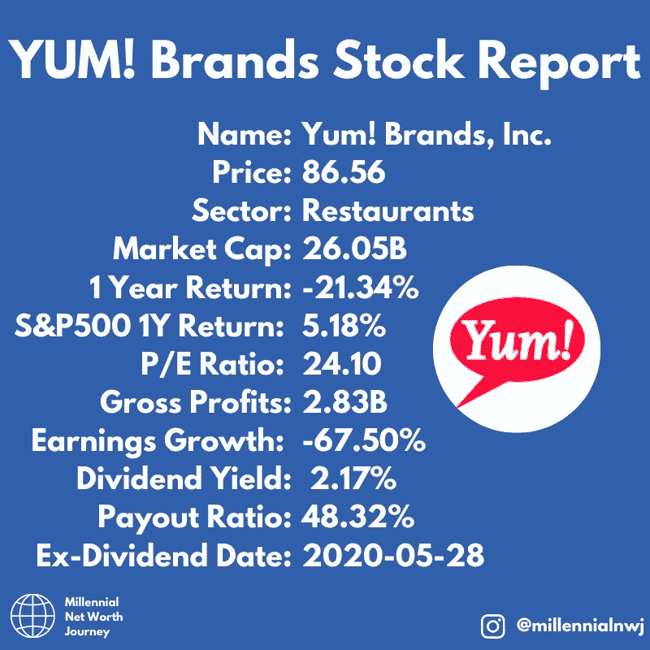
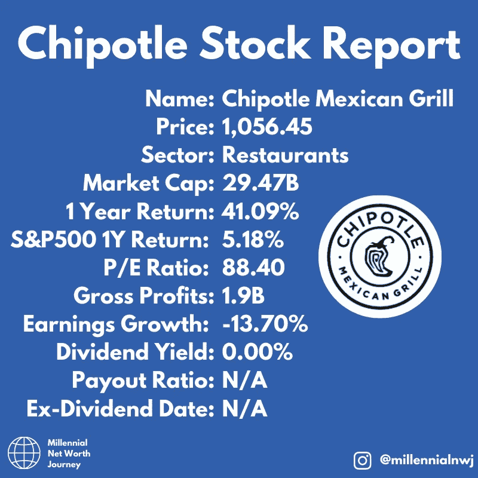
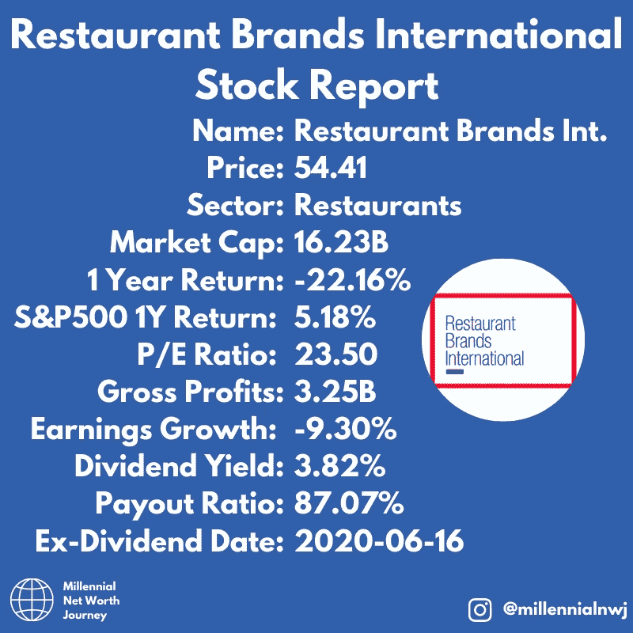

# 快餐股票——投资概述(麦当劳、星巴克、肯德基、Chipotle、蒂姆·霍顿)

> 原文：<https://medium.datadriveninvestor.com/fast-food-stocks-investment-overview-mcdonalds-starbucks-kfc-chipotle-tim-horton-s-793d15ac1478?source=collection_archive---------14----------------------->

Post from [@millennialnwj on Instagram.](https://www.instagram.com/millennialnwj)

随着世界大部分地区开始放松对餐馆就餐的限制，我认为看看 S&P500 最重要的快餐股票会很有意思。

该行业规模相对较大，市值总计 3730 亿美元。

不出所料，金色拱门以超过 36%的市场份额位居榜首，星巴克位居第二。

百胜品牌！你可能不熟悉，但他们拥有肯德基、必胜客和塔可钟。在西方经济体中，没有多少人没在这些餐馆吃过饭。

 [## 关于数字化转型的 8 个问题投资者应该从每位首席执行官那里得到答案|数据…

### 几乎没有什么比做生意更令人兴奋的了。最吸引人的方面之一当然是投资于年轻的…

www.datadriveninvestor.com](https://www.datadriveninvestor.com/2020/07/06/8-questions-about-the-digital-transformation-investors-should-get-answers-from-every-ceo/) 

从这些股票中可以注意到的是，由于冠状病毒的强制关闭，它们的一年表现相当差。这种下跌可能是在市场低迷并受到一定打击时入场的机会。像麦当劳和星巴克这样的公司不会凭空消失，不管有没有冠状病毒。它们是传统公司，深深扎根于美国和世界的流行文化和商业框架中。

# 股息分解

如果你投资这些公司是为了分红，这是你在每家公司投资 1000 美元的收益。注意，由于 Chipotle 是一家相对较新的公司，它还没有支付股息。

Post from [@millennialnwj on Instagram.](https://www.instagram.com/millennialnwj)

## 麦当劳

Post from [@millennialnwj on Instagram.](https://www.instagram.com/millennialnwj)

首先是麦当劳，世界上最大最著名的快餐店。这些公司在全球大多数国家拥有超过 36，000 家餐厅。金色拱门是世界上最知名的品牌标志之一，经常出现在流行文化中，并因其对儿童的吸引力而对人们的生活产生了重大影响。

不管你喜不喜欢这些食物，你都不能否认它们的成长和数量。巨无霸是有史以来最畅销的食品，仅在美国每年就售出 5.5 亿份。相当于每个美国人卖出 1.67 个巨无霸。

除了销量，该公司还公布了巨额利润和股息，原因是其简化的商业模式，允许特许经营者在其品牌下经营，并向他们出售制作汉堡的供应品。这将风险降至最低，并利用其品牌推动利润增长。

不管是不是新冠肺炎，麦当劳哪儿也不会去。它的销售肯定受到了打击。尽管如此，随着其在送货上门领域的显著扩张，该公司应该能够继续逐年提高股息。

## 星巴克

Post from [@millennialnwj on Instagram.](https://www.instagram.com/millennialnwj)

我们名单上的下一个是星巴克，世界上最受欢迎的咖啡连锁店。咖啡屋不只是卖咖啡。它出售的是一种生活方式和形象，这种生活方式和形象在美国和海外都变得异常流行。他们个性化杯子的“Instagram”特性几乎已经成为一种文化基因，被喜剧演员和其他人在互联网上模仿。

然而，该品牌对个性化和创造体验的重视很好地服务了它。因为这个原因特别受年轻人欢迎。

由于商店关闭，该公司受到冠状病毒的严重打击，这是应该考虑的事情。然而，该公司正在与其合作伙伴一起推进送货上门服务。所以希望这能减轻一些由此带来的伤害。

星巴克的股息也相当不错，这些年来一直在稳步增长。

## 好吃！品牌

Post from [@millennialnwj on Instagram.](https://www.instagram.com/millennialnwj)

我知道你可能会看到这个标志，但没有马上认出来。然而，该品牌拥有三家覆盖多个菜系的大型连锁快餐店。肯德基、必胜客和塔可钟以及该公司旗下的许多其他控股公司。

事实上，这家公司有相对多样化的业务范围，它们都有一个共同点:它们是美国最受欢迎的食品。炸鸡、比萨饼和墨西哥食物是许多人日常饮食的一部分。

由于冠状病毒商店关闭的影响，该公司的价格和收益大幅下降。但是，随着限制的解除，这些地点的覆盖范围和品牌的力量可以帮助它扭转局面。

## 墨西哥薄饼

Post from [@millennialnwj on Instagram.](https://www.instagram.com/millennialnwj)

我们单子上的下一个股票是 Chipotle。该公司销售 Tex Mex 烧烤体验，并在多年的经营中实现了快速增长。

这是今年唯一一家股价实现正回报的公司。这是由于销售强于预期，因为它的重点是送货上门。它也是榜单上唯一一只表现几乎像成长股的股票，像许多成长型公司一样，将资金再投资于扩张业务。

这只股票需要注意的一点是，市盈率相对较高。作为一家新公司，它不太可能在短期内派发股息。但是如果你认为 Chipotle 是未来的赢家。

## 餐饮品牌国际

Post from [@millennialnwj on Instagram.](https://www.instagram.com/millennialnwj)

最后一个快餐库存是国际餐饮品牌。虽然你可能没听说过他们，但他们在世界各地拥有并经营着大量特许经营的餐厅。他们经营的汉堡王分店直接与麦当劳竞争。他们还拥有在加拿大非常受欢迎的 Tim Hortons 和 Popeyes chicken，去年随着最新三明治的发布，Popeyes chicken 大受欢迎。

比尔·阿克曼的对冲基金 Pershing Square 持有该公司 16%的股份，该公司通常有相当不错的选股记录。⁣在所有上榜的快餐股票中，这只股票的股息最高。⁣
⁣

## 最后

在我们总结这些股票的时候，有一点需要注意的是，由于新冠肺炎，它们在未来的几个月和几年里都可能面临艰难的时期。⁣:这对消费的影响还不是 100%清楚，复苏之路可能是漫长而艰难的。但如果这些公司能挺过这一关，转向送货上门的新模式，它们就能在尘埃落定后继续生存和发展。

如果你喜欢这样，请考虑订阅我的时事通讯，这样你就可以把我的文章直接发送到你的收件箱。

[http://millennialnetworthjourney.com/newsletter-sign-up/](http://millennialnetworthjourney.com/newsletter-sign-up/)

**访问专家视图—** [**订阅 DDI 英特尔**](https://datadriveninvestor.com/ddi-intel)