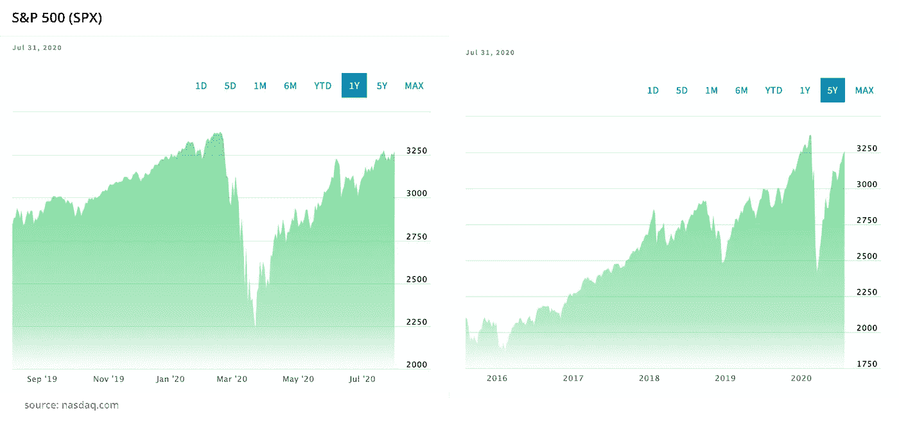

# 投资时要避免的致命错误

> 原文：<https://medium.datadriveninvestor.com/fatal-mistakes-to-avoid-when-investing-95842f7b67d?source=collection_archive---------28----------------------->

source: Photo by Pixabay from Pexels

刚开始投资的时候，一开始是相当容易犯投资错误的。

不幸的是，投资新手在投资中会赔钱，因为他们没有明确的目标、风险定义和策略。因此，就短期或长期回报而言，它们的表现差于几乎所有其他资产类别。

作为个人投资者，如果你能避免可预见的投资错误或从中吸取教训，你就能最大限度地降低投资风险，并通过投资获得良好的回报。

初次投资者会犯哪些错误？

# 🗒投资无计划

没有任何计划的投资会导致偏离你的道路，你可能得不到任何利润。

> *“风险来自于不知道自己在做什么。”—沃伦·巴菲特*

例如，你可能犯的一个至关重要的错误是投资股票或商品，你不知道你在长期或短期内可以获得多少回报。

作为一个后台分析和逻辑能力很强的投资者，你需要在投资之前，以拥有公司的心态来分析一只公司股票和一家公司。

**说到挑选最佳公司股票，你必须考虑投资者通常用来分析公司的不同指标。**

通过广泛的研究和分析，我定义了十大最有效和最有用的投资指标:收入/销售额、收益增长、现金流、股价、净利润率等等。

如果你想在投资股票前找到更多关于我最喜欢的 10 个指标的信息，你可以在我即将发布的新闻简报[中阅读它们(关于如何用 15 种简单方法每月节省更多现金的奖金备忘单)。](https://ilonacodes.com/financial-tips-for-freeing-extra-money-for-investment/)

记住，不是所有在股票市场交易的股票都是安全的投资。

**不要交易，而是先学习再投资。**

总是决定你的目标和目的，以及适当的基准，以获得更好的结果。

# 💸不分散投资

分散投资是降低投资风险的关键。

例如，大多数开发商投资者持有其雇主的大量股票，但除此之外几乎没有。或者他们持有同一行业的少数股票，如科技或 IT。

简而言之，为了在不损害回报的情况下降低风险，你应该投资至少 10-15 项不相关的投资，并根据你的资产配置使你的投资组合多样化。

资产配置基本上是投资组合中的投资组合。

它描述了构成任何投资组合并保持正确资产配置的现金、债券和股票的比例，这是长期投资者可以做出的最重要的决定。

要确定哪些因素会影响你的投资组合，请阅读我关于个人投资策略的文章。

投资者把所有的投资都放在一个地方，经常会损失很多钱。多样化可以帮助你最小化风险，因为一项资产的利润可以抵消另一项资产的损失。

顺便说一句，我最近创建了一个新的免费迷你课程**，教你如何用各种高回报、先进和创新的投资工具每月投资 500 美元并获利。**在此获得即时访问权限:

 [## 如何投资获利每月 500 美元-仅限严肃投资者

### 10 种行之有效的投资方式每月 500 美元开始独立投资，无需银行、基金和…

seriousinvestorsonly.com](https://seriousinvestorsonly.com/how-to-invest-profitably-500-a-month/) 

# 🏦没有注意管理费用和税收

银行和经纪费可能构成你投资的很大一部分，侵蚀你的回报。例如，如果一只基金的回报率为 8%，但管理费为 2%，那么你的净收益就是 6%

随着时间的推移，这些费用将会随着[的单利和复利一起复合成一个更大的数字。](https://ilonacodes.com/blog/how-developers-can-supercharge-their-savings/)

另一方面，**每次你买入/卖出/持有一项资产，你的经纪人或银行都会从持有和执行交易中获得佣金，**这就是为什么你应该尽可能少地进行交易，并找到一家经纪人或银行，他们会提供以低成本运营费开立和维护你的安全账户。

如果你读过丹·卡尼曼的《思考时快时慢》，你就会知道自动化投资意味着首先支付自己，实现平均成本。最后一个是指在控制市场波动的同时，定期在市场上投资等量的美元，并在不同的价格点和最佳时机购买资产。此外，投资自动化将允许您避免订单费用，因此您将支付一次，以建立每月贡献。

另一个事实是，你持有一项资产的时间越短，你支付的税款也就越多。您收入的税率取决于您所在的征税国家。你的资本越大，你的不安全感和固定资产就越多，你在特定时期缴纳的税就越少。

# 🎯目光短浅的

事实是，尽管长期投资表现相当稳定，但大多数投资者新手都专注于短期投资股票/商品市场。

因为你持有股票的时间越长，你未来的回报就越稳定。事实上，对于 1 年和 5 年的持有期，可能的回报范围是完全可以预测的。

让我们比较一下标准普尔 500 指数 1 年和 5 年的增长情况:

由于 2020 年 3 月的市场崩盘，标准普尔 500 指数下跌，但根据上面的图表，该指数增长到了过去的表现，并继续增长。

如果你有一份高薪工作，那么你很有可能在寻找一项长期投资。你知道，随着时间的推移，它往往会有稳定一致的回报和丰厚的利润。

与短期内过度专注的投资者相比，你不会为每天甚至每小时的表现而挣扎，因为你赚得很好，不需要立即追逐大利润。

只要把重点放在长远上，将来你会得到丰厚的回报。

# 📚缺乏对金融语言的理解

的确，这是一个大问题！

毫无疑问，大多数个人投资者通常都是受过良好教育的专业人士。尽管如此，当谈到金融知识时，没有多少人能理解金融定义或表达。

如果你对你的投资是认真的，掌握财务知识并利用所有的选择是一个先决条件。即使你不自信，谷歌一下你不懂的东西，问很多问题也会有帮助——非常有帮助！

> *“我们在学校没有被教授金融知识。要改变你的思维方式，掌握财务知识，需要大量的工作和时间。”—罗伯特·清崎*

确保你意识到你在投资研究中面临的所有金融术语。首先，试着自己找到任何生词的解释，如果你仍然不确定或有疑问，不要犹豫，向你信任的专家咨询。

# 💬结论

灵活谦逊，从错误中学习。在你开始投资之前，你应该能够解释你为什么要买。

要有长远的眼光，忽略短期的波动，因为具有长期视野的低风险投资可能会在以后产生高股息。

一开始，投资是一件很有挑战性的事情。尽管如此，学习和应用它是至关重要的，因为仅仅储蓄不能帮助你实现所有的财务目标。

*免责声明:作者的观点仅代表其个人观点，不以任何方式构成财务建议。作者发布的任何内容都不构成投资建议，也不应依赖作者发布的任何数据或内容进行任何投资活动。*

*附属信息披露:作为亚马逊的附属信息，我可以从 Amazon.com 的合格购买中赚取佣金。*

**进入专家视角—** [**订阅 DDI 英特尔**](https://datadriveninvestor.com/ddi-intel)