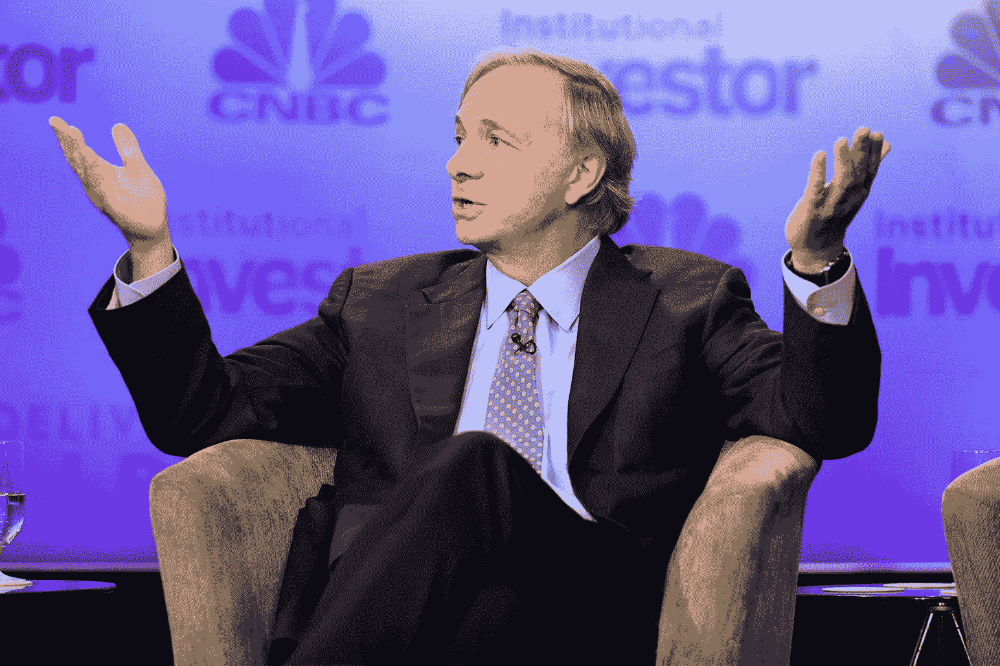

# 雷伊·达里奥对比特币的分析中的断层线和裂缝

> 原文：<https://medium.datadriveninvestor.com/faultlines-and-cracks-on-ray-dalios-thoughts-on-bitcoin-18d7a8f72d02?source=collection_archive---------18----------------------->

雷伊·达里奥是一个传奇。他对宏观经济学和经济如何运行的理解是首屈一指的。他对法定货币及其在经济中的作用的理解也是首屈一指的。顺便说一下，这也是他对比特币理解的偏见的来源。

正如比特币最大主义者和无政府主义者对比特币价值的分析和预测是如何被反抗系统的欲望所蒙蔽，雷伊·达里奥对比特币的反思也是被他的财富和对传统世界的了解所蒙蔽。

虽然雷伊·达里奥已经理所当然地回到家中，并承认比特币是货币、银行和金融未来的看涨期权，但他还没有达到正确客观地分析与看涨期权相关的特征、风险和概率的水平。

一路走来，他的进步，从“比特币是郁金香狂热”式的无知的否认阶段，到目前“我相信比特币是一个发明地狱”的阶段，是值得称赞的。以这种知识积累的速度，不断质疑假说，并在更新信念的情况下以贝叶斯方式完善自己的世界观，戴利奥很可能在十年内成为比特币的最大主义者。

他的论文题为:我对比特币的看法是需要的，尤其是在被错误引用了几次之后。

鉴于 Breed Love 的公开信，他的论文也是必要的。

 [## 致雷伊·达里奥的公开信:比特币

### 写给对冲基金巨头雷伊·达里奥的一封信，内容涉及他的世界观、金融自然的力量以及比特币是如何…

breedlove22.medium.com](https://breedlove22.medium.com/an-open-letter-to-ray-dalio-re-bitcoin-4b07c52a1a98) 

达利奥更新自己的观点，公开说出自己的想法，这很勇敢。然而，出于对思想交流的热爱，有必要根据 Dalio 对比特币的分析中出现的错误来批评他的思想。

 [## 我对比特币的看法

### 我写这个是为了澄清我对比特币的看法。不是比特币/加密货币专家，我相信我的观点是…

www.bridgewater.com](https://www.bridgewater.com/research-and-insights/ray-dalio-what-i-think-of-bitcoin) 

# 达利奥论证中的九条断层线和裂缝

# **1。“CBDCs 可以为比特币提供竞争”——不，它们不能。**

用达利奥的话来说:*“我们主要担心的是，央行数字货币未来是否会激增，成为官方认可的数字财富仓库*”。

这种说法缺乏诚意。CBDC 的纸币不能起到财富储存的作用，因为它们是由中央银行发行的。它们是集中的。供应不是硬编码的限制。没有绝对的稀缺。

# **2。“比特币的发展需要得到当局的批准”**——不，这不是罪有应得。

这一思路源于对民主化、自由化、推动比特币的技术进步以及这股潮流有多强大的理解失败。它比政府更强大。

无论有没有政府的支持，比特币都会成长。监管的争论在短期内可能是相关的，但从长期来看，这是无关紧要的。即使在短期内，监管论也高估了政府的力量，低估了监管套利的存在(只有同步的全球禁令才能奏效)。

历史上，政府拥有所有的权力，但技术和进步正在侵蚀这种权力基础。控制、征税、制定规则等权力正受到挑战，也受到技术的侵蚀。比特币是反建制的。这是一个相当多的人信奉的理想。在这种情况下，重要并不一定意味着大多数，因为大多数人并不真正关心比特币。

> 比特币是相当多的人愿意为之生为之死的东西。

这是可以理解的，雷伊·达里奥永远也不会理解。怎么会有人为了一个想法而生，为了一个想法而死？牺牲不是有钱人真正理解的东西。对他们来说，这只是一场游戏。雷伊·达里奥对经济运作的理解以及他对可能发生的社会剧变的记录是非凡的。然而，它只是一个投资组合分析。

# **3。根据比特币的历史**进行分析——不，你不能使用比特币的 10 年历史。

你如何分析一家初创公司？你不用以前的历史。这是他分析中的一个根本性错误，尽管他提出了几个否认声明，指出 BTC 的短暂历史不足以得出结论。

这里的重点是，达利奥的方向是不正确的。你根本不需要研究历史。你必须研究这个案件的是非曲直，这个命题的有效性。

如何用数据来比较存在了 6000 年的黄金(上帝的钱)和存在了 10 年的东西？这种比较是出了名的。

比特币可以被认为是一种仍然是想法的东西。它还处于初级阶段。正如之前在《Breed Loves 公开信》中观察到的那样，雷伊·达里奥使用虚假的标准来衡量比特币的有效性，违反了他自己对精英管理理念的信仰。

# **4。忽略比特币波动性的上行性质——你是在期待比特币直线上涨吗？**

这种断层线源于不了解比特币的轨迹、采用曲线以及不了解市场波动性的作用。

有一种市场结构特别导致上涨波动性强于下跌，并伴随着剧烈的偶尔回撤。比特币不可能直线竖线或者直线 45°向上。

“*比特币波动太大*”。是的，因为它发展得很快。如果它被缓慢地采用，它将变得不那么不稳定。波动性对其上升和向前的轨迹至关重要。没有波动性，它就不会增长。

比特币本身是稳定的(2100 万枚硬币)，移动的部分是采用(基于信仰和信念)和法定货币供应动态。我们用美元来衡量一枚比特币的价值。美元本身并不是一个稳定的衡量标准。他们不断印刷更多。比特币的采用是零星的，但却是渐进的。

# **5。“其他密码将会出现，取代比特币”——你忽略了技术驱动型市场中赢家通吃的动态。**

这条断层线源自一种寻找断层的天真愿望。这种说法是，比特币没有赢得成为加密货币领导者的战斗。然而，所有证据都指向比特币的压倒性胜利和持续胜利。比特币已经赢了这个东西。结束了。

暴露这一论点谬误的讽刺之处在于双重标准的明显应用。同样的“创新”标准被不同地应用于比特币和法定货币。

在看待比特币时，一种具有更好特性和功能的新创新货币进入该领域并取代比特币的危险被认为是一个巨大的风险。

在看待法定货币时，一种具有更好特性和功能的新创新货币进入这个领域并取代法定货币的危险被认为是不太可能的，也不是一个问题。

现行的货币体系已经存在了几千年。创新无处不在。比特币可以接管，顺其自然。最终会被别的东西废黜。用人类进步的现实作为反对比特币的事实，从根本上来说是错误的。

# **6。不了解流动性如何在一个互联系统中流动**

Dalio 举了一个例子，说明关闭 Tether 可能会导致包括比特币在内的所有加密货币的价值暴跌。虽然比特币也不能幸免于崩溃，但给出的例子有些夸张。

替代硬币和稳定硬币中的任何一个崩溃都可能导致其他稳定硬币和替代硬币的崩溃，但流动性极有可能流入比特币，而不是流出比特币。流动性不太可能进入法定货币和其他法定计价工具，如法定现金、债券和股票。

然而，随着投资者争夺流动性，整个全球投资组合的负面流动性事件将足以见证比特币的价值崩溃。

# **7。不正确的分析立场——将比特币视为创新而非反叛。**

虽然比特币是一种创新，但简单地将其视为创新就没有抓住要点。这不仅仅是一项货币创新。这是一次反抗。任何分析或思考都不应忽视这一事实。

反抗用例是基础用例。这是评估采用和弹性的出发点。

> 比特币的创造、创新、设计和采用背后的动机都深深植根于一种反叛的时代精神。

霍德勒夫妇愿意不惜任何代价进行抵抗。有的会捧到坟前，只把硬币传给下一代。

为什么观点很重要？为了正确地观察风景，你必须站在一个特定的位置，以优化你能看到的区域。你必须站在一个更高的地方，才能看到整个地区。这必须是一个客观的立场。

达利奥观点的第二个方面是低估了想要反抗体制的人数。一有机会就会想造反或参与造反的人。像 Satoshi 这样的“无政府主义者”比 Dalio 和其他熊认为的要多得多。

有多少人想造反？除了特权阶层，基本上所有人都是如此。与公告、竞争、放松管制等相关的抛售是前进道路上的小障碍。随着越来越多的人选择反抗，长期轨迹是一条向上的采纳曲线。

# **8。完全忽略了可能推动大规模进入加密货币的因素**——全球货币贬值。

麻烦正在平坦的土地上酝酿。通胀体系无法修复，因为债务水平过高，必须通过通胀来消除。重置是不可避免的。雷伊·达里奥是这一领域的大师。

人们会把财富存放在哪里？不是每个人都能将财富转化为黄金、土地和商品。然而，任何人都可以将自己的资金余额转换成比特币。

比特币作为一种数字产品，比其他所有商店都有优势，因此极有可能从重置事件中受益。在对比特币的任何分析中，这都不是一件容易被忽略的事情。

这里的断层线源于确认偏见，雷伊·达里奥选择忽略与他根深蒂固的信念相悖的信息，同时选择打击确认他现有世界观的信息。

这个传说迎合了他的偏见。行动中的反身性。

# **9。错误诊断市场中投资和投机之间的动态**

**完全误解了持有的作用、动机和意义。**

Dalio 认为投资和投机是对立的，一个是好的，一个是坏的。这是一个错误的二分法。投资和投机对市场都是必要的。这两种力量在任何市场中都创造了一种动态平衡。

如果一个市场只有长期、买入和持有的投资者，那么市场结构就会失衡，这个市场也就不复存在了。如果投机者不在市场中承担风险，流动性很容易枯竭，市场崩溃。如果一个市场只有投机者，那么投机泡沫就会膨胀得太快，最终导致崩盘。

问题的关键在于，投资者和投机者对市场都至关重要。作为一种新兴的数字资产，比特币具有投资者-投机者的特征，这对于其所处的发展阶段来说是必要的、必要的和合适的。

要求它拥有与黄金相似的投资者-投机者特征是应用了错误的标准。这条断层线源于使用了错误的工具集(菲亚特工具集)来诊断比特币。

要求比特币应该有一个恒定的价值(终极稳定性)或者在一个固定的区域内交易，是没有理解比特币正在一个轨迹上。一条通向某处的路。

然而，Dalio 正确地观察到了比特币类似期权的特征，因此在某种程度上，他承认了某种通向有回报事件的途径的存在。

Ray Dalio

# 围捕

Dalio 在比特币学习曲线上完成了一次巨大的旅程，这对于任何其他亿万富翁来说都是非常困难的。

传奇很快就要回家了。他在路上了。他信中的这一段是承认他要来。

> “我相信比特币是一项了不起的发明。通过一个编入计算机程序的系统发明了一种新型货币，这种货币已经工作了大约 10 年，并且作为一种货币和一种财富储存手段迅速受到欢迎，这是一项了不起的成就。这就像创造现有的基于信用的货币体系一样，当然是一种炼金术——也就是说，从很少或没有中赚钱。它就像 1350 年前后让美第奇家族(Medicis)的银行家致富的信贷一样，让它的发明者和那些早期进入它的人变得非常富有，并有可能让更多的人变得非常富有，并扰乱现有的货币体系。那些建立了比特币并支持让这种新货币成为现实的梦想的人，在维持这一梦想并让比特币(我指的是比特币及其类似的竞争对手)成为一种替代性的类黄金资产方面，做了出色的工作。

再见。