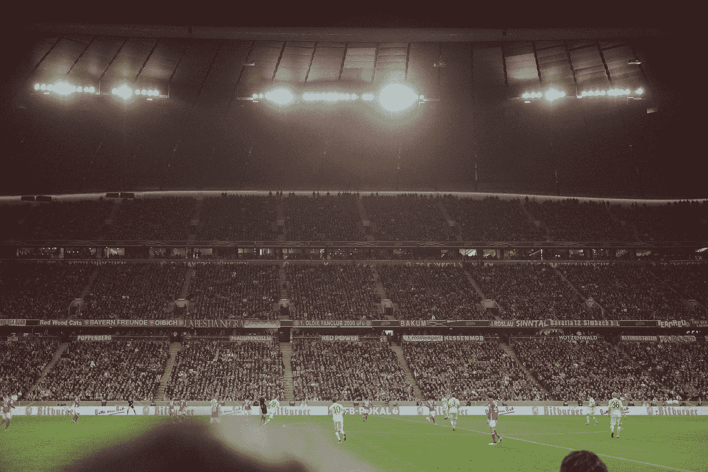
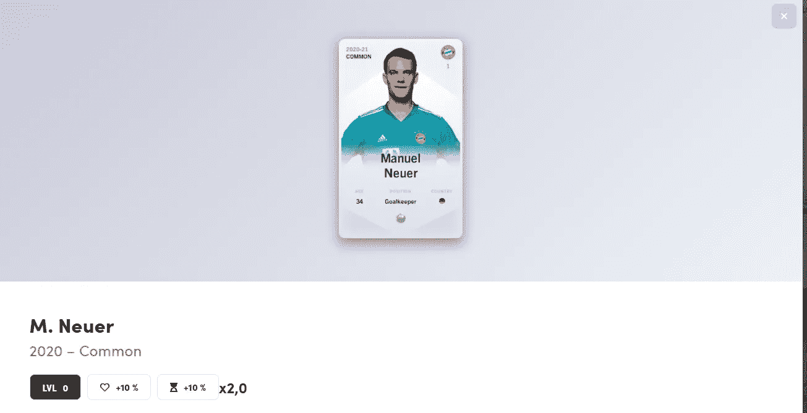

# 拜仁慕尼黑足球俱乐部在以太坊区块链上标记其球员

> 原文：<https://medium.datadriveninvestor.com/fc-bayern-munich-tokenizes-its-players-on-the-ethereum-blockchain-18211833686b?source=collection_archive---------10----------------------->

Photo by [Tobias Zils](https://unsplash.com/@herrzett?utm_source=medium&utm_medium=referral) on [Unsplash](https://unsplash.com?utm_source=medium&utm_medium=referral)

梦幻足球初创公司 Sorare 说服拜仁慕尼黑俱乐部将其球员作为 NFT 令牌带到区块链以太坊。俱乐部的球迷现在可以把他们最喜欢的球员装进钱包里，在虚拟草皮上追捕他们，或者在其他市场上出售他们。

没错，FC 拜仁慕尼黑要上区块链了。为了证明这一点:这里有一张来自曼努埃尔·诺伊尔的信物卡:

如果你去掉图形的东西，而是想知道区块链上的谢洛美·保定看起来像什么，你应该看看以太坊-探索者以太扫描的令牌。

这实际上没有意义:对智能合约、令牌 ID 和事务的引用。要了解更多信息，你必须点击“阅读合同”选项卡，将合同 ID 复制到“getCard”，获取 playerID，将其插入“get player”——你瞧:我们实际上有了谢洛美·保定。区块链证明了！

负责这一切的是初创公司 Sorare。Sorare 是一个“梦幻足球”的平台，这类似于传统的足球经理游戏:你可以从作为交易卡购买的球员中组建一支球队。然后你可以和其他球队比赛，这给了球员更多的经验，可以赢得一些东西。但是当然，不是每个玩家都一样；代币的力量取决于真实球员在真实足球生活中的表现。拜仁慕尼黑俱乐部的球员，当然，高于平均水平，因此购买昂贵。

几乎没有一种情况下，个别令牌，即所谓的不可替代令牌(NFT)适合，这一个。这就是为什么 Soare 在让足球俱乐部入伙方面也相当成功。除了拜仁，大约有 100 家俱乐部参与其中，包括尤文图斯，巴黎圣日耳曼，马德里竞技，以及德国俱乐部沙尔克和勒沃库森。

俱乐部现在可以通过电子方式出售他们的球员。由于每个玩家都是一个代币，每个玩家只能被购买一次，并且由于代币在区块链上，他们可以将其存储在自己的钱包中，并在其他平台上转售。例如，在收集区块链代币的市场 OpenSea 上，除了虚拟柏林街道、照片、插图、像素羊驼和区块链域之外，还可以交易足球票:

因此，Sorare 是足球经理、电子鸡和神奇聚会交易卡的混合物:你组建了一支足球队，球员变得更好，他们有更多的经验可以用单独的交易卡相互竞争。当然，现在每个人都可以投资足球运动员。基本上，自从 CryptoKitties 在以太坊的 NFTs 方面发展起来的一切都聚集在一起，现在满足了世界上最大的足球俱乐部。

平台 Sorare 本身做的还算体面，哪怕还是有点 beta 效应。我试着测试的时候，注意到网站不连接常用的以太坊钱包 metamask 提示将 sorare.com 添加到已连接网站列表的信息框会导致错误的方式，因为 Metamask 上不存在此选项。最后，我连接了 Android 版 Opera 的集成钱包，但这是一个限制。

第一次注册，免费获得十人代币，可以在新手联盟训练测试。但我不清楚这些球员是否可以被输出；至少我没成功。也许他们必须先获得经验？

尽管用户界面有些小问题，Sorare 应该会让足球迷们非常兴奋——他们中的许多人应该会通过该平台第一次接触到区块链钱包。

我在每月一期的 [**简讯中分享了更多私密的想法，你可以在这里**](https://mailchi.mp/bf8f8e8ed697/keep-in-touch-with-lukas) 查看。请在评论中告诉我，并在各种社交媒体平台上加入我:

[**推特**](https://twitter.com/WiesfleckerL)●[**insta gram**](https://www.instagram.com/lukaswiesflecker/)●[**脸书**](https://www.facebook.com/lukaswiesfleckerr)●[**Snapchat**](https://www.snapchat.com/add/luggooo)**●[**LinkedIn**](https://www.linkedin.com/in/lukas-wiesflecker-1b11251a5/)**

**无论你做什么，都要带着爱和激情去做！**