# 恐惧和贪婪——金融幻想家

> 原文：<https://medium.datadriveninvestor.com/fear-and-greed-financial-imagineer-f566c836da7a?source=collection_archive---------15----------------------->

当市场再次疯狂时，你害怕吗？害怕在投资和人生方面没有做出理性和科学证明的正确选择？遭受攀比和慢性羊群疲劳的折磨？

那么你已经准备好深入这篇文章了，在这篇文章中，我们将剖析使我们的世界运转的两种最强大的人类情感:

恐惧和贪婪。

这些情绪对个人和集体的行为有着最强烈的影响。

它们以一种强有力的方式影响着你的生活和(金融)市场。

如果你想了解并控制恐惧和贪婪，以建立一个更好、更幸福、更富裕的生活，请继续读下去。

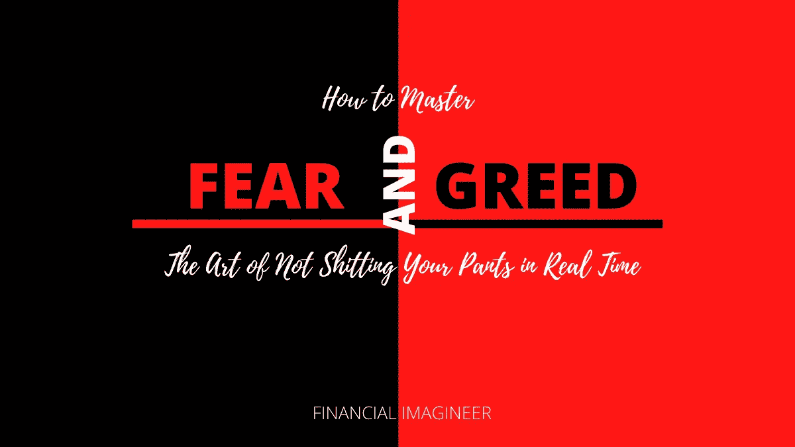

# 第一步:了解行为的驱动因素

所有自由市场都是由供给和需求驱动的。因此，所有交易至少需要三样东西:

一个买家，一个卖家和最后一个:前两个需要在价格上达成一致！

想象一下，越来越多的人在追逐同样有限的资产或资源。越多的人想买，越少的人想卖——为了满足供给和需求，价格就会攀升得越高。

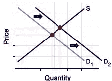

通常情况下，如果价格确实上涨，它会吸引社会上“更多的眼球”，甚至会有更多的人加入进来。这就是贪婪的运作方式，也是导致金融泡沫增长的原因。

另一方面，把恐惧想象成突然没人想买了，但是越来越多的人渴望卖出。

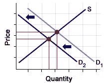

价格会下降，直到有人再次渴望购买。价格水平将由买卖双方同意交易的地点决定。

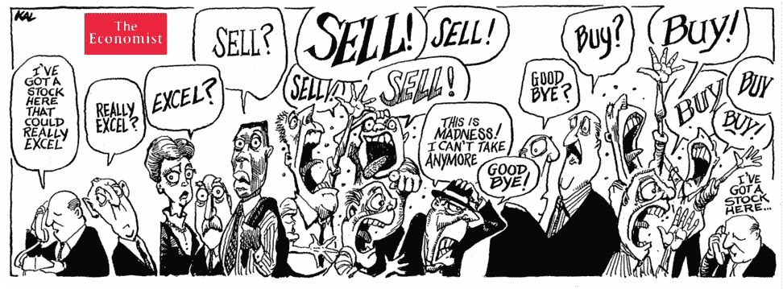

市场反映的只是个人行为的总和。

是的:它确实变得很乱！

# 第二步:理解市场如何运作

在最令人恐惧的市场中，人们会不理性地卖出股票，而在贪婪的市场中，人们会买入股票。

聪明的人可能会试图与众不同，做相反的事情，正如俗话所说，“低买高卖。”否则不行。

[我父亲](https://www.financial-imagineer.com/2020/09/13/money-lessons/)有一句名言:

> *有些人是聪明的。*
> 
> *有些是……否则。*
> 
> *我爸*

在我们对如何理解恐惧和贪婪得出结论之前，让我们更深入地了解它们。

# 什么是恐惧

恐惧是生活中非常有趣的一部分。

在我们的文化中，人们认为失败是最害怕的。让我说，他们全搞错了。不管你想在生活中实现什么，恐惧本身对成功是最有害的。

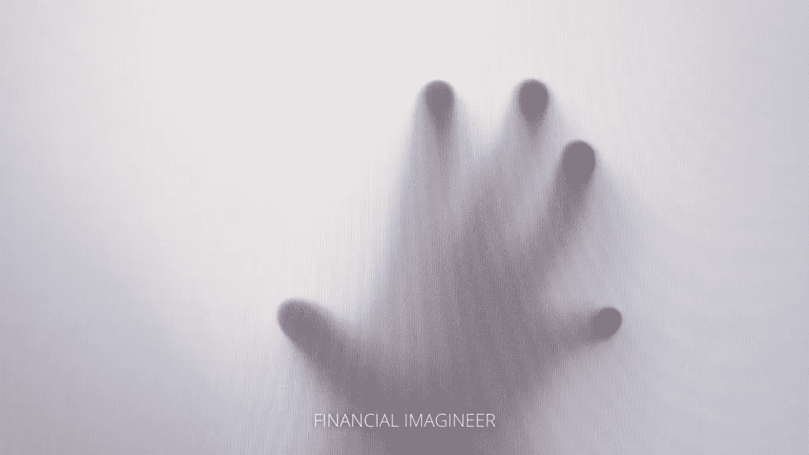

> *恐惧……*
> 
> 它帮助我们生存下来。
> 
> 保护我们免受剑齿虎的伤害。
> 
> 但是它阻碍了我们。
> 
> *它创造了舒适区。*
> 
> 它让我们无法前进。

然而，在我们的现代社会，恐惧是世界上所有错误的根源:

> *害怕失败:“我不够好！”*
> 
> *怕尴尬:“没人会在意！”*
> 
> *害怕开始:“如果我失败了呢？”*

这些听起来耳熟吗？

恐惧是有史以来最邪恶的虚构事物，也是让你的生活低于你的意义和潜力的最快方式。

行动是梦想的救世主。

你上一次采取行动是什么时候？

把恐惧作为成长的工具，挑战自己。

学习如何度过恐惧的时刻对塑造你的性格是最有益的。

害怕尝试或去“做”？

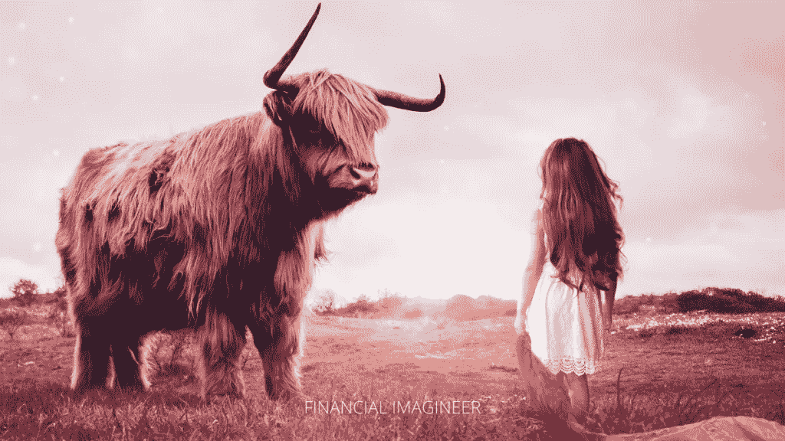

直面你的恐惧！

问问你自己:可能发生的最糟糕的事情是什么？

你要么赢，要么学习！

坚持学习，直到你赢。

找到一条通往恐惧另一边的路，因为那是梦想变成现实的地方。

恐惧的另一面是你的世界开始改变的地方，如果你允许的话。

恐惧是如此的有价值，但同时也是如此的令人虚弱。是把恐惧作为成长的工具，还是作为安身立命的理由，由你自己决定。我们是勇敢地克服障碍，还是害怕地躲起来，这取决于你！

 [## 这么说一家大型风投基金正在投资你的初创公司？4 实际考虑|数据驱动的投资者

### 首先，恭喜你。融资总是需要努力的，一个大的风险投资基金当然是一个大的…

www.datadriveninvestor.com](https://www.datadriveninvestor.com/2020/08/09/so-a-big-vc-fund-is-investing-in-your-startup-4-practical-considerations/) 

恐惧可能是梦想的最大杀手。

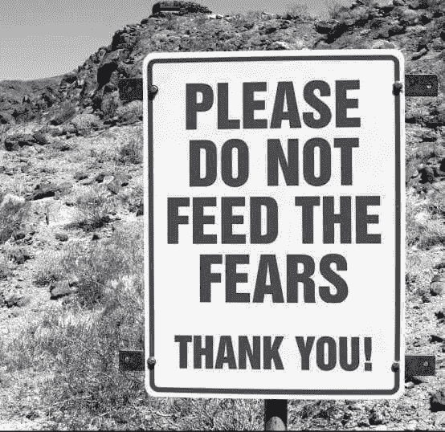

唯一的区别是，要么克服恐惧并成长，要么让恐惧限制你梦想的生活！

与其让恐惧扼杀你的梦想，不如杀死你的恐惧！

生活中大多数美好的事物都在恐惧的另一面。

> 如果你乐于坐在办公桌前而不冒任何风险，你将会在办公桌前呆上 20 年。
> 
> 大卫·鲁宾斯坦

# 第三步:消除恐惧！

不要害怕！

# 什么是贪婪

贪婪是一种不受控制的渴望，渴望获得或使用更多的物质利益(食物、金钱、土地、任何财产)或社会价值(地位或权力)。在人类历史上，贪婪一直被认为是“不可取的”，因为它在个人和社会目标之间造成了行为冲突。

贪婪是一种强大的东西。

在我看来，它紧随恐惧而来。

就激励力量而言，它抓住了进化精神的本质。贪婪可以以不同的形式表现出来。它过去是，现在仍然是推动人类不断前进的驱动力——在历史上。

这就是为什么在 1987 年的电影《华尔街》中，迈克尔·道格拉斯扮演的戈登·盖柯宣扬他的话:“贪婪，因为没有更好的词，是好的。”

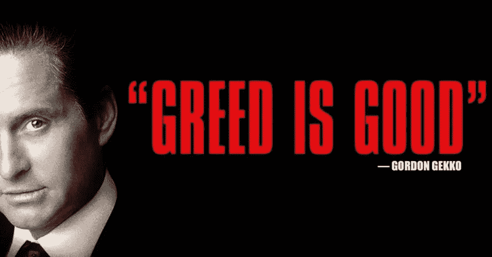

问题是:贪婪伴随着负面影响。每隔一段时间，贪婪就会引发资产泡沫，贪婪的投资者不断买入，无视所有可能崩盘的闪烁警告信号。

2008 年的危机主要是由“复杂的衍生品”结构引起的，在这种结构中，最终产品从基础商业案例中抽象出了两到三个维度，由于广泛的多样化和较低的透明度，一切看起来都很好。

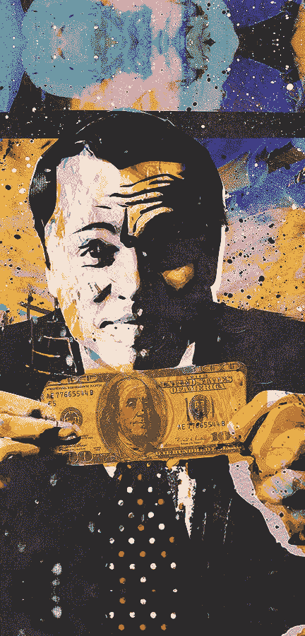

别误会，有野心是好的。想要在生活中有所成就是很棒的。想要学习、取得成就或成长是很自然的事情。作为一名训练有素的经济学家，我研究了微观经济决策发现背后的一种健康形式的贪婪。

如果自由市场力量放任自流[意味着没有政府干预]，就会出现“贪婪的好品质”。商品和服务将以对所有相关方的最优分配进行交换。均衡点有其相应的均衡数量和均衡价格，导致稀缺资源的最有效配置。

没有贪婪，华尔街、经济或我们的资本主义体系还能运转吗？我不这么认为。经济活动取决于利润动机。在宏观层面上，贪婪本身从来没有被完全抛弃过。全球各地的政府一直在影响市场。然而，在个人层面上，我们知道贪婪能做什么。

对一个人来说，最大的问题永远是:多少才够？

贪婪是追逐远大目标的良好动力，但陷阱往往是目标被调整得越来越高。太多永远不够。人们往往会失去对自己的控制。当涉及到金钱和权力时，贪婪往往会占上风。

# 第四步:学会控制自己的贪婪。

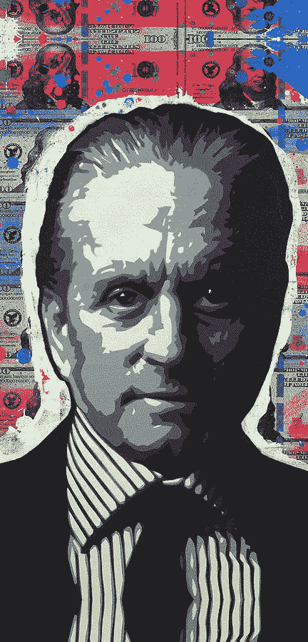

过度自信，生活方式膨胀，承担太多风险，试图越玩越大，往往会付出很大代价。它可以花费爱，友谊，信任，或者仅仅是一些钱。

当心:贪婪经常被用来出售东西。如果不是因为恐惧，营销经常直接迎合你的贪婪。人们会听并购买。

如何征服贪婪？

斯多葛派的心态是解药。

控制你的贪婪！

知道你有什么。

感激不尽。

避免生活方式膨胀，不要让对无意义的过度消费的渴望占据你的头脑。忘了攀比吧。避免从众心理。

这就是问题所在。

引导你的生活并记住:真正的领导者会致力于真正重要的事情！

你是你生活的领导者。

你开动脑筋。

# 实时拉你的裤子

在这篇文章的第三部分，我们将结合恐惧和贪婪的概念。

恐惧和贪婪以及与之相关的行为的最初动机(或目的)是促进个人或家庭的生存和保护未来的机会。在我们的现代世界，控制恐惧和贪婪仍然很重要:

投资者必须学会的最难的事情是管理自己的情绪。

恐惧、贪婪、过度自信、急躁、绝望、恐慌……我敢肯定，如果你偶尔阅读财经新闻，你可能会遇到这些概念。

这里的关键是避免让恐惧或贪婪麻痹和影响你的投资决策的错误。

没完没了地看美国消费者新闻与商业频道不会让你成为更好的投资者。关注这样的新闻只会让你要么精神崩溃，要么达到高潮——这取决于“当天的心情”。就像瘾君子一样，你会不断地说“哦，天哪”、“啊”、“是”或“不”，并不停地看垃圾广播:当其他人都这样做时，触发你采取行动！

你会实时吓得尿裤子，或者迟早会高潮衰竭。

你将乘着恐惧和贪婪的浪潮。

错误的方式。

不受控制。

是的，如果你投资股票，你将面临波动风险。有时，这种波动会让人神经崩溃。一旦市场陷入深度亏损，你将面临这样的局面:你想扔掉毛巾，卖掉所有东西。另一方面，当某些股票一飞冲天时，你的贪婪会引发所谓的“错过的恐惧”，你会在一个相当愚蠢的时刻加入进来。

> “当别人贪婪时要恐惧，当别人恐惧时要贪婪。”
> 
> 沃伦•巴菲特

现在你会说:好吧，我明白了，马特。不要做别人正在做的事。但是，嘿，你会建议如何处理股市波动呢？

首先，要明白波动是游戏的一部分。你和我，我们无法控制它。股票今天、明天、下周都会波动。你看不看都没关系。你喜不喜欢也不重要。

有时，人们声称他们更喜欢房地产投资，而不是股票，因为波动性较低。顺便说一下，我也是房地产投资的狂热爱好者。但是现在，想象一下你有一个疯狂的邻居。想象一下，这位邻居会隔着栅栏大喊你房子的实时价格。每一个。他妈的。一分钟。

你对此有何感想？

我想你可能会带上耳塞。

你不检查你家的实时价值。

那你为什么要用股票来做呢？

忽略噪音，关闭媒体。

别担心，随着时间的推移[你会成长为这个](https://www.financial-imagineer.com/2020/07/28/if-youth-knew-if-age-could/)！

# 第五步:如果你控制不了。学会不要让它控制你！

> *“股票市场是一个把钱从没有耐心的人身上转移到有耐心的人身上的工具。”*
> 
> 沃伦•巴菲特

如果你是一个多元化的长期投资者，我唯一允许你在华尔街的“红色日子”观看的媒体是这里的这个:

股票市场下跌时的引导冥想

作者 JL·科林斯

# 恐惧和贪婪指数

在这篇文章的最后一部分，我们了解了在资本主义的七大海洋中，理解恐惧和贪婪是如何有用的。

许多交易者使用技术、基本面或其他定量分析。然而，市场波动很大程度上是由人类情绪驱动的。因此，多愁善感的分析常常被忽视。

“[恐惧和贪婪指数](https://money.cnn.com/data/fear-and-greed/)”可以帮助你解读市场情绪。请注意，你不能仅仅根据这个指标来做交易决定。应该作为一个补充，来补充你最初的策略。

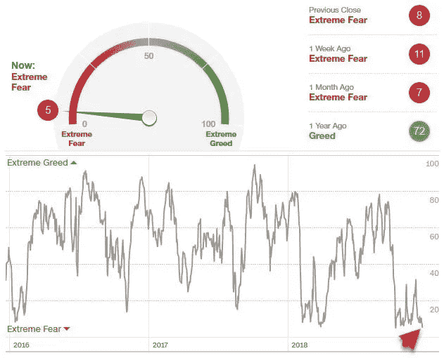

理解这一指标相对简单:

*   极度恐惧预示着可能的买入机会
*   极度贪婪表明市场调整是可以预期的

> *“在股票中赚钱的关键是不要被吓到。”*
> 
> 彼得·林奇

一个简单的应用方法是根据指数的某些读数重新平衡你的资产配置。如果指数显示恐惧，你可以减少债券或贵金属配置，增加股票配置。反之亦然，如果指数显示贪婪。

这是利用它的简单而容易的方法。

免责声明:请注意——这不是直接的投资建议，而是帮助你拓展金融知识的概念介绍。执行和交易风险自担。

在我职业生涯的大部分时间里，我一直是一名财富经理，帮助老练的投资者理财，现在让我介绍更多的选择。

# 贪婪阶段:

如果市场处于高位，恐惧和贪婪指数高于 80 点，预计将出现约 8%的回调(2011 年至 2020 年的数据)。高指数通常也意味着低波动性和减持的好机会。

要考虑的行动:

1.  卖出你所持股票/指数的备兑买入期权
2.  使用收益 1。购买相同持仓的看跌期权以建立对冲

简而言之:减少风险敞口，对冲潜在的负面影响。

# 恐惧阶段:

如果市场感到恐惧，波动性通常会很高，股票会相对便宜。有一件事是相当肯定的，市场不会在很长一段时间内保持在令人恐惧的领域。

要考虑的行动:

1.  买一个逆 VIX ETN，如 SVXY——一旦情况正常化，再放手
2.  如果你计划增加你的股权分配:在期望的执行价格水平卖出你期望的附加期权，收取溢价并等待。

简而言之:卖出恐惧，卖出波动，潜在地增加风险敞口。

如果你像我一样对投资充满热情，那就学会倾听市场的心跳。把 VIX、恐惧和贪婪指数加入到你的观察名单中吧！

# 第六步:学会倾听市场的心跳。

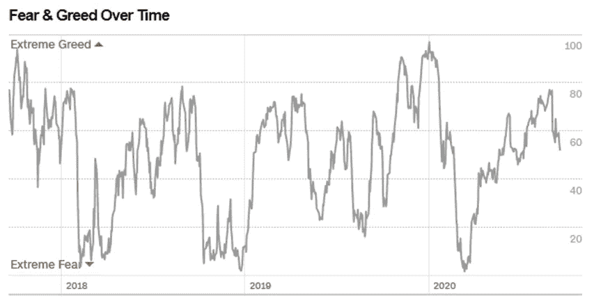

请注意，恐惧和贪婪指数不是一个官方的指数或工具，它是由 CNN 构建的。了解它是如何计算的，并注意 CNN 可能会在没有通知的情况下改变它的计算方式。

富人知道短期股市是由恐惧和贪婪等情绪驱动的。

普通人认为这完全是由逻辑和策略驱动的。

他们害怕何时应该购买。

……希望在他们应该谨慎的时候

…在他们应该销售的时候变得贪婪

然而，富人比普通人有一个强大的优势:

他们已经把自己安排在一个可以让自己冒险的位置上。

如果你还没有承担风险的能力，那就努力吧！

承担适当的风险，扩大你承担更多风险的能力，建立你的资产和现金流是最保守的“百万富翁的秘密”之一！

# 第七步:把自己放在一个允许自己冒险的位置上。

财务独立允许人们一次又一次地承担更多小的、可计算的风险。

但是记住:猪会被宰杀。

> *“牛赚钱，熊赚钱，猪被宰”*
> 
> 华尔街的一句老话，警告投资者不要过度贪婪

你能冒的风险越多，你就越不会尿裤子，情况会变得越艰难，当形势再次逆转时，你就越容易暴露自己的优势。

快乐战胜你的恐惧！

马特(男子名ˌ等于 Matthew)

如果你喜欢这篇文章，请考虑在媒体上关注我，通过电子邮件订阅我的博客，喜欢我的[脸书页面](https://www.facebook.com/financialimagineer/)或者在 [Twitter](https://twitter.com/FI_imagineer) 上关注我。

*原载于 2020 年 9 月 19 日 http://www.financial-imagineer.com**的* [*。*](https://www.financial-imagineer.com/2020/09/19/fear-and-greed/)

**访问专家视图—** [**订阅 DDI 英特尔**](https://datadriveninvestor.com/ddi-intel)