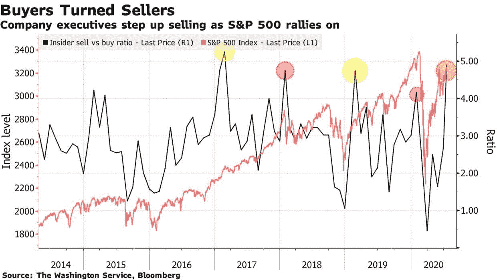
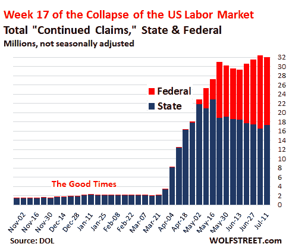
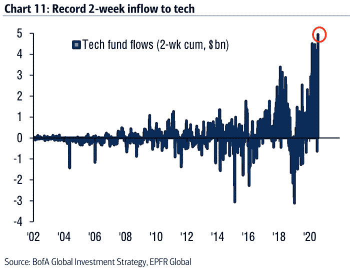
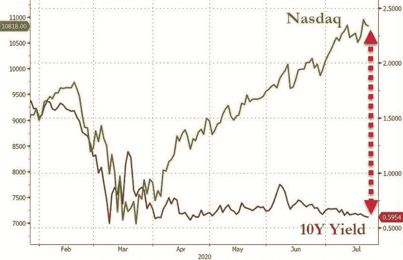
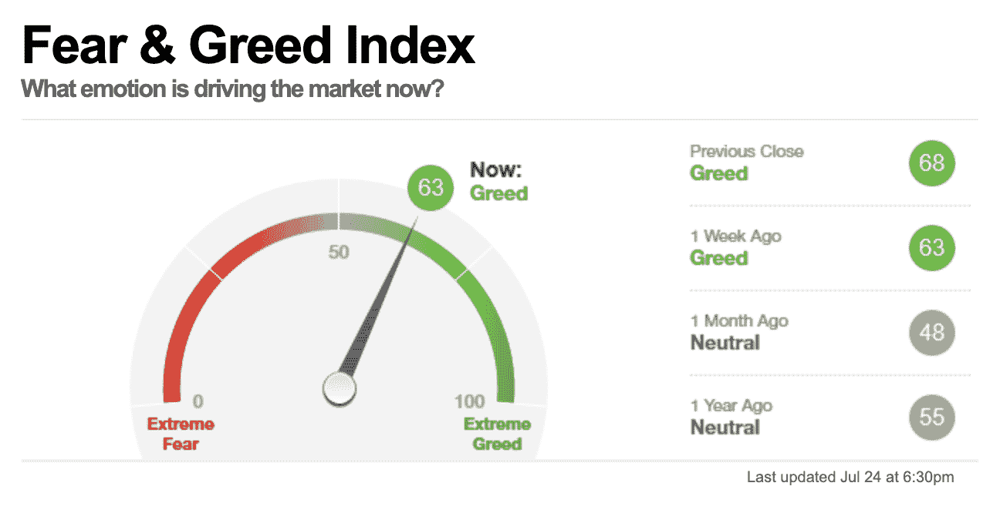
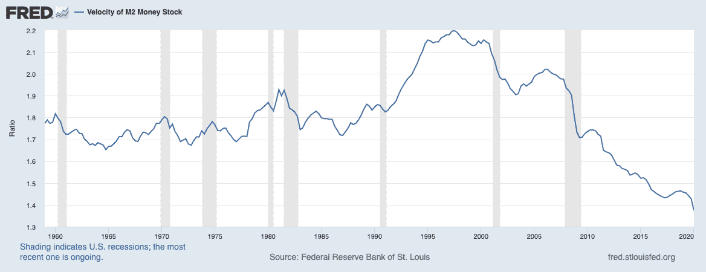

# 投资者希望金价能再涨至 1200 美元，金价因此变得火热。

> 原文：<https://medium.datadriveninvestor.com/fear-and-uncertainty-in-the-markets-as-investors-turn-to-gold-7b0fc2c82818?source=collection_archive---------9----------------------->

## 7 月 26 日的市场简讯周|阿尔法交易&数据驱动的投资者

*被困在 Medium 的付费墙后面？* [*注册我们的 Discord 服务器*](https://discord.gg/a97qq2s) *查看#公告免费获取全文:*[*https://discord.gg/a97qq2s*](https://discord.gg/a97qq2s)

Person Catching Glitters, source: cottonbro, Pexels

# 让您的生活更轻松:

*   [**市场观点**](#bd96)
*   [**每周击败**](#9d17)
*   [**最古老的对冲——黄金和贵金属**](#75b2)
*   [**其他新闻**](#f7f8)
*   [**洞察一周**](#b8e3)
*   [**编辑台**](#723d)
*   [**观看演出**](#17a4)

*结束一周，这样你就不用。这是最新一期的阿尔法交易通讯。阅读上一期我们的加密货币简讯* [***【此处】***](https://medium.com/datadriveninvestor/riding-the-defi-wave-where-are-we-headed-405c5593ec92) *以及所有关于股票和经济的* [***【此处】***](https://medium.com/datadriveninvestor/tech-leaders-slip-amid-covid-resurgence-economy-set-for-a-decisive-turn-aec14d426abb)*。*

[【复制我们的 S & P 500 主图，设置警报！】](https://www.tradingview.com/chart/12yl2kNH/)

# 市场观点

随着投资者以接近创纪录的数量撤出股票，流入债券，资产价格受到挤压。在[冠状病毒死灰复燃](https://www.reuters.com/article/us-health-coronavirus-global-cases/record-numbers-of-coronavirus-cases-in-every-global-region-reuters-tally-idUSKCN24Q08E?utm_source=morning_brew)、中美关系和总统选举不确定性的背景下，市场情绪已经下滑。专家担心，这是长期熊市之前的教科书式反弹，没有经典的降息工具来减轻痛苦。随着股市继续上涨，机构投资者对股市的看法日益悲观。

**欧洲陷入僵局|** [欧洲领导人关于€7500 亿恢复基金的谈判于上周结束。马拉松式的通宵谈判引发了领导人之间的紧张关系。他们将如何分配资金的细目分类如下。](https://www.cnbc.com/2020/07/20/european-recovery-fund-deadlock-despite-marathon-talks.html)

# 每周节拍

## 冠状病毒第二波造成重大伤亡

特朗普政府与美国制药巨头辉瑞和德国生物技术公司 BioNTech 签署了一份价值 20 亿美元的合同，在 2020 年底前提供 1 亿剂药物。这笔可观的投资是旨在加速新冠肺炎疫苗开发和大规模生产的众多投资之一。

 [## 关于数字化转型的 8 个问题投资者应该从每位首席执行官那里得到答案|数据…

### 几乎没有什么比做生意更令人兴奋的了。最吸引人的方面之一当然是投资于年轻的…

www.datadriveninvestor.com](https://www.datadriveninvestor.com/2020/07/06/8-questions-about-the-digital-transformation-investors-should-get-answers-from-every-ceo/) 

政治棋局| 川普[签署了四项针对大型制药公司的行政命令](https://www.marketwatch.com/story/pharma-stocks-fall-with-trump-set-to-sign-executive-orders-targeting-drug-prices-2020-07-24?mod=home-page&utm_source=morning_brew)，以大幅降低美国公众的药费。在一个关键的公共问题进入总统选举的背景下，这一决定可能是一个明智的政治举措，以确保选票。

**失业补贴已经停止。失业率仍然高达 21%(相比官方公布的 12%)，随着新冠肺炎恢复隔离措施，7 月份的就业率再次急剧下降。然而，数百万美国人所依赖的 600 美元补贴已经走到了尽头。劳动力市场显示出明显的疲软迹象，因为雇主仍在大范围减薪和冻结工资，影响到目前美国八分之一的就业人口。各州政府正努力调整他们的系统，以应对另一波失业申请。**

削减补贴和大量积压的失业申请自然会导致商业和住宅部门的拖欠(点击查看信息图),这已经是美国的一个关键问题。

因此，毫不奇怪，美国劳动力市场复苏[已经停滞](https://www.isabelnet.com/u-s-labor-market-recovery/)。

一些好消息| 财政部长姆努钦表示，共和党[已经敲定](https://www.cnbc.com/2020/07/26/mnuchin-says-1-trillion-gop-coronavirus-relief-plan-ready.html)新冠状病毒救助计划，据白宫经济顾问拉里·库德洛称，该计划将包括[另一张 1200 美元支票](https://www.cnbc.com/2020/07/26/kudlow-says-coronavirus-relief-will-include-1200-checks-and-extension-of-eviction-moratorium.html)和延长驱逐禁令。

## 中国紧张局势持续

随着美国以经济间谍为由下令关闭中国驻休斯敦领事馆，美中关系继续恶化。中国[通过](https://www.washingtonpost.com/world/asia_pacific/china-vows-to-retaliate-after-us-orders-closure-its-consulate-in-houston/2020/07/22/41e5c6ea-cbf1-11ea-99b0-8426e26d203b_story.html?utm_source=morning_brew)[关闭美国驻成都领事馆](https://www.ft.com/content/19cd7828-23c2-4cf1-9650-2ee24f636f13)来报复。中国外交部发言人王文斌指责美国“从事世界上最大规模的网络攻击活动”是虚伪的

英国暂停了与香港的引渡协议，称北京的行为侵蚀了该地区的言论自由和司法独立。这一决定是在英国的支持下做出的，本月早些时候，中国电信华为被排除在该地区的 5G 发展计划之外。

**避免系统性风险的绝望措施|** 中国[将九家金融机构](https://www.zerohedge.com/geopolitical/nine-chinese-financial-institutions-over-1-trillion-yuan-assets-are-nationalized-same)收归国有，资产超过 1430 亿美元。这一举动既不是一长串收购的开始，也不是结束。

中国黑天鹅| [圣经级别的洪水](https://www.aljazeera.com/news/2020/07/thousands-evacuated-china-floods-threaten-villages-200722045507013.html)本月在中国肆虐，给[三峡大坝带来巨大压力](https://www.wsj.com/articles/chinas-mighty-yangtze-is-heaving-from-rain-and-the-three-gorges-will-be-tested-11595675012)。全国各地的多座大坝已经倒塌，这是潜在灾难即将来临的不祥征兆。

## 投机者的时代

尽管投资者越来越不确定和谨慎，但散户投资者继续押注科技、行业颠覆者和航空公司等受打击的行业。尤其是千禧一代交易员是特斯拉(TSLA)股价长期上涨的幕后推手，这家汽车制造商巨头的最新财报获得了纳入标准普尔 500 指数的资格。

印度的年轻人已经加入了大规模投机美国股票的队伍，而且主要是基于手机的交易。正如《华尔街日报》所说， [**现在每个人都是日内交易者**](https://www.wsj.com/articles/everyones-a-day-trader-now-11595649609?mod=hp_lead_pos7) 。

# 最古老的对冲——黄金和贵金属

千禧一代的交易员们正在给已经人满为患的交易市场注入流动性，将 T2 的黄金和白银交易所交易基金推向了新的高度。贵金属表现如此好的真正原因[可能与美国债券市场的崩溃](https://www.msn.com/en-us/finance/markets/ever-lower-us-bond-yields-are-driving-gold-e2-80-99s-relentless-rally/ar-BB173rUT)有关。随着投资者寻求对经济不确定性的对冲，分析师们预计黄金现货价格将在 18 个月内达到 2000 甚至 3000 美元。因此，随着投资者逃离 5 年期和 10 年期美国国债，转向贵金属，美元指数(DXY) [遭遇](https://www.fxstreet.com/news/covid-19-update-us-cases-at-a-critical-mass-spells-danger-for-dxy-202007200208)。

Source: Bloomberg

Source: CNN; [https://money.cnn.com/data/fear-and-greed/](https://www.google.com/url?q=https://money.cnn.com/data/fear-and-greed/&sa=D&ust=1595867537499000&usg=AFQjCNFU0QE95Rq_pIvjNvbGKFsbPy7bcQ)

## 当我们谈到弱势美元的话题时，

美元走软意味着全球经济更加稳定，但表面上看，美国国内形势严峻。随着全球投资者在普遍预期疫情最糟糕的时期已经过去的情况下重新考虑欧元，投资者已经开始多元化投资美元，将美国股市置于潜在的顶部。

## 基础经济处于昏迷状态。

> *“货币流通速度是在给定的时间内，一个货币单位被用来购买国内生产的商品和服务的频率。* ***如果货币的流通速度在增加，那么在一个经济体中，更多的交易发生在个人之间。****——美联储圣路易斯银行*

**

# *其他新闻*

***在逃|** 据报道，Wirecard 公司的首席运营官·詹斯·马沙莱克已经在俄罗斯避难，以逃避该公司今年早些时候揭露的[€19 亿英镑丑闻](https://www.datadriveninvestor.com/2020/06/19/how-wirecard-concealed-its-e1-9-billion-plothole/)的法律后果。这是[又一个企业逃犯在其管辖范围之外寻求庇护的例子。](https://www.zerohedge.com/markets/wirecards-no-2-has-reportedly-fled-russia-handelsblatt)*

*多管闲事的孩子！Twitter hack update |Twitter 的一份报告发现[黑客利用 Slack](https://decrypt.co/36017/attackers-used-slack-to-breach-twitter-according-to-report?&utm_medium=referral&utm_campaign=feed&utm_source=trading-view) 入侵了至少 130 个账户，而且这都是一小群年轻、缺乏经验的自以为是者所为。*

*美国正在失去一张王牌吗？欧芹能源公司的首席执行官怀疑，在 COVID 引发的石油行业几个月的波动中，美国的页岩繁荣已经接近尾声。*

*周一，巴菲特购买了 8 亿美元的美国银行普通股。*

# *本周洞察*

***向我们最好的学习技术分析。**在之前的视频中，我们的分析师 Amol Gharte 给出了一些关于[如何使用布林线](https://youtu.be/s3oLm04LC8I?t=516)、[交易周开盘价水平](https://youtu.be/s3oLm04LC8I?t=75)和[捕捉回撤](https://youtu.be/s3oLm04LC8I?t=1235)的提示，以便进入有利可图的交易(链接重定向到视频中的相关时间戳)。*

*[**利润从何而来？**](https://nathantankus.substack.com/p/where-do-profits-come-from?token=eyJ1c2VyX2lkIjo5NDA0NTI4LCJwb3N0X2lkIjo3NTU2MjIsIl8iOiJiV0IrSiIsImlhdCI6MTU5NTY1NDIyMSwiZXhwIjoxNTk1NjU3ODIxLCJpc3MiOiJwdWItMzQxMjEiLCJzdWIiOiJwb3N0LXJlYWN0aW9uIn0.ODHl6mgBXlTjuriYMROkP0Wk8M9opEcX-wtfYkUCHPc&utm_source=substack&utm_medium=email&utm_content=share) **|** **作者内森·坦库斯|** 坦库斯先生关于危机的*笔记*在经济学家和政治学家中引起轰动。如果你准备进入大脑模式，拿一杯特浓绿茶，准备好学习全球支票簿最终如何平衡的新视角。在一个关于是否应该为美国家庭提供另一轮失业救济的激烈辩论中，内森为支持刺激的阵营提供了一个令人难以置信的深思熟虑的推理。*

*[**晨酿解说反垄断**](https://www.morningbrew.com/daily/stories/2020/07/23/brews-guide-big-tech-antitrust-hearings?utm_source=morning_brew) **|** 这些家伙做出了世界上最好的时事通讯之一。吹捧一个直接竞争对手可能是愚蠢的，但我们没有办法，他们就是那么好。我们尤其喜欢他们对本月举行的四大反垄断听证会的报道。如果你冒险去看他们的时事通讯，告诉他们阿尔法交易和数据驱动的投资者给你发的。也许森派终于会注意到我们了，UwU。*

# *编辑桌*

*每周我们都会从我们的网络中为读者带来一些精选的故事。*

*****|**[**数据驱动的投资者**](https://www.datadriveninvestor.com/) **|作者:赛义德·易卜拉欣·艾哈迈德|** “像 GDP、失业和通货膨胀这样的统计数据在一个很大程度上是非正规的经济体中没有什么意义。”这个让我们思考。他们的竞争被粉碎，国际贸易放缓，大量人才和劳动力准备重返工作岗位，谁会从中受益？***

***[**数字欧元即将到来**](https://thecapital.io/article/digital-euro-is-coming-MCpbWfIbf3ZAy9b5Qzt) **|** [**首都**](https://thecapital.io/) **|作者:Marko vid rih |**cbdc 将带来快速、高效、易于追踪的资金流动，当这种升级早该进行的时候。CBDCs 的广泛实施并不是一场比特币革命，但它仍然是一段重要的历史。***

# ***观看表演***

***我们的团队每周都会介绍市场价格行为背后的基本驱动因素— [ [**在我们的 Discord server 中了解更多信息]**](https://discord.gg/a97qq2s) 。在今天的节目中找到你的优势。***

# ***放弃***

***Alpha Trades，LLC 提供的信息不用于制定任何财务决策，也不是购买、持有和/或销售特定产品、数字资产或 ICO 的请求或建议。***

***访问我们的完整服务条款:[https://bit.ly/3faVeeV](https://bit.ly/3faVeeV)***

*****访问专家视图—** [**订阅 DDI 英特尔**](https://datadriveninvestor.com/ddi-intel)***