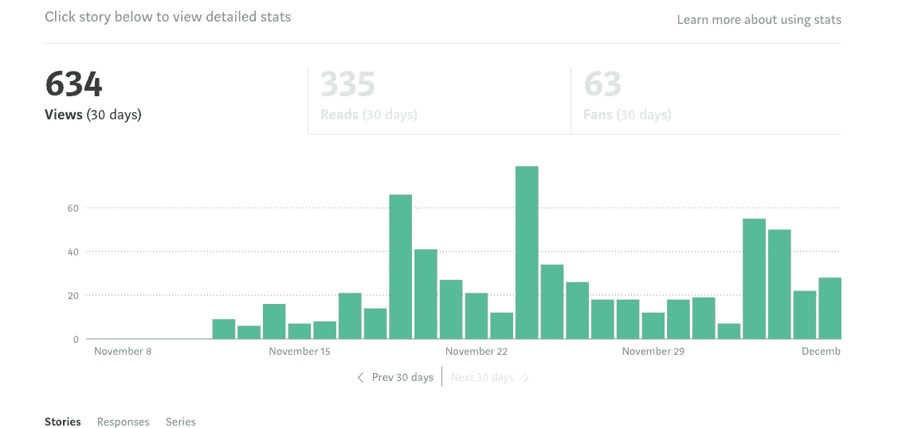

# 恐惧催化剂

> 原文：<https://medium.datadriveninvestor.com/fear-catalyst-8503d15235d1?source=collection_archive---------9----------------------->

当我开始写作时，有一件事一直萦绕在我脑海中，那就是每天写作。现在，热爱我正在做的事情，稍后出现在行动中变成了完成整个事情。

captured at 23:11

我开始写博客还不到一个月，我对博客世界还是个新手。作为一个内向的人，我总是很难向别人敞开心扉。我一直认为我的想法和想法比别人更愚蠢，这可能是我有过的最糟糕的心态。

一天早上醒来，带着发布我的第一篇博客的满足感，看到我博客上的 **9 次浏览**让我兴奋不已。我不知道夸大观点是个错误。

不知何故，我的多巴胺总是想让我每 20 分钟查看一下我博客的浏览量。我对自己的愚蠢行为感到恼火，因为我的生产率和时间都被它消磨了。

我决定做我自己的读者，在我满意的时候发表我的博客。有几次写完一个完整的博客后，我会把它们扔进垃圾箱。我把我的多巴胺推向我的社交媒体喜欢和观点的满足感受体。

同样，一点一滴地减少我对社交媒体的关注，将我的潜在能量转移到某个地方，让那里的事情运转起来。

通过尝试不同的东西，尤其是让我害怕的东西，我学到了很多。我害怕的事情有一个清单，我每天都把它们写出来，告诉他们如何去解决它们。

恐惧之一是在我的博客上看到很低的浏览量，但现在它一去不复返了。恐惧就是每天都在创造，我喜欢这种恐惧让我每天都更努力地鞭策自己。

有时候，只有当你思考如何扭转消极时，你的消极才会变成积极。

## 获得专家观点— [订阅 DDI 英特尔](https://datadriveninvestor.com/ddi-intel)