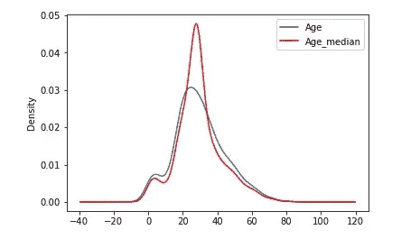
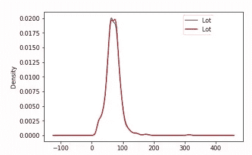
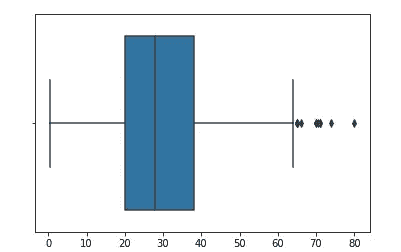
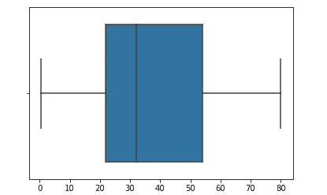

# 要素工程-使用 Python 处理缺失的数字数据

> 原文：<https://medium.datadriveninvestor.com/feature-engineering-handling-missing-numeric-data-with-python-7be1e871f85e?source=collection_archive---------0----------------------->

我们经常想要填满那些空的空间，不管是家、心还是数据。

在真实的场景中，我们经常看到和观察到数据在数据集中丢失。

在看到处理它们的技术之前，让我们看看它可能会出现什么样的问题，以及各种类型的丢失数据是什么。

**缺失数据**呈现各种**问题**。

1)缺失的**数据**降低了统计功效，统计功效是指当零假设为假时，测试将拒绝零假设的概率。

2)缺失的**数据**会导致参数估计的偏差。

3)会降低样本的代表性。

缺失数据会降低试验的效力。预计会有一些数据缺失，因此目标样本量会增加。然而，这并不能消除潜在的偏见。应该更多地关注在研究的设计和执行以及结果数据的分析中缺失的数据。

**缺失数据有哪些不同类型？**

1.**完全随机缺失(MCAR):** 如果缺失的概率对所有观测值都相同，那么变量就是完全随机缺失(MCAR)。当数据为 MCAR 时，缺失的数据与数据集中观察到的或缺失的任何其他值之间完全没有关系。换句话说，那些丢失的数据点是数据的随机子集。没有系统化的方法使一些数据比其他数据更容易丢失。

MCAR 的数据很少。

在下面的例子中，我们可以看到没有任何规则的数据丢失。


MCAR 数据的统计学优势是分析保持无偏性。设计中可能会损失功率，但估计的参数不会因为缺少数据而产生偏差。

2.**非随机缺失数据(MNAR):** 系统性缺失值在数据集中，缺失的数据和任何其他观察到的或缺失的值之间绝对存在某种关系。

在这种情况下，获得参数无偏估计的唯一方法是对缺失数据进行建模。

在下面的例子中，我们可以看到，只有等于或少于 30000 英镑的工资丢失。


3.**随机缺失(MAR):** 这里的缺失数据只受完全(观测)变量的影响，不受缺失数据本身特征的影响。换句话说，对于一个数据点，缺失与缺失的数据无关，但与部分(或全部)观察到的数据有关

假设我们可以根据其他数据预测缺失的值。

在下面的例子中，我们可以看到缺失的数据是年龄> 50 岁的人的数据


现在让我们看看如何用各种技术来处理它们。

处理缺失值的技巧有:

1.均值/中值/众数替换

2.随机样本插补

3.用新特性捕获 NAN 值

**4.分布终点插补**

**5.任意插补**

**6.频繁类别插补**

# **均值/中值/众数插补**

**均值/中值插补假设数据完全随机缺失(MCAR)。我们通过将 NAN 替换为最频繁出现的变量来解决这个问题。**

****假设:**缺失数据完全是随机的(MCAR)。**

**在 python 中，我们可以通过以下代码来实现:**

```
**def** median_rep(df,field,median):
 df[field+"_median"]=df[field].fillna(median)
```

**或者**

```
from sklearn.preprocessing import Imputer
 values = mydata.values
 imputer = Imputer(strategy=’median’)
```

****

## **优势**

**1)易于实施**

**2)快速获取完整数据集的方法。**

**3)适用于小型数值数据集。**

****缺点****

**1)原始方差的变化或扭曲，如上图所示。**

**2)影响相关性。**

**3)不太准确。**

**4)仅适用于列级别。**

# **随机样本插补**

**从变量中随机抽取样本的缺失数据。它适用于数字变量和分类变量。可以显示变量列表，或者估算者将自动选择所有变量。**

**在 python 中，我们可以通过以下代码来实现:**

```
**def** random_rep(df,field):
 df[field+"_random"]=df[field]
 *# random value to fill the na*
 random_value=df[field].dropna().sample(df[field].isnull().sum(),random_state=0)
 *#pandas need to have same index in order to merge the dataset*
 random_value.index=df[df[field].isnull()].index
 df.loc[df[field].isnull(),field+'_random']=random_sample
```

****或****

```
imputer = mdi.RandomSampleImputer(random_state=[field1, field2],
 seed='observation',
 seeding_method='add'/’mutiply’)
```

*   ****random_state** ( *，default = None*)—random _ state 可以取一个整数来设置抽取随机样本时的种子。或者，它可以采用变量名或变量列表，这些值将用于确定每个观察的种子观察。**
*   ****种子** ( *，default = ' general '*)-指示是否应为每个具有缺失值的观察值设置种子，或者是否应使用一个种子一次性估算所有变量。**
*   **概述:一个种子将用于估算整个数据框。这相当于在熊猫身上播下种子。样本(random_state)。**
*   **观察:将使用 random_state 中指示的变量值为每个观察设置种子。**
*   ****seeding_method** ( *，default='add'* ) —如果指示多个字段为每个观察值的随机抽样播种，您可以选择以加法或乘法的方式组合这些值。可以接受值“加”或“乘”。**

****

****优势****

**1)易于实现。**

**2)随机抽样插补保留了原始分布，这与其他插补技术不同。**

**3)方差失真较小**

****缺点****

**1.随机性能否起作用取决于特定的数据条件，但并非在所有情况下都有用。**

# **通过新增功能获取 NAN 值**

**如果数据不是完全随机丢失的(MNAR)，这种策略很有效。**

**用键值 0 或 1 捕获 Nan 值，并用任何策略(如均值、中值或众数)替换字段中的 Nan 值。**

**这样我们就有了一个密钥，可以进一步查看 Nan 值是否对数据分布有任何影响。**

****假设:**对于随机不完全缺失的数据(MNAR)。**

**在 python 中，我们可以通过以下代码来实现:**

```
**def** capture_nan(df,field):
 **import** **numpy** **as** **np**
 df[field+’_NAN']=np.where(df[field].isnull(),1,0)
```

****优势****

**1.实现起来很容易。**

**2.捕捉缺失值的重要性**

****缺点****

**1.创建附加功能。**

**如果有许多字段需要跟踪缺失值，那么这会产生更高维的数据。(维度的诅咒)**

# **分布终点插补**

**如果通过观察，一个人感觉丢失的值不是随机的，那么获取该信息是重要的。在这种情况下，人们会希望用变量的**分布**尾部的值来替换丢失的数据。**

****假设:**缺失值不是随机的。(蒙古国)**

****

**在 python 中，我们可以通过以下代码来实现:**

```
**def** extreme_rep(df,field,extreme): 
  extreme=df.field.mean()+3*df.field.std()
 df[field+"_end_distribution"]=df[field].fillna(extreme)##Or*# set up the imputer*
import feature_engine.missing_data_imputers as mdi 
tail_imputer = mdi.EndTailImputer(distribution='gaussian',tail='right',fold=3,variables=[field])
```

*****高斯极限:*****

**右尾:平均值+3 *标准差**

**左尾:平均值-3 *标准差**

****

****优点****

**1.易于快速实施。**

**2.它捕捉丢失值的重要性(如果有人怀疑丢失的数据是有价值的)**

****缺点****

**1.如果丢失的数据不重要，这种行为可能会扭曲变量，掩盖预测能力。**

**2.如果缺失数据很大，隐藏真实的异常值，或者创建一个非预期的异常值。**

# **任意值插补**

**它被定义为用一个**任意值**替换变量中所有出现的缺失**值**。理想情况下，该值应不同于中值/平均值/众数，并且不在变量的正常**范围**内。**

****假设:**数据不是随机缺失的。(蒙古国)**

```
**def** arb_rep(df,field,arbVal):
 df[field+"_arbVal"]=df[field].fillna(arbVal)
```

**或者**

```
from sklearn.impute import SimpleImputer
# create the imputer, with fill value 99 as the arbitrary value
imputer = SimpleImputer(missing_values=np.nan, strategy='constant', fill_value=99)
```

****优点****

1.  **实现起来很容易。**
2.  **这是获得完整数据集的快速方法。**
3.  **它捕捉了一个值“丢失”的重要性，如果有一个值的话。**

****缺点****

1.  **原始变量分布和方差的失真。**
2.  **剩余数据集变量的协方差失真。**
3.  **如果任意值位于分布的末端，它可能会屏蔽或创建**异常值**。**
4.  **我们需要小心，不要选择与均值或中值(或变量分布的任何其他典型值)过于相似的任意值。**
5.  **NA 的百分比越高，失真就越高。**

***原载于 2020 年 10 月 9 日 https://www.numpyninja.com*[](https://www.numpyninja.com/post/feature-engineering-handling-missing-data-with-python)**。****