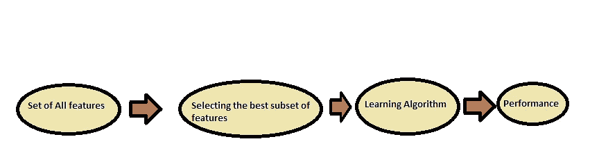
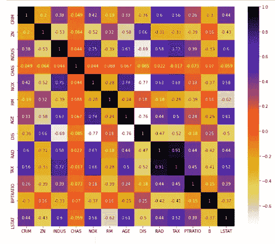
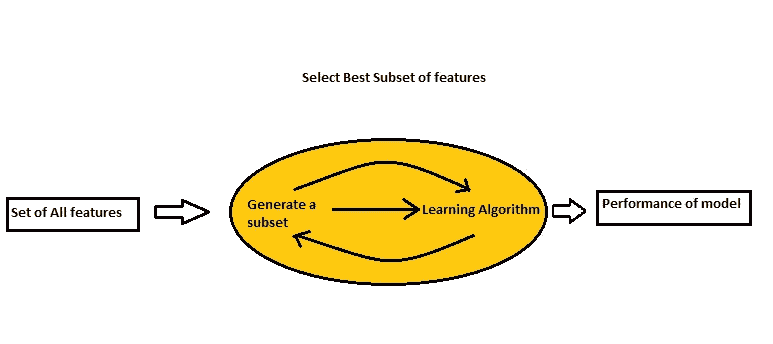
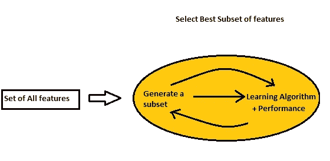

# 特性选择-通过 Python 选择最重要的特性

> 原文：<https://medium.datadriveninvestor.com/feature-selection-selection-of-the-best-that-matters-through-python-c05018916c94?source=collection_archive---------8----------------------->

消除浪费，保留商品是普遍规律。在机器学习中，我们希望我们的模型是优化和快速的，为了做到这一点，并消除不必要的变量，我们采用各种特征选择技术。

使用特征选择的主要原因是:

*   来更快地训练机器学习模型。
*   以提高模型的准确性，如果选择了优化的子集。
*   降低模型的复杂性。
*   以减少过度拟合并使其更易于解释。

易于使用且效果良好的特征选择技术有:

**A)** **过滤方法**

1.  删除常量功能
2.  单变量选择
3.  特征重要性
4.  热图相关矩阵



Filter Methods

**下降常数特性**

在这个过滤器中，我们可以移除具有恒定值的特征，这些特征对于解决问题陈述实际上是不重要的。

在 Python 中，使用 sklearn 的 VarianceThreshhold 功能应用此功能的代码是:

```
**from** **sklearn.feature_selection** **import** VarianceThreshold
var_thres=VarianceThreshold(threshold=0)
var_thres.fit(data)
data.columns[var_thres.get_support()]
constant_columns = [column **for** column **in** data.columns
**if** column **not** **in** data.columns[var_thres.get_support()]]
data.drop(constant_columns,axis=1)
```

**单变量选择**

在这种类型的选择中，统计测试用于选择那些与结果/输出变量关系最密切的变量/特征。

scikit-learn 库提供了 SelectKBest 类，它可以与一组不同的统计测试一起使用，以选择特定数量的特性。

*   皮尔逊相关系数:f _ 回归()
*   方差分析:f_classif()
*   卡方:chi2()

以下示例使用非负特征的卡方(chi)统计测试从移动价格范围预测数据集中选择 10 个最佳特征

为了理解 Chi2，我们需要理解以下几个术语:

**自由度**指逻辑独立值的最大数量，可以自由变化。简而言之，它可以定义为观测值的总数减去施加在观测值上的独立约束的数量。

卡方检验在统计学中用于检验两个事件的独立性。给定两个变量的数据，我们可以得到观察计数 O 和期望计数 E。卡方测量期望计数 E 和观察计数 O 如何相互偏离。

Xc2= ∑(Oi — Ei )2 / Ei

其中:

c=自由度，

O=观察值

e =预期值

当两个特征独立时，观察计数接近预期计数，因此我们将具有较小的卡方值。所以高卡方值表明独立性假设是不正确的。简而言之，卡方值越高，特征越依赖于响应，并且可以被选择用于模型训练。

在 Python 中，这种类型的过滤可以通过使用来自 sklearn 的 SelectKBest 和 chi2 库来完成，如以下代码所示:

```
**import** **pandas** **as** **pd**
**import** **numpy** **as** **np**
**from** **sklearn.feature_selection** **import** SelectKBest
**from** **sklearn.feature_selection** **import** chi2
data = pd.read_csv("train.csv")
X = data.iloc[:,0:20]  *#independent columns*
y = data.iloc[:,-1]    *#target column i.e price range*

 *#apply SelectKBest class to extract top 10 best features* 
bestfeatures = SelectKBest(score_func=chi2, k=10) 
fit = bestfeatures.fit(X,y)
dfscores = pd.DataFrame(fit.scores_)
dfcolumns = pd.DataFrame(X.columns)

 *#concat two dataframes for better visualization* 
featureScores = pd.concat([dfcolumns,dfscores],axis=1) featureScores.columns = ['Specs','Score'] *#naming the dataframe columns*
featureScores
print(featureScores.nlargest(10,'Score'))  *#print 10 best features*
```

**特征重要性**

特征重要性是数据集中每个特征的一种分数，分数越高，特征对于结果或因变量越重要或相关。

通过使用模型的要素重要性属性，可以获得数据集每个要素的要素重要性。

特征重要性是一个内置的类，带有基于树的分类器，我们将使用额外的树分类器来提取数据集的前 10 个特征。

在 python 中，这可以通过以下代码来实现:

```
**from** **sklearn.ensemble** **import** ExtraTreesClassifier 
**import** **matplotlib.pyplot** **as** **plt** 
model = ExtraTreesClassifier() 
model.fit(X,y)
print(model.feature_importances_) *#use inbuilt class feature_importances of tree based classifiers*
*#plot graph of feature importances for better visualization* feat_importances = pd.Series(model.feature_importances_, index=X.columns) 
feat_importances.nlargest(10).plot(kind='barh') plt.show()
```

**与热图相关的矩阵**

相关性说明变量和输出或目标变量之间的关系。

相关性可以是正的(正比)或负的(反比)

热点图使得识别哪些特征与目标变量最相关变得容易，我们将使用 seaborn 库绘制相关特征的热点图。

在 Python 中，这可以通过下面的代码来完成。

```
**import** **seaborn** **as** **sns**
*#get correlations of each features in dataset*
corrmat = data.corr()
top_corr_features = corrmat.index
plt.figure(figsize=(20,20))
*#plot heat map*
g=sns.heatmap(data[top_corr_features].corr(),annot=**True** , cmap=plt.cm.CMRmap_r)
plt.show()
```



深色表示相关性较高。

**B)** **包装方法**

包装方法的一些常见示例有:

1)正向特征选择

2)反向特征消除

3)递归特征消除。



Wrapper Methods

**1:前向选择**:前向选择是一种优化特征选择的迭代方法，我们从模型中没有特征开始。在每一次迭代中，我们不断地添加最能改进我们模型的特性，直到添加一个新变量不能改进模型的性能。

在 python 中，它可以实现为:

```
1\. *# step forward feature selection*
2\.  
3\. from sklearn.model_selection import train_test_split
4\. from sklearn.ensemble import RandomForestRegressor
5\. from sklearn.metrics import r2_score
6\. from mlxtend.feature_selection import SequentialFeatureSelector as SFS
7\. *# select numerical columns:*
8\.  
9\. numerics = ['int16', 'int32', 'int64', 'float16', 'float32', 'float64']
10\. numerical_vars = list(data.select_dtypes(include=numerics).columns)
11\. data = data[numerical_vars]
12\. *# separate train and test sets*
13\. X_train, X_test, y_train, y_test = train_test_split(
14\.  X,Y, test_size=0.3, random_state=0)
15\. *# find and remove correlated features*
16\. def correlation(dataset, threshold):
17\.  col_corr = set() *# Set of all the names of correlated columns*
18\.  corr_matrix = dataset.corr()
19\.  for i **in** range(len(corr_matrix.columns)):
20\.  for j **in** range(i):
21\.  if abs(corr_matrix.iloc[i, j]) > threshold: *# we are interested in absolute coeff value*
22\.  colname = corr_matrix.columns[i] *# getting the name of column*
23\.  col_corr.add(colname)
24\.  return col_corr
25\.  
26\. corr_features = correlation(X_train, 0.8)
27\. print('correlated features: ', len(set(corr_features)) )
28\. *# removed correlated* *features*
29\. X_train.drop(labels=corr_features, axis=1, inplace=True)
30\. X_test.drop(labels=corr_features, axis=1, inplace=True)
31\. X_train.fillna(0, inplace=True)
32\.  
33\.  
**34.** ***# step forward feature selection***
35\.  
36\. from mlxtend.feature_selection import SequentialFeatureSelector as SFS
37\.  
38\. sfs1 = SFS(RandomForestRegressor(), 
39\.  k_features=10, 
40\.  forward=True, 
41\.  floating=False, 
42\.  verbose=2,
43\.  scoring='r2',
44\.  cv=3)
45\.  
46\. sfs1 = sfs1.fit(np.array(X_train), y_train)
47\. X_train.columns[list(sfs1.k_feature_idx_)]
48\. sfs1.k_feature_idx_
```

**2:向后消除**:在向后消除中，我们从所有的特征开始，并在每次迭代中移除最不重要的特征，从而提高模型的性能。我们重复这一过程，直到在删除特征时没有观察到改进。

在 python 中，它可以实现为:

```
49\. *# step backward feature elimination*
50\.  
51\. sfs1 = SFS(RandomForestRegressor(), 
52\.  k_features=10, 
53\.  forward=False, 
54\.  floating=False, 
55\.  verbose=2,
56\.  scoring='r2',
57\.  cv=3)
58\.  
59\. sfs1 = sfs1.fit(np.array(X_train), y_train)
60\. X_train.columns[list(sfs1.k_feature_idx_)]
61\. sfs1.k_feature_idx_
```

**3:递归特征消除**:这是一种最贪婪的优化算法，旨在找到性能最佳的特征子集。

它重复地创建模型，并在每次迭代中保留性能最好或最差的特性。它用剩下的特征构造下一个模型，直到所有的特征都处理完。然后，它根据要素被消除的顺序对其进行排序。

在 python 中，它可以实现为:

```
**from** **sklearn.svm** **import** [SVC](https://scikit-learn.org/stable/modules/generated/sklearn.svm.SVC.html#sklearn.svm.SVC)
**from** **sklearn.datasets** **import** [load_digits](https://scikit-learn.org/stable/modules/generated/sklearn.datasets.load_digits.html#sklearn.datasets.load_digits)
**from** **sklearn.feature_selection** **import** [RFE](https://scikit-learn.org/stable/modules/generated/sklearn.feature_selection.RFE.html#sklearn.feature_selection.RFE)
**import** **matplotlib.pyplot** **as** **plt**

*# Load the digits dataset*
digits = [load_digits](https://scikit-learn.org/stable/modules/generated/sklearn.datasets.load_digits.html#sklearn.datasets.load_digits)()
X = digits.images.reshape((len(digits.images), -1))
y = digits.target

*# Create the RFE object and rank each pixel*
svc = [SVC](https://scikit-learn.org/stable/modules/generated/sklearn.svm.SVC.html#sklearn.svm.SVC)(kernel="linear", C=1)
rfe = [RFE](https://scikit-learn.org/stable/modules/generated/sklearn.feature_selection.RFE.html#sklearn.feature_selection.RFE)(estimator=svc, n_features_to_select=1, step=1)
rfe.fit(X, y)
```

**C)**嵌入方法



Embedded Methods

**1:套索回归**

Lasso 回归执行 L1 正则化，这实际上是添加等于系数大小绝对值的惩罚。

正则化意味着向机器学习模型的不同参数添加惩罚或惩罚，以减少模型的自由度，从而避免过度拟合。在线性模型正则化中，惩罚应用于乘以每个预测值的系数。从不同类型的正则化中，Lasso 或 l1 具有其能够使许多系数值为零的性质。因此，可以从模型中删除该特征。

在 python 中，它被实现为:

```
*#load libraries*
from sklearn.model_selection import train_test_split
from sklearn.linear_model import Lasso
from sklearn.feature_selection import SelectFromModel
from sklearn.preprocessing import StandardScaler
*# different scales, so it helps the regression to scale them*
*# separate train and test sets*
X_train, X_test, y_train, y_test = train_test_split(
X,Y, test_size=0.3,
 random_state=0)

scaler = StandardScaler()
scaler.fit(X_train.fillna(0))
*# to force the algorithm to shrink some coefficients*

sel_ = SelectFromModel(Lasso(alpha=100))
sel_.fit(scaler.transform(X_train.fillna(0)), y_train)
*# make a list with the selected features and print the outputs*
selected_feat = X_train.columns[(sel_.get_support())]
```

很明显，套索正则化可能有助于从数据集中移除不重要的要素。因此，增加惩罚将导致移除的特征数量增加。

惩罚越高，重要特征被移除的概率越高，这可能导致模型性能下降，然后意识到我们需要降低正则化。

**2:随机森林/集合技术**

随机森林也可以被称为集成决策树，并且对于特征选择和分类器也是有用的。

随机森林是最流行的机器学习算法之一。因为它们提供了非常好的预测性能、低过拟合和容易解释，因此它们被认为是非常成功的。

在分类中，我们通过基尼系数或信息增益/熵来衡量杂质。在回归分析中，我们用方差来衡量杂质。当我们训练一棵树时，可以计算出每个特征减少杂质的程度。哪个特征减少杂质，它就越重要。在随机森林中，每个特征的杂质减少可以确定该特征的最终重要性。

在随机树的顶部选择的特征通常比在树的末端节点选择的特征更重要，因为通常顶部节点导致更大的信息增益。

在 python 中，它可以实现为:

```
*# Import libraries*
from sklearn import preprocessing
from sklearn.preprocessing import LabelEncoder
from sklearn.preprocessing import StandardScaler
from sklearn.model_selection import train_test_split
from sklearn import tree
from sklearn.ensemble import RandomForestClassifier
*# Encode categorical variables*
X = pd.get_dummies(X, prefix_sep='_')
y = LabelEncoder().fit_transform(y)
*# Normalize feature vector*
X2 = StandardScaler().fit_transform(X)
*# Split the dataset*
X_train, X_test, y_train, y_test = train_test_split(X2, y, test_size = 0.30, random_state = 0)
*# instantiate the classifier with n_estimators = 100*
clf = RandomForestClassifier(n_estimators=100, random_state=0)
*# fit the classifier to the training set*
clf.fit(X_train, y_train)
*# predict on the test set*
y_pred = clf.predict(X_test)
```

希望看完这篇博客后，通过 python 选择不同类型的特性会更加容易。

感谢阅读！

*原载于 2020 年 10 月 14 日*[*【https://www.numpyninja.com】*](https://www.numpyninja.com/post/feature-selection-selection-of-the-best-that-matters)*。*