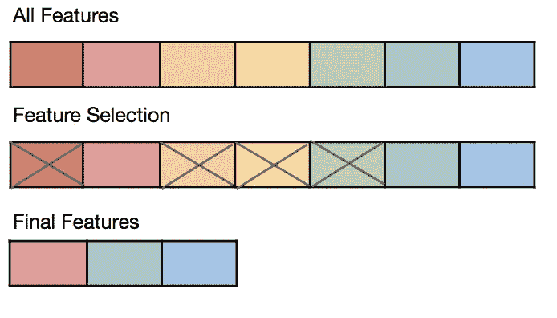
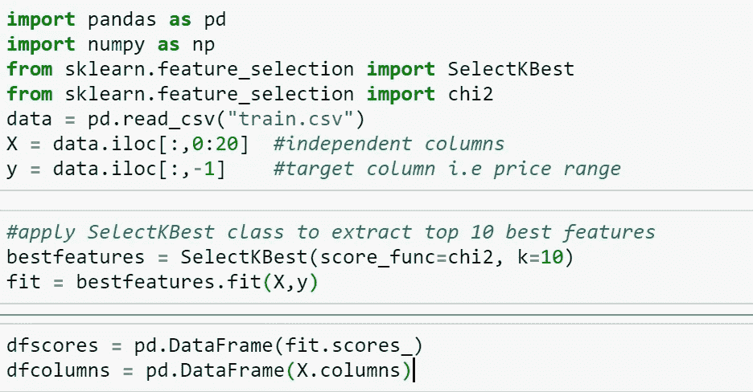
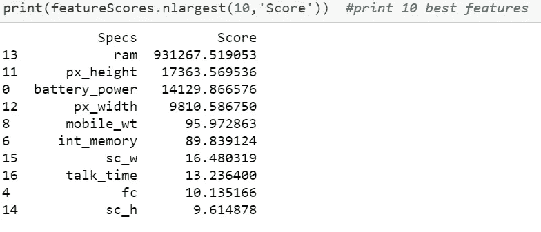
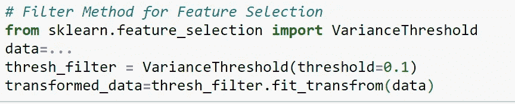
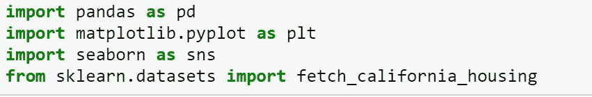
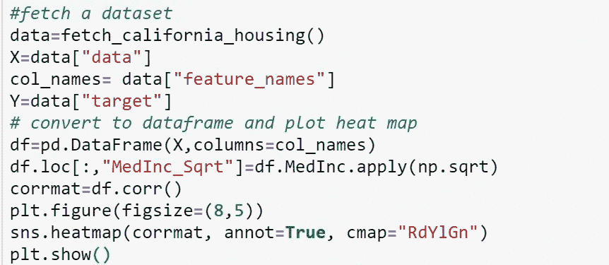
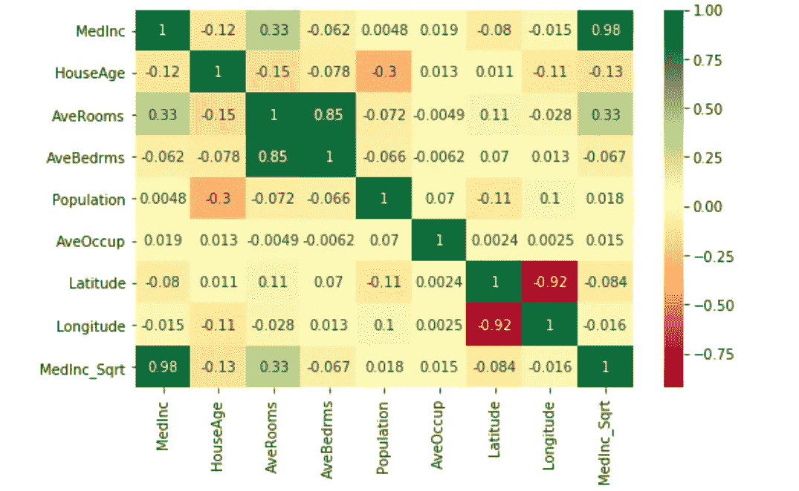
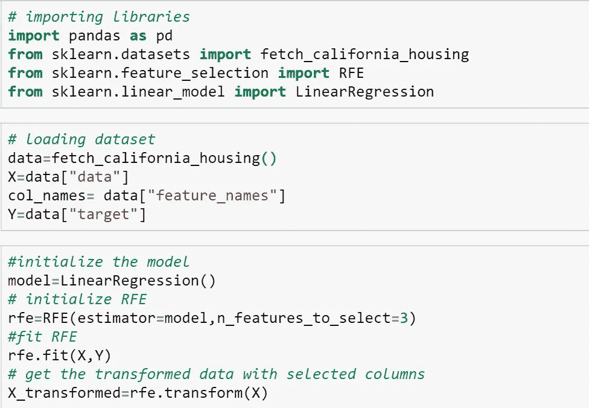

# 特征选择技术

> 原文：<https://medium.datadriveninvestor.com/feature-selection-techniques-1a99e61da222?source=collection_archive---------2----------------------->

Image source: kdnuggets

# 什么是特征选择？

你们都看过数据集。有时它们很小，但通常它们的尺寸非常大。处理非常大的数据集变得非常具有挑战性，这些数据集至少大到足以导致处理瓶颈。

机器学习算法的训练时间和性能在很大程度上取决于数据集中的特征。理想情况下，我们应该只保留数据集中那些实际上帮助我们的机器学习模型学习一些东西的特征。拥有太多的特征会带来众所周知的维数灾难问题。

不必要的和冗余的特征不仅减慢算法的训练时间，而且它们还影响算法的性能。选择最适合训练机器学习模型的特征的过程称为“特征选择”。

在进行特征选择之前，我们需要进行数据预处理。你可以[检查这个](https://medium.com/@yashjoshilko/data-pre-processing-before-model-training-7e741e9cb253)

# 执行特征选择的好处:

在训练机器学习模型之前执行特征选择有几个优点，其中一些列举如下:

*   特征数量少的模型具有更高的解释能力
*   实现特征减少的机器学习模型更容易
*   特征越少，泛化能力越强，从而减少了过度拟合
*   特征选择消除了数据冗余
*   具有较少特征的模型的训练时间明显更短
*   特征越少的模型越不容易出错

# 特征选择技术:

已经开发了几种方法来为机器学习算法选择最佳特征。

**注意:**在本文中，我们将讨论被广泛采用的方法。所有的技术都是相互独立实现的，不是连续的

1.  **过滤方法。**
2.  **包装方法。**
3.  **嵌入法(收缩法)。**

## 过滤方法:

过滤方法可以大致分为两类:**单变量过滤方法**和**多变量过滤方法**。

单变量过滤方法是一种根据特定标准对单个特征进行分级的方法。然后选择前 N 个特征。

统计测试可用于选择那些与输出变量关系最密切的特征。**互信息、ANOVA F 检验**和**卡方**是一些最流行的单变量特征选择方法。

scikit-learn 库提供:

**SelectKBest** :保留了前 k 的评分特征。

**SelectPercentile** :保留用户指定百分比的顶级特性。

必须注意的是，chi 只能用于本质上非负的数据。

以下示例使用非负特征的 chi 统计测试从移动价格范围预测数据集中选择 10 个最佳特征。

**可以下载** [**数据集**](https://www.kaggle.com/iabhishekofficial/mobile-price-classification#train.csv) **:**

现在我们将看到如何在 Python 的帮助下**从我们的数据集中移除方差非常低的要素**和**相关要素**。

如果特征具有非常低的方差(即非常接近于 0)，则它们接近于常数，因此根本不会给我们的模型增加任何价值。摆脱它们并因此降低复杂性是很好的。请注意，方差也取决于数据的缩放比例。Scikit-learn 有一个方差阈值的实现，可以精确地做到这一点。

All columns with variance less than 0.1 will be removed

**输出观察值和输入特征之间的相关性非常重要，应保留这些特征**。但是，如果两个或两个以上的特征相互关联，它们会向模型传递冗余信息。

我们可以删除高度相关的特征。请注意，我们将使用**皮尔森相关性**来计算不同数字特征之间的相关性。

Importing Libraries

heatmap makes it easy to identify which features are most related to the target variable, we will plot heatmap of correlated features using the seaborn library.

我们看到特性 MedInc_Sqrt 与 MedInc 具有非常高的相关性。因此，我们可以删除其中一个。

现在，你可能会说，为什么不通过直觉或仅仅查看热图来移除不相关的特征呢？

总的来说，不被个人的偏见或直觉所影响是明智的。

在现实生活中，我们必须处理 3 个以上的特征(通常从几百到几千个)。因此，逐一检查并决定是否保留它是不可行的。此外，变量之间可能存在不容易被人眼发现的关系，即使通过精确的分析也不容易发现。

但是，在某些情况下，您可能希望使用特定的机器学习算法来训练您的模型。在这种情况下，通过过滤方法选择的特征可能不是特定算法的最佳特征集。还有另一类特征选择方法，为特定算法选择最佳特征。这样的方法被称为**包装器方法**。

## **包装方法:**

包装方法使用变量组合来确定预测能力。它们基于贪婪的搜索算法。包装器方法将找到变量的最佳组合。包装器方法实际上是根据测试模型来测试每一个特性，然后用它们来评估结果。

在所有这三种方法中，这种方法的计算量非常大。不建议在大量特征上使用此方法，如果不正确使用此特征选择，甚至可能会过度拟合模型。

常见的包装方法有:**逐步** / **子集选择、向前逐步、向后逐步(RFE)。**

**这里我提到了要遵循的基本步骤:**

*   训练基线模型。
*   使用特征选择技术确定最重要的特征
*   创建仅包含这些要素的新“有限要素”数据集
*   在这个新数据集上训练第二个模型
*   将“全功能”(基准)模型的准确性与“有限功能”(新)模型的准确性进行比较

**正向选择:**

1.  确定最佳变量(例如，基于模型准确性)
2.  将下一个变量添加到模型中
3.  等等，直到满足某个预定的标准

**逐步** / **子集选择:**

类似于正向选择过程，但是如果某个变量在经过一定数量的步骤后被认为不再有用，它也可以被丢弃。

## 现在让我们实现各种特征选择技术

## 1.**向后逐步(**递归特征消除(RFE))

递归=重复发生的事情

顾名思义，递归特征消除通过递归(重复)移除特征并在保留的特征上构建模型来工作。

以下示例使用 RFE 和线性回归算法来选择前 3 个要素。算法的选择并不重要，我们可以使用任何其他算法来代替线性算法。

我们使用 sklearn 库中的特征选择模块来应用递归特征消除(RFE)

Scikit learn 还提供了 **SelectFromModel** ，帮助您直接从给定的模型中选择特性。如果需要，还可以指定系数或要素重要性的阈值以及要选择的最大要素数。

**3。嵌入法(收缩)。**

嵌入式方法是内置变量选择方法。在这种方法中，我们不选择或拒绝预测因子或变量。这控制参数的值，即不太重要的预测值被赋予非常低的权重(接近零)，这也被称为**正则化。**

使用具有 **L1(套索)惩罚**的模型进行特征选择。当我们对正则化进行 L1 惩罚时，大多数系数将是 0(或接近 0)，并且我们选择具有非零系数的特征。

**【岭】罚**，这个加一个罚，等于系数大小的平方。所有系数都以相同的因子收缩(因此没有预测值被消除)。

最后，我想说的是，特征选择是机器学习管道中决定性的一部分:过于保守意味着引入不必要的噪音，而过于激进意味着丢弃有用的信息。

如果你想了解缺失值处理，那么[看看这个。](https://medium.com/@dikshabellani.2803/handling-missing-values-bb8b549364cc)

如果你发现这篇文章有用，给它一个**掌声**和**与他人分享**。

——*快乐学习*

— *谢谢*