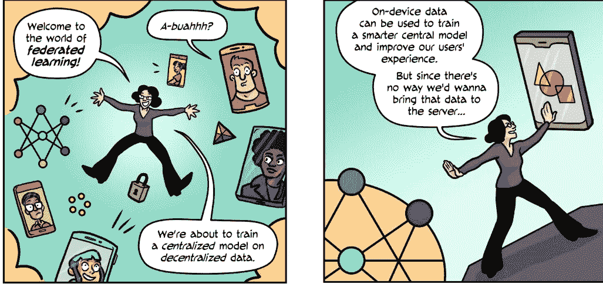

# 联合学习——训练数据而不破坏安全的好方法

> 原文：<https://medium.datadriveninvestor.com/federated-learning-a-great-way-to-train-data-without-an-outbreaking-security-breach-93e319a3d075?source=collection_archive---------9----------------------->

这个博客是关于我从脸书 udacity 纳米学位项目中学到的关于人工智能的安全和私人使用。从 PyTorch 的基础学习开始，到加密深度学习结束。本课程的所有教室均可在[**【https://github.com/udacity/deep-learning-v2-pytorch】**](https://github.com/udacity/deep-learning-v2-pytorch)上课。它由一堆针对各种深度学习主题的教程笔记本组成。在大多数情况下，笔记本会引导您实现卷积网络、递归网络和 GANs 等模型。

如今，数据隐私已经成为政府和公司非常关注的问题。一方面，我们保留父和父以提高模型的质量，另一方面，我们非常关心数据的隐私。这导致像我们这样的研究人员，由于数据的限制，解决他们的问题有太多的困难。这意味着由于隐私的原因，许多问题不能使用 ml 技术来解决。但是多亏了联合学习，它拯救了我们于困境。我对你使用联邦学习来解决这些问题感到非常兴奋，让我们从差分隐私开始吧。

> **差分隐私的基本定义是，你可以不受允许你的数据进行任何研究或分析的影响**

为了更好地理解这个定义，你可能听说过网飞的电影推荐竞赛，其中他们用独特的整数匿名化数据，我们甚至不知道是谁进行了评级。为了确保某人的隐私，基本的观察是，如果我们从数据中删除某人，并且数据准确性不受影响，这意味着该人没有将任何统计信息泄露到查询的输出中。

> 现在最大的问题是，我们能否构造一个查询，使得当我们从数据库中删除某人时，查询不会改变？

是的，这是可能的，让我告诉你怎么做？

我希望您喜欢看到这段代码，它同时创建和删除数据库中的条目，但是它很容易被入侵者攻击。

所以差别隐私来拯救我们了。考虑这样一个场景，一个社会学家不是问每个人他犯了什么罪，而是要求抛硬币，如果硬币是正面的，你诚实地说你犯了罪，但如果硬币是反面的，你可能说错了，这样我们获得了隐私，但失去了准确性。差分隐私的主要目标是我们最小化噪音量，最大化准确性。

差分隐私的进一步实现可以在我的下一篇文章中找到。#状态调整