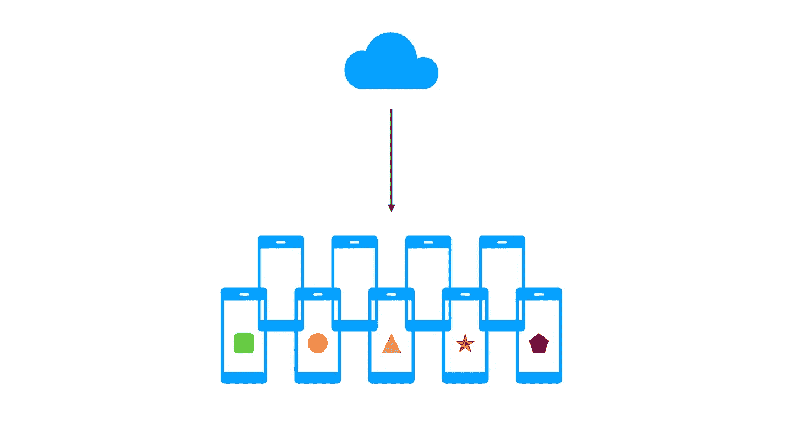

# 联合学习

> 原文：<https://medium.datadriveninvestor.com/federated-learning-c401f98fcdbf?source=collection_archive---------14----------------------->

联合学习是对这样一个问题的回应:是否可以在不需要将训练数据移动和存储到中央位置的情况下训练模型？联合学习不需要将用户数据存储在云中，这是一种分散的人工智能模型。交换和验证本地学习模型更新的云架构。这使得设备上的机器学习无需任何集中的训练数据。联邦学习(Federated Learning)，一种新的人工智能(AI)模型开发框架，分布在数百万个移动设备上。它使手机能够协作学习共享的预测模型，同时将所有训练数据保留在设备上，将机器学习的能力与将数据存储在云中的需求分离开来。

Federated Learning

联邦学习是 Android 上的 Gboard 也就是谷歌键盘。当 Gboard 显示一个建议的查询时，您的手机会在本地存储关于当前上下文以及您是否点击了该建议的信息。联合学习处理设备上的历史记录，为 Gboard 查询建议模型的下一次迭代提供改进建议。你手机上的键盘类型和基于人们观看、分享或删除的照片类型的照片排名也用于不同位置的温度计算，从获取用户离线数据，然后显示温度的平均值。此外，当使用该设备的人自动训练并理解语音时，用于语音识别，并根据话语识别，不需要像美国、英国、印度那样的口音，但它使用联合学习算法自动训练。使用优化算法(如随机梯度下降(SGD ))的联邦算法的解决方案运行在跨云中的服务器均匀分区的大型数据集上。

如今的联邦学习框架包括 TensorFlow Federated，这是谷歌的一个开源框架，用于对分散数据进行机器学习和其他计算的实验。

**联合学习如何工作**

联盟成员(称为客户端)的随机子集被选择来从服务器同步接收全局模型。

每个选定的客户端使用其本地数据计算更新的模型。

模型更新将从选定的客户端发送到服务器。

服务器聚集这些模型(通常通过平均)来构建改进的
全局模型。

**目标:**

联合学习的动机是保护客户拥有的数据的隐私。即使没有公开实际数据，也可以利用重复的模型权重更新来揭示不是数据的全局属性，而是特定于单个贡献者的属性。

**联合学习的作用:**

在图像分类中，卷积神经网络(CNN)用于大数据集的训练数据和测试小的单个图像，在 CNN 中使用联邦学习算法用于基于离线图像的分类，并且在没有云上训练的情况下进行训练。
联合学习还使用 RNN 和 LSTM 架构进行语音识别或语音输入命令，以首次理解用户查询并自我训练。有两种方式将信息发送到服务器，如下所示:

**联邦政府**

**FederatedAvg**

这项研究工作令人兴奋，将为我的技能和知识提供一个新的视野。使用生成对抗网络(GAN)、长短期记忆(LSTM)、递归神经网络(RNN)和卷积神经网络(CNN)实现如下:

**生成对抗网络(GAN):**

GAN 能够学习模仿任何类型的分布数据。我们将结合整流器线性激活和 sigmoid 激活来应用发生器，同时在鉴别器端最大输出激活。发生器的中间层可以处理掉信号。在训练过程中，生成网络中的权重和偏差被更新以增加分类误差，而判别网络中的权重和偏差被更新以减小误差。我们可以尝试使用条件 GAN 和深度卷积 GAN，其中一些条件参数已经到位。在 CGAN 中，一个附加参数 y 被添加到生成器中，用于生成相应的数据。标签也被放入鉴别器的输入中，以便鉴别器帮助区分真实数据和伪造生成的数据。而 DCGAN 由 ConvNets 代替多层感知器组成。ConvNets 在没有 max pooling 的情况下实现，实际上被卷积步幅所取代。此外，这些层没有完全连接。

**长短期记忆 LSTM):**

LSTM 是递归神经网络和前馈神经网络的结合。LSTM 有许多与基于给定任务的上下文求解的文本文档处理相关的应用。因此，它从相对上下文中预测下一个术语。因此，单词不被视为独立的个体，而是被视为依赖于它们在文本中的近邻的单位。LSTM 的优点是输出不依赖于输入的长度，因为输入是顺序输入的，每个时间步一个输入。LSTM 递归神经网络的基本结构接收存储块，该存储块由几个存储单元组成，可以通过该单元的输入门、遗忘门和输出门与之通信。LSTM 神经网络的训练分两个阶段进行，前向传递和后向传递。值得注意的重要特征是，LSTM 记忆细胞在输入转换中对加法和乘法赋予不同的作用。下图中中央的加号实际上是 LSTM 的秘密。

**递归神经网络(RNN):**

具有强大的序列学习能力，可以从一个数据中精细地描述依赖关系。LSTM 等 RNN 是强大的模型，当给定足够的训练数据时，它们能够学习序列的有效特征表示。RNN 是分层的神经网络，包括各层之间的循环连接。这种重现对网络产生了暂时的影响，允许在不同的时间使用某些网络连接(参数)。这使得 RNN 可以从数据序列中捕捉时间关系，这使得它们适合于预测序列数据

**卷积神经网络(CNN):**

CNN 是卷积和池层的组合，在开始，几个完全连接的层在最后，最后是 softmax 分类器，用于将输入分类到各种类别。使用 CNN 的主要特点是参数共享和连接稀疏。因此在特征提取后的参数共享中，在一个部分中使用的特征也可以在整个网络上卷积。在每层的稀疏连接中，每个输出值取决于少量的输入，而不是考虑所有的输入