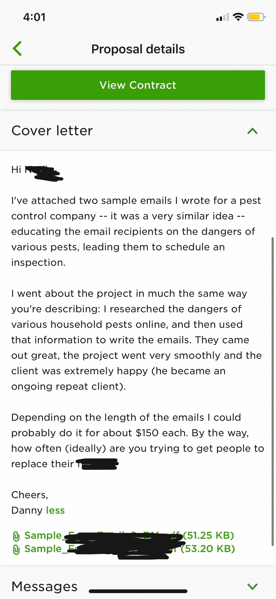

# 尽情享受你一天中的每一分钟

> 原文：<https://medium.datadriveninvestor.com/feel-free-to-enjoy-every-minute-of-your-day-cae2b4ec2655?source=collection_archive---------12----------------------->

## 自由职业者拥有完全自由的力量

Photo by Paige Cody on Unsplash

没有什么比不受约束的、不合理的自由更自由的了。这是[丹尼·玛格丽丝](https://twitter.com/OmahaCopywriter)对有抱负的自由作家的热情保证。

一句话，“自由职业”唤起了不可思议的承诺和石化的恐惧。玛格丽丝不会听后者的。

“享受一天中的每一分钟，完全自由地支配自己的时间，感觉如何？”他说。

玛格丽丝说:“有些人太‘理性’了，不愿追求充满这种自由和快乐的生活。”。“他们会告诉你，你必须妥协——我对这个词不屑一顾，就像一千个太阳一样炽热。”

千禧一代专家、全球演说家和 LinkedIn 讲师[切尔西·克罗斯特](https://twitter.com/ChelseaKrost/)在 Margulies 的#MillennialTalk Twitter 聊天中，以同样的热情谈论了如何释放自由职业者的真正收入潜力。

“吸引那些大客户，”玛格丽丝说。“是的，它们真的存在。它们不是神话中的生物。”

对于就地躲避的自由职业者来说，不要因为缺少娱乐而分心。这是一个释放你的想象力并把它写下来的好时机。

“保持冷静，不要惊慌，”玛格丽丝说。“人们很容易想，‘哦，不，所有的工作都会枯竭’，但它不会。即使有一部分成功了，也会有很多其他的机会。

他说:“这也是完善你技能的好时机，因为即使在‘糟糕’的经济环境下，优秀的自由职业者也会受到欢迎。”。“当公司解雇员工时——尽管这很不幸——他们通常会雇佣自由职业者来填补空缺。”

# **深呼吸，集中注意力**

他指出，即使在如此艰难的时期，企业仍然蜂拥而至 [Upwork](https://twitter.com/Upwork) ，这是一个面向企业和自由职业者的在线人才解决方案。

“保持冷静，保持专注，保持敏锐，你仍然可以获得大量的客户，”玛格丽丝说。

克罗斯特注意到，在经历了最初的低迷之后，自由职业者的工作出现了反弹。

“起初，一切都停止了，但业务正在慢慢恢复，”她说。“不要放弃。这让我们有时间后退一步，重新聚焦，并在前进的过程中建立新的关系。”

在数字世界里，自由职业者的优势是任何人都可以做。缺点是任何人都可以做到。你必须写作，让自己与众不同。

玛格丽丝权衡了从事自由职业的利弊:

*   优点:控制你的时间表，你的收入和你工作的一切。无限的收入潜力——想休息多久就休息多久——可以选择只做自己喜欢的工作。还有，在任何地方工作的自由，打造你自己的“完美”职业道路。
*   反对意见:如果你需要别人告诉你该做什么，怎么做，什么时候做——换句话说，如果你觉得你需要一个老板加预制的公司结构来茁壮成长——自由职业可能会让你感到沮丧和困惑。

克罗斯特说:“控制自己何时为谁工作是一种自由。“要想长期成功，你肯定需要自律。最好的部分是能够确定你什么时候想休假，你有多想工作或不工作。”

这就是为什么玛格丽特喜欢向上运动。

“它拥有众多客户的最佳组合、可供选择的客户多样性以及高质量的客户，”他表示。“这是自由职业网站的黄金标准。我也认识很多在 Upwork 工作的人，他们真的很在乎自由职业者的成功。"

# **招聘和工人联系**

该网站容纳了各种各样的技能。

“我在那里看到人们几乎在所有方面都取得了成功——咨询、项目管理、写作、法律、会计、设计等等,”Margulies 说。"许多人几乎在所有方面都做得很好。"

他补充说，Upwork 连接了客户——那些雇佣者——和自由职业者——工人。

Margulies 说:“毫无疑问，在 Upwork 上获得优秀客户的最快方法是真正擅长写一份优秀的提案。”“这就像擅长钓鱼一样。如果你能写出一份出色的提案，你几乎可以在任何时候凭空获得新客户。”

他描述了简单而伟大的提案的关键组成部分:

*   一个快速的介绍，显示你已经阅读并理解了这个职位。
*   谈论并展示与客户需求高度相关的工作实例。
*   以一个好问题结束，最好是一个容易回答的问题。

他举了一个例子，一个简单但非常有效的建议使用了这个公式。

“对于‘额外加分’，你也可以把你的提议作为一个机会，向客户提供你认为他们会觉得有帮助的具体提示或想法，”Margulies 说。“客户喜欢这样。”

自由职业新手可能会感到害怕，但有办法让自己成为有价值的雇员，使自己可以与那些更有经验的人相媲美。首先，要有一个好的内容库，最好能显示出风格、质量和频率的一致性，这样潜在的客户就知道你能做好。

“我最喜欢的开始方式之一就是尽可能多的阅读你所在的行业，”Margulies 说。“更有经验的专业人士通常太忙，无法跟上新的趋势和方法。通过向客户展示你拥有真正前沿的知识，你真的可以脱颖而出。

“你也可以在你选择的行业中专攻一个子类别，”他说。“例如，你可以开始你的自由职业生涯，专注于撰写关于美国的页面——比如，‘关于当地餐馆的美国页面’。”激光瞄准提高可信度。"

# **利用新鲜视角**

那些从事自由职业的人不需要宣传他们缺乏经验。

“不要为自己是新人而道歉，”玛格丽丝说。“新的自由职业者给游戏带来了新鲜的体验、视角、能量和其他优势。如果你是诚实的，真诚地想有所贡献，客户会非常幸运地在你职业生涯的这个阶段遇到你。

“记得向客户展示与他们的需求高度相关的作品，”他说。“如果有必要，可以举一些高度相关的例子。有经验的专业人士并不总是有高度相关的工作实例，所以这能帮你一把。”

寻找最佳客户归结为兼容性。

“简单地说，我寻找的一件事就是，他们提供的工作真的让我感兴趣吗？”玛格丽丝说。“如果不行，那就没什么意思了，我还得加倍努力才能把工作做到最好。然而，如果它更令人愉快，我会很兴奋地工作。巨大的差异。

“我也仔细阅读了客户的招聘信息，”他说。“听起来是不是很恭敬？友好？专业？还是比较生硬和居高临下？我通常会从阅读中获得一种直觉，这种直觉告诉我要么申请，要么通过。当有疑问时，我就简单地通过。”

外部引用也很重要。

“我也会看客户的评论，”玛格丽丝说。“如果他们的历史上有过几次不好的经历——甚至只有一次——我通常会通过。有很多五星级客户，所以为什么要在一个可能很难共事的人身上冒险呢？

“也就是说，我不会因为客户没有后续工作历史就避开他们，”他说。“不过，我在那种情况下会更加小心。在我们通过电话或 Skype 交谈之前，我不会接受他们的提议。这样我才能在同意与他们合作之前更好地了解他们。”

# 收费多少？

定价是自由职业者最大的问题之一。要价太高有失去工作的风险，出价太低也有转嫁成本的风险。

“虽然每个人都不一样，但我可以分享我的经历，”玛格丽丝说。“例如，我开始时每小时 15 到 20 美元。但是在最初的几个月里，我学到了很多东西，以至于我可以很快达到每小时 50 美元。然后我很快就达到了每小时 75 到 125 美元。

“要记住的一件重要事情是，这都是相对的，”他说。“对于一个没有经验的人来说，每小时挣 30 美元可能感觉很多。而对于有丰富经验的人来说，即使每小时 50 美元也可能觉得很低。”

竞争并不像看上去的那样。

“这真的不是一场与他人的竞赛，”玛格丽丝说。“只要*你*随着时间的推移提高*你*的价格——随着你获得经验和信心——你总会到达你想去的地方。记住这一点*非常*重要。”

对于“完全不知道该收多少钱的人”，他给出了过于简单的指导方针:

*   初学者:每小时 15 到 25 美元
*   中级:每小时 30 至 45 美元
*   经验:每小时 50 到 65 美元
*   专家:每小时 75 到 125 美元

对于那些想以自由职业者的身份赚取六位数收入的人来说，Margulies 认为这看似简单。

“如果你每小时收费 75 美元——很多人都这样做——你一周只工作 32.5 个小时，每年可以轻松赚到六位数的收入——然后休息一整个月，”他说。“不要把它过分复杂化。这完全可行。

“自由职业者的工资应该是传统工作的两倍甚至更多，”玛格丽丝说。“这有助于你支付自主创业的费用，并为你承担为自己工作的‘风险’支付更多收入。更多的风险应该伴随着更多的回报。”

**关于作者**

吉姆·卡扎曼是[拉戈金融服务公司](http://largofinancialservices.com/)的经理，曾在空军和联邦政府的公共事务部门工作。你可以在[推特](https://twitter.com/JKatzaman)、[脸书](https://www.facebook.com/jim.katzaman)和 [LinkedIn](https://www.linkedin.com/in/jim-katzaman-33641b21/) 上和他联系。