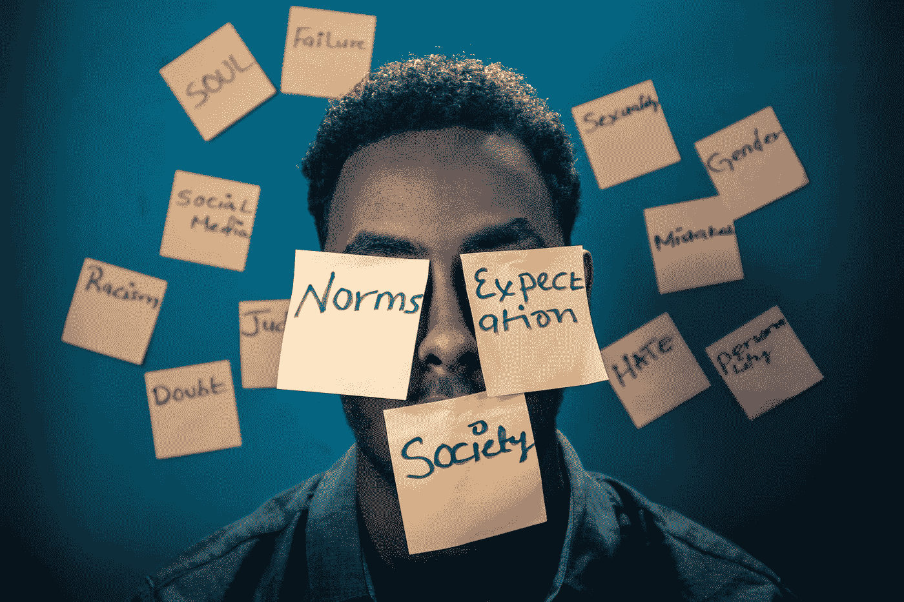

# 感情是愚蠢的

> 原文：<https://medium.datadriveninvestor.com/feelings-are-stupid-b64de6b2092d?source=collection_archive---------12----------------------->

Photo by [Yasin Yusuf](https://unsplash.com/@yasinyusuf?utm_source=medium&utm_medium=referral) on [Unsplash](https://unsplash.com?utm_source=medium&utm_medium=referral)

我们这个国家已经到了历史最低点。不仅仅是仇恨，而是我们被自己的情绪所控制。很多时候，我们似乎让自己的感觉决定了事情的对错。这就是问题所在。

如果每个人都觉得自己的对错是主观的，是真理，那我们就没有真理。我们之间不会有真相。我们只是在地球上走来走去，做我们想做的事情，不相信我们的行为会有后果。我对现在发生的事情的看法可能不受欢迎，但它需要得到解决。

 [## 良好的生活是习惯的形成|数据驱动的投资者

### 过度思考是过度紧张。仅仅几个简单的习惯就会在一天中产生巨大的影响。那是…

www.datadriveninvestor.com](https://www.datadriveninvestor.com/2020/01/17/a-good-life-is-habit-forming/) 

我们经常看新闻，不由自主地对某些事情感到愤怒，却没有研究这种特定的情况是如何发生的。我们如此信任一个甚至没有全部事实的媒体。你知道我想说什么。

所有正在进行的暴乱和抗议正在扼杀许多被视为少数的人的生意。那么，当我们被认为是反对不公正的时候，我们为什么要破坏这方面的东西呢？不如我们仔细照照镜子，意识到我们自己并不好。

我是说，你觉得我们是怎么走到这一步的？尊重他人，不在街上乱跑？在房子之间卖毒品和电击警察？你认为当你做这些事情的时候会发生什么，当他们问你问题的时候不听或者不回答。这么多的错误永远不能成为一个正确的！

不要相信你看到和听到的一切，尤其是当它是一个片面的事件。这方面没有增长。你有自己的思想，上帝给了你理智。所以利用它。不要做一只等待屠杀的绵羊，也不要为他们欢呼。做得更好。变得更好。我们都可以。它从我们内心开始。一旦我们认识到自己的失败，认识到自己已经破碎，需要被修复。

## 访问专家视图— [订阅 DDI 英特尔](https://datadriveninvestor.com/ddi-intel)