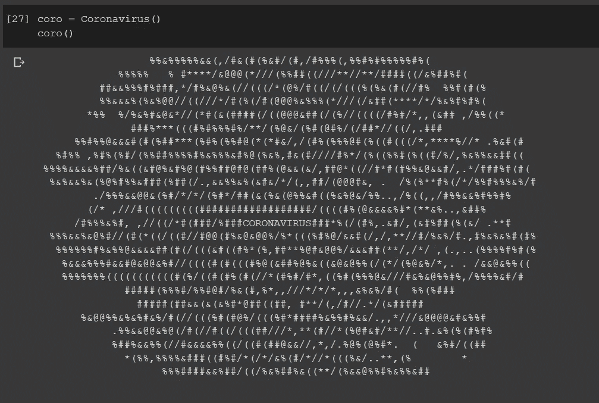
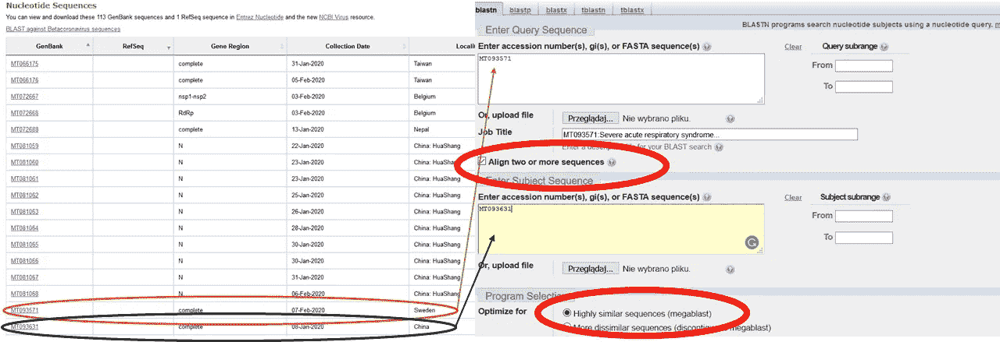
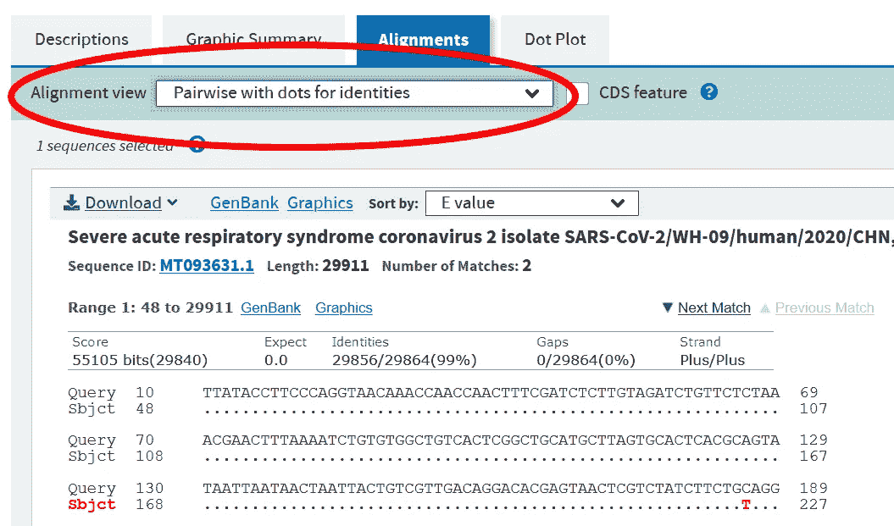
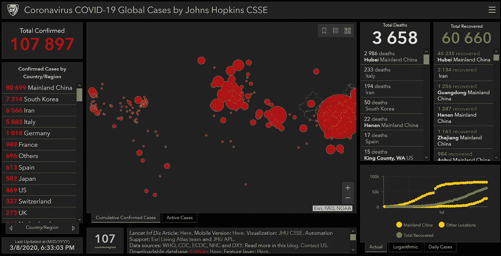
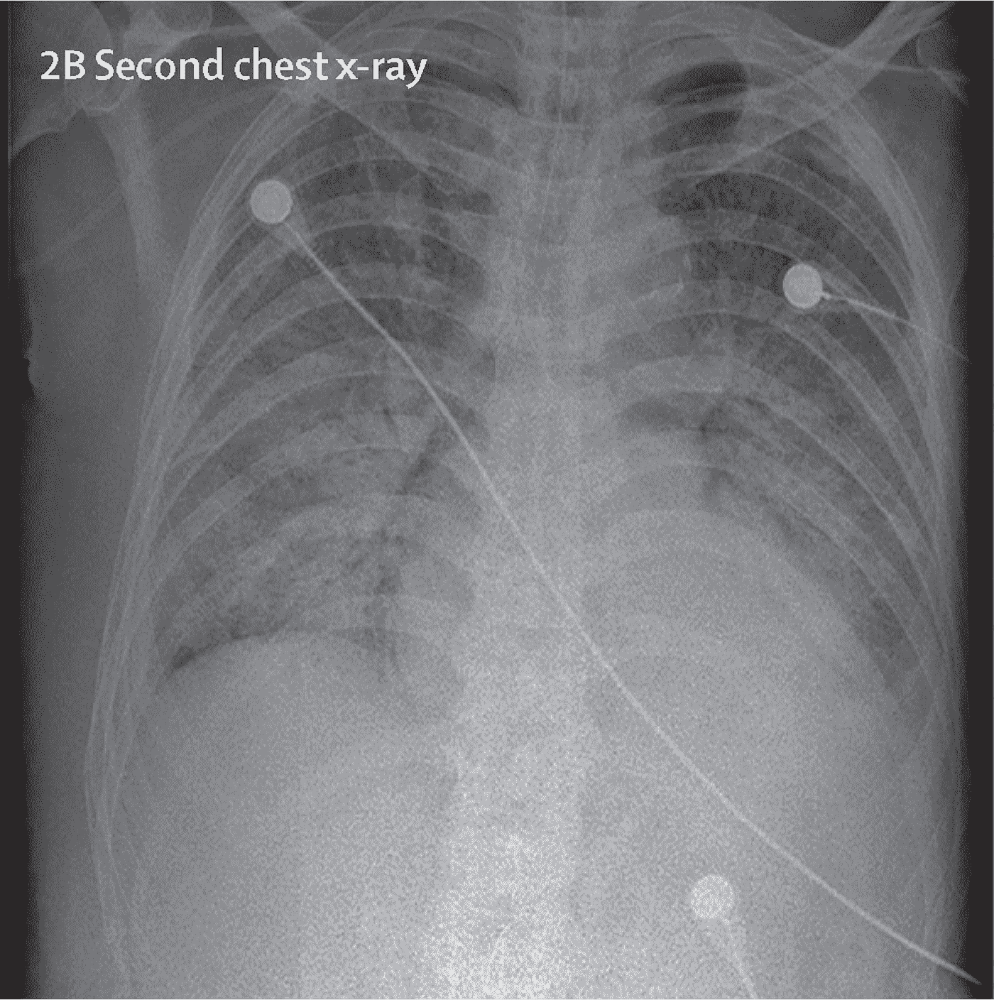

# 用数据击退冠状病毒

> 原文：<https://medium.datadriveninvestor.com/fight-off-coronavirus-with-data-b31a47acb5bc?source=collection_archive---------7----------------------->

## 在过去的几个月里，爆发了一种新型冠状病毒——SARS-cov 2，并迅速在全球传播。随着病毒的出现，大量关于它的数据开始出现。

Coronavirus in the Google Colab notebook.

除了让你的朋友从恐慌中冷静下来，并告诉问题的另一端的人，这仍然是一个大问题，特别是对于老年人、慢性病患者或从社会经济的角度来看。你可以尝试用数据科学来启发科学家或者自己做科学。

# 什么是 SARS-COV2？

如果你已经知道，就省略这一部分。然而，SARS-COV2 通常被称为冠状病毒、新型冠状病毒或来自武汉的冠状病毒，并引起轻度至严重的上呼吸道疾病。SARS 来自于该病毒引起的疾病(SARS-严重急性呼吸综合征)，这种疾病被医学界称为新冠肺炎(来自冠状病毒疾病 2019)。

有许多其他种类的冠状病毒，不仅仅是最近几个月的那种。它们大多因引起**【普通感冒】**【1】而为人所知，除了婴儿和非常老的人之外，它们大多无害。

# **SARS-cov 2 的基因组数据**

基因组是生物体内的全部 DNA 序列。它描述了有机体是如何构建的，并编码了复制和生存所必需的所有指令。即使病毒不是活的(它们在没有宿主的情况下不会复制，它们需要有人),它们仍然携带 DNA 信息。基因组是一个由 A、T、G 和 C 字母组成的长序列，**，所以如果你下载一个带有基因组的文件，你会发现一个长字符串**。SARS-COV2 是一种 RNA 病毒(活生物体中的一种不同类型的信息载体——它的区别在于一个字母 U 而不是 T)。尽管如此，数据在约定中仍表示为 DNA。

## 你手上的基因组数据

通过 NCBI 网站 **(** [**可以获得 SARS COV-2 和其他几种病毒的基因组数据，这里是 COV-2 的一个**](https://www.ncbi.nlm.nih.gov/genbank/sars-cov-2-seqs/) **)** 。DNA 序列数据，所以这些数据是由 4 个字母 A、T、G 和 C 组成的长序列，包含了病毒的所有信息。这些数据来自不同的患者，因为病毒经常从一个宿主到另一个宿主快速变异，所以你可以比较来自中国患者的相同病毒是否仍然来自例如瑞典的患者。

## 你如何使用这些数据？

您可以通过访问网站[这里](https://blast.ncbi.nlm.nih.gov/Blast.cgi?PAGE=MegaBlast&PROGRAM=blastn&BLAST_PROGRAMS=megaBlast)并将序列或登录号(GenBank 栏中以 M 开头的数字)粘贴到下面显示的两个字段来快速比较两个或多个基因组。一切设置好后，你只需点击页面底部的“**爆炸**”。

To compare two genomic sequences you just copy and paste the two accession numbers to the fields shown with arrows. If you want to compare more, you’ve to paste them in the bottom windows separated by a comma. Also, remember to check the two checkboxes marked with the red circle.

结果，您应该得到一个比对，它显示了两个序列之间的差异以及差异的数量，如下所示。

The alignment of the patients’ SARS-COV2 virus genome from Chinese and Sweden. To better depict the differences change the view in “Alignment view” to “Pairwise with dots for identities”. It will show differences as bold red letters and no differences as dots. You can save the results with the “Download button” too.

你也可以将其与其他病毒进行比较，比如最初的 SARS(你可以在这里找到)或一些流感病毒。

## 你可以在哪里使用数据科学的知识？

在撰写本文时，NCBI 基因银行(前面提到的网站)中有超过 100 个来自不同患者的基因。例如，你可以利用它们，通过一些机器学习工具来预测病毒的突变。此外，如果您单击相应的登录号(如 MT093631)，您将会发现其他信息，如收集日期(标记为/collection_date)或其他可用于分析的信息。由于序列是相同的，所以最好使用例如通过如上所示的比对的差异。

 [## 数据科学和软件工程哪个更有前途？数据驱动的投资者

### 大约一个月前，当我坐在咖啡馆里为一个客户开发网站时，我发现了这个女人…

www.datadriveninvestor.com](https://www.datadriveninvestor.com/2019/01/23/which-is-more-promising-data-science-or-software-engineering/) 

此外，您还可以使用 Biopython 包通过 Python API 访问所有服务(参见[此处](http://biopython.org/DIST/docs/tutorial/Tutorial.html)并搜索 NCBI 和 BLAST)。

## 关于基因组数据的其他想法——针对更高级的用户

对于更高级的生物信息学用户，您可以使用基因组数据来了解病毒中的蛋白质序列。然后，你可以通过同源性将序列与现有的蛋白质进行比较(因此，两个序列的相似程度以%表示，如果它们几乎相同，则该数字接近 100%)。如果同源性足够高(至少 30%)，你可以断定两个蛋白质是相似的。然后，你可以找到一种与发现的蛋白质结合的药物，并怀疑该药物也与 SARS-COV2 结合。那么最有可能的是，你已经找到了一种可以用来对抗 SARS-COV2 的药物(当然是在人体试验之后——不是开箱即用，怀疑并不意味着有效)。

# 约翰·霍普金斯大学的疾病传播数据

最近，约翰霍普金斯大学发布了两个数据集，其中包括不同国家/地区和省/州的 SARS-COV2 报告以及确认死亡/康复的时间序列。这些数据每天更新，是数据建模和分析的重要来源。你可以在 **GitHub 资源库** [**这里**](https://github.com/CSSEGISandData/COVID-19) 找到它们。

The dashboard from Johns Hopkins University. The link to it is available in the repository or here in the article.

此外，存储库中可用链接中的数据有一个很好的可视化(或更多的仪表板)(或这里的)。仪表板每天更新，很可能是 GitHub 存储库中的最佳数据，因此您可以确保拥有最新的可用数据。

## 如何使用它们？

您可以使用数据来模拟疾病的传播，或者模拟疾病在时间上是会传播得更快还是更慢。在数据科学网站上已经有很多关于时间序列建模的文章，只需在搜索栏中输入合适的关键词。
此外，已经有一些包，例如为 **R 用户**准备的包通过内置 API 提供对数据的轻松访问([参见此处](https://github.com/RamiKrispin/coronavirus))。

## 更新 03.16！

## 用于新冠肺炎探测的 x 射线图像

X-ray image from the dataset published by Dr. Cohen’s from the University of Montreal.

蒙特利尔大学的科恩博士发布了一个数据集。该数据集由新冠肺炎(由 SARS-COV2 引起的疾病)的肺部 x 射线图像组成，但不仅限于此。还有非典病人、健康病人和其他人的图像。
该数据集可方便地用于基于 x 射线图像的 SARS-COV2 检测。尽管如此，如果你不是受过训练的医务人员，也不要急于解释。
你在这里找到数据集[，记得引用数据集作者！：](https://github.com/ieee8023/covid-chestxray-dataset)

# 摘要和进一步更新:

有大量数据可以用来帮助对抗冠状病毒。但是记住不要用这些数据来传播恐慌。惊慌无助于任何人，只会弊大于利。

如果我发现一个有趣的数据集，我会把它贴在这里，所以请检查文章的更新。

# 参考资料:

[1]梅塞尔·莱莫因，玛丽安娜等，“一种引起普通感冒的人类冠状病毒大量杀死树突状细胞，但不杀死单核细胞。”病毒学杂志 86.14(2012):7577–7587