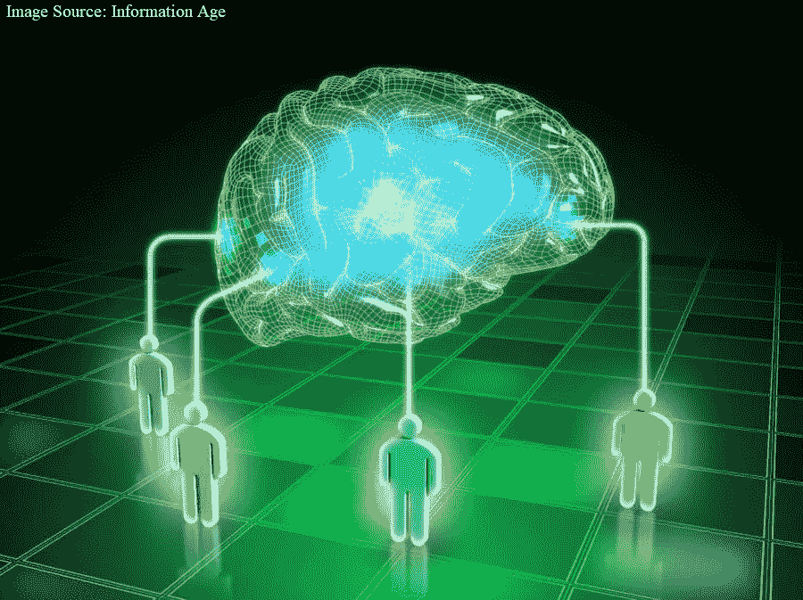
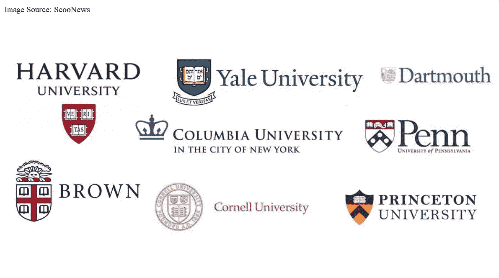
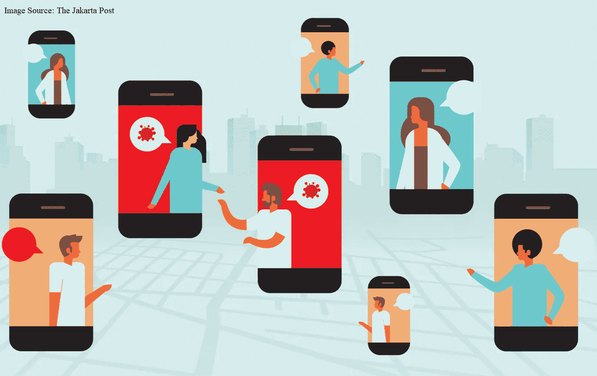
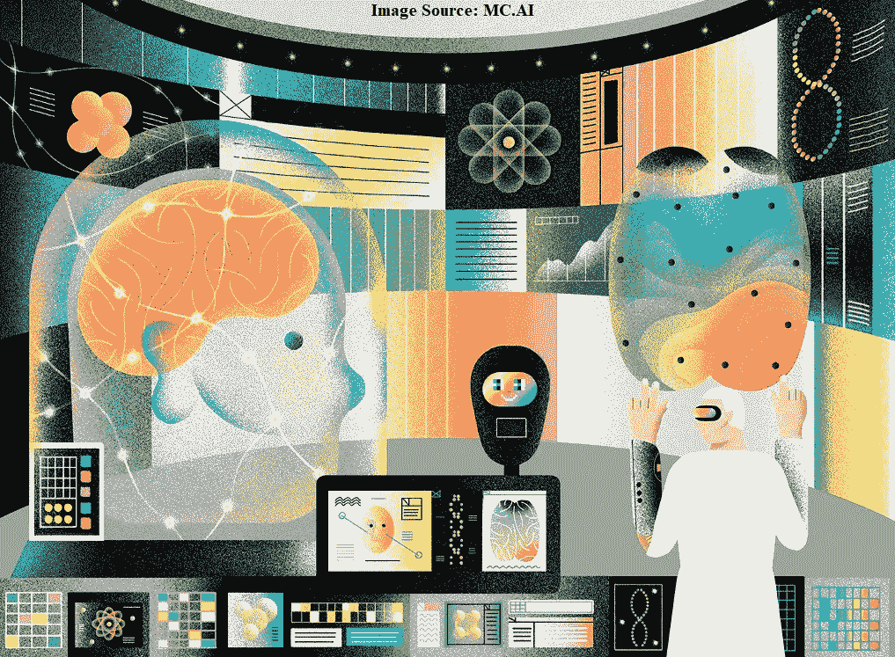

# 用集体智慧对抗新冠肺炎

> 原文：<https://medium.datadriveninvestor.com/fighting-covid-19-with-collective-intelligence-13c93327ae76?source=collection_archive---------19----------------------->

> 集体智慧是人类集体参与智力合作以创造、革新和发明的能力——皮埃尔·莱维，哲学家、文化理论家、媒体学者，人类集体智慧专家

正如这个词所表明的那样，*集体智慧*指的是当人们带着健康的竞争意识一起工作时出现的集体智慧。与他们单独解决问题相比，它引导他们集体解决问题和做出决定，并提供更大的机会找到有效的答案。归因于许多生物，这一特性具有多种应用，例如在政治学、计算、社会生物学、大众同行评议、众包、投票系统和社交媒体等领域。简而言之，集体智慧就是*成功合作*！

新型冠状病毒疾病造成的破坏几乎颠覆了我们的生活。它迫使我们在生活方式上做出巨大的改变，并在这个过程中以前所未有的速度传播焦虑、恐慌和恐怖。全世界的科学家、研究人员、医疗工作者和决策者正在联合起来对抗新型冠状病毒。目的是以更好的方式分析这种病毒及其引起的疫情，从而提出有效的治疗、疫苗接种和应对策略。在这种情况下，问题出现了—

> 如果在几个规模和层次上实施，集体智慧的流行概念能把我们从危机中拯救出来吗？嗯，似乎有可能。

# 开始——学术界的合作智能

本届疫情之初，传统的研究加速发展，发生了巨大变化，出现了著名的期刊( [*【细胞】*](https://www.cell.com/COVID-19)*[*【自然】*](https://www.nature.com/collections/hajgidghjb) )等。)立即向所有人提供他们关于新型冠状病毒疾病的出版物。许多大学和研究机构一直在不断更新他们关于这种病毒性疾病的开放和合作数据流，以便世界能够更好地了解这场危机。研究成果正以很快的速度发表在预印本服务器和实验室网站上。关于新型冠状病毒的各种外展视频、重要文章和其他信息手段都可以在互联网上找到。*

*此外，学术界正在自我组织起来，为需要跨学科和多学科技能和知识的紧迫问题提供创新的解决方案。这些平台通过将社区的需求联系起来并启动即时研究项目(如低成本诊断技术、口罩设计、社区监测、生存工具包、呼吸机原型、有效遏制该疾病的方案等),促进了有效的协调。)以确保有效应对因新冠肺炎而出现的一些挑战。*

**

*在所有这一切中，在线教育模式越来越受欢迎。全球有相当多的教育机构鼓励越来越多的教师和学生通过各种虚拟方式相互联系。例如， [*哈佛大学*](https://www.edx.org/school/harvardx) 正在向世界各地的学生免费提供几门在线课程。这种模式有多种用途，首先是*，没有边界，我们需要的只是一个稳定的互联网连接，我们有机会参加知名教师的讲座，在舒适的家中学习。*其次*，保证学生的教育不会因为这个疫情而受到阻碍。*第三*，通过激励他们成为各种全球合作倡议的一部分，积极努力抗击这种病毒性疾病，使他们能够以更好的方式应对当前的形势。**

# **数字研究技术的进展**

**用人类的智慧增加机器的智慧有助于世界从几个新的数据来源中产生新的和改进的见解。这种方法特别适合处理令人严重关切的复杂和快速变化的全球问题，如当前的危机。在过去的几个月里，已经开发了许多平台、网站和应用程序来监测公众的健康状况，预测新型冠状病毒在全球的轨迹，评估特定地区的感染程度，等等。它们利用各种工具和技术从大量数据中学习，并探索众多可信的报告和统计数据，以生成所需的产出。**

****

**已经有一些倡议，通过让公众参与帮助，产生关于这种感染的传播过程的新的科学数据(也适用于其他类似情况)。人们被要求下载监控他们 GPS 位置的应用程序，并被要求报告他们在某一天与谁联系过。这种努力创造了大量的信息，不断地以多种方式帮助研究人员和科学家，例如了解谁是超级传播者，为限制疫情而实施的预防措施的效果等。这是*公民科学* 的一个[好例子，它涉及公众成员和专业科学家的数据收集和分析，通常作为合作研究项目的一部分。](https://www.citizenscience.org/covid-19/)**

**信息的实时监控在当今时代也有了很大的发展。一些平台允许人们观察他们所在地区的每个已知感染病例、平均康复时间以及各种感染之间的网络连接。当局和社会认为公开情况是帮助每个人做出正确和实际的决定并在此过程中控制其焦虑水平的最佳方式，这种方法正在一些地方使用。另一方面，也有一些项目通过 [*挖掘*](https://www.datadriveninvestor.com/glossary/mining/) *社交媒体帖子*和 [*自然语言处理*](https://www.datadriveninvestor.com/glossary/natural-language-processing/) 来观察症状(如呼吸问题、发烧等)的当前提及，从而利用公民生成的数据来监控当前疫情的进展。)在早些时候报告潜在病例的地点。他们基于这样的想法，即推特或其他社交媒体活动的热点可以成为监测这种疾病在任何地区传播的良好指标。**

**作为一项有趣努力的一部分，来自华盛顿大学的研究人员呼吁该协会参加一个 T2 在线游戏，以加速对抗新型冠状病毒的药物/疫苗的开发。挑战包括制造一种可以阻止病毒穿透人体细胞的蛋白质。其他几个组织正试图开发快速廉价的新冠肺炎检测试剂盒。这些可以在世界上任何地方使用，并且基于生物社区的众包思想，开源设计，以便认证实验室可以很容易地为人们生产测试包。此外， [*世界卫生组织*](https://www.who.int/emergencies/diseases/novel-coronavirus-2019/technical-guidance-publications?healthtopics=b6bd35a3-cf4f-4851-8e80-85cb0068335b&publishingoffices=aeebab07-3d0c-4a24-b6ef-7c11b7139e43) 正在将所有发表的研究汇集到一个全球数据库中。它还为卫生专业人员和决策者制作学习资源，以更好地管理疾病，这些资源可在其在线学习平台上获得。**

# **装备医疗保健行业**

**已经开发了一些工具，使研究人员和当局能够绘制基本供应品的可用性图。一线工作人员可以使用某些技术在一个公共平台上报告关键设备的供应不足情况。该数据可用于在地图上显示短缺位置。反过来，这将使政府能够了解不同医疗机构的需求，并实时监控其现有能力。这将有助于组织、企业和制造商对这些供应不足的地区做出反应，从而使医疗保健力量更好地应对这种情况。**

**另一个因素是将重要的设备廉价而快速地运送到高感染区。在这种情况下，3D 打印等工具可以用来提供制造能力，这有助于向医院和诊所提供口罩、手套、个人防护设备等物品。从这一过程中获得的成功设计可以由具有更高生产能力的制造商按比例放大。为了有效处理数量庞大的新冠肺炎病例，学校、学院和其他类似的社区建筑可以改作*隔离设施。快速培训和动员社区卫生工作者对于追踪活跃患者的数量和症状至关重要。政府可以使用特定的工具来识别潜在的病毒热点，并在一个区域内部署快速部署能力。通过适当的集体智慧，这可以有效地扩大到国家一级！***

****

**另一个最新发展是医生和科学家在各种社交媒体平台上的参与。目标是最大限度地传播大众对疫情的认识。他们加入了一些讨论组，如 [*【推特】*](https://blog.twitter.com/en_us/topics/company/2020/covid-19.html)*Reddit、*等。并实时给人们答案。他们还利用这些平台来打破神话，并呼吁与这种疾病相关的错误信息，强调应该始终仔细查看内容，只有在确认其可信度后才应该相信。所有这些努力都大大有助于加快相关信息在全球的传播，并在像我们目前面临的紧急情况这样的紧急反应中创造新的创新。**

# **AI/ML 来拯救**

**利用大众的智慧做出更好的判断是自古以来就被认可的概念！像*亚里斯多德*这样的著名哲学家指出，与个人相比，群体通常会做出更有效的决定。最近在 [*人工智能*](https://www.datadriveninvestor.com/glossary/artificial-intelligence/)*(*[*AI*](https://www.datadriveninvestor.com/glossary/artificial-intelligence/)*)*和[*机器学习*](https://www.datadriveninvestor.com/glossary/machine-learning/) *(ML)* 等领域的进步，可以让驾驭这种集体智慧变得容易得多。从长远来看，这反过来会让我们更有效地解决紧迫的社会挑战。**

**众所周知，批判性思维、解决问题和协作是当今时代成功工作制度的三大支柱，这涵盖了世界上所有可能的领域、领域和范围。影响群体集体智慧的最重要因素之一是其成员之间的协调程度。智能工具和技术在这一领域大有裨益。人工智能/人工智能工具可以促进不同层次之间的沟通，帮助建立信息库，并协助群体协调他们的决策活动，以及其他任务。**

**这一切是如何实现的？这仅仅是关于回归基础——分析自然如何放大群体智慧，比如说，蜜蜂的集体决策和任务表现！《自然》开发了实时系统，在该系统中，不同的群体通过反馈回路相互作用，并最终在调查他们的知识、洞察力、智慧和直觉的不同组合的基础上，汇聚成可能的最佳结果。所有基于集体智能的计算技术本质上都是基于这个基本原理。这些工具已被用于预测市场表现，预测电视连续剧和电影的成功，提高医生诊断疾病和医疗状况的能力，以及许多其他功能。**

****

**然而，建立具有*社会智能*的人工智能仍然是一项艰巨的任务，因为机器继续与我们指导群体动态的细微社会线索斗争。他们在复制我们的特性方面还有很长的路要走，比如灵活性、对环境的把握和好奇心等等。2020 年 2 月发表的一份[报告](https://www.nesta.org.uk/report/future-minds-and-machines/)确定了人工智能可以增强我们集体智慧的几种方式。它包括帮助我们更详细地理解任何数据，找到让我们能够以更好的方式协调决策的方法，帮助我们克服固有的偏见，并强调我们往往容易忽视的解决方案。然而，该研究也表明，将人类与人工智能技术结合起来需要精心设计和实施，以避免意想不到的后果。这是难以预测这些系统在不受控制的条件下(自然世界)的有效性的因素之一。**

**尽管我们的集体智慧可以为人工智能技术增加人类的成分，导致其有效的决策技能，但当机器拥有更多信息时，两者之间的协同作用才能发挥最佳效果。这通常涉及到关于我们数据和信息隐私的艰难选择。考虑到世界复杂、多方面的挑战，如*气候变化和*像新冠肺炎这样的流行病，利用我们的合作智慧和人工智能/人工智能(更有效地)变得越来越重要。这种方法的一个很好的例子是*卡耐基梅隆大学*的研究人员开发的[方法](https://covidcast.cmu.edu/?sensor=doctor-visits-smoothed_adj_cli&level=county&region=42003&date=20200630&signalType=value)，它可以实时预测新型冠状病毒感染的传播(在美国)。它使用机器学习来结合自愿的症状调查、医生的报告、实验室统计数据和谷歌搜索趋势。**

> **简而言之，AI/ML 可以帮助我们利用我们的集体智慧来有效地解决最大的全球集体行动问题，但世界仍然需要在这个方向上做一些认真的工作，以便能够以最佳方式引导这种巨大的力量。**

> **“集体智慧能拯救地球吗？这是我们唯一的希望。”— Patrick Joseph McGovern，商人，国际数据集团董事长兼创始人**

***原载于 2020 年 8 月 7 日 https://www.datadriveninvestor.com***。****