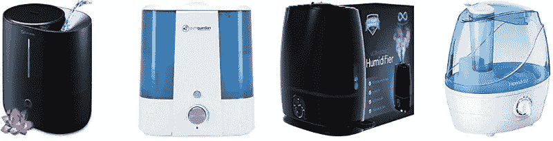

# 用潮湿对抗流感

> 原文：<https://medium.datadriveninvestor.com/fighting-the-flu-with-humidity-28d4ccb42bd7?source=collection_archive---------7----------------------->

Humidifiers

## 研究人员发现湿度对免疫系统的好处

当温度下降时，热量就出现了。这降低了空气中的湿度。事实证明，这不仅会导致手、鼻腔和喉咙干燥，还会损害呼吸道的屏障功能和先天免疫系统。

除了鼻子和嘴，呼吸系统还包括喉咙、支气管和肺。这些都衬有上皮细胞，其中一些产生粘液。这种粘液提供了抵抗病毒性上呼吸道感染的第一层防御，如流感和新型冠状病毒疾病新冠肺炎。

上皮细胞具有称为纤毛的小细胞突起，纤毛移动粘液以促进进入呼吸系统的病原体和颗粒的清除。这个过程产生的痰和粘液通过咳嗽、打喷嚏和擤鼻涕被清除。

流行病学研究发现，流感死亡人数的增加与湿度下降之间存在关联。研究老鼠的研究人员找到了这种相关性的原因。他们确定，在较低湿度下感染会损害粘液清除和先天免疫系统的反应。因此，在 10%或 20%湿度下感染流感病毒的小鼠比在 50%湿度空气中感染的小鼠发病更快。该病毒对在较低湿度条件下感染的小鼠也更致命。

对气管中粘液的分析表明，低湿度下的感染导致上皮细胞上的纤毛不能移动它。低湿度使得粘液太稠。

对在 10%湿度或 50%湿度下感染的小鼠的肺的检查显示，在 10%湿度下，病毒存在于上皮细胞和巨噬细胞中。在 50%湿度下感染的小鼠仅在巨噬细胞中有病毒。巨噬细胞是先天免疫细胞，清除病原体和感染细胞。这表明较低的湿度损害了先天免疫系统抵抗病毒感染的能力。

与在 50%湿度下感染的小鼠的肺相反，在 10%湿度下感染的小鼠的肺在感染后 6 天具有减少的组织修复迹象。这与在较低湿度下感染的小鼠症状更严重、死亡率更快和更高是一致的。

对在 10%或 50%湿度下感染的小鼠的肺表达的基因的分析显示，在 10%湿度下感染的小鼠较少激活参与介导抗病毒反应的基因。

总的来说，这些结果解释了流感感染的季节性。他们还支持一种简单的方法来降低感染的风险和症状的严重性。暖气开着的时候用加湿器。

**高亮文章**

E.工藤、宋轶、约基、拉基布、黄炳誓、荷马、岩崎。低环境湿度损害屏障功能和对流感感染的先天抵抗力。继续进行。自然。阿卡德。Sci。美国。 ***116、***10905–10910(2019)。DOI: [10.1073](https://doi.org/10.1073/pnas.1902840116)

**相关文章**

A.C. Lowen，S. Mubareka，J. Steel，P. Palese。流感病毒的传播依赖于相对湿度和温度。 *PLoS Pathog。* **3、**1470–1476(2007)。DOI:[10.1371/journal . ppat . 0030151](https://doi.org/10.1371/journal.ppat.0030151)

J.Shaman，V. E. Pitzer，C. Viboud，G. T. Grenfell，M. Lipsitch，绝对湿度与美国流感的季节性发作。*公共科学图书馆生物学。* **23** 、e1000316 (2010)。DOI:[10.1371/journal . pbio . 1000316](https://doi-org.proxygw.wrlc.org/10.1371/journal.pbio.1000316)