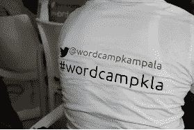

# 终于，#WordCampKampala2019 下线了

> 原文：<https://medium.datadriveninvestor.com/finally-wordcampkampala2019-went-down-9a58c02ef630?source=collection_archive---------28----------------------->

Photo by [Dustin Lee](https://unsplash.com/@dustinlee?utm_source=medium&utm_medium=referral) on [Unsplash](https://unsplash.com?utm_source=medium&utm_medium=referral)

Photo credit: @WordCampKampala2019

WordPress 是全球最流行的内容管理系统之一。内容管理系统是为网站开发人员、软件开发人员、程序员、内容创建者/作者、图形设计人员以及任何领域的几乎所有人构建的在线系统，用于展示他/她的作品，或者作为他/她的工作的必备工具。

接近或超过 30%的网站由 WordPress 提供支持；我不能忘记说包括白宫。这个 CMS 的大多数用户应用它在网站建设/开发，博客等。有些人(使用其他人，如 Drupal、Joomla 等。)实际上认为 WordPress 只是用来写博客的。非常不对！

迄今为止，WordPress camp(WordPress camp)和 meetups 已经揭开了这种思维方式的神秘面纱。

 [## 2019 年最值得学习的编码语言|数据驱动的投资者

### 在我读大学的那几年，我跳过了很多次夜游去学习 Java，希望有一天它能帮助我在…

www.datadriveninvestor.com](https://www.datadriveninvestor.com/2019/02/21/best-coding-languages-to-learn-in-2019/) 

主要的 WordPress 营地网站[https://central.wordcamp.org/schedule/](https://central.wordcamp.org/schedule/)给出了世界各地所有预定事件的列表——美国、加拿大、南美、非洲、亚洲等城市。

今年的 WordCampKampala 是 2017 年该版本问世后的第三届。我参加了所有这些活动。第一次和第二次作为演讲者，第三次(去年 11 月)作为志愿者。我不知道这一次我是怎么没去演讲的，但我想我当时没有心情。

然而，我的另一个朋友更喜欢称之为“给其他即将到来的参与者展示，而不是年复一年的相同面孔”。“嗯，我猜可能是这个原因。

但是像往常一样，技术事件总是被复杂的开发者、编码者、程序员、软件创作者、网站设计者等增光添彩。最底层是 WordPress 博客作者、用户和创建简单网站或博客的爱好者。

但是让我们更进一步，什么是‘WordPress’？

有些人说并确信“这只是另一个博客网站”。其他人说“这是一个内容管理系统”并就此打住。供你参考，WordPress 是一个内容管理系统(CMS ),是为网站设计者/开发者、博客作者/作家等建立的。以及任何有兴趣上网的人。

所以，你可能会问“这是什么……我指的是单词营？”

这是一年一度的活动，不仅仅是一天，一群人，个人，从街头混混、学生、教师、作家、研究人员、网页开发人员、社交媒体影响者、数字营销人员、专业人士、记者、网页/应用程序/软件开发人员、程序员等。聚集在一起分享想法、经验、提出问题、相互学习、建立关系以及其他活动。

坎帕拉的 WordPress 社区每个月都会召开一次会议，要讨论的主题会在登陆日之前确定。这些聚会通常在空间提供商同意的地点举行。但去年(2019 年)，该社区通过其中一个牵头人，设法在 Makerere 创新和孵化中心(MIIC 中心)获得了另一个场地。

出席总是免费的。好事情是一个人可以免费学到很多东西！然而，WordCamp 活动(一年一次)总是要付费的(只要几美元)。

那么这次又发生了什么呢？事实上，问题不应该是“发生了什么？”但是“我错过了什么？”

WordPress 圈子里的几乎所有东西。罗杰斯·穆卡莱勒首先向我们介绍了我们在同一年创建的社区网站[www.wcuganda.org](http://www.wcuganda.org/)。他还是乌干达 ICT 教师协会的协调员和 IT 专家。了解他在 www.mukalele.net[的作品。他是促成 MIIC 收购 meetup 空间的线索之一。](http://www.mukalele.net/)

Rogers 还与 ezonewebservices.com[的 Stephen Dumba](http://www.ezoneweb.com/)合作，他的创意旨在为学习者提供计算机和技术技能，为个人和企业提供网络开发服务。这两个人一起旅行，在协会的领导下，在全国各地培训教师的信息和通信技术。斯蒂芬是一名教师。

只是让你知道，刚刚结束的 WordCamp 有更多的新面孔…和更多的女性技术人员。由于他们的兴趣和凝聚力，ICT 教师也在那里。

令人惊讶的是，这次第一个出场的是一位女士。一张新面孔。这个人不是别人，正是 Florence Kyohangirwe，她写博客讨论社会影响，主要是性别、人权等问题。www.theeascene.com 在她的博客上写道。她在宽扎通信公司从事公关行业。

我们还有其他女士，其中最著名的是乌干达基督教大学的佩兴斯·安昆达，她从建筑转向了计算机科学——一个很有前途的技术人员！她向我们讲述了她的故事和她所期待的反响。她也是大学里的 GDG 领导。

像往常一样，我们也有 Cerinah Nalwoga，带我们了解技术团队的敏捷项目管理。她运营着一个用 WordPress 建立的网站[www.trillionventures.net](http://www.trillionventures.net/)一位足智多谋的女士，有金融背景和培训经验。雇佣她来训练你的团队的效率和效果。

这些女性中最突出的是尼日利亚的玛丽·乔布。她在 WordPress 上开发了这个网站，为非洲的技术人员和他们的博客提供问题的答案。她的主题讨论是鼓励女性在单词营和聚会上发言，以培养一个多元化的社区。他带我们参加了一个引人入胜的会议，敦促所有在场的人和一个女孩/女士一起回来参加下一个单词营。挑战开始了！

这次我就不多说那些常见的面孔了像沙菲克·卢塔亚，劳伦斯·巴希尔瓦，大卫·万班巴，蒂莫西·瓦西克，卡西尔耶实验室的亚瑟·卡西尔耶，坎祖代码的彼得·卡科马，Mzungu 日记的夏洛特·博沃伊辛，沃尔夫冈·h·托姆博士等等。他们是家喻户晓的名字，在 2017 年和 2018 年的 camp 中很突出，我也参加了。我来说说新面孔。

有一位先生，Abubaker Suleiman Tsamiya，介绍了项目开发中的时间管理。他是一名医疗保健提供者，因此创造了 Petograph(一种检测女性先兆子痫的小工具)，一名励志演说家和软件内容开发者。我第一次认识他是在去年罗杰斯推出社区网站的时候。

我们还听到了 Alex Agaba 介绍如何使用 HubSpot 来发展您的业务。HubSpot 是一个 CRM 工具，也是 WordCamp 的金牌赞助商之一。他从 2017 年就和我们在一起了。我们还参加了一个关于安全的小型小组讨论，由演讲者回答观众的问题。

它让 Ishimwe Joseph Patient 谈论如何自动化 WordPress 任务并减少时间浪费，Kiberu Sharif 与 Lutaaya Shafiq 共同创立的 Ronzag Group 的 Marvin Alinaitwe 谈论高级安全面板。Sharif 是一名 WordPress 主题和插件开发者，在乌干达 A11 Media 工作。伦扎格集团经营 potustimes.ronzag.com。

还有尼克松·卡穆吉沙，他是乌干达基督教大学的一名技术员。他是一名计算机科学家，拥有网络和系统工程以及系统开发方面的经验。他也是高级安全讨论小组的成员。他在 Earthug 咨询有限公司工作。

我不能忘记 africastalking.com T4 的 David Okwii 的贡献，他被称为“揭开软件开发文化的神秘面纱”。

他专注于软件开发人员需要做的事情，以便通过协作、寻求其他开发人员的帮助、记录项目、作为开发人员始终寻求提升自己的游戏以保持在市场中的相关性等实践变得有效和高效。David 拥有 PHP、Python、Golang 方面的专业知识，目前在[sitemonki.com](http://www.sitemonki.com/)工作。

发言者名单很长，这就需要根据听众的能力水平(初级、中级/用户或高级)和他们的兴趣进行单独的发言(例如同时进行两场发言)。

例如，David Okwii 的会议在一个房间举行，Stephen Dumba 在另一个房间举行了关于在 WordPress 中创建一个网站的会议……许多初学者带着一个关于如何创建网站的网站离开了营地。多好的资源啊！

如我之前所说，这次有多样性。我不会忘记一个名叫伯纳德·穆卡萨的人的贡献。他是该公司的律师、宣誓专员和知识产权主管。难怪他会给我们提供有见地的知识产权信息。毕竟，谈论什么是知识产权、版权、专利是可以带回家的免费信息。

这是一次颇具说明性的讨论，提问和回答都很详细。正如我所说的，单词营总是给一两个来自其他行业的人一个机会来帮助回答一些科技行业中令人不安的问题。

你也应该知道，拥有科技产品是这个行业的威胁之一。创新者创造了产品或解决方案，但不知道他们可以通过对其智力产品(应用程序、设备等)申请专利和版权来合法拥有它们。).

反正我可能不会把营地两天发生的事情都告诉你，但是上面可以给你一个你错过的画面。当然你也错过了食物。学习减喂脑细胞，让他们疲惫；相信我，空腹会告诉大脑“请不要理解任何事情，直到我用一些食物填满自己”。事实！

第二天(最后一天)，以小组讨论结束了活动。这样做是为了给那些没有提问的人一个提问的机会，也给小组成员一个参与的机会，让他们对一些影响成员使用 WordPress 产品的问题给出反馈和详细的见解。

该小组包括:Wolfgang 博士、Stephen Dumba、Joseph Ishimwe Patient、Timothy Wasike、Marvin Alinaitwe、Suleiman Tsamiya 和 Shafiq Lutaaya 在社区其他知识成员的协助下。不幸的是，该小组缺少一名女性代表。

还要注意，这些营地通常是付费的，只需几美元。志愿者通常会得到免费通行证。所以下次你想伸出援手的时候，到时候就报名吧。还有赞助商(金、银、微)。

要成为其中一员，请联系社区领导之一— Lawrence Bahiirwa、Rogers Mukalele 或 Arthur Kasirye。你也可以在同一网站上通过[www.wcuganda.org/register/](http://www.wcuganda.org/register/)或我们的 WhatsApp 或 Telegram 链接注册。

通过这个网站，你还可以获得关于即将到来的聚会的提醒/通知。参加这些活动是完全免费的，地点是 Kanjokya 街的 Hive Colab、Kamwokya 和 Makerere 大学计算/IT 街区的 MIIC 中心。我们还设法在金贾找到了另一个场地。

多么里程碑啊！感谢团队。

像往常一样，该营地由顶级技术品牌赞助，如 BlueHost、WooCommerce、Jetpack、GoDaddy 和 HubSpot。银类的 DigitalBlend 和微类的 Sadja WebSolutions。

详情请访问[https://2019.kampala.wordcamp.org/](https://2019.kampala.wordcamp.org/)

您也可以在 Twitter @WordCampKampala 关注我们。

我等不及下一个#WordCamp 了！

我不知道你怎么样。

注:这篇文章也出现在 http://www.wcuganda.org/category/community/的[上](http://www.wcuganda.org/category/community/)

***关于作家***

朱利叶斯·马萨巴是一名私人投资研究员和商业顾问。他还与 Ablestate、 [*、https://app.ablestate.org/*](https://app.ablestate.org/)*和一位 WordPress 作家/博客作者一起研究创业、企业家精神、商业和金融。他热爱科技。*