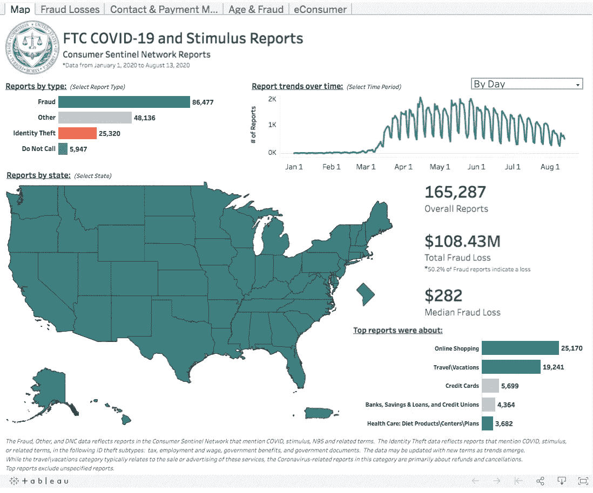
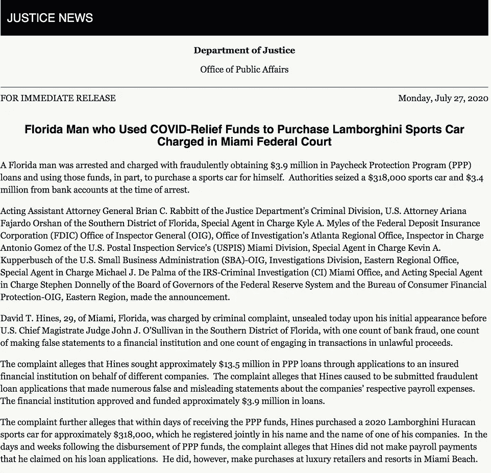
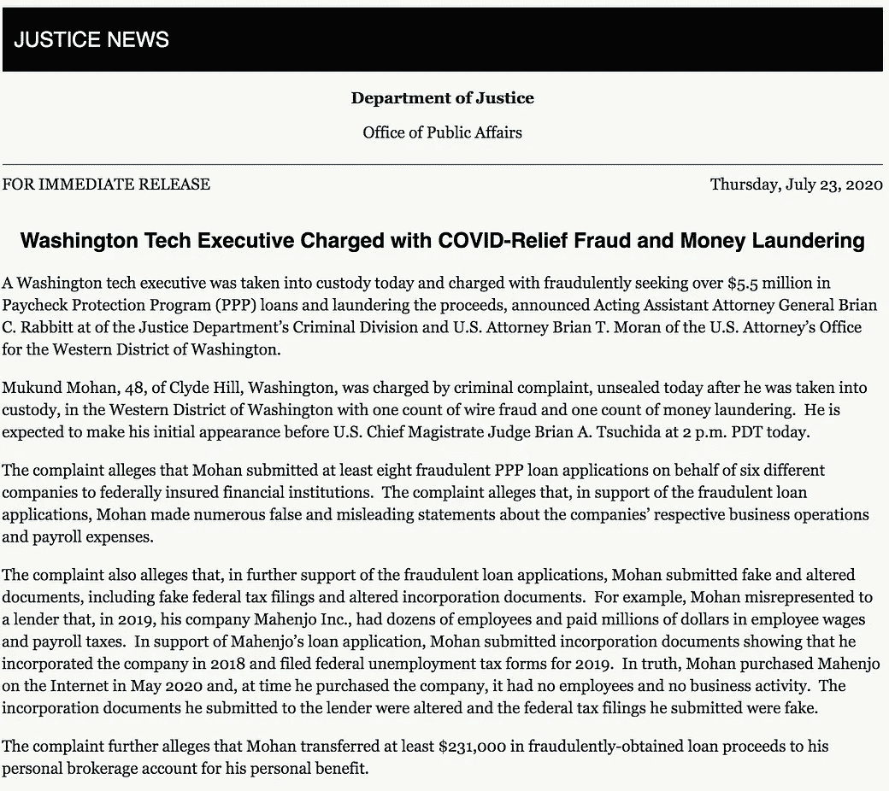
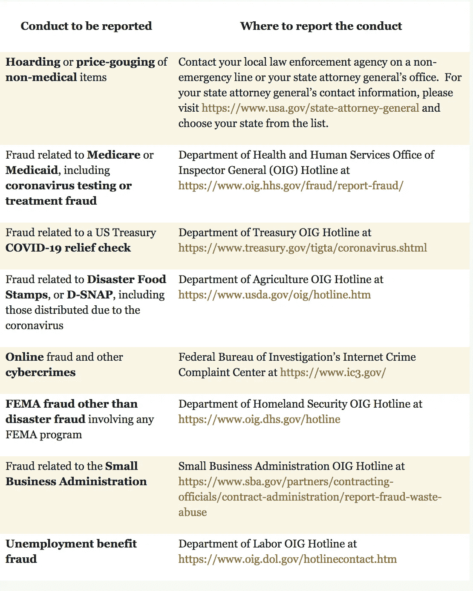
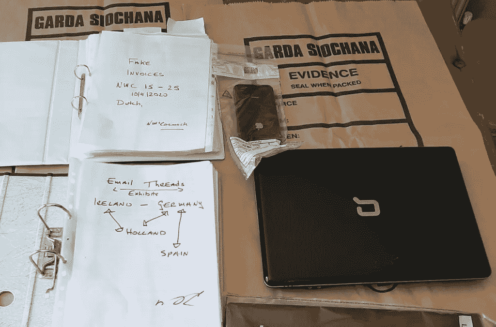

# 金融犯罪、合规和新冠肺炎

> 原文：<https://medium.datadriveninvestor.com/financial-crimes-compliance-and-covid-19-9f8530f620b9?source=collection_archive---------19----------------------->

非法行为者利用全球经济紧张的脆弱性和新冠肺炎疫情造成的供应链中断，有效地制造了一场欺诈计划和洗钱的完美风暴。

“[世界银行(WB)和国际货币基金组织(IMF)](https://www.protiviti.com/sites/default/files/united_states/insights/guide-to-us-aml-requirements-6thedition-protiviti_0.pdf)估计洗钱量占全球国内生产总值(GDP)的 3%至 5%，相当于每年约 2.2 万亿至 3.7 万亿美元。”

目前，整个反洗钱(AML)社区正在适应实时推出的“[新联邦、州、地方和外国政府举措，以打击新冠肺炎疫情及其经济后果](https://www.fincen.gov/news/speeches/prepared-remarks-fincen-director-kenneth-blanco-delivered-consensus-blockchain)随着隔离、社会距离、旅行限制、边境控制、制造业爆发等问题的出现，国内和国际上出现了对腐败、网络犯罪、冒名顶替计划和大规模欺诈的担忧。

事实上，仅从 2020 年 1 月 1 日到 2020 年 8 月 13 日，美国联邦贸易委员会(FTC)报告的疫情相关欺诈损失总计[1.0843 亿美元](https://public.tableau.com/profile/federal.trade.commission#!/vizhome/COVID-19andStimulusReports/Map)。然而，这个数字很可能是一个严重的低估，因为我们正处于与疫情有关的史无前例的诈骗范围之中。

根据金融犯罪执法网络(FinCEN)在危机和欺诈的不和谐联盟中的说法，犯罪分子正在利用新冠肺炎作为诱饵，适应远程工作增加带来的机会——窃取敏感信息和泄露交易，通过虚拟货币支付进行诈骗，并在此类"[远程环境中破坏尽职调查/“了解您的客户”(KYC)流程。](https://www.fincen.gov/news/speeches/prepared-remarks-fincen-director-kenneth-blanco-delivered-consensus-blockchain)

FinCEN 发布了一份[建议](https://www.fincen.gov/sites/default/files/advisory/2020-07-07/Advisory_%20Imposter_and_Money_Mule_COVID_19_508_FINAL.pdf)，详细说明了冒名顶替者的金融危险信号指标如下:

*   自称代表政府机构强调救济金和/或预付卡的犯罪分子；
*   与新冠肺炎有关的主动来文，要求提供财务信息，包括银行账户凭据；
*   与声称是政府机构的发件人不匹配的电子邮件地址；而且，
*   不存在的慈善组织募集与新冠肺炎有关的捐款。

非法行为者利用上述机制，通过“通过电子邮件、自动电话、短信或其他通信方式索取付款、捐款或个人信息”来欺骗易受攻击的人。此外，“许多例子包括网络钓鱼方案，骗子发送看似来自合法来源的通信，收集受害者的个人和财务数据，并通过说服目标下载恶意附件或点击恶意链接来潜在地感染他们的设备。"

" FinCEN 通过一个特定的下拉类别，为金融机构创建了一个专门针对新冠肺炎的在线联系机制，以便"在遵守其《银行保密法》义务的同时传达疫情的关切，因为遵守《银行保密法》对国家安全至关重要。

**冠状病毒援助、救济和经济安全法案**

2020 年 3 月，[联邦立法](https://www.congress.gov/bill/116th-congress/house-bill/748)颁布[CARES 法案](https://home.treasury.gov/policy-issues/cares)，2.2 万亿美元的联邦援助，授权美国国税局(IRS)向大约 1.6 亿纳税人发送刺激计划，或 [*经济影响*](https://home.treasury.gov/policy-issues/cares/assistance-for-american-workers-and-families) 款项。根据该法案，已婚夫妇有资格获得最高 2，400 美元的补助，每个合格的受抚养人可额外获得 500 美元，个人可获得最高 1，200 美元的补助。有关该法案的概要，请参见此处的[和](https://www.forbes.com/sites/leonlabrecque/2020/03/29/the-cares-act-has-passed-here-are-the-highlights/#61d0689c68cd)。

7 月 27 日，参议院多数党领袖米奇·麦康奈尔公布了共和党的《治愈法案》,通过新一轮的刺激检查来解决疫情问题。HEALS 是健康、经济援助、责任和学校的首字母缩写。根据该法案，年收入 75，000 美元以下的成年人将获得 1，200 美元，收入更多的成年人将获得较少的金额。没有收入或领取社会保障津贴的人有资格获得全额津贴。此外，该法案还包括一个后续的薪酬保护计划(PPP)，为超过 3100 万领取福利的美国人延长联邦失业时间(将其从每周额外 600 美元改为 200 美元)，并为学校拨款 1000 亿美元。

 [## DDI 亮点-本周十大必读书籍|数据驱动的投资者

### 在我们进入本周的前 10 名之前，我们想和你分享一些事情。[技术项目]您是否有…

www.datadriveninvestor.com](https://www.datadriveninvestor.com/2020/08/22/ddi-highlights-top-10-must-reads-this-week/) 

迄今为止，已经发放了数十亿美元的失业救济金，各州感到迫切需要迅速向弱势群体发放援助。这一过程的快速性对诈骗者尤其具有吸引力，尤其是直接存款和就业部的 Visa [预付借记卡](https://edd.ca.gov/About_EDD/The_EDD_Debit_Card.htm)。

为了利用失业系统，攻击者正在使用“美国公民的详细信息，如可能从过去几年的网络黑客中获得的社会安全号码，代表没有被解雇的人提出索赔，[官员说](https://www.nytimes.com/2020/05/16/us/coronavirus-unemployment-fraud-secret-service-washington.html)

美国联邦贸易委员会发布了一份针对大学生的网络钓鱼诈骗警告，诈骗者伪装成大学财务部门。同样，疗养院和辅助生活设施中的罪犯试图拿走为享受医疗补助的老年人准备的刺激基金，引发了联邦贸易委员会的另一个警告。

根据《保健法》,联邦法律刺激付款被视为“税收抵免”,税收抵免不作为医疗补助等联邦项目的资源，这样政府(和养老院)就不能没收它们。

鼓励国税局相关新冠肺炎诈骗案的受害者在此举报他们的投诉[。](https://www.treasury.gov/tigta/coronavirus.shtml)

**全球关注和应对金融犯罪**

在全球化的世界中，金融犯罪没有国界。2020 年 5 月，金融行动特别工作组(FATF)发布了一份全面的[报告](https://www.fatf-gafi.org/media/fatf/documents/COVID-19-AML-CFT.pdf)，确定了新冠肺炎在洗钱和恐怖融资方面的风险。这些风险包括:

*   罪犯绕过尽职调查；
*   滥用金融服务隐藏非法资金；
*   利用刺激基金和破产机制；
*   更多地利用不受监管的金融部门；
*   误用和挪用国内和国际金融和应急资金；而且，
*   犯罪分子利用新冠肺炎和“相关的经济衰退进入发展中国家新的现金密集型和高流动性的业务领域。”

疫情似乎已经影响了反洗钱现场检查，并被视频会议检查所取代。由于行动上的限制，国际合作还会出现更多的延误。此外，“货币价值转移服务部门面临着特别的干扰，因为农民工受到了限制措施和公司倒闭的影响，他们的大部分业务都是面对面完成的。”

FATF 鼓励保持警惕，因为“犯罪分子和恐怖分子可能会试图利用国家反洗钱/打击资助恐怖主义(CFT)系统的漏洞和弱点，同时他们认为资源被集中在其他地方，这使得基于风险的监督和执法活动比以往任何时候都更加重要。”此外，“监管机构、金融情报机构和执法机构应继续与私营部门分享信息，以优先考虑和应对关键的(洗钱)风险，特别是与欺诈有关的风险，以及与新冠肺炎有关的(资助恐怖主义)风险。”

“在全球远程工作的急剧增长中”,最令人担忧的是利用企业网络安全中的弱点,[允许犯罪分子访问网络上的敏感商业机密，甚至危害商业电子邮件——暴露客户联系和交易细节。](https://www.fincen.gov/sites/default/files/advisory/2020-07-30/FinCEN%20Advisory%20Covid%20Cybercrime%20508%20FINAL.pdf)

这方面的财务危险信号包括:

*   身份文件的数字处理(如政府发布的身份信息)；
*   跨帐户利用泄露的凭据(利用弱身份验证过程；
*   照片分辨率低或在身份证明文件中模糊不清；
*   帐户信息中姓名的拼写与政府身份不符；
*   客户拒绝提供补充信息；而且，
*   客户在短时间内从单个 IP 地址跨多个不相关的帐户登录。

根据金融犯罪执法网的说法，虽然“没有一个单一的金融红旗指标必然表明非法或可疑活动，但金融机构应考虑额外的背景信息和周围的事实和情况，如客户的历史金融活动，交易是否符合普遍的商业惯例，以及客户是否表现出多种指标，然后才能确定交易是否可疑或以其他方式表明潜在的欺诈性新冠肺炎相关活动。”

*美国*

司法部(DOJ)宣布了几项与 PPP 贷款欺诈有关的指控。PPP 提供了数十亿美元的可减免贷款，期限为两年，利率为 1%。“企业必须将 [PPP 贷款收益用于支付薪资成本](https://www.justice.gov/opa/pr/washington-tech-executive-charged-covid-relief-fraud-and-money-laundering)、抵押贷款利息、租金和公用事业费用。如果企业在规定的时间内将收益用于这些支出，并且至少将一定比例的贷款用于工资支出，PPP 允许免除利息和本金。”如下例所示，有人利用政府资金欺诈购买奢侈品和汽车。

DOJ 将研究各种执法理论来追究不法分子的责任，特别是根据两项关于洗钱的关键法律条款——美国法典第 18 编第 [1956](https://codes.findlaw.com/us/title-18-crimes-and-criminal-procedure/18-usc-sect-1956.html) 和 [1957](https://codes.findlaw.com/us/title-18-crimes-and-criminal-procedure/18-usc-sect-1957.html) 。

根据第 1956(a)条，如果某人进行或试图进行金融交易，而明知交易中涉及的财产是非法活动的收益，意图是促进特定非法活动的进行，则此人可能面临刑事责任；或者:

*   意图逃税或欺诈；
*   明知交易旨在隐瞒特定非法活动的性质、地点、来源、所有权或收益；或者，
*   避免联邦/州报告要求。该财产事实上必须来自非法活动。

根据第 1957 条，一个人如果从事超过 10 000 美元的货币交易，收益来自“特定的非法活动”(第 1956 条第 7 款概述)，可能面临刑事责任。

任何人如有涉及新冠肺炎的欺诈企图的信息，可拨打 DOJ 灾难欺诈热线:866–720–5721，或在此提交以下投诉:

*欧洲*

国际刑警组织[报道了](https://www.interpol.int/en/News-and-Events/News/2020/Unmasked-International-COVID-19-fraud-exposed)对最近一起复杂诈骗案的担忧，这起诈骗案利用了封锁开始时全球医疗用品的短缺。随着社交工程攻击的急剧增加，一家公司购买者从一个虚假网站购买了价值 150 万欧元的防护口罩。“买家电汇了钱，但面具一直没到。结果发现荷兰公司(他们以为他们是从那里购买的)确实存在，但他们的网站也被克隆了。没有该命令的官方记录。”欺诈者调整了他们的销售策略，以利用疫情爆发获取巨额利润。

国际刑警组织迅速跟踪资金流向，在资金到达预定的尼日利亚账户之前冻结了资金。

*英国*

英国金融行为监管局(FCA)发布了一份[指南](https://www.fca.org.uk/firms/financial-crime/financial-crime-systems-controls-during-coronavirus-situation)，警告不要为了减少为解决运营问题而产生的警报数量而改变交易监控触发器或制裁筛选系统。FCA 敦促做出合理的努力来收集尽职调查信息，如果各方修改了其控制措施，决策应“明确评估风险、记录在案并经过适当的治理。”如果存在可能影响金融犯罪控制的重大问题，各方应通知 FCA。

*中东*

阿联酋金融服务监管机构发布了关于处理金融犯罪风险和反洗钱义务的[联合指南](https://dfsa.ae/Documents/AML-Joint-Guidance/UAE--Supervisory-Authorities---AML-guidance_COVID-19-05.05-English-.pdf)(迪拜和阿布扎比当局)。在业务难以坚持现有识别和验证的情况下，应使用 fintech(金融技术)、regtech(监管管理技术)和 suptech(监管机构的人工智能和机器学习)来继续履行客户尽职调查义务。同样，金融行为也发生了变化，许多银行关闭了分支机构，减少了营业时间，或者限制了服务，因为面对面的银行业务可能会不必要地让人们面临感染的风险。因此，必须通过其他方式(利用上述技术)进行尽职调查。

此外，金融机构和非金融企业应继续采用对风险敏感的方法，并密切监控业务关系，这可能包括未经政府许可为慈善事业非法筹款和网络钓鱼计划。

*南美*

据[美国有线电视新闻网](https://www.cnn.com/2020/07/08/americas/brazil-coronavirus-corruption-intl/index.html)报道，“在巴西，近 1500 起与冠状病毒相关的联邦刑事司法诉讼已经开始，包括对滥用联邦资金、欺诈、定价过高和洗钱的调查。”巴西总统雅伊尔·博索纳罗的病毒检测也呈阳性。

从州到联邦的各级政府都在接受调查，各种时间敏感的合同正在接受审查，其中包括一份价值 1 亿美元的来自中国的[呼吸机](https://www1.folha.uol.com.br/cotidiano/2020/05/tce-abre-investigacao-para-apurar-compra-de-3000-respiradores-pela-gestao-doria.shtml)合同。6 月份，该合同被取消，因为一家中间商公司未履行订单而被起诉。“急于获得紧急医疗用品导致仓促谈判合同，有时价格过高。随着供应商加大生产和争夺原材料，对医疗设备的需求激增也迫使合法成本上升。”

**FATF 应对欺诈挑战**

金融机构面临与新冠肺炎相关的欺诈浪潮的原则关注。他们必须维护强大的网络安全协议，防止盗窃/客户欺诈。为了应对来自疫情的风险，FATF 提出以下建议:

*   在国内进行协调(监管人员将合作识别、监控和沟通不断变化的风险形势)；
*   加强与私营部门的沟通(为监管机构提供联络点，并保留相关记录以清理积压)；
*   鼓励客户尽职调查(CDD)团队充分利用基于风险的方法。
*   鼓励使用负责任的数字身份和其他创新解决方案来识别客户身份并进行交易；
*   支持电子和数字支付选项(提高电子钱包的最高限额，降低国内银行间转账费用)；
*   监控业务连续性计划并根据相关情况调整监管(例如:随着商场和赌场的关闭，更加关注赌场和赌博平台；而更侧重于贵金属、宝石和黄金的经销商)；
*   了解新的风险并调整操作响应；
*   阐明经济救济措施背景下的反洗钱/CTF 要求；
*   继续跨国合作；而且，
*   监测新冠肺炎在私营部门的影响。

**进入专家视角—** [**订阅 DDI 英特尔**](https://datadriveninvestor.com/ddi-intel)