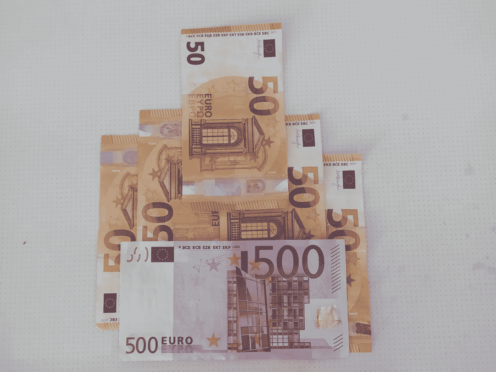

# 金融危机和新冠肺炎

> 原文：<https://medium.datadriveninvestor.com/financial-crisis-and-covid-19-e7329809b09?source=collection_archive---------24----------------------->

## 新冠肺炎引发的金融危机会有多大？

Banknotes, photo by the author.

我们都生活在无形敌人 COVID 19 的新威胁下。很少有人意识到病毒对我们未来生活的影响。

我不说我们生活中的新常态。呆在家里，注意安全。永远戴着口罩。不要社交。生活在恐惧中，你知道你会被感染或者传染给你爱的人。

我谈到了 COVID 19 将对经济产生的影响，这将改变我们的生活，我们知道这一点。

我听说美国印了几万亿美元，日本印了同样的日元，最后，欧盟同意根据病毒和人口造成的损失给每个国家几百万美元。这很好，人类应该这样做。我想到的一件事是，这笔钱来自某个地方，必须归还。

人们很高兴，因为在工作了这么多年之后，每天都去办公室，他们终于有机会呆在家里拿工资了。他们会意识到，首先，过一段时间后，他们会感到厌倦，但最重要的是，这些钱必须归还给银行。

为什么？

因为这就是我们货币体系的运作方式。我住在希腊，我是希腊人。当 2008 年的危机从美国的房地产开始，并引发了全球范围的危机反应时，希腊受到了重创，以至于破产。

没有人在电视上，没有人在报纸上，没有记者说实话。这种情况又发生了。大多数人认为，与 2008 年的危机相比，这次危机会小一些。
他们大错特错。

我为什么这么说？

因为太明显了，能把你的眼睛抠出来。
首先，这一次，问题不在一个板块，房地产，而是所有的板块都受到了冲击。从普通工作到拥有小生意或在那里工作的人，直到所有的旅游业。
酒店和飞机公司、餐馆、咖啡和酒吧、船运公司和导游。

大多数国家给不能工作的人发放津贴。那是国家给的钱。但是国家并没有向所有关闭的企业征税。那么，当他们给予的比他们收集的多的时候，国家怎么可能有一个正的账户呢？此外，许多小企业将无法生存。这增加了失业人数。

回到我的祖国，希腊。
在媒体上，在 Covid19 危机开始时，他们说 AGP 将减少 3%到 4%。一周后，他们说将会是 5 比 6。下周，他们表示，在最坏的情况下，失业率可能从 7.5%升至 12%。同一周，他们表示，希腊国家银行预测将在 5.5%左右。

你看到他们在做什么吗？

他们让你为即将到来的事情做好准备。他们不想直截了当地说出来，他们用一种不会错的方式说出来。他们说所有可能的结果，但尽量让你保持冷静和乐观。

我不想毁了你的一天，但当涉及到数字时，你是乐观还是悲观并不重要。这只是数学。

只有一个人(希腊政治家)预测，这场危机将使 AGP 减少 18%到 24%左右，他的名字叫 Gianni Farufakis。这也是我的信念。
德国向汉莎航空公司注资 90 亿欧元以挽救其破产。
不幸的是，他们不能给所有面临财务问题的公司钱。

但即使他们可以，我在这里提醒你，这些钱来自某个地方(中央银行)，必须以某种方式返回那里。

你猜怎么着？

政府会找到一种方法，以税收的形式从中产阶级和纯粹的中产阶级那里拿走所有这些钱，然后返还给银行。即便如此，这也将是一个巨大的档案。对社会群体的影响将是巨大的。

以一种令人不安的方式，这场危机可能是反思和重新设计我们的金融和货币体系的恰当时机。做一些意味着重新评估我们的价值观和我们的社会结构的事情是必须的。

现在是这样做的时候了。每个人都知道这件事，但是没有人有勇气去做。
如果不是我们，那是谁？如果不是现在，那是什么时候？