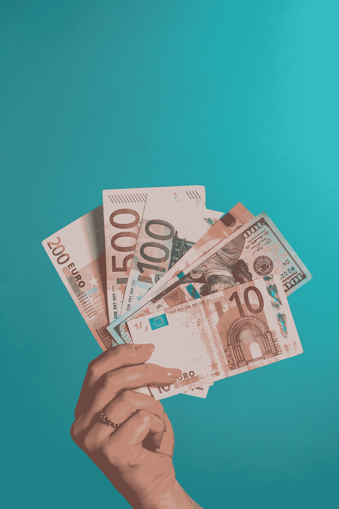

# 财务自由:实现财务自由的诀窍。

> 原文：<https://medium.datadriveninvestor.com/financial-freedom-how-to-achieve-it-376a2f3e2778?source=collection_archive---------13----------------------->

## 我非常怀疑你没有负债。

Photo by [Omid Armin](https://unsplash.com/@omidarmin?utm_source=medium&utm_medium=referral) on [Unsplash](https://unsplash.com?utm_source=medium&utm_medium=referral)

我们都想通过退休达到财务自由，但是财务自由是什么意思呢？有些人认为你需要积累大量财富才能获得财务自由。这是不正确的，因为如果我们不正确地使用它，钱会很快用完。

要实现财务独立，你需要拥有相当数量的资产，这些资产带来的收入应该大于你的支出。

这些是一些现代的解决方案，给你一个如何达到财务自由的想法。

# 不动产

Photo by [park dasol](https://unsplash.com/@awakedesigner?utm_source=medium&utm_medium=referral) on [Unsplash](https://unsplash.com?utm_source=medium&utm_medium=referral)

房地产是最好的长期投资之一；标准来看，美国的房价在过去十年中持续上涨。有一些波动和短期的低迷，但从长期来看，它总是在升级。在加州，一栋 2000 年价值 125，000 美元的房子，今天将价值 225，000 美元甚至更多。

 [## 自然语言处理的五种金融应用|数据驱动的投资者

### 过去的五年对于自然语言处理领域来说是革命性的。我们从荣耀的 ctrl-f…

www.datadriveninvestor.com](https://www.datadriveninvestor.com/2020/09/17/five-financial-applications-of-natural-language-processing/) 

有些人认为你需要有数百万美元来投资房地产。如今，有许多低成本投资，一些低成本选择包括购买存储空间并将其出租。你至少可以花 2000 美元左右买一个。它会保证你每月的回报。

# 金色的

Photo by [Dmitry Demidko](https://unsplash.com/@wildbook?utm_source=medium&utm_medium=referral) on [Unsplash](https://unsplash.com?utm_source=medium&utm_medium=referral)

黄金永远是有价值的，因为它很稀有，一件物品越稀有，它的价值就越高。据估计，从人类历史开始到今天，从地球上提取的所有黄金，如果融化，只能填满三个奥林匹克大小的游泳池，所以资源基础是有限的。

福特 T 型车在 1920 年很受欢迎。在那个时期，一辆新的福特车要 400 美元，相当于 20 盎司黄金。今天，同一家公司——福特——的一辆车要花 26000 美元。奇怪的是，这款新车的黄金价格与近 100 年前福特 T 型车的价格相同:20 盎司。黄金随着时间的推移保持同样的重要性。因此，即使美元的价值像过去的其他货币一样恶化，购买黄金也意味着在几十年内保持同样的价值。

如今一个新兴的趋势是黄金自动取款机。目前，你可能会无意中发现一台自动提款机——不是为了现金，而是为了黄金。如今淘金容易多了。我想表达的意思是，如果你有多余的钱或存款，你知道你不需要它。我强烈建议你购买黄金。能买多少就买多少。从长远来看，这是值得的。

> 少量但持久的(某物)比有大量不一致的东西要好。

# 股票

Photo by [Markus Spiske](https://unsplash.com/@markusspiske?utm_source=medium&utm_medium=referral) on [Unsplash](https://unsplash.com?utm_source=medium&utm_medium=referral)

最好的长期投资之一是投资股票。在这段时间里，股票的价值增加了 1500%，如果不是更多的话。人们应该考虑到，这种价值的巨大增长是在很长一段时间内发生的。股票市场在短期内也会有波动，这是正常的，但从长期来看，这是一项出色的投资。

沃伦·巴菲特，这个星球上第二富有的人，通过投资股票市场积累了他的巨额财富。他从小就开始投资。因此，如果你着眼于短期收益的投资，这永远不会发生。你不应该在没有研究的情况下投资。

你不应该用短期内需要的钱投资股票市场。你需要有至少 5-10 年的长远眼光；这就是我们看到价值增长的地方。

# 金融情报

Photo by [Kathy Marsh](https://unsplash.com/@travelkat74?utm_source=medium&utm_medium=referral) on [Unsplash](https://unsplash.com?utm_source=medium&utm_medium=referral)

你有没有想过如何在大富翁上取胜？在垄断中获胜的玩家总是投资土地、建造房屋，并在人们拥有自己的土地并因此变得富有时获得回报的人。

那些继续积累财富而不投资土地的玩家看起来会赢。然后，他们最终失败，因为他们通过向其他玩家支付“租金”并从银行贷款而失去了他们的财富。

这是一个值得学习的宝贵教训:不要只收集现金，只要你有多余的钱就去投资。

# 让你的钱增值的简单方法

# 在人群密集的地方销售:

你可以在网上搜索你所在城市的节日或事件。然后，你可以根据事件准备物品和商品，你会有买家，积累双倍于你投入的钱。这被认为是交易，但它仍然可以在短期内增加你的钱。

# 购买停车位:

你可以通过购买公司经营的停车场来投资房地产。你可以拥有一个停车位，他们每年支付你租金——只要你有收入，房子不必很大。财富就是这样产生的——缓慢但稳定！

# 古董:

60 年代或 50 年代的旧车总是在涨价。旧车被认为是古董，它们的价值会随着时间的推移而增加——这是你唯一能买到的、你妻子不会抱怨的东西，因为它会随着时间的推移而升值。在你匆忙购买任何汽车之前，有一些关于如何选择车辆以赚更多钱的书。

# 旧书:

旧书拍卖非常普遍，尤其是在英国。那里有你能买到的有价值的书。总的规律是，书籍只会随着时间变得更有价值。你可以买一本书，放上几年，下次再以双倍的价格出售。

# 关闭

我不是来告诉你如何快速致富，而是告诉你如何明智地使用你的钱。我呼吁的是财务自由，不是财务赌博；当你把钱投到你不了解也没有研究过的东西上，这更接近于赌博，就好像你把钱扔进了大海。慢慢来，学习，理解，咨询，然后投资。

**进入专家视角—** [**订阅 DDI 英特尔**](https://datadriveninvestor.com/ddi-intel)