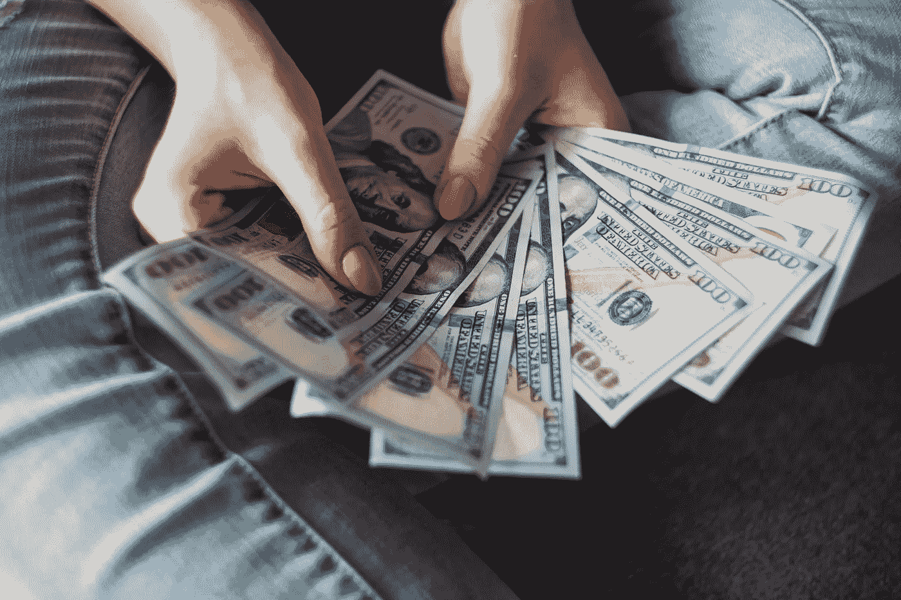

# 为受冠状病毒影响的企业提供财务帮助

> 原文：<https://medium.datadriveninvestor.com/financial-help-for-businesses-affected-by-coronavirus-3b214a0a7d64?source=collection_archive---------16----------------------->

Marnie Kunz

Photo by [Alexander Mils](https://unsplash.com/@alexandermils?utm_source=unsplash&utm_medium=referral&utm_content=creditCopyText) on [Unsplash](https://unsplash.com/s/photos/cash?utm_source=unsplash&utm_medium=referral&utm_content=creditCopyText)

# 冠状病毒商业贷款和对美国企业的帮助

如果你是小企业主，你可能和我一样，受到过冠状病毒的重创。我的[活动公司](http://runstreet.com)在一周的时间里，从春风得意到彻底死亡和停滞。不过，幸运的是，有越来越多的资源可以帮助受到冠状病毒严重打击的小企业主。随着新的法律和计划的出台，其中许多内容将会更新。欢迎在评论中留下任何建议或更新。

无论你是经营一家住宿加早餐公司、餐饮公司、餐馆还是健身房，你都有可能看到你的小企业因冠状病毒而彻底停止业务，或者营业时间非常有限或顾客寥寥无几而碰壁。这是一个艰难的处境，除了面临全球疫情最重要的健康问题之外，你可能还要担心支付房租、支付员工工资，或者做出裁员甚至关门的艰难决定。

# 冠状病毒商业贷款

如果你的企业需要现金来支付租赁、供应、员工或其他费用，你可以考虑低息或无息商业贷款。

众议院刚刚通过了一项法案，即[家庭第一冠状病毒应对法案](https://docs.house.gov/billsthisweek/20200309/BILLS-116hr6201-SUS.pdf)，目前正等待参议院通过，该法案包括向受冠状病毒影响的小企业和美国工人提供数十亿美元的援助。预计本周参议院通过该法案后，我将为小企业主提供该法案的最新资源。

# SBA 灾害援助贷款

美国小企业协会为受冠状病毒影响的企业提供灾难援助贷款。SBA 向各种规模的企业、私人非营利组织、房主和租房者提供低息灾难贷款。SBA 灾难贷款可用于修复或替换在已宣布的灾难(如冠状病毒)中损坏或毁坏的以下物品:房地产、个人财产、机械设备以及库存和商业资产。

 [## 更好的预算，打造更大的|数据驱动型投资者

### 即使是专家也承认它们并不完美。从 1 到 10 的范围内，安东尼·科普曼和德尔…

www.datadriveninvestor.com](https://www.datadriveninvestor.com/2018/11/08/budget-better-to-build-bigger/) 

冠状病毒目前在各州的基础上列出，因为随着病毒呈指数级增长，SBA 继续更新贷款权限。你可以在这里查看你所在州的小型企业管理局灾难贷款的状况。

企业主可以通过拨打电话 1-800-659-2955 或发电子邮件给 disastercustomerservice@sba.gov[来获得更多关于这个项目的信息。](mailto:disastercustomerservice@sba.gov)

# 纽约市冠状病毒商业贷款和赠款

你的地方政府也可以为受冠状病毒影响的小企业提供财政援助。例如，在纽约市，该市宣布将推出一项计划，为小企业提供赠款和贷款，以帮助应对冠状病毒给经济带来的巨大打击。

员工少于 100 人、销售额下降 25%或更多的企业将有资格获得高达 75，000 美元的零利息贷款，以帮助减轻利润损失。纽约市还为员工少于 5 人的小企业提供一笔补助金，支付两个月 40%的工资成本，以帮助留住员工。

你可以[在这里注册](https://www1.nyc.gov/site/sbs/businesses/covid19-business-outreach.page)直接从纽约市政府获取更多信息。

# 其他小企业贷款

Kiva 是一家非营利机构，提供低息或无息众包贷款来资助你的企业。通过利用 Kiva 的平台以及您自己的社交网络，您可以帮助提高您的小企业贷款活动的知名度，人们可以以 25 美元的增量捐款。随着你每个月偿还贷款，它们会随着时间的推移得到偿还。Kiva 向世界各地的小企业主提供高达 15，000 美元的贷款，一旦你偿还了全部贷款，你就可以申请另一笔贷款。

# 对小企业的税收减免

由于冠状病毒造成的经济困难和痛苦，许多州延长了企业的纳税期限。联邦政府表示，它也将推迟纳税期限，尽管 3 月 16 日的营业税期限刚刚过去，联邦政府没有进一步的消息。查看这个[州税务网站目录](https://www.thebalance.com/state-tax-web-sites-3193299)以了解更多关于你所在州的税收减免计划。

# 受冠状病毒影响的小型企业的一般资源

如果你的企业受到冠状病毒的重创，你可以采取一些其他措施来度过这段艰难时期。下面是一份可供探索的财务选项清单:

**向您现有的银行申请商业信用额度**。如果你有一个商业账户，大多数银行也会给你一个信用额度。商业信贷额度是一种小型企业贷款，它提供了常规商业贷款所不具备的灵活性，并赋予你支付租金或工资等直接开支的购买力。有了商业信用额度，你可以借到一定的额度——比如 10 万美元——并且只为你借的那部分钱支付利息。除了传统银行提供商业信贷额度，网上贷款也可以提供。这是来自 NerdWallet 的一份关于 T2 的指南，介绍提供商业信用额度的在线公司。

[**QuickBooks Capital**](https://quickbooks.intuit.com/capital/)**为现有 QuickBooks 客户提供商业贷款，作为客户，他们已经有了你的财务信息，所以申请起来超级容易。**

**[**PayPal 商业贷款**](https://www.paypal.com/us/webapps/mpp/paypal-business-loan) 提供固定利率贷款，可快速将商业贷款存入您的 PayPal 账户。商业贷款金额从 5000 美元到 500000 美元不等。**

****试试众筹。**除了 Kiva，你可能还想试试热门网站上的众筹选项，比如 [KickStarter](https://www.kickstarter.com) 和 [Indiegogo](https://www.indiegogo.com) 。这些网站提供资金而没有偿还贷款的压力。如果你的企业在社交媒体上很受欢迎，或者你的团队有很好的技术和设计技能，这些网站是筹集商业资本的绝佳选择。**

**你的小企业如何应对冠状病毒？请在下面留下你的建议。**

**[*玛妮·昆兹*](https://www.marniekunz.com) *是布鲁克林的作家、企业家，也是*[*run street*](https://www.runstreet.com)*Art Runs 的创始人。她喜欢旅行、跑步、吃大量的玉米卷和冥想。***