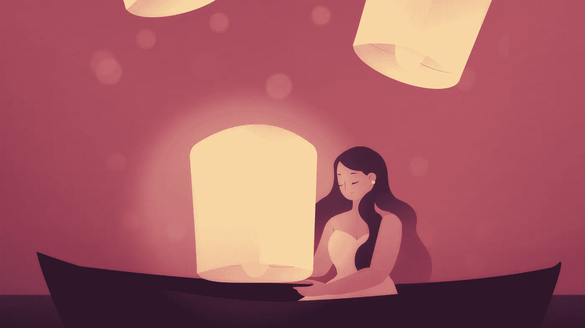

# 找到你的流量；你现在比任何时候都需要它

> 原文：<https://medium.datadriveninvestor.com/find-your-flow-you-need-it-now-more-than-ever-e17a970f5ddc?source=collection_archive---------9----------------------->

## 在不确定的时期寻找清晰和平静的时刻

Image from [mixkit.co](https://mixkit.co/free-stock-art/woman-sitting-in-a-rowboat-surrounded-by-lanterns-floating-in-97/)

自从疫情正式开始以来，我一直密切关注着我的日子。我记下我的感受，承认我何时焦虑和沮丧，认可我何时感觉良好。

这是我的救命稻草——在第一周的混乱之后，看到我的低能量日子不会永远持续下去，以及哪些做法可以帮助我摆脱它们，这让我感到欣慰。

很艰难。这是一个起伏不定的过山车，我可以很容易地画出一条曲线来跟踪我的情绪——它们变化如此之快，以至于有几天我从骨子里感觉到我的情绪波动的指数性质。我甚至不能享受上升的道路，因为它不可避免地会转到一个向下的点，谁知道我还能再创多少新低。我的大脑似乎非常善于用新的焦虑、新的抑郁、新的冷漠来震惊我。

 [## 良好的生活是习惯的形成|数据驱动的投资者

### 过度思考是过度紧张。仅仅几个简单的习惯就会在一天中产生巨大的影响。那是…

www.datadriveninvestor.com](https://www.datadriveninvestor.com/2020/01/17/a-good-life-is-habit-forming/) 

我知道这很自然——但知道这一点并不会让我更加享受。

虽然我把我糟糕的日子归因于信息超载和我们周围普遍的焦虑，但在我美好的日子里有一件事是不容忽视的。

# 进入状态

在积极心理学中，Mihály Csíkszentmihályi 创造了一种心流状态，即处于*区*，这是一种精神状态，在这种状态下，一个人在进行活动时完全沉浸在一种充满活力的专注感、完全参与和享受活动过程的感觉中。从本质上来说，流动的特点是完全吸收特定的活动，导致空间感和时间感的丧失。

流动状态需要两个因素:

*   你需要有**能力**和技能来完成任务，
*   它需要一点点**的挑战性。**

如果你有技能，但任务没有挑战性，你肯定会感到厌倦。如果挑战太大，你会感到沮丧。心流是一种状态，在这种状态下，当你想要迎接挑战时，你的技能会逐渐提高。

如果你想一想你生活中的一些活动，你可以很容易地找出那些能让你进入心流状态的活动。对我来说，这些是写作、锻炼或跑步；但是任何其他需要专注和增加技巧的创造性形式都可以做到。

# 心流会阻止你过度思考

我意识到对我来说焦虑的最大来源是过度思考。我倾向于过度思考很多事情，虽然我相信思考是伟大的，但我也认为它可能会过度，如果是这样，它可能弊大于利。

我们从小就习惯于思考。我们被教导在说话和行动之前要思考，要权衡和考虑后果，要评估选择。虽然在很多情况下理性思考是必要的，但太多的人被自己的想法毁掉了自己的生活。如果思考是行动的替代品，那么它可能是有害的——如果它过度到阻碍你信念飞跃的程度。拖延是一种失败，当我们想而不是做的时候，即使我们已经知道我们应该做什么和为什么要做。

# 熟能生巧

你一定听说过掌握一项技能需要 1 万个小时——正如马尔科姆·格拉德威尔所说。你正在经历同样的动作去做正确的事情，当你做对了，你会继续做得更好一点。

当一个人开始跑步时，第一步是要能够喘过气来。然后随着你的进步，你可以开始研究你的呼吸如何支持你，你的运动如何更有效，你如何提高你的速度。没有限制；这总是一个挑战。对于新手来说，跑前 5 公里是一个挑战，就像跑马拉松对于经验丰富的跑步者来说一样。跑步能让你不断追求更好、更多的目标。

如果你考虑弹钢琴，那是关于手眼耳的协调，需要你全神贯注。如果你刚刚开始，把你的手指放在正确的键上，保持节奏并协调你的双手是一个巨大的挑战。你需要无数个小时来掌握它——即使它只是一小段。你需要练习，练习，再练习。

同样的事情也发生在学习新的舞蹈动作或正确地做俯卧撑上。

> 不要练习，直到你能做对为止——练习，直到你不会做错为止。

而当你不能出错的时候，就是时候做更多的事情了。

有那么一刻，你已经知道你必须做什么，这是停止思考的时候了。你需要让你的日常动作取代你的想法。这是你停止思考，开始真正去做的时候。

在这种状态下，任何进一步的思考都只会让你困惑——在弹钢琴的时候，你不需要开始思考哪个手指敲了哪个键，按的是哪个踏板——你只要去做就好了。

当你有足够的空间来加入你自己的个性，你的动作变得优雅，你的才华可以闪耀——那就是你注定要做大事的时候。

# 渐进重复的美

进入心流状态意味着你进入了一个渐进重复的阶段。想想一个非常简单的任务——一些重复的，甚至是无聊的事情。您是否曾经需要将大量项目从一个文件复制粘贴到另一个文件？你还记得找到你认为最好最快的完美组合键的感觉吗？这就是心流状态——即使这是一项毫无意义的无聊任务。

首先，你需要找到正确的方法。然后你重复它，直到你不需要去想它。然后你潜移默化的提高。有趣的是，重复的任务并没有真正重复。它们在过程的开始和中间不是完全相同的运动。你觉得你在重复它们，但是你在进步——你用的空间更少，你更快，你更有效。

当我在进行跆拳道训练时，同样的拳和钩拳组合通过重复得到提高。一开始，我必须集中精力在它们的顺序上，思考举起哪只手，我的重量在哪里。但是经过多次重复后，思考让位于行动，这时我开始更努力，瞄准更好，变得更好。

当我写作并沉浸在作品中时，我允许自己顺其自然——不要想太多。如果我允许自己在写的时候不去编辑，我就可以很容易进入心流，不用担心结果，不用来回检查拼写和寻找更好的同义词。

# 就在那里做吧

除非你生活在岩石下，否则你一定听说过正念，你可能读过成千上万篇关于它的文章中的一篇或几篇。活在当下需要你全神贯注——注意你的呼吸(重复)，在听到某些声音时让自己放松(被动聚焦)。

心流状态是一种正念状态，当你从不必要的想法中清除，这样你就可以专注于让你放松或挑战你的事情。

你不能在心流中想太多，因为想太多会让你脱离它，你会失去动力。

在困难时期，以通常的方式思考和处理信息会阻碍你享受生活。即使在不确定世界的艰难时期，你也可以诉诸这种正念来找到生活的焦点。你可以找机会做一些不需要深思熟虑的事情，一些比什么都需要行动的事情。

能够思考是人类最大的好处之一——尽管这很好，但过度思考可能会适得其反。有时间思考，也有时间行动。如果你已经知道思考不会有帮助，为什么不去做一些能让你脱离自己想法的恶性循环的事情呢？

当有疑问时，我们需要去做；逐步重复并练习，直到我们不会出错，并完全掌握为止。这样，我们可以确保有事情可以期待——即使其他事情看起来都不确定。