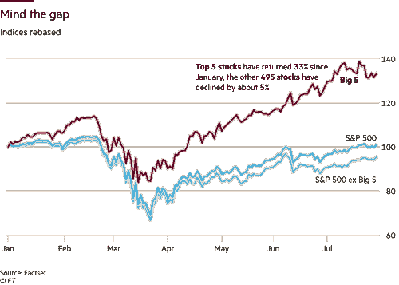
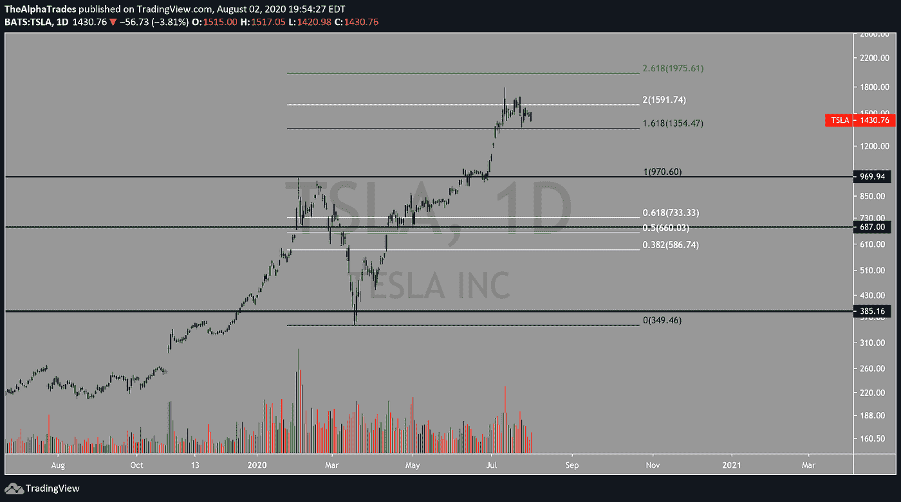

# 在家庭经济中寻找机会

> 原文：<https://medium.datadriveninvestor.com/finding-opportunities-in-the-stay-at-home-economy-2216eaa0a176?source=collection_archive---------14----------------------->

## 阿尔法交易剧本后 Q2 收益。

在德克萨斯州的休斯顿，当地著名的巴里披萨店和 T2 狂野西部酒吧在自豪地为当地人和游客服务了 40 年后，永远关闭了。这些仅仅是 T4 在 COVID 经济中成千上万伤亡者中的两个。彭博报道称，超过三分之一的美国餐馆预计将在今年永久关闭。没有运动可看，没有酒吧可爬，人们发现很难适应。我们的分析师费萨尔住在休斯顿，我们可以保证他对失去所有他最喜欢的城镇感到非常沮丧。

Photo by Ostap Senyuk on Unsplash

# 总结:

*   美国经济前景介于糟糕和令人困惑之间
*   全面的收益报告引起了对疫情顺风与零售繁荣的关注
*   赢家:大型科技股、成长型股、黄金股、创新股和具有疫情优势的公司

# 我们一生中最糟糕的经济

美联储[重申](https://www.bloomberg.com/news/articles/2020-07-29/fed-leaves-rates-near-zero-repeats-vow-to-use-all-of-its-tools)他们将使用一切必要的工具来支持经济复苏，主席杰罗姆·鲍威尔称这次衰退是“我们一生中”最严重的一次。利率将保持在接近零的水平，关于更多金融援助的言论以及政府加倍持有美国国债和抵押贷款支持证券的消息让投资者暂时放心。尽管投资者只能在 Q2 GDP 损失达到 32.9%的情况下睡一觉。

# 消费水平通胀已经出现。

虽然消费者价格指数(CPI)整体通胀率上升了 0.6%，但食品价格上涨了 4.5%。这给低收入美国家庭带来了更大的压力。

 [## 回购市场注入对经济有何影响——跟踪面包屑|数据驱动的投资者

### 我们发现人们倾向于忘记(包括我们自己)重要的因素、事件或定义…

www.datadriveninvestor.com](https://www.datadriveninvestor.com/2020/05/13/what-repo-market-injections-say-about-the-economy-follow-the-breadcrumbs/) 

# 大到不在乎

尽管有反垄断听证会和疫情经济衰退，但由于强劲的收益，大型科技股价格再次爆炸式上涨。

苹果、亚马逊、Alphabet、脸书和微软占据了标准普尔 500 的 20%以上。自从指数中排名前五的公司占据了五分之一的市值以来[已经有 42 年了](https://www.ft.com/content/89e07076-dfb7-49bc-a970-0d15e2dd2c2a)，这也是第一次他们都属于科技行业。

自 1995 年以来，在竞争对手成为威胁之前，大型科技公司已经花费了 2000 多亿美元收购其对手。

# 世界需要芯片。

**重要的半导体芯片制造商 Marvell Technology (MRVL)** 继续[将利润](https://simplywall.st/stocks/us/semiconductors/nasdaq-mrvl/marvell-technology-group/news/marvell-technology-group-ltd-s-nasdaqmrvl-stocks-on-an-uptrend-are-strong-financials-guiding-the-market/)再投资于其业务，这很可能是其收益增长的催化剂。半导体行业在疫情期间恢复良好，尤其是 MRVL 受益于数据中心[和 5G 基础设施的](https://www.fool.com/investing/2020/07/27/this-soaring-tech-stock-could-keep-running-higher.aspx)增长。随着远程工作模式改变了数据中心的需求，MRVL 将从不断增长的存储需求中受益匪浅。由于疫情，我们今年保持低预期，但 MRVL 很有可能在 2021 年保持稳定。

应该补充的是，虽然美中紧张局势导致一些人认为半导体行业将因缺乏合作而遭受损失，但就目前情况而言，美国仍将是该领域的主导者。

**AMD、** [**击败收益**](https://www.forbes.com/sites/greatspeculations/2020/07/29/earnings-blowout-sends-amd-surging-to-record-highs/#17ac11a47e54) **如此之难，以至于把股价送上了历史新高。** AMD 是在家办公转型的另一个受益者，对芯片的需求空前高涨。

# 能源行业前景黯淡

埃克森美孚和雪佛龙公布了他们连续第二个季度的亏损，这是历史上最大的跌幅。随着经济受到 COVID 的支配，人员和货物的流动大幅下降，从而抑制了对能源产品的需求。再加上糟糕的收益，能源行业陷入了困境。

埃克森美孚在 Q2 的损失:**11 亿美元**

雪佛龙在 Q2 的损失:**83 亿美元**

# 建筑行业看起来并不太热。

卡特彼勒(Caterpillar)是经济复苏和增长领域的一只金丝雀，它公布的收益如此糟糕，甚至连悲观主义者都感到惊讶。由于新冠肺炎和国外的麻烦，中国市场波动加剧。

中国正走在 GDP 正增长的道路上，并且是 COVID 爆发的中心，中国工业投资增加的早期迹象可能表明世界正在从疫情的破坏中慢慢恢复。卡特彼勒与中国的工业发展直接相关，因此中国的复苏对这个行业巨头来说是个好兆头。然而，中国在工业领域投资的增加是刺激计划的结果，而经济的消费方面看起来不太乐观，表明复苏不均衡。

当工业增长与消费水平经济同步上升时，能源行业将随之上升，但这一时刻可能仍要提前几个月。

# 电子商务正在蓬勃发展。

电子商务公司中的高增长公司 Shopify 本周公布了与 Zoom 相当的收益，令投资者大吃一惊。像 Shopify 这样的 COVID 优势名称继续打破人们的期望。

# 散户 ETF 适应新常态。

SPDR S&P 零售 ETF (XRT)曾经是实体零售的一个体面代表。如果你想深入了解这个行业，XRT 是你的首选。然而，在过去两个季度，该 ETF 对其资产进行了多元化。Overstock.com，一家完全基于网络的零售企业，以及 etsy.com、亚马逊、易贝、卡瓦纳和 Stamps.com 都是 XRT 最大的控股公司。当你试图解读今天的零售业时，你肯定会把它与电子商务的表现捆绑在一起。相比之下，基于电子商务的 ETF Amplify 在线零售 ETF (IBUY)年初至今[上涨了 57.47%。](https://www.etf.com/IBUY#overview)

# 特斯拉瞄准了标准普尔 500

特斯拉(TSLA)现在[有资格进入标准普尔 500 指数](https://www.bloombergquint.com/businessweek/stock-market-what-happens-if-tesla-enters-s-p-500)，目前，它将是有史以来被纳入该指数的最大公司之一。尽管年初至今已经上涨了 240%以上，空头利息停留在接近 9%的水平，但由于政府的刺激，兴奋、绝望和实际市场估值的根本脱钩的混合物。任何人都不知道 TSLA 价格对进入标准普尔 500 会有什么反应。

我们的分析师正在寻找 TSLA 达到 2000 美元的心理水平。跌破 1350 美元将增加迅速升至 1000 美元的几率。如此显著的下跌可能需要大范围的市场抛售。

Tesla (TSLA); Source: Alpha Trades

# 我们仍然是黄金。

有些人喜欢现金，有些人喜欢比特币，但持有一点黄金才有意义。黄金现货价格打破了 2000 美元的历史新高，专家们呼吁美元对其他货币的反弹，因为美国冠状病毒感染率稳定下来，新病例比上周下降了 2%。这是一个大杂烩，让许多人困惑于在哪里对冲他们的赌注。

# Pinterest 在 Q2 财报会议上上涨了 32%。

该公司拥有 4 亿用户，并且还在增加，已经受益于广告收入的稳定增长，预计将在 2021 年实现盈利。我们在 Alpha Trades 的分析师认为，Pinterest 可能会成为亚马逊等公司的收购目标。

# Snapchat [炒作起来](https://seekingalpha.com/article/4361143-snap-inc-bullish-intense-retail-interest-is-concerning)，Twitter 呢？

最近，投资者对 Snapchat 很友好。该公司对喜欢拥有大量年轻客户群的高增长社交平台的广告商仍有吸引力。该公司还处于向其不断增长的 2.38 亿日常用户提供增强现实的前沿。Q2 的收入增长强劲，但不足以使公司摆脱 2019 年的净亏损。既然川普总统[已经禁止了一个主要的外国竞争对手](https://www.forbes.com/sites/oliviergarret/2020/07/31/investors-heres-what-you-need-to-know-if-trump-bans-tiktok/#d7cbda06d995)，抖音，SNAP 的前景可能会迅速改变。

然而，Twitter 尚未释放其真正的潜力。该公司继续努力扩大用户群，并寻找广告收入以外的盈利方式。人们来 Snapchat 是为了相互交流。然而，Twitter 已经成为[主要的新闻来源。首席执行官杰克·多西暗示了订阅服务](https://www.fool.com/investing/2020/07/31/3-reasons-twitters-stock-rally-could-come-to-an-en.aspx)可能会是什么样子，尽管这些想法仍处于早期发展阶段。

# “南美洲的 Amazon.com”

**MercadoLibre (MELI)** 是拉丁美洲电子商务的重量级公司，最近引起了很多关注。被认为是贝宝和易贝的结合体，甚至被称为“[阿里巴巴的崇拜者](https://www.economist.com/business/2020/07/22/mercadolibre-is-a-wannabe-alibaba)”，该公司面临着来自其明显竞争对手亚马逊的激烈竞争。再加上拉丁美洲和疫情的社会经济不稳定严重影响了公司的收益，在考虑入股之前，MELI 目前的估值需要回归现实。

# COVID 时代的一部保险剧

我们对 EverQuote (EVER) 寄予厚望，这是一家提供在线保险市场的美国公司。随着对冲基金[增加他们的风险敞口](https://finance.yahoo.com/news/did-hedge-funds-call-everquote-145451083.html)，EVER 在年初至今的表现令人难以置信的好。机构的热情表明，这家公司很有可能成为 1 万亿美元保险行业的重要参与者。

# Aerovironment (AV)，一个有着半个世纪历史的航天和国防巨头

这家公司要去火星了([字面意思](https://finance.yahoo.com/news/aerovironment-marks-50-years-achieving-132600508.html))。在无人驾驶飞机系统(UAS)和充电站的最前沿，出色的财政前景，以及 2021 年的[强劲盈利预期，这是我们投资硬科技未来的首选。](https://dronelife.com/2020/07/17/aerovironment-financials-flying-high-in-the-drone-world/)

# 找到你的优势。

[订阅 Alpha Trades Discord 服务器](https://bit.ly/2KJ1oor)，寻找专业人士的一对一指导。加入阿尔法包两天，无风险。

# 观看表演

阿尔法交易提供了市场，密码，和整个星期的经济独家新闻。通过最近的剧集找到你的优势:

[**美股讨论| Pinterest 和 Twitter 被低估？**](https://youtu.be/l-Bu6I3QmNs)

永远不要浪费一次好的危机| 4 只科技股收益后增值 2000 亿美元！

[**新加密牛市？|比特币涨到 13.9 美元的速度可能比你想象的要快。**](https://youtu.be/cRZUOfDfljY)

# 想免费试用 Advantage 两天吗？

[订阅 Discord 服务器](https://bit.ly/2KJ1oor)学习技术分析以及如何投资获利。询问 2 天的高级会员试用！

# 放弃

Alpha Trades，LLC 提供的信息不用于制定任何财务决策，也不是购买、持有和/或销售特定产品、数字资产或 ICO 的请求或建议。

访问我们的完整服务条款:[https://bit.ly/3faVeeV](https://bit.ly/3faVeeV)

**进入专家视角—** [**订阅 DDI 英特尔**](https://datadriveninvestor.com/ddi-intel)