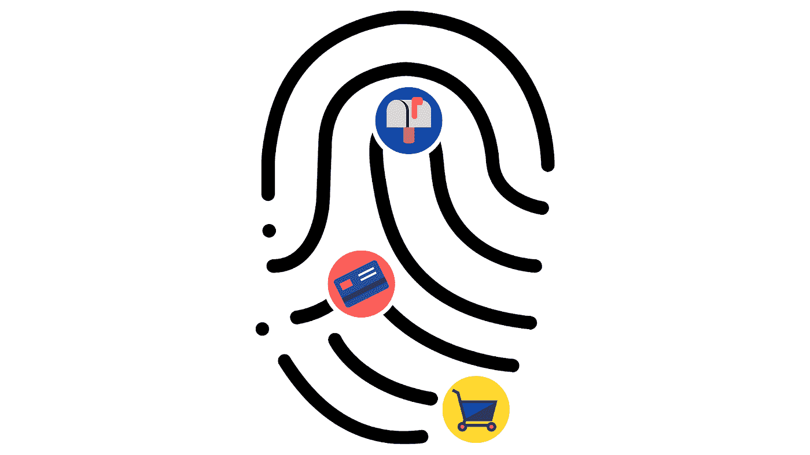
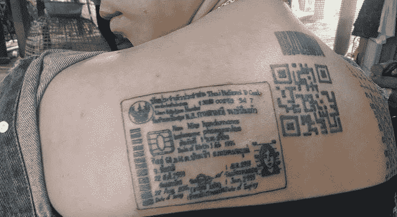
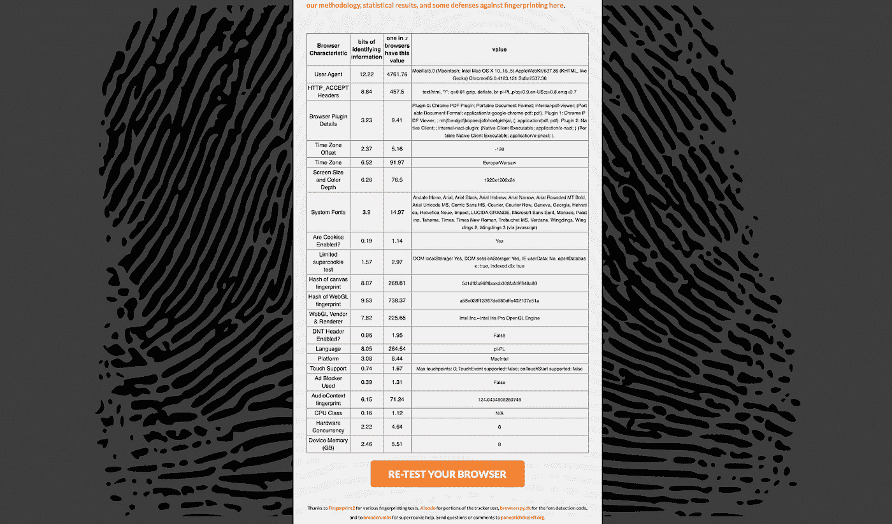
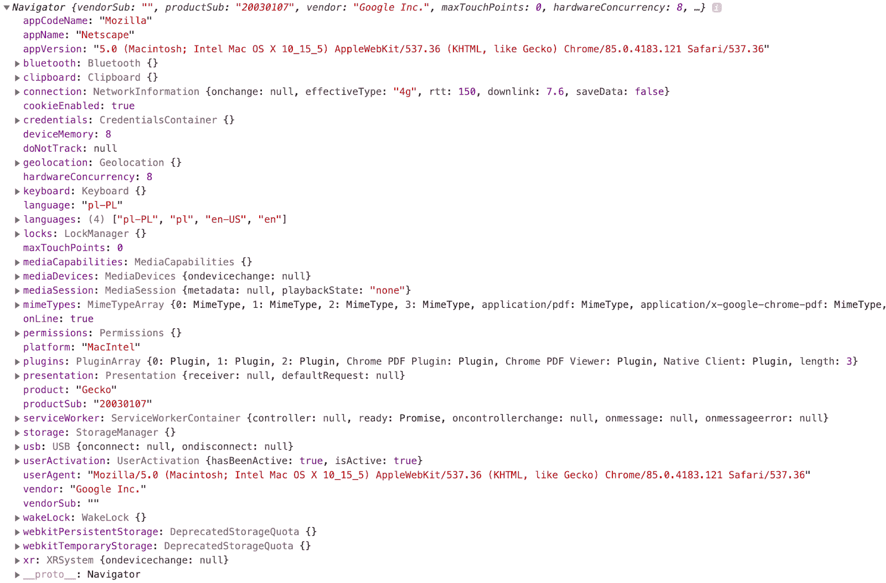
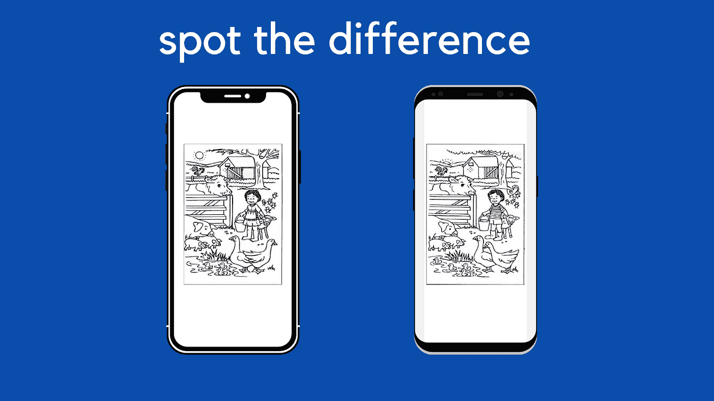
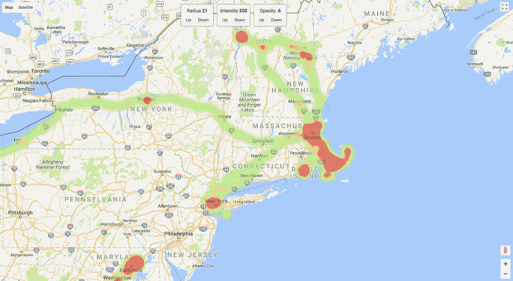
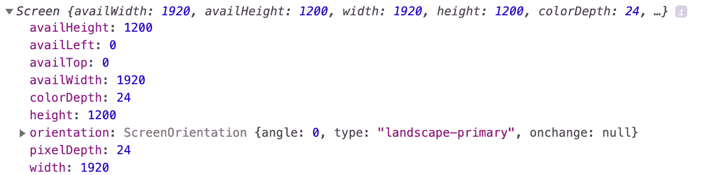

# 指纹识别

> 原文：<https://medium.datadriveninvestor.com/fingerprinting-aba640862019?source=collection_archive---------0----------------------->

## 当你用信用卡付款时，为什么收银员会问你的邮政编码

(Fig. by Author)

# 为什么不仅仅基于存储

基于存储的方法(在[前一部分](https://medium.com/the-innovation/alternatives-to-third-party-cookies-in-2020-857609f8f2bb)中描述)是最著名和最常用的在线识别和跟踪人的方法。但是，这些方法有时并不影响。用户可以很容易地关闭或清除浏览器存储。浏览器还会开发一些方法来限制跟踪的可能性。

设备或浏览器指纹识别可以解决这些问题。

> **2021 年 4 月 30 日更新:**虽然文章仍然包含最新的知识和概念，但随着时间的推移，它们的实现和实施已经发生了变化。我正在做一个更新，所以请把这篇文章收藏起来。

# 为什么收银员需要我的邮政编码

你知道为什么当你用信用卡付款时，收银员会问你邮政编码吗？

发生这种情况是因为零售商希望将特定消费者购买的购物篮归类。商店不会获取您信用卡号码的所有数字，而只会获取最后几个数字。由于这些数字不够独特，我们无法识别每个消费者。

但是商店可以通过简单地询问消费者来收集一些额外的特征。邮政编码很好，因为:

*   是一个短数字，
*   信用卡的数字组合足够独特，
*   客户一般不介意分享。

Just two characteristics are enough to identify consumer between her/his visits. (Fig. by Author)

信用卡和邮政编码的数字通常一起唯一地标识特定的客户，并允许篮子归属。

因此，零售商有一种方法来确定哪些购买是来自一个特定的客户。

[🔔想要更多这样的文章？在这里签名。](https://fischerbach.medium.com/membership)

# 什么是指纹识别？

网站可以采取类似的策略。

简而言之，指纹识别是使用可观察的特征来创建数字“指纹”，网站可以借此识别或重新识别访问用户、浏览器或设备。指纹是浏览器、设备或用户本身的唯一标识符，由网站可以从用户设备读取的一个或多个值组成。

指纹识别还可用于:

*   关联会话内和会话间的用户活动，
*   在跨域上下文中跟踪用户，
*   识别假名用户(当浏览器指纹与电子邮件或其他识别信息相关联时)，
*   欺诈检测。

跨域用户跟踪是可能的，因为指纹是相对唯一的，并且对所有来源都是相同的。因此，不同的网站可能能够合并单个用户的信息，即使 cookie 策略会阻止第三方 cookie。

这是用户可以在多个不同的网站(域)上被跟踪的方式，使用其他方法可能是不可能的。这种跟踪对用户是透明的，并且不管浏览器是否接受 cookies，它都能工作，因为没有数据存储在基于存储或基于会话的机制中。

用户甚至不需要认证。

Maybe digital fingerprints are not as permanent as this woman’s ID tattoo, but they can still be used to effectively identify users. (Pic. by [thephuketnews](https://www.thephuketnews.com/photos-of-thai-woman-unusual-id-tattoo-go-viral-on-social-media-62581.php))

# 被动指纹识别

每个请求都包含许多可以用来区分用户的特征。这些属性可以被动地被发现，而无需在用户设备上执行代码。

被动指纹识别可以使用:

*   IP 地址，
*   用户代理，
*   版本和操作系统，
*   首选语言，
*   [HTTP 接受报头](https://developer.mozilla.org/en-US/docs/Web/HTTP/Headers/Accept)。

当用户访问网站时，这些数据几乎总是由浏览器发送。

对于某些群体，用户代理和 IP 地址是唯一的，足以识别特定的用户(设备)。

# 主动指纹识别

主动指纹技术要求网站运行 JavaScript 客户端脚本来观察关于浏览器、设备、用户或其他上下文的附加属性。

这包括:

*   浏览器窗口大小，
*   安装的字体和插件，
*   启用的插件，
*   性能，
*   来自设备传感器的数据，
*   时区，
*   支持的[哑剧](https://en.wikipedia.org/wiki/MIME)类型，
*   启用存储机制，
*   呈现图形模式。

区分被动和主动方法的关键在于主动指纹识别可能会被用户检测到。

(Pic. from movie *Superbad)*

# 整体情况

获得指纹识别直觉的最简单方法是测试您的浏览器的独特性。

 [## 将数据隐私转化为你的优势，重建消费者的信任:下一个投资前沿

### 疫情期间，抖音的使用量激增，全球约有 8 亿用户使用该平台…

www.datadriveninvestor.com](https://www.datadriveninvestor.com/2020/09/18/turn-data-privacy-to-your-advantage-and-rebuild-consumers-trust-the-next-investment-frontier/) 

Panopticlick 是电子前沿基金会的一个研究项目。它会用流行的在线跟踪技术分析你的浏览器，还会检查你的系统是否配置独特，从而可以识别。

[**全景点击**](https://panopticlick.eff.org/)

(Screenshot by Author)

我鼓励你点击“显示完整的指纹结果”。它将向您显示一个包含流行指纹识别技术列表的表格。

现在让我们来看看如何操作其中的一些。

# 浏览器指纹

## 用户代理

用户代理请求头是一个字符串，它让服务器识别应用程序、操作系统、供应商和/或请求浏览器的版本。

它可以在服务器端和客户端获得。

在服务器端附加到每个 HTTP 请求。在客户端可用变量 [navigator.userAgent](https://developer.mozilla.org/en-US/docs/Web/API/NavigatorID/userAgent) 。

User-agent fingerprinting

[导航器](https://developer.mozilla.org/en-US/docs/Web/API/Navigator)对象对于指纹识别很有意思，因为它存储了更多关于浏览器和设备的信息。

例如:

*   浏览器的详细版本，
*   支持的图像和媒体文件格式，
*   首选和公认的语言，
*   CPU 平台，
*   启用的存储。

(Screenshot by Author)

值得一提的是，自我报告的用户代理对浏览器供应商的检测可能是不可靠的，因为各种浏览器和 web 扩展可以混淆该字符串，甚至冒充另一个浏览器。

## 帆布指纹

HTML5 引入了一个屏幕区域——[画布](https://developer.mozilla.org/en-US/docs/Web/API/Canvas_API)，它可以用来用 JavaScript 绘制文本或图像。

一个页面可以包含一个 canvas 元素，其中 JavaScript 命令将简单的形状、颜色、字体和图像排列成一个像素图形。通过快速改变这些图形来创建动画；浏览器游戏是最重要的应用领域之一。浏览器可以将画布生成的像素图形转换成 JPEG 或 PNG 等格式。

您可能会认为，对于相同的输入，所有浏览器都会产生相同的结果。但令人惊讶的是，用 canvas 创建的图形往往显示出微小的差异。由于字体栅格化、抗锯齿、平滑、API 实现和物理显示，创建的图像取决于操作系统、安装的字体、显卡和浏览器本身。

(Fig. by Author)

例如，可以使用 toDataURL 函数对结果进行哈希运算。如果浏览器在同一设备上重复呈现同一图像，则同一哈希值应该保持不变。

Canvas fingerprinting example

类似的技术也可以用于 WebGL。

# 网络和位置指纹识别

## 国际电脑互联网地址

正如我之前提到的，IP 地址是指纹识别中的一个重要特征。这可能是从传入的 HTTP 请求中最容易获得的特征之一。

但是现在用户的 IP 变化相对频繁，尤其是在移动网络中。然而，IP 在足够长的时间内保持静态，以将其用作指纹识别的一部分。

**检查演示(通过 cloud flare):**[https://www.cloudflare.com/cdn-cgi/trace](https://www.cloudflare.com/cdn-cgi/trace)

## 全球（卫星）定位系统

移动设备可以通过使用 GPS、WiFi 或蜂窝塔来确定自己的位置。许多网站利用这一点来显示与用户当前位置相关的个性化信息。网站可以通过[地理定位 API](https://developer.mozilla.org/en-US/docs/Web/API/Geolocation_API) 访问这些数据。

这种知识的一个有趣应用是基于地理位置历史的用户识别。[有研究显示](http://citeseerx.ist.psu.edu/viewdoc/download?doi=10.1.1.651.44&rep=rep1&type=pdf)超过 50%的用户可以从两个随机选择的点上被唯一识别。

(Fig. from the [article](https://codeburst.io/how-i-created-a-heatmap-of-my-location-history-with-javascript-google-maps-972a2d1be240) by [Brandon Morelli](https://medium.com/u/e9031892baf5?source=post_page-----aba640862019--------------------------------), )

当然，地理定位不足以区分用户，但结合其他技术，如时间关联，可能会给出一个好结果。

Geolocation fingerprinting

# 操作系统指纹识别

## 日期和时区

JavaScript 还有助于识别系统本地时区和本地日期时间，误差不超过 1 毫秒。

Time zone and datetime fingerprinting

## 制图法

JavaScript 可以使用 window.screen 全局变量来检测颜色深度、屏幕分辨率和其他显示参数。

Screenshot by Author

## 字体指纹

JavaScript 可以检测到已安装字体的列表。其中一个技巧是设置两个隐藏文本。

一个文本用测试字体书写(几乎肯定存在于大多数设备中，例如 Times New Roman)，另一个用我们想要定位的字体书写。

如果两个文本的宽度不同，那么我们可以假设您正在寻找的字体已经安装。

Font check demonstration

# 指纹库

## 指纹

上面描述的大多数方法都是在免费的 JavaScript 库 [fingerprintJS](http://valve.github.io/fingerprintjs/) 中实现的。

fingerprintJS 可以使用以下方式执行浏览器指纹识别:

*   用户代理，
*   屏幕分辨率，
*   颜色深度，
*   安装了支持 mime 类型的插件，
*   时区偏移量，
*   本地存储，
*   会话存储。

## ClientJS

ClientJS 是一个 JavaScript 库，它使数字指纹识别变得简单，同时也公开了生成指纹时使用的所有浏览器数据点。

ClientJS 可以使用以下方式执行浏览器指纹识别:

*   用户代理，
*   丝网印刷，
*   颜色深度，
*   当前分辨率，
*   可用分辨率，
*   设备 XDPI，
*   设备 YDPI，
*   插件列表，
*   字体列表，
*   本地存储，
*   会话存储，
*   时区，
*   语言，
*   系统语言，
*   饼干，
*   帆布印花。

# 外卖和未来方向

在这一部分中，您已经熟悉了一些指纹识别方法。

虽然在大多数情况下，用户代理、IP 地址和画布指纹可能足以识别，但目录仍然开放。

未来的解决方案将会针对可能的浏览器限制而开发，应该考虑到如果用户更改指纹属性(如更新插件或更改屏幕分辨率)会发生什么。

[研究](https://firstpartysimulator.net/static/browser-uniqueness.pdf)表明，当前指纹可以通过启发式算法与先前的指纹匹配，准确率约为 99 %

归根结底，指纹只是众多追踪个人用户技术中的一种。

为了开发可靠的跟踪解决方案，您应该将指纹识别与经典的 cookies、localStorage、Web Storage、WebSQL、FileWriter API 或 HTTP-ETag 结合起来，并不断改进和发现新方法。

# 参考

 [## 2020 年第三方 cookies 的替代品

### 不使用第三方 cookies 的跨域跟踪示例

medium.com](https://medium.com/the-innovation/alternatives-to-third-party-cookies-in-2020-857609f8f2bb) 

W3C。[减轻 Web 规范中的浏览器指纹。](https://w3c.github.io/fingerprinting-guidance/)