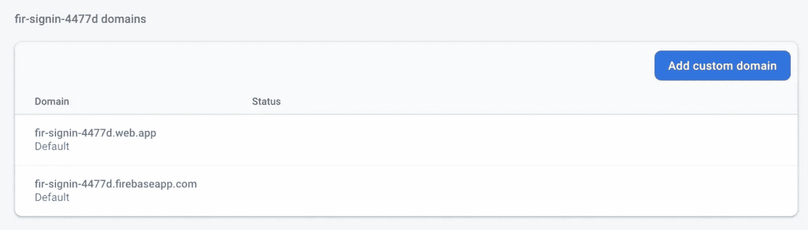
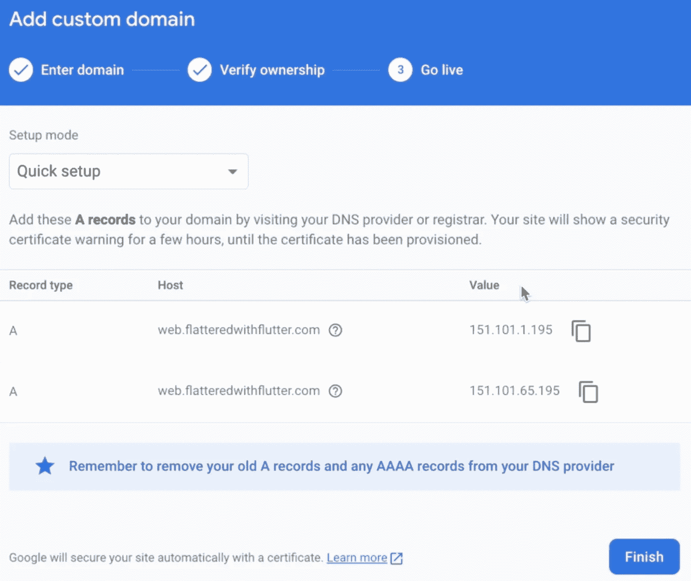
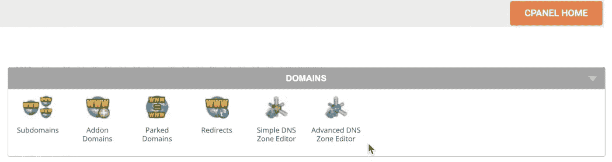
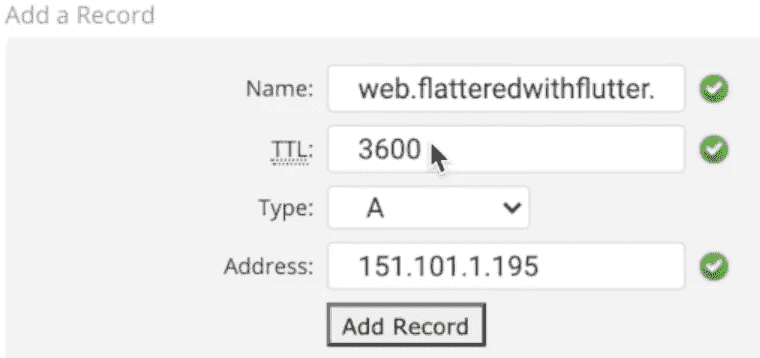
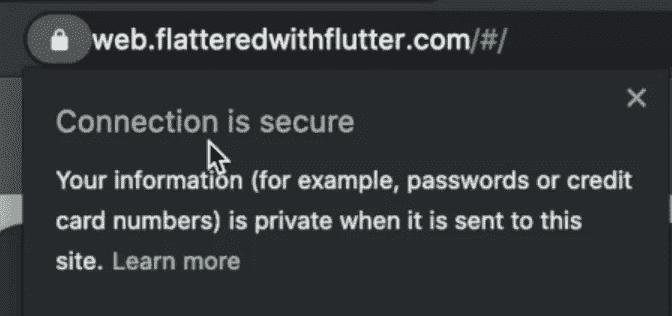

# Firebase 托管和网站背景

> 原文：<https://medium.datadriveninvestor.com/firebase-hosting-and-siteground-254a2860244d?source=collection_archive---------7----------------------->

*场地和消防基地托管*

> 如何使用 Firebase Hosting 和 Siteground 托管 Flutter 网站？嗯…

All in one Flutter 资源:[https://flattedledwithflutter . com/firebase-hosting-and-site ground/](https://flatteredwithflutter.com/firebase-hosting-and-siteground/)

***网址:***[***https://web.flatteredwithflutter.com/#/***](https://web.flatteredwithflutter.com/#/)

## 先决条件:

我们有一个网站编程使用颤振网页([***https://fir-signin-4477d.firebaseapp.com/#/***](https://fir-signin-4477d.firebaseapp.com/#/))。现在我们想给我们的网站一个自定义域名。

这篇文章不会创建任何网站(而是使用现有的网站)。

> **等级:任何人！**


Firebase Hosting and Siteground

# 开始…

我们将简要介绍

1.  Firebase 托管
2.  添加带有站点背景的自定义域

## Firebase 托管

一旦你准备好建立你的网站，你可以通过

```
firebase deploy
```

这个命令将一个**版本**部署到 Firebase 项目的默认托管站点:

*   `PROJECT_ID.web.app`
*   `PROJECT_ID.firebaseapp.com`

默认情况下，Firebase Hosting 通过 SSL 提供您的内容。

转到 **Firebase 控制台**并导航到**主机选项**。您将看到您的网站部署及其详细信息。



Firebase Hosting and Siteground

让我们继续向这个已部署的网站添加一个自定义域。

## 自定义域

点击**添加自定义域**按钮


Firebase Hosting and Siteground

在此，输入您希望最终用户在其 web 浏览器上看到的域。

在我们的例子中，我们进入了(**web.flatteredwithflutter.com**)

> **注意**:你应该输入一个你自己的域名，在我们这里是**flatteredwithflutter.com**

接下来，点击**继续**



Firebase Hosting and Siteground

Firebase 托管给了我们 **A 记录**，需要添加到我们的 DNS 提供商，在我们的例子中，是它的**网站。**

> A **记录**是 **DNS 记录**的最基本类型，用于将一个域或子域指向一个 IP 地址

## 具有网站背景的自定义域

登录您的 Siteground 帐户并导航至 **cPanel** 。

转到 cPanel 主目录中的**域**部分。



Firebase Hosting and Siteground

在域部分，点击**高级 DNS 区域编辑器**

接下来，你需要添加两个 **A 记录**，就像 Firebase 托管中提到的那样。

1.  名称:您在自定义域中输入的内容。
2.  TTL(生存时间):输入值 3600

> TTL 以秒为单位设置，最低**值**可能是 600 秒(10 分钟)。最大可能的**值**是 86400 秒(24 小时)。

3.地址:在 Firebase 自定义域步骤中指定。



Firebase Hosting and Siteground

最后，点击**添加记录**

> 对下一个 IP 地址重复相同的步骤。(因为客户域为我们提供了两个 IP)

最后，点击**完成**，进入 **Firebase 自定义域设置**

您现在将看到类似这样的内容(在 Firebase 主机控制台中)，


Firebase Hosting

如果您现在想要导航到该站点，您将会看到不安全连接警告。


Firebase Hosting and Siteground

传播域名更改需要一些时间，最长可达 24 小时。

在我们的例子中，花费的时间要少得多，(大约 2 个小时)，我们看到类似这样的东西(在 **Firebase 主机控制台**中)。


Firebase Hosting and Siteground

我们的新域已经被分配了一个 SSL 证书。



Firebase Hosting and Siteground

唷…..

与颤振腹板相关的文章:

[](https://medium.com/flutterpub/flutter-web-and-flutter-hooks-ae80c691c83e) [## 颤动的网和颤动的钩

### 在颤振腹板中使用颤振钩

medium.com](https://medium.com/flutterpub/flutter-web-and-flutter-hooks-ae80c691c83e) [](https://medium.com/flutterpub/flutter-web-and-streams-e3b2d14432b6) [## 颤动的网和溪流

### 如何在 flutter web 中使用流？立即了解！！

medium.com](https://medium.com/flutterpub/flutter-web-and-streams-e3b2d14432b6) 

*托管网址:*[***https://web.flatteredwithflutter.com/#/***](https://web.flatteredwithflutter.com/#/)

