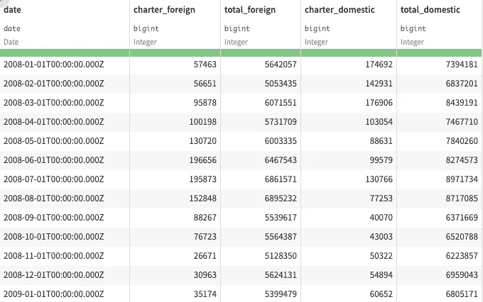
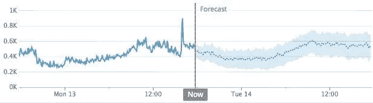
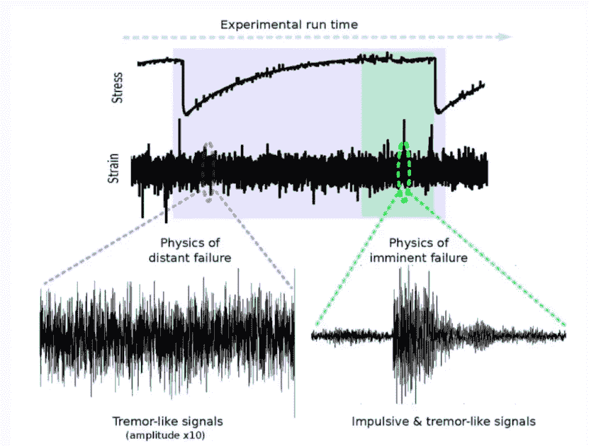

# 时间序列预测分析的首次约会

> 原文：<https://medium.datadriveninvestor.com/first-date-with-time-series-predictive-analysis-9266f7909371?source=collection_archive---------26----------------------->

这就像占星家用历史数据预测未来一样简单。

Photo by [Isaac Smith](https://unsplash.com/@isaacmsmith?utm_source=medium&utm_medium=referral) on [Unsplash](https://unsplash.com?utm_source=medium&utm_medium=referral)

伙计们，我是塔潘。在这篇博客中，我们将更多地讨论时间序列数据。

在时间序列中有不同的用例，人们并没有意识到这一点。因此，在这篇文章中，我们将只是看看到底什么是时间序列，它的类型是什么，之后，这将研究一个特定的项目及其代码。

## 什么是时间序列数据？

时间序列数据可以简单地解释为带时间戳的数据。就像这样简单:如果你的数据至少在时间戳上有一列，如下图所示，那么它就是时序数据。

当我们处理带有时间戳和时间变化的数据时，我们应该将它视为时间序列数据。

## 最有可能的用例是什么？

有了时间序列，我们将始终以连续的方式面对数据。在分类中，你必须找到这个或那个。同样，在时间序列中，我们可以分出两个主要用例。

以下两个用例看起来和听起来都很相似，但有许多不同之处。

*   预测分析
*   预测

今天，在这篇文章中，我们将讨论预测分析，因为预测的例子在市场上数不胜数。所以让我们开始吧。

# 预测

预测可以很容易地解释为预测连续的结果。

比如，2 年后的房价会是多少？或者像会接到多少订单？？

# 预测分析

预测分析更多的是在粒度级别上，我们可以询问特定事件在不久的将来是否会发生。

例如，机器何时会出现故障？或者什么样的顾客会购买特定的产品。

[https://www.gislounge.com/using-machine-learning-and-surface-deformation-data-to-predict-earthquakes/](https://www.gislounge.com/using-machine-learning-and-surface-deformation-data-to-predict-earthquakes/)

## 为什么理解预测分析现在更重要？

当我们在网上进行所有的行为时，从简单的支付账单到大笔的购买。这意味着我们确实有人们正在做的各种数据，所以作为一名机器学习工程师，毫无疑问我们将很快面临这些项目，因为每个企业都想表明*他们关心他们的客户*。

## 哪些项目与预测分析相关？

这里有一些可以用这个做的项目。

1.  预测性机器维护。
2.  客户服务报告
3.  质量保证
4.  商业智能

## 当你面对这些用例时，你应该注意什么？

最常见的事情，如找到南，清理数据，我不打算在这里讨论。正如我们已经知道的。

在这些数据中，非常重要的特性是时间戳，您可以在上面的每个用例中找到它。所以我们可以检查

1.  数据行之间是否有间隙？
2.  在某个特定的月份里有重复的趋势吗？
3.  如何克服这些数据的不均衡性？
4.  数值和分类值在时间戳中的表现。

## 现在怎么办？

在我的下一篇博客中，我将用代码解释项目的每个步骤。我将继续进行预测性机器维护。

感谢阅读。

如果你喜欢这篇文章，请一定要鼓掌。请关注我的 Github 和我的 medium 个人资料上的更多项目和文章。

 [## tapanKumarPatro -概述

### Arctic Code Vault 贡献者来自 greensdata/成为数据科学家的 10 个步骤📢准备学习或复习…

github.com](https://github.com/tapanKumarPatro)  [## Tapan Kumar Patro -中等

### 大家好，这是我为 Analytics Vidya 主办的黑客马拉松提供的解决方案。该解决方案在…的得分为 0.83

medium.com](https://medium.com/@tapankumarpatro05) 

不要忘记查看 Android 应用程序开发深度学习项目的端到端部署。

 [## 基于深度学习的端到端 app。

### 聪明烹饪

medium.com](https://medium.com/analytics-vidhya/end-to-end-deep-learning-based-app-af67d4008550) 

谢了。如有任何疑问，请留言。