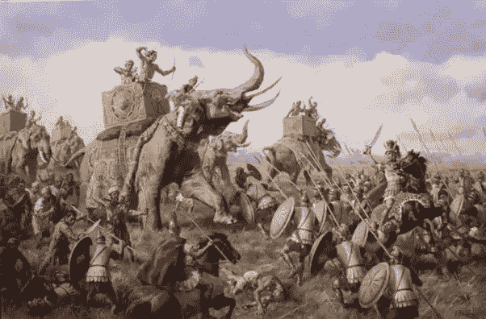

# 印度第一捍卫者(附音频)

> 原文：<https://medium.datadriveninvestor.com/first-defender-of-india-4a082ec7ecc0?source=collection_archive---------10----------------------->

国王 Porus 或 Purushotama，他的王国来自旁遮普地区，他在印度次大陆的杰赫勒姆河和杰纳布河之间扩展了他的王国。

***【赫达斯佩斯之战】***

*   它发生在公元前 326 年亚历山大大帝和国王波罗斯之间。亚历山大带着他的波斯和印度盟友全力进攻保拉瓦王国，带着他的军队进攻波斯。
*   由于大雨，河水涨满且湍急。河里只有一个地方足够浅，可以过河。波罗斯在这里扎营。
*   虽然马其顿军队赢得了许多战役，但他们从未在战斗中面对过战象。波罗斯的军队中有许多这样的大象。
*   与此同时，亚历山大军队的剩余部分渡过了河。被包围后，7 英尺高的 Porus 坐在他巨大的大象上，鼓励他的士兵去战斗。
*   战斗越来越激烈，马其顿人占了上风。波罗斯被带到亚历山大。希腊征服者惊讶地看着波罗斯。他以前从未见过像波罗斯这样的战士。
*   从那以后，亚历山大很尊重波罗斯。 ***真正的英雄就是这样。*** “你希望得到怎样的待遇？”亚历山大问波罗斯。“像一个国王，”Porus 说。“什么意思？”亚历山大问道。“当我说‘像个国王’的时候，一切都说了，”波罗斯回答。
*   虽然取得了胜利，但这也是马其顿人打得最昂贵的一仗。国王波罗斯和他的部下进行的抵抗赢得了亚历山大的尊敬，他要求波罗斯成为他的总督之一。大量的勇气和胆量也可以赢得敌人的尊重，而不必屈服于自己的尊重。

著名的历史学家认为，当亚历山大努力击败一个小国王 Porus 时，他怎么可能与强大的 Maghada 统治者 Dhana Nanda 作战，他比 Porus 强大 100 倍。所以亚历山大放弃了征服印度的希望。

虽然历史上记载波罗斯被打败了，但他表现出了巨大的勇气，这就是为什么他夺回了他的王国。但是亚历山大从希腊到印度打了那么多仗。他从来没有找到一个真正的战士？他什么时候开始尊重人们的勇气了？我认为波罗斯国王打败了他。

希望你喜欢。

希望得到积极的回应。

请关注我的@Medium 简介 [Yash Kamal Chaturvedi](https://yashkamalchaturvedi.medium.com/)