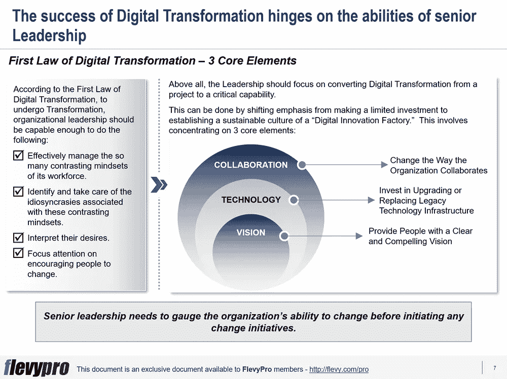

# 数字化转型第一定律:管理数字化转型的 3 个关键要素

> 原文：<https://medium.datadriveninvestor.com/first-law-of-digital-transformation-3-key-elements-to-manage-digital-transformation-c08b6773e8c6?source=collection_archive---------16----------------------->

英特尔联合创始人戈登·摩尔观察到，密集集成电路中的晶体管数量大约每两年翻一番。他预计这种增长速度至少还会持续十年。

他的观察被称为“摩尔定律”，正确预测了几十年来的创新步伐，并指导了半导体行业的战略规划和研发。摩尔定律是基于对历史趋势的观察和预测。

2015 年，戈登·摩尔预见到发展速度将达到饱和。事实上，自 2010 年以来，整个行业的半导体进步都在下降，远低于摩尔定律预测的速度。倍增时间和半导体性能已经改变，但它并没有影响法律的本质。

尽管许多人预测摩尔定律会消亡，但随着创新技术的出现，计算能力的指数级增长仍在持续。摩尔定律只是有效的[数字转型](https://flevy.com/digital-transformation)等式的一部分——还有包括领导角色在内的其他促成因素。

# 数字转型第一定律

麻省理工学院斯隆管理学院的高级讲师乔治·维斯特曼提出了一条新定律，该定律指出，“**技术变化很快，但组织变化要慢得多**”被称为“[数字化转型第一定律](https://flevy.com/browse/flevypro/first-law-of-digital-transformation-4054)或“乔治定律”的定律是一个非常直观的观察结果，但经常被高层领导忽视。这就是为什么数字化转型被认为是一个领导问题，而不是技术问题。

仅仅宣布一个组织范围的转型计划并不能改变企业。根据乔治定律，成功的数字化转型取决于高层领导有效管理员工众多对立心态的能力，识别并照顾与这些心态相关的特质，解释他们的愿望，并专注于鼓励人们改变。

最重要的是，领导层应专注于将数字化转型从项目转化为关键能力。这可以通过将重点从有限投资转移到建立可持续的数字创新工厂文化来实现，该文化集中于 3 个核心要素:

1.  **为人们提供清晰而引人注目的愿景**
2.  **投资升级或更换传统技术基础设施**
3.  **改变组织协作的方式**

现在让我们来讨论数字化转型第一定律的前两个要素。

# 为人们提供清晰且引人注目的愿景

如果没有一个清晰和令人信服的变革愿景，组织就无法聚集人们来支持变革议程。人们既可以是变革的抵制者、旁观者，也可以是变革的推动者。然而，大多数人通常倾向于维持现状，忽视变化，或者选择公开或秘密地参与反对变化的斗争。

对于接受变革的员工来说，领导层需要让他们明白在过渡期间和未来的组织状态中他们能得到什么。这就需要领导者制定并分享一个令人信服的愿景，以帮助人们理解变革的理由，让人们看到他们可以通过变革实现的积极成果，以及他们可以做些什么来实现变革。一个引人注目的愿景甚至会促使人们推荐将愿景变为现实的方法。

# 投资升级或更换传统技术基础设施

传统平台中的问题和缺点是数字化转型过程中需要关注的一个重要方面。遗留的技术基础设施、过时的系统、无组织的流程和杂乱的数据是组织萎靡不振的主要原因。这些问题阻碍了统一的客户视图的可用性、数据分析的实施，并在执行数字化转型的过程中增加了大量成本。

成功的数字创新需要组织投资于简化遗留系统，并建立新的技术平台，以支持数字和链接遗留系统。修复遗留平台会产生更精简、更快速的业务流程，并有助于保持[创新](https://flevy.com/browse/stream/innovation)的稳定势头。

有兴趣了解更多关于数字化转型第一定律的信息吗？你可以在 [Flevy 文档市场](https://flevy.com/browse)上这里[下载一个关于**数字化转型第一定律**的可编辑幻灯片。](https://flevy.com/browse/flevypro/first-law-of-digital-transformation-4054)

## 你在这个框架中找到价值了吗？

您可以从 [FlevyPro 库](https://flevy.com/pro/library)下载关于这个和数百个类似业务框架的深入介绍。 [FlevyPro](https://flevy.com/pro) 受到 1000 名管理顾问和企业高管的信任和使用。有些人不得不说:

> “我的 FlevyPro 订阅为我提供了当今市场上最受欢迎的框架和平台。它们不仅增加了我现有的咨询和辅导产品和服务，还让我跟上了最新的趋势，为我的实践激发了新产品和服务，并以其他解决方案的一小部分时间和金钱教育了我。我强烈推荐 FlevyPro 给任何认真对待成功的顾问。”

–战略商业建筑师事务所创始人比尔·布兰森

> “作为一家利基战略咨询公司，Flevy 和 FlevyPro 框架和文件是一个持续的参考，有助于我们为客户构建我们的调查结果和建议，并提高他们的清晰度、力度和视觉效果。对我们来说，这是增加我们影响力和价值的宝贵资源。”

–Cynertia Consulting 的咨询区域经理 David Coloma

> “作为一个小企业主，FlevyPro 提供的资源材料已被证明是非常宝贵的。根据我们的项目事件和客户要求按需搜索材料的能力对我来说很棒，并证明对我的客户非常有益。重要的是，能够针对特定目的轻松编辑和定制材料有助于我们进行演示、知识共享和工具包开发，这是整个计划宣传材料的一部分。虽然 FlevyPro 包含任何咨询、项目或交付公司都必须拥有的资源材料，但它是小公司或独立顾问工具箱中必不可少的一部分。”

–变革战略(英国)董事总经理迈克尔·达夫

> “作为一名独立的成长顾问，FlevyPro 对我来说是一个很好的资源，可以访问大量的演示知识库来支持我与客户的合作。就投资回报而言，我从下载的第一个演示文稿中获得的价值是我订阅费用的好几倍！这些资料的质量让我能够打出超出自己体重的水平，这就像是用很小一部分开销就能获得四大咨询公司的资源一样。”

–Roderick Cameron，SGFE 有限公司的创始合伙人

> “我每个月都会浏览几次 FlevyPro，寻找与我面临的工作挑战相关的演示文稿(我是一名顾问)。当主题需要时，我会进一步探索，并从 Flevy 市场购买。在所有场合，我都阅读它们，分析它们。我采纳与我的工作最相关和最适用的想法；当然，所有这些都转化为我和我的客户的利益。"

量子 SFE 公司首席执行官奥马尔·埃尔南·蒙特斯·帕拉

在 [**科技**](https://app.ddichat.com/category/science-and-technology) **:** 安排一次 DDIChat 会话

 [## 专家-科学和技术- DDIChat

### DDIChat 允许个人和企业直接与主题专家交流。它使咨询变得快速…

app.ddichat.com](https://app.ddichat.com/category/science-and-technology) 

在此申请成为 DDIChat 专家[。
与 DDI 合作:](https://app.ddichat.com/expertsignup)[https://datadriveninvestor.com/collaborate](https://datadriveninvestor.com/collaborate)在此订阅 DDIntel [。](https://ddintel.datadriveninvestor.com/)