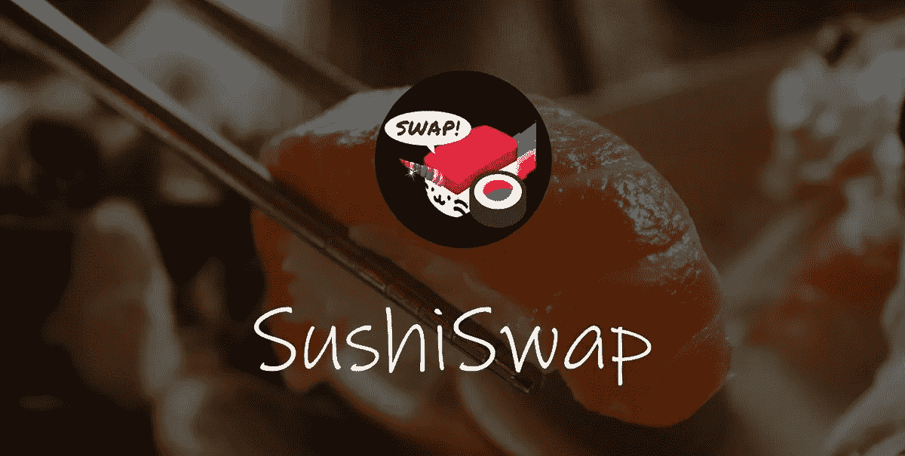
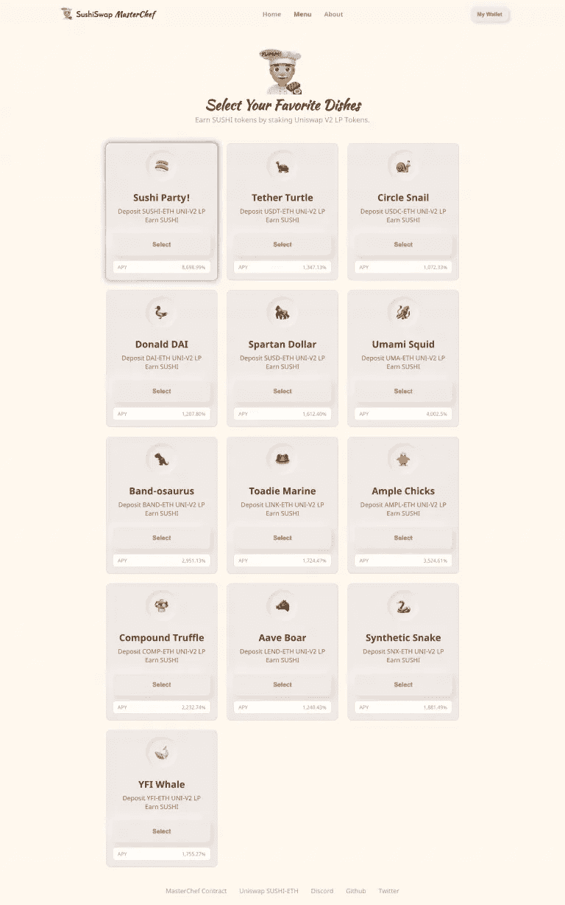
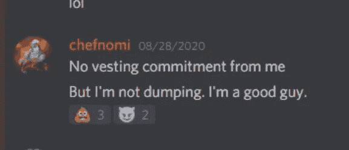
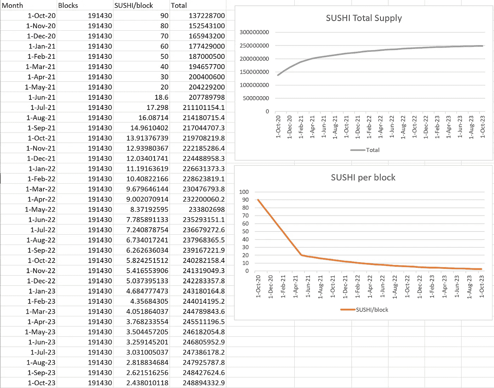
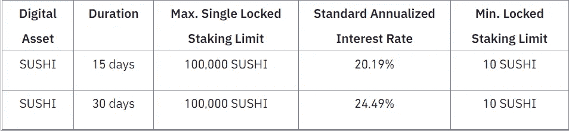
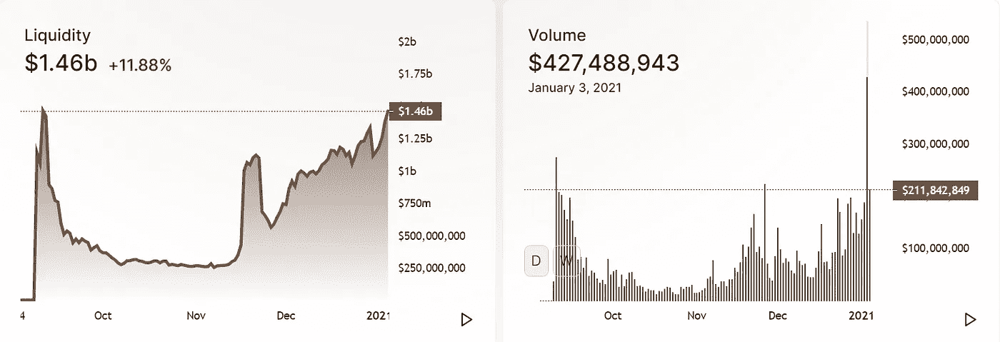

# 首先看看 SushiSwap

> 原文：<https://medium.datadriveninvestor.com/first-look-into-sushiswap-476e90c5859?source=collection_archive---------3----------------------->

2020 年夏天对于分散金融(DeFi)社区来说一点也不平凡。它见证了 DeFi 代币价格的大幅上涨，这可能与这一爆炸性趋势的主要促成因素——高产农业热潮有关。简而言之，DeFi 中的产量农业允许人们通过参与协议引入的流动性挖掘计划来获得加密货币奖励。在大多数情况下，它涉及向分散交易所(dex)的流动性池提供资金，收到的回报通常是治理令牌的形式。

许多人会记得，复合金融是第一个在 6 月份掀起这股热潮的，当时他们推出了自己的治理令牌 COMP，并将其分发给在其平台上借贷资产的用户。代币的价格从 78 美元飙升到 336 美元，由于使用了不同的策略来赚取尽可能多的红利，一周内锁定的资金总价值从 1 亿美元增加到近 6 亿美元。然而，DeFi 上的第一种产量农业形式可以追溯到 2019 年 7 月，当时 Synthetix 使用 SNX 奖励来激励 Uniswap 上 sETH/ETH 池的流动性。

由于产量农业项目可以给协议带来明显的成功和利益，潜在的利润也吸引了试图利用这一热潮的不良行为者的涌入。由于加密货币的开源特性，出现了许多流行的 DeFi 平台。这些分叉的治理令牌显然没有价值，价格只由被高 apy 吸引的后来的进入者支持，类似于庞氏骗局。这很快变成了一场猫捉老鼠的游戏，早期参与者将种植这些代币，并以高价将它们倾销给后来的参与者。早期参与者带着他们的利润潜逃，跳到下一个岔口，而后来的参与者不得不忍受损失，看着不可持续的通胀回报冲击价格。这不可避免地导致了 DeFi 夏季的结束。

SushiSwap 看起来像是那些依靠最近这股热潮的人之一，但它在福克斯的人群中脱颖而出，它的旅程从一开始就是一个值得讲述的故事。

# **来历**

如果你正在涉足 DeFi，很有可能你会遇到/使用过 [Uniswap](https://app.uniswap.org/#/swap) 。Uniswap 是一个建立在以太坊基础上的分散式交易所，使用[自动做市商(AMM)模式](https://academy.binance.com/en/articles/what-is-uniswap-and-how-does-it-work)通过流动性池而不是通常的订单簿交易来交换代币。流动性提供者(LP)向其首选池中存入等值的 2 个代币，并获得代表其在池中份额的流动性代币。这个资金池从每笔交易中抽取 0.3%的佣金，然后在有限合伙人之间分配。

它已成为 DeFi 的先驱之一，并展示了其在日交易量方面与中央集权同行竞争的潜力。SushiSwap 是 Uniswap 的一个分支，除了引入了他们自己的治理令牌 Sushi 之外，它的工作方式完全相同。

> 在sushi swap 发布时，Uniswap 没有本地令牌。

# 进入寿司吧

The first SushiSwap Menu in its early days

SushiSwap 由他们的假名创始人 [Chef Nomi](https://twitter.com/NomiChef) 于 2020 年 8 月 28 日推出。[发布](https://medium.com/sushiswap-org/the-sushiswap-project-8716c429cee1)引起了 DeFi 社区中每个人的注意，因为它大力宣传自己是 Uniswap 的面向社区的演进版本，并具有可以增强协议设计的功能，为 LP 和 SushiSwap 用户带来更多好处。该令牌赋予持有者治理权，对改进协议的提案进行投票。从某种意义上说，SushiSwap“属于”这个社区。

为了提高流动性并吸引流动性提供者加入 SushiSwap，除了有限合伙人参与的资金池所产生的 0.25%的掉期费用之外，还奖励了 Sushi token。为了参与这一流动性挖掘计划，有限合伙人必须将他们的 Uniswap 流动性代币投入到 SushiSwap 合同中，并准备在两周内将其流动性从 Uniswap 转移到 SushiSwap。该奖励为 13 个流动性池设立，并巧妙地针对 Uniswap 最大的流动性池(如 USDC-ETH/USDT-ETH/戴-ETH)和受欢迎的 DeFi 令牌的流动性池(如 SNX-ETH/COMP-ETH/YFI-ETH)。这让 DeFi 社区团结起来，并以其令人疯狂的诱人产量让他们陷入了农业狂热。结果，该计划中列出的每一种 DeFi 代币都在价格行为中获得了巨大收益，因为每个人都想从寿司中分得一杯羹。

愿意赌寿司的代币持有者有权获得整个协议产生的另外 0.05%的交换费。这些费用用于每天购买寿司，将根据您的赌注份额按比例分配。它获得了巨大的欢迎，这是一个惊人的壮举——自推出以来不到 4 天，锁定在 SushiSwap 合同中的资金总价值就超过了 10 亿英镑。根据 CoinGecko 的数据，这种代币从最初的 2.59 美元涨到了 8.84 美元，翻了三倍多。寿司在主要集中交易市场的迅速上市，如[【币安】](https://www.binance.com/en/support/articles/ac34042b96d04b5e8464613f27567353)和[【FTX】](https://www.newsbtc.com/news/ethereum/ethereum-defis-sushi-rips-100-higher-after-ftx-listing/)也带来了带来反弹所需的曝光率。

> 人们无法抗拒这些美味寿司的诱惑。这是一次十亿美元的流动性抢劫吗？

# 腐烂的寿司？

SushiSwap 的推出似乎完全符合社区希望看到的变化——向社区更公平地分配代币，而不是向拥有大量溢价的创始人或早期以优先条款进入的基金/风投。当社区中的人们在辩论 SushiSwap 是否真的为 DeFi 提供了价值，或者只是一个吸干 Uniswap 流动性的吸血鬼攻击时，有一件事是清楚的。诺米主厨站在社区一边，是把社区利益放在第一位的倡导者。或者看起来是这样。

设立了一个发展基金，以确保项目的长期可行性，每份寿司的 10%分配给开发商。SushiSwap 的成功大概超出了 Nomi 的预期，冲昏了他的头脑。他在推特上与 Uniswap 的创始人海登·亚当斯发生了争执。

然而，他的评论老得可怕。就在事件发生几天后，2020 年 9 月 5 日，厨师 Nomi 在 [2](https://medium.com/r?url=https%3A%2F%2Fetherscan.io%2Ftx%2F0x419a835b33eb03481e56a5f964c1c31017ab196cb7bb4390228cabcf50dfd6f1) [交易](https://medium.com/r?url=https%3A%2F%2Fetherscan.io%2Ftx%2F0xc97cac6a9457f73febfd93ca90dd4dfbe128ad1658c3e48d01ad3d92d3efd07e)中以大约 37，400 ETH 的价格出售了他在发展基金中的寿司代币份额，在 [p](https://etherscan.io/tx/0xc97cac6a9457f73febfd93ca90dd4dfbe128ad1658c3e48d01ad3d92d3efd07e) 销售点的交易总额约为 1，300 万美元。他在这件事上的立场是，由于他的贡献，他应该得到他的那份。通过出售他的代币，他可以不再关心价格，而是专注于迁移的技术细节，而没有价格波动的压力。

Screenshot of Chef Nomi’s conversation on Discord

当然，这个决定对社区来说不是一个好兆头，是一个退出骗局的明显迹象。这也引发了对匿名团队的信任问题，这种背叛玷污了 SushiSwap 所代表的目的。当寿司的价格在一天之内从 4.58 美元下跌到 1.20 美元，跌幅超过 70%时，这立即反映在寿司的价格上。情况看起来肯定不太好，它的命运似乎会像许多无用的叉子一样结束。

# 镇上的新厨师

Sam Bankman-Fried

Nomi 主厨仍然单独控制着 SushiSwap 合同的密钥，并计划着手将流动性转移到 SushiSwap。但是在他的特技表演之后，没有人相信他会完成迁移。FTX 的首席执行官萨姆·班克曼-弗里德在推特上就苏珊·威普的传奇发表了长篇大论，他认为诺米放弃对密钥的控制并下台符合苏珊·威普的最大利益。

看到社区不再站在他这一边，Nomi 主厨马上把管理钥匙交给了 Sam，并发表了他的告别演说。Sam 监督了流动性迁移流程，并于 2020 年 9 月 10 日按计划完成。他还将密钥的控制权转移给了多签名合同，因此对协议或开发人员资金的任何更改都需要获得社区选出的人员的批准。SushiSwap 回到了社区，寿司店将再次开业。

一周后，事情发生了令人惊讶的转变，厨师 Nomi 将他从销售中获得的所有 ETH 都归还给了项目财政部。他承认了自己的错误，并为自己造成的麻烦向社区里的每个人道歉。

那是我们最后一次听到他的消息。

# 初速电流状态

从那里开始，一个由早期贡献者和志愿者组成的新团队成立了，社区任命的主厨 [0xMaki](https://twitter.com/0xMaki) 在这样一个艰难的开始后，将 SushiSwap 推向了更高的高度。

## 温泉

SushiSwap 目前[仍在为其最大的流动性池和受欢迎的 DeFi 代币流动性池提供寿司奖励，以激励流动性](https://sushiswap.fi/pools)。它鼓励更多的流动性留在瑞士法郎区，以促进较低滑点的大宗交易，这在理想情况下会带来更多的交易量。有一个被称为“每周菜单”的倡议，为新代币带来流动性，寿司奖励被分配给由社区投票选出的流动性池，菜单每周轮换。

温泉是一个新的流动性挖掘激励计划，最近取代了每周菜单。实施的[措施](https://forum.sushiswapclassic.org/t/simp-2-onsen/1546)旨在与即将到来的项目建立有意义的关系，同时提高流动性，引导资金流向可持续发展领域。这将有助于捕捉热门趋势令牌的交易量，项目可以考虑在 SushiSwap 上建立主要的流动性池。这对所有相关方来说都是一个双赢的局面。SushiSwap 获得牵引力，成为培育新项目的理想平台。项目可以利用 SushiSwap 团队的专业知识/支持，并依靠寿司奖励的额外收益来确保顺利启动，并在更广泛的 DeFi 社区中获得更多曝光率。

从长远来看，这种改进是一种积极的变化，最终会随着交易量的预期增加而增加寿司的回报。

## 奖励的归属

Sushi’s Emission Schedule

通过向合格池提供流动性获得的寿司奖励的三分之二被锁定 6 个月。其余三分之一可在获得奖金后立即获得。这有助于在高通胀回报的初始阶段缓解市场对代币的持续抛售压力，高通胀回报用于刺激国债流动性。通过这样做，它允许团队有足够的时间在项目上工作，并想出通过构建 SushiSwap 来增加 Sushi token 价值的方法。

## 与向往金融(YFI)合并

早在今年夏天，渴望金融就在 DeFi 家族中声名鹊起，当时它围绕公平的发行创造了叙事，并专注于创新战略，以最大限度地提高其用户的收益。此后，它通过与不同的项目合作，迅速扩大其生态系统，涵盖 DeFi 的各个方面。SushiSwap 就是其中之一，因为两个项目的功能重叠，所以对双方都有利。生态系统中的其他项目也支持 SushiSwap，包括实现更多的交易功能，拥有保险覆盖等。我们可以期待生态系统内更多的协同关系。

## AAVE 的 xSushi？

xSushi 是在[寿司店](https://app.boring.finance/#/sushibar)押寿司时收到的被动屈服令牌。如前所述，收益来自 SushiSwap 每笔交易收取的 0.05%的掉期费，并被转换成寿司。随着时间的推移，xSushi 将相当于更多的寿司，回报取决于寿司的量。与分配给流动性提供者的寿司奖励不同，这里没有授予期。

一份[提案](https://governance.aave.com/t/listing-proposal-add-xsushi/1794)在 AAVE 论坛上提交，将 xSushi 列为抵押品。AAVE 是以太坊上借贷活动的领先平台之一，在 DeFi 中享有很高的声誉。如果获得批准，这将为项目带来积极的宣传，并通过 xSushi 抵押品带来更多的收益。堆叠产量？好吃！

## 币安立桩

These rates are subjected to changes

币安最近[向用户提供](https://www.binance.com/en/support/announcement/da8663d40f7e434da2431b26c7f077c8)锁定寿司，以赚取高达 24.49%的年化利息。根据锁定期的长短，利率略有不同，利息以寿司的形式每天支付。这为那些不熟悉以太坊交易的人提供了很大的便利，尽管仍然建议在寿司吧中下注寿司，以便在不锁定的情况下享受更好的回报。这个由币安设计的替代方案是这个项目合法性的最好证明，并且是用户友好的。

## 交易额

Taken as of 3rd Jan 2021

显示的图表是在写作的时候。SushiSwap 的日交易量达到了自成立以来的历史最高水平 4.27 亿美元，这主要归因于 ETH 价格的大幅飙升。这是一个很好的迹象，尽管排放计划每月都在减少，但交易所的流动性和每周交易量都在稳步增长。真正的赢家？寿司桩。过去 24 小时赚取的费用约为 21.5 万美元(年化费用约为 7900 万美元)，这些费用用于从市场上购买寿司(没有双关语的意思)以分配给赌注者。这只是随着 sus 的财富越来越大而可能带来的回报的一瞥。

# 结束语

虽然 SushiSwap 几乎是因为一个人的贪婪而一手毁掉的，但社区团结起来，将项目恢复到现在的状态，这绝对是一个奇迹。诺米大厨的行为给人们留下了不好的印象，也玷污了寿司的形象，许多人仍然认为这是一个骗局。然而，随着团队继续在幕后努力工作并响应社区需求，以推动 SushiSwap 向前发展，人们对寿司的看法开始变得更好。所有人都在关注 Sushi 即将推出的产品[BentoBox](https://boringcrypto.medium.com/the-bentobox-lending-solution-1351606b9f5a)——一种先进的隔离配对借贷解决方案，允许用户为任何代币创建借贷配对，从而能够对各种代币进行保证金做空。利息收入的一部分也转化为寿司，分发给赌注者，这是 xSushi 的额外收入来源，进一步增加了产量。

随着我们进入 2021 年，分散交易所将继续从集中交易所占据市场份额，因为任何人都可以为任何令牌对创建流动性池以开始交易，而后者必须经过严格的上市流程，交易活动仅限于上市的资产。这就是无权限协议的美妙之处。以太坊第 2 层扩展解决方案将在增加 dex 的使用中发挥至关重要的作用，因为高昂的天然气费用正在将小用户挤出市场。

SushiSwap 是 DEX 的草根驱动版本，在 Sushi 的案例中，考虑到它在过去几个月中取得的成就，培养一个社区为该项目创造了奇迹。寿司代币代表了一个快速崛起的社区拥有的 DEX 的所有权股份，可用于通过下注产生被动收益。代币的价值与 SushiSwap 的交易量直接相关——该团队已经提出了增加交易量的预期功能。我对 SushiSwap 的未来发展感到兴奋，它肯定是 2021 年值得期待的 DeFi 项目之一。

> 我最喜欢的寿司？工资单。

## 资源

[SushiSwap 文档](https://docs.sushiswap.fi/) | [SushiSwap 分析](https://sushiswapanalytics.com/) | [SushiSwap 论坛](https://forum.sushiswapclassic.org/)|[sushi board](https://sushi.zippo.io/)|[Twitter](https://twitter.com/sushiswap)|[Discord](https://discord.gg/G9rMyrGjY5)|关于即将推出的功能的附加阅读— [MISO](https://forum.sushiswapclassic.org/t/proposal-miso-minimal-initial-sushi-offering/1309) ， [Gusoku](https://hackmd.io/j70mou-pQ_KZ8lcDPrb1qA) ， [SushiSwap V2](https://forum.sushiswapclassic.org/t/simp-1-sushibar-v2/1318) ，[限价单](https://sushiswapchef.medium.com/sushiswap-limit-order-c7b9e92e862e)

请继续关注更多关于 DeFi 产品的内容报道，并在推特[上关注我](https://twitter.com/TheTokenBias)！

**访问专家视图—** [**订阅 DDI 英特尔**](https://datadriveninvestor.com/ddi-intel)