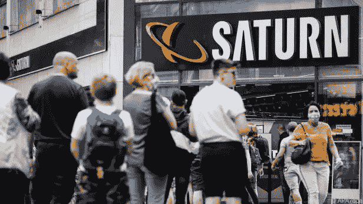
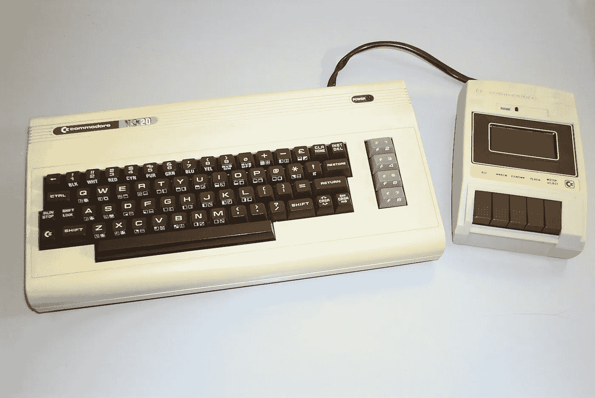
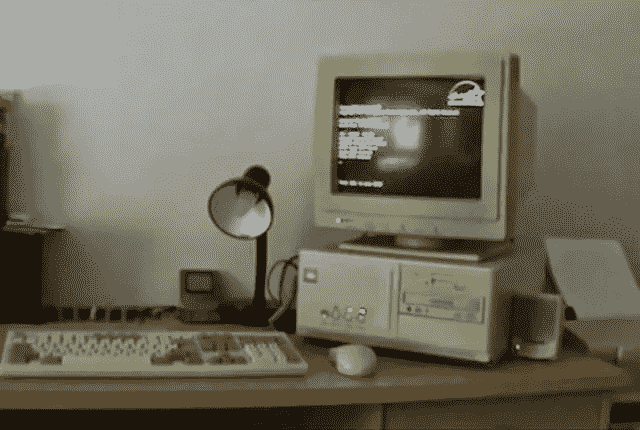
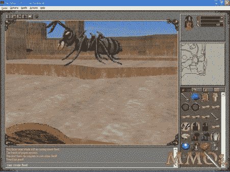
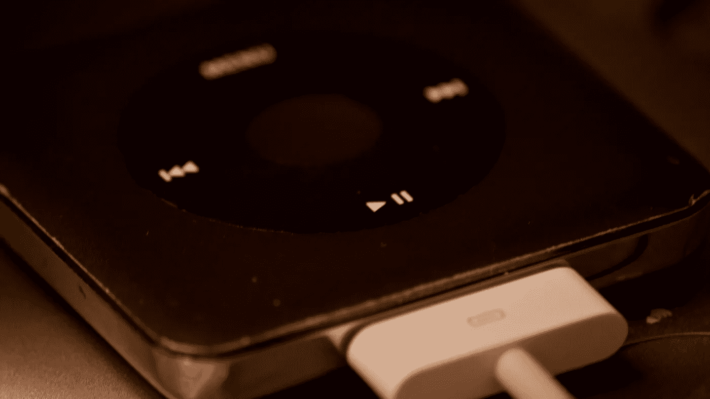
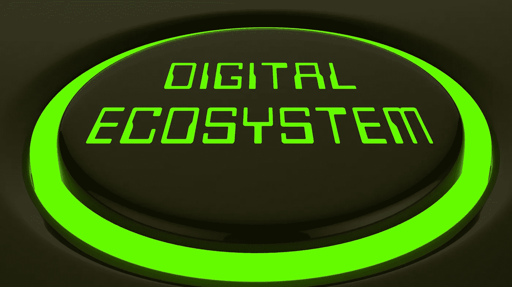

# 先是冥王星降级，现在土星没了。

> 原文：<https://medium.datadriveninvestor.com/first-pluto-was-downgraded-and-now-saturn-is-gone-231ccaecdd0e?source=collection_archive---------23----------------------->

## 消费电子产品简史，不是天文学讲座。

All pictures in this article without source information are from CANVA PRO.

亲爱的读者，我承认我对这个标题有点着迷。我对点击诱饵犯罪百分之百有罪。我不是在谈论土星，尽管标题可能会假设。我把你引入歧途。

我说的是电子连锁店土星。土星商标从奥地利消失了。它与 MediaMarkt 品牌合并了。在亚马逊主宰商业的世界里，商业上有意义的事情仍然让我有点伤感。

从一个 70 年代的小男孩的消费者视角，加入我的科技史之旅，在 2020 年成长为一个中年人。我讨厌说我是个中年男人。但这就是 46 岁——一个老掉牙的年龄。

Picture from [https://kurier.at/wirtschaft/marke-saturn-geht-in-mediamarkt-auf/400970021](https://kurier.at/wirtschaft/marke-saturn-geht-in-mediamarkt-auf/400970021)

# 土星是什么？一个星球，还有什么？

对于可能生活在奥地利甚至欧洲以外的读者来说，土星是什么有点解释。

一方面，它是我们太阳系的第六颗行星。另一方面，它是 1961 年在汉堡成立的电子产品零售连锁店。第一家商店是为了卖唱片而建立的。它自称是“世界上最大的唱片秀”

是的，记录。那是 1961 年。在音乐被压制在黑胶唱片上的日子里，卖唱片是一项不错的生意。就像理查德·布兰森的处女店。

随着时间的推移，它演变成了一个在欧洲拥有 200 多家商店的电子商店连锁店——主要是在讲德语的国家及其邻国。Saturn 隶属于 MediaMarktSaturnRetail 集团，在 15 个国家拥有 1000 多家门店，员工超过 65000 人。

# 世界是如何变化的

10 月份，我想去土星的网站上看看新的苹果 iPhone 可能的交付日期。我过去常去的商店离我的公寓只有 5 分钟的车程。

我在土星商店里度过了 25 年以上的电子瘾。所以我想看看新 iPhone 什么时候可以订购和提货。真是个惊喜。当我打开 Saturn.at 网站时，我被重定向到 MediaMarkt。简单的信息:土星和 MediaMarkt 合并了——品牌消失了。

哦天啊。这真的在情感上打击了我，我的头脑开始创造关于过去事件的伤感故事。它启发了我写这篇文章来克服我失去心爱的人的情感痛苦。

和我一起踏上我的过去之旅，让我们用 10 分钟的时间重温当今科技发展的重要里程碑。

Picture from [https://nat.museum-digital.de/index.php?t=objekt&oges=209576&cachesLoaded=true](https://nat.museum-digital.de/index.php?t=objekt&oges=209576&cachesLoaded=true)

# 80 年代——VC 20、C64 和 Amigas 加 CDs

我很早就被科技所吸引。一个邻居有一辆准将 VC 20。我看到了，被迷住了。

我玩的第一个电脑游戏就是在这台电脑上。青蛙很可能是它的名字。我们从哪里得到的电脑和游戏？

我在奥地利山区长大。去大城市旅行并不常见。在当地，我们有一些较大的零售店。当地人开的。零售店有小小的书呆子角落。卖了点科技产品。

这就是我们获得游戏和设备的地方——卡带游戏。当然大家都买了，也没人抄袭那些游戏。我们是诚实的孩子。准将 C64 取代了 VC 20。

硬件和软件被添加到常规零售店的销售组合中。通常，员工不知道它们可以用来做什么。那时的计算机并没有解决我们日常生活中的任何问题。没有专门的计算机商店。我在 1986 年得到了我的第一辆 C64 真有趣。

我买的第一个游戏是《电脑小人》。它是基于智能生命生活在计算机中的故事，通过游戏，玩家可以与这些人互动——计算机所有者需要照顾他们。它是模拟人生的前身。

80 年代也是光盘(CD)革新数据存储方式的时期。我第一次看到光盘是在 80 年代末，当时一个朋友在学校炫耀。山区的美国普通低收入人群仍然沉迷于磁带和唱片。

all tech 的销售过程非常简单。走进当地的一家小零售店——购买——离开——不要问任何问题。没有大型电子产品零售连锁店。

Source: [http://www.creativemountaingames.com/2015/04/throwback-thursday-early-90s-pc-sounds.html](http://www.creativemountaingames.com/2015/04/throwback-thursday-early-90s-pc-sounds.html)

# 90 年代早期——窗户门

随着 Windows 和微软 Office 的发明和普及，事情发生了一些变化。个人电脑——Intel Inside 和微软在软件方面要复杂一些。

Commodore 计算机和 Apple 计算机是封闭的体系结构系统。用户无法改变太多。个人电脑则不同。基本上，用户可以从硬件方面以任何他想要的方式组装计算机。销售人员需要在销售开放架构方面比销售封闭系统更熟练。

因此，我第一次看到了完全专注于销售电脑的商店。最终，他们毁了私营零售店的电脑业务。原因很简单。像我这样的书呆子从专业商店的专家那里得到了适当的建议。散户什么都不知道。

开放式架构对我们这些书呆子和无所不知的年轻人来说是正确的。我们想玩，把东西放在一起，然后把它们拆开。当事情进展顺利时开心，当事情失败时痛哭。我们在那些冒险中投入了每一分钱。

让我们记住，在 1993 年之前，互联网是不存在的。做研究基本上就是买书、杂志，在商店和朋友中与专家交谈。

那时候购物不是走进一家商店买了就走。我和我的朋友们经常在这样的电脑商店见面，讨论最新的创新，有时店主会偷偷给我们看最新的尚未“正式”发布的科技产品。至少他们是这么说的。

我的一个朋友拥有这样一家商店。这是镇上书呆子们见面和打招呼的地方。与此同时，我的朋友在微软工作，在中东和亚洲推出云服务。

那是美好的日子。比尔·盖茨与微软和 Windows 一起统治了市场——Intel inside。

# 90 年代中期——大学——互联网和亚马逊，DVD 和手机

然后发生了三件绝对改变世界的事情。

第一个改变游戏规则的人:我决定去格拉茨大学学习经济。它真的改变了我的世界。在大学里，我很高兴有了自己的电子邮件账户。这是我第一次登录互联网。我很快意识到——我需要在家里上网，因为我可以连接到整个世界。

**第二个改变游戏规则的人:**1991 年，随着[蒂姆·伯纳-李](https://www.w3.org/People/Berners-Lee/1991/08/art-6487.txt)的一条消息，互联网诞生了。他在欧洲核子研究中心工作。1993 年，CERN 宣布万维网(Web 1.0)应该免费公开。真正的游戏规则改变者。我记得那些日子。我在一所商学院接受过培训，我想:他们为什么要这么做？当所有者免费赠送时，互联网将如何生存？我一点也不知道。

第三个改变游戏规则的人:很快，杰夫·贝索斯意识到了互联网的潜力。1993 年，他决定创办一家网上书店:Amazon.com。鉴于万维网于 1993 年宣布并于同年向公众开放这一事实，杰夫·贝索斯是互联网商业理念的先驱。至少在我看来是这样。

source: [https://mmos.com/editorials/oldest-mmorpgs](https://mmos.com/editorials/oldest-mmorpgs)

那时我的世界基本上由奥地利组成，因为低收入家庭的生活更多的是地方性的，而不是全球性的。互联网彻底改变了这一切。它为我打开了整个世界。

最初，互联网主要用于收发电子邮件和聊天，就像我们在 ICQ 上做的那样——基本上就像很早以前的 Whatsapp 一样。电脑游戏第一次上线。我记得第一个在线 RPG，如 Meridian 59 或 Everquest。

## 移动电话

与此同时，由于互联网和移动电话行业的兴起，通信方式也发生了变化。直到 20 世纪 90 年代初，创新的进展相当缓慢。80 年代的电脑。电视有一点创新，但没有改变游戏规则。

移动行业是 90 年代后半期的第二大热门。以前，我们在家里用电线接电话。于是，移动行业向所有人推出了手机。那是辉煌的日子。我第一次免费得到手机。我记得我为整个家庭——10 个人——我、我的伴侣、我们的父母和兄弟姐妹免费获得了一年的电话和合约。

手机很笨拙，无法与我们今天的手机相媲美。但是，我们可以随时随地发短信聊天。

## DVD-Playstation 和盒式磁带的死亡

随着互联网和计算机芯片的改进，更好的数据存储成为紧迫的问题。此外，DVD 也推出了——基本上与 CD 相同，但存储空间更大。

这是游戏系统的兴起。80 年代，我用的是准将。在基于 Windows 的个人电脑上玩游戏有点尴尬。Playstation 终于在我家赢了游戏。他们使用 CD 和后来的 DVD 和蓝光存储，并针对游戏进行了优化。个人电脑仅仅是为了工作，而游戏则去了 Playstation。

## 土星——我的爱

所有这些创新

*   因特网
*   移动电话
*   更好的存储设备

完全改变了我们沟通和做生意的方式。我意识到的第一个变化是当地的电脑商店消失了。像 Mediamarkt 和 Saturn(最后我成功了)这样的大型零售连锁店接管了市场，以满足对计算机设备日益增长的需求。

我清楚地记得 90 年代后半期和我的长期伴侣的周末购物旅行。她喜欢时尚；我对技术感兴趣。大型购物中心在奥地利的扩展使得购物成为全家人的周六活动。玩具店旁边的时装店和像土星这样的消费电子零售连锁店。

然而，书呆子社区不再在购物中心见面了。就像 80 年代的旧时光一样，这或多或少是为了获得所需的设备。但是很棒。

那是我第一次见到你，就爱上了你:土星。在消费电子产品方面，你拥有我想要的一切。在 90 年代，亚马逊只是一家书店。所以，看到新玩意，测试它们，购买音乐 CD、电影 DVD、游戏、调制解调器、鼠标、显示器、电脑、Playstation——这一切都发生在位于购物中心的大型专业消费电子连锁店。

这个世界完美而美好。然后…

# 90 年代末

在 90 年代末和新千年开始之际，戴尔改变了游戏规则，Napster 摧毁了音乐产业，史蒂夫·乔布斯拯救了地球。

戴尔全毁了。Napster 也是如此。史蒂夫·乔布斯把零零碎碎的东西拼凑成全新的样子。

这是我第一次意识到互联网和电子产品的力量已经完全超越了整个价值链。

## 戴尔案例

我们习惯于在商店里买电脑。开放式架构使得购买过程更加复杂。我应该买英伟达显卡还是 AMD 显卡？哪款处理器最好？哪种显示器针对这一点进行了优化？

这项研究花了很长时间。互联网还很年轻，谷歌还没有出现。搜索引擎或多或少是一个按字母顺序排列的链接列表。信息来源于纸质杂志和与少数专家的交谈。尽管如此，我们还是找不到完美的系统。土星汽车公司的销售人员？他们什么都不知道。但是他们拥有将一个健全的游戏系统组装在一起所需的所有零件。

戴尔改变了这一点。我需要的一切都在他们的网站上。我可以按照我想要的方式配置我的电脑。当我超出预算时，当我拿回我买不起的 3000 欧元的设备时，没有一个销售人员生气地看着我。偷走他生命中的时间，然后花几百块买下。网站很有耐心。

而且比在土星上买便宜。所以我的许多书呆子朋友去网上购买戴尔的产品，这蚕食了土星的业务。第一次击中。我知道了商业术语“同类相残”。

之前，我在商学院接受了如何维持一家企业的培训。90 年代后半期，创新列车驶离车站。创新，自我吞噬或者死亡。

## Napster 的案子

另一个不错的发明是 MP3 播放器。我相信每个跑步者都知道我在说什么。在 80 年代，我们有了随身听——一种带电池槽的卡带播放器，可以播放卡带 20 分钟。从你的角度看，这个装置很大，而且很纠结。它很重。

随身听取代了它。同样的故事。但是你不能带着它跑。为什么？因为激光束失去了跟踪。所以对我们这些活跃的人来说，我们需要新的东西——可靠的。有人发明了 MP3 播放器。那是什么？

一个带闪存盘的简单设备。足够存储 10 到 20 首歌曲。好吧，至少这是我没有问谷歌博士就记得的。唯一的问题是:你从哪里得到播放器的歌曲？

通常的过程是买一张 CD 并将其转换成 MP3 格式，这需要一台电脑、一个软件和使用这些东西的专业知识。它不是为街角的普通人准备的。它至少需要一个计算机科学的硕士学位和一个足够大的口袋来购买 MP3 播放器和 CD，并转换它们。嗯，好吧，我又有点跑题了。

我记得在 2000 年左右，当我们搬到维也纳时，我为我的长期伴侣复制了 CD 到 MP3。

然后是 Napster。Napster 是一个共享 MP3 的点对点网络。这个想法是

*   你买了一张 CD
*   将其转换为 MP3 并
*   当你在线时，你分享你的图书馆和
*   您可以访问其他用户库

你给予和接受。

Napster 是另一个意外的游戏规则改变者。隐藏的资产是让人们一起工作，免费分享他们的财产。很少有人谈论经济中的转折。这是一个需要改进的商业模式，但它为订阅铺平了道路。

不利的一面是，Napster 的创始人摧毁了音乐产业的价值链——有意或无意——谁知道呢。当时的许可条款规定，CD 的所有者只能将其用于私人目的，如果原版被销毁，可以制作有限数量的副本，但仅限于个人使用。

条款不包括通过 Napster 免费提供音乐。Napsters 模型是不确定的。虽然没人用它赚钱，但它破坏了音乐行业的商业模式。很快，这个行业就开始和 Napster 的人做生意了。Napster 走上了非法路线。

## 史蒂夫·乔布斯需要拯救世界。

但是改变行业的想法已经摆出来了。史蒂夫·乔布斯总是擅长给发明做最后的润色。让已经很棒的变得优秀。苹果，在我眼里，并不是很有创新性。我不记得苹果自己做的一个发明，但我记得很多通过苹果打磨而出名的发明。

MP3 播放器和点对点分享是苹果公司在新千年的第一次抛光行动。苹果发明了苹果 iPod。在此之前，MP3 播放器可以存储 10-20 首歌曲。对于用户来说，不断地删除和上传歌曲是一项繁重的工作。

史蒂夫·乔布斯给了它什么独特的转折:

> 苹果 iPod——1000 首歌曲在你的口袋里

多么独特的销售主张。你想听听这位大师如何将禅宗引入正题吗？

这是一个不错的独特销售主张。

## 游戏——我的嗜好之一

博彩业在 90 年代发现了互联网。射手和角色扮演游戏上线。幽灵侦察，彩虹六号，子午线 59，或无尽的任务。

游戏产业将全世界的人联系在一起。当时的社区很独特。接入互联网价格昂贵，技术复杂；语言主要是英语，而且需要稳定的互联网连接。在过去，稳定的联系是不可能的。它确实每月花费大量的钱。

在奥地利，有线电视提供商是第一个向私人客户开放其光纤网络的公司。它很贵，但对于像我这样的狂热游戏玩家来说是必要的补充。它提供了必要的带宽。

我清楚地记得我和韩国和美国学生在网上玩的那些夜晚。通过短信聊天——一个每天练习英语和逃避现实的独特机会。

## 土星和我

在新千年的早期——土星——我的个人电子产品经销商拥有一切。音乐和蓝光光盘。是的，即使 Napster 还在，我还是坚持购买音乐和电影。为什么？寻找一个高质量的 MP3 文件需要花费大量的时间。

我还完成了经济学硕士学位，开始工作，先是做研究，然后在 M&A 的大公司工作。购买电影和音乐支持艺术家，并确保我手头有高质量的录音。这是我没有购买苹果 iPod 的另一个原因。将 CD 转换成 MP3 是一项工作。花了时间，感觉像偷东西。所以我保持了通过光驱在电脑上听音乐的习惯。

土星提供了我需要的一切:电脑、手机、CD、游戏——一切需要的东西。我和土星的关系蒸蒸日上。每个周末都有新玩意——是的，我花了很多钱和时间。但是很有趣。

# 2005 年及以后——苹果的十年

2005 年至 2010 年间，又发生了许多事情，永远改变了我们的世界。

幸运的是变得更好了。

## 史蒂夫·乔布斯又做到了——iPod Nano。

令人印象深刻的一点是——史蒂夫·乔布斯从未停止改进发明。2005 年 9 月，他向全世界介绍了 iPod Nano。这个产品真的打动了我。这不是 2001 年的又大又重的 iPod。这是一个有着巨大数据存储量的小设备。

但是并没有带走获取 MP3 的问题。这是我发现苹果第二项发明的时候。史蒂夫·乔布斯接管了整个音乐产业价值链。

怎么会？

我面临的问题仍然是将 CD 转换成 MP3。最重要的是，我讨厌在只有一两首歌吸引我的时候去买整张唱片。当我看到 iPod Nano 来到土星时，我同时发现了 iTunes 商店。

2003 年，史蒂夫·乔布斯已经推出了以 0,99 ct 的价格购买专辑中的单曲的选项。和 iPod Nano 一起，它真正改变了我的世界。为什么？

我喜欢运动，最想做运动时听音乐来分散注意力和激励自己。苹果公司解决了这个问题——iPod Nano 和 iTunes 商店每首歌 0.99 美分的选项。

## 史蒂夫第二次出击——智能手机。

他又做了一次。移动产业欣欣向荣。自从我在 1997 年得到第一部手机以来，奥地利的工业界免费赠送了如此多的手机，以至于每个人平均拥有 2-3 部手机。我的公寓堆满了旧手机。我不能在易贝卖掉它们。由于高创新速度和“免费”模式，它们在我得到一个时就变得一文不值了。嗯，我本来就不需要付钱。

移动行业试图找出如何夺回“免费”模式。那是烧钱。大多数客户并没有通过每月订阅产生足够的收入来证明免费赠送手机的合理性。

此外，传统手机都有一个问题。他们带来了封闭的软件架构。每次我得到一部新手机，我都要花一天的时间学习它是如何设置的——将电话簿从旧手机转移到新手机上。这通常是行不通的，因为系统不兼容，sim 卡不能存储很多联系人。

外部存储？嗯，那时候没有。所以很多事情仍然没有解决。在这个市场上，面对这样的问题，史蒂夫大师做了一些令人惊讶的事情。

他提供了下一个解决方案:

> iPhone 1.0

我真的不知道这项创新有多大的潜力。我清楚地记得我订购第一部 iPhone 的时候。早在 2007 年，我在管理一家生命科学公司的财务部。首席执行官罗杰·诺瓦克(Rodger Novak，同时也是 CRISPR Therapeutics 的首席执行官)希望我订购一部 iPhone。我咧嘴一笑，说:“为什么要有电话功能的 iPod？订购普通手机和 iPod 比购买 iPhone 要便宜得多。”罗杰是首席执行官，所以，当然，我微笑着服从了。

过了几年我才真正明白 iPhone 的价值。第一个来的时候没有 3G。3G 回到了 2020 年的 5G。我迷上了 iPhone 3G。它给了我在通勤时浏览网页的可能性。当然，坐地铁——不是坐汽车。游戏规则改变者是用户 100%个性化 iPhone 的绝对力量。它可以转移到新的 iPhones 上。

依赖技术人员设计手机的日子已经一去不复返了。2020 年的今天，当我买一部新 iPhone 时，它的配置和我的旧 iPhone 完全一样。我什么都不用做。

谢谢你史蒂夫。愿上帝在来世保佑你。你为社会做了伟大的工作。

## 网飞上线了

在股市历史上最大的一次崩盘前夕，网飞将其业务放到了网上。2007 年以前，网飞通过邮政服务出租 DVD。2007 年，他们转向了互联网。通过互联网发行电影。这是一个大胆的举动，因为 2007 年的带宽仍然很窄。数据高速公路上经常发生交通堵塞。

网飞做得对。2010 年，他们从派拉蒙和米高梅公司获得了五年的电影流媒体播放权。就在那时，没有人对这种权利感兴趣。但稍后会有更多。

## 赌博

在发布内容方面，它或多或少还是离线的。虽然 Playstation 和其他游戏设备已经上线，但玩家仍然需要购买 DVD 或 BlueRay 来启动游戏。Playstation 上的游戏从一张 DVD 开始，然后玩家上网享受与游戏玩家社区一起玩的乐趣。

与 90 年代相比，最棒的是软件补丁(苹果引入应用经济之前的应用名称)是以数字形式发布的。不再到处推销碟片或 CD。游戏安装的那一刻，它就获得了最新的错误修复。但不会马上有大的创新。

## 我和土星。

2005 年到 2010 年是我们从 90 年代开始长期交往以来的第一次，那时我没有经常去拜访。我们在一起十几年，我开始背叛你。是的，我犯了通奸罪。土星很适合我。是我开始尝试其他销售渠道。

苹果的 iPod Nano/iTunes 单曲组合搞定了我。我不再在土星买音乐 CD 了。把我所有买音乐的钱都投入 iTunes 商店。我真的不明白，这是我与土星的爱情结束的开始。

这只是与其他频道的一点调情。没什么严重的。

# 从 2010 年开始，科技列车加速前进

哦，我亲爱的读者。如果你真的认为 1974 年以来的创新速度很高。你错了。从 2010 年开始的创新速度让世界进入快速拨号状态，直到 2020 年新型冠状病毒突然停止。

让我告诉你怎么做和为什么。

## 网飞——这不是一个关于就业的故事。

最初，流媒体是微软和苹果完全忽略的东西。我认为这两位创新教父已经失去了锋芒，开始衰老。此外，亚马逊的杰夫·贝索斯在派对上迟到了很久。

网飞的工作人员抓住了它。当我可以通过互联网购买音乐时，我总是想:为什么不可以买电影呢？然后我发现了网飞。我相信我在 2012/13 年左右获得了我的第一份订阅。我在欧洲的奥地利。不，没有袋鼠。他们在澳大利亚。

在网飞之前，电影是在复杂的价值链中传递的。第一，他们出现在电影院；然后，他们去 BlueRay 上购买，过一会儿再去租。最终，他们转向了有线电视。SKY 是最早播放电影的人之一。SKY 的商业模式是高额的月订阅费。几个月后，电影被分发到有线电视。再过几年就能看到免费电视了。这是很好的旧电影产业价值链。

然后是网飞。没有人相信 2010 年之前的时光会倒流。互联网落后、拥挤、缓慢。流媒体电影需要稳定的宽带连接。3G 不是为此而生的；4G 还很年轻，还没有完全推出。还有光纤网络——嗯，互联网的主干不是为海量数据而建的。

因此，当网飞与派拉蒙和米高梅电影公司达成价值十亿美元的流媒体播放权交易时，他们极具冒险精神。剩下的就是历史了。网飞成功了。世界电影图书馆上线了，可以通过订阅的方式获得。我还记得我不得不取消每月 50 欧元的天空套餐，转而选择每月 6 欧元的网飞套餐的乐趣。

Sky 打电话给我，想说服我留下。我对电话里的女士说:“如果你给我 6 欧元的天空订阅费，我就留下”。她问:“为什么？”。我解释说，“网飞每月 6 欧元。”她笑着回答:“但是网飞没有最新的电影。我们有。”

“是的。没错。但是我看电影主要是为了学习英语，网飞对我来说已经足够了。尽管如此，当我买一两部蓝光电影时，我还是在省钱。在一个季度里，我至少会看一两部电影。那么，我是否可以以每月 6 欧元的价格获得 Sky？”

不。我不明白。但这一点都不重要。

## 再见史蒂夫

史蒂夫·乔布斯于 2011 年去世。科技史上最伟大的人之一。他用他的精神塑造了我们的社会。由于互联网(不是乔布斯的发明)、智能手机和平板电脑，2020 年的锁定是可以理解的。向用户提供网飞等应用的设备。

在某种程度上，用户不需要工程博士来访问内容。我相信是史蒂夫·乔布斯给我们的社会带来了这种转变，并在苹果公司建立了一支优秀的团队。在我看来，史蒂夫·乔布斯是那个用简单易用的设备——iPhone——让所有人都能上网的人。

当史蒂夫·乔布斯离开苹果的时候，我相信公司会走下坡路。

对于苹果，我总是错的。我不了解 iPod 和智能手机，也不知道史蒂夫·乔布斯通过深思熟虑的领导层选择建立了一家伟大的公司。蒂姆·库克(Tim Cook)接手，让苹果成为这十年来最有价值的公司。

蒂姆·库克让苹果的创新列车永不停息。苹果手表是他的发明之一，同样改变了世界，就像他的前任史蒂夫·乔布斯的发明一样。

## 赌博

它还没有采用订阅模式。但是游戏产业做了史蒂夫·乔布斯对音乐产业做的事情。他们通过互联网直接交付给玩家。我真的不记得什么时候开始不买蓝光上的游戏了。我 2014 年弄了个 PS4。我在 PS3 上网购游戏了吗？我不记得了。很有可能。

由于网飞导致互联网流量过大，互联网提供商提高了带宽和速度。它使得在短时间内下载 60-100 千兆字节成为可能。几个小时，而不是几天或几周。难以置信的速度——来自互联网早期的 56 kbit 调制解调器。

索尼和微软也上线了。不是网络游戏可以在网上购买；还有，每个软件都是需要的。许多应用程序(软件的新名称)可以按月付费使用。

一个新的行业诞生了:基于云的服务和数据存储成为了一个全新的领域。

## 软件去应用

我记得旧的微软办公室。几十年来，我购买 CD/DVD/蓝光，等待数周，直到在线更新过程完成，我终于可以使用新的软件。今天，我得到了一个月订阅。该软件几乎每天都有少量下载更新，不会给用户体验带来太多摩擦。

Adobe 和许多其他应用程序也做了同样的事情。

## 亚马逊——世界上最大的零售店

杰夫·贝索斯以网上书店起家。2020 年，几乎所有合法的商品都可以通过亚马逊购买。90 年代的网上书店发展成为世界上最大的零售商店。没有商店，所有东西都送到家门口。

它只需要一个指尖，几天后你得到了你一直想要的东西。亚马逊还启动了亚马逊网络服务，这仍然是亚马逊在 2020 年的一大增长因素。

## 我和土星。

我们发展了十多年的关系受到了严重的打击。我被年轻的销售渠道所吸引。好吧，我承认我开始经常背叛我的土星。

随着网飞的崛起，我不再在蓝光上买电影了。我相信我最后一次收到肯定是在 10 年前。我在网飞找不到的电影，我开始在苹果商店购买。苹果也有在线服务。没有订阅费，但大约 5 欧元，我可以租一部 48 小时的电影。

亚马逊也有同样的服务。这三个因素一起使我远离了在当地租赁服务机构租赁电影或在土星上购买电影。

博彩业也是如此。索尼开始在网上销售游戏的那一刻，我就毫不犹豫地在网上买了。这不是一个基于低价的决定——只是为了方便。点击—购买—下载—播放。完成了。无需在收银台等待，也不会因为游戏目前售罄而感到沮丧。当您需要时，数字内容总是可用的。

我在土星上最后一次认真购买是在 2013 年。我花了大约 1700 欧元买了一台新的工作用笔记本电脑。从那以后——什么都没有。很明显，我在不知不觉中慢慢扼杀了我的传统销售渠道。很有可能，数百万其他消费者也这样做了。数字化只是更有吸引力的提议。

# 2015 —新的数字生态系统不断发展

正是法昂的崛起改变了整个世界。脸书、亚马逊、苹果、网飞和 Alphabet(前身为谷歌)在过去五年中实现了令人着迷的投资回报。为什么？

因为他们将商业模式发展到整个生态系统，这些创新引擎以多种方式为客户带来价值。让我们来深入了解一下。

## 苹果

股票市场上对苹果故事的最大批评是，苹果只是一家生产单一产品的公司:它只销售 iPhone。以及一款被视为 iPhone 的大屏幕平板电脑。许多分析师警告称，iPhone 销量下降可能会对该公司造成长期伤害，并很容易失去其全部价值。

除了 iPhone，苹果在 2015 年之前没有别的东西可以提供。蒂姆·库克改变了这个故事。让我们想想苹果的初创公司——ai rpods。蒂姆·库克走进拥挤的耳塞空间。我喜欢运动。最大的问题之一是购买可靠的耳机。它们应该耐用且重量轻。

蒂姆·库克为市场带来了解决方案——无线苹果 AirPods。从第一版开始的杰作。无论我做什么样的运动——跑步或在健身房锻炼——他们都不会掉下来。

几周前，我计算了苹果 Airpod 业务的价值，结果是 840 亿美元。试想一下，你开了一家公司，3 年后，它的价值接近 1000 亿。

 [## 苹果空运业务的价值

### 如何以苹果的方式创业

medium.com](https://medium.com/the-innovation/the-value-of-apples-airpod-business-aca3b7659ed3) 

蒂姆·库克为消费者带来了多种设备，可以将苹果放在手中(iPhone 和平板电脑)、手腕上(Apple Watch)和耳朵上(Airpods)。对于小工具的定制，消费者需要购买应用程序。令人惊讶的是，苹果从每笔销售中获得 30%的佣金。

随着订阅模式越来越受欢迎，你很容易想象这对苹果的收入意味着什么。一个顾客不仅仅是每 4-5 年买一部 iPhone，不，在 2020 年，她会定期在 Appstore 购买应用程序，并向苹果交付现金。

苹果公司在全世界有大约 15 亿台设备。假设只有不到三分之一的人是活跃用户。这仍然是美国的人口规模，他们经常通过 iPhone 购物——苹果公司从中提成。

难怪苹果积累了大量现金，沃伦·巴菲特持有的苹果股票最多。

## 亚马孙

从互联网经济中进化出来的下一个大生态系统。亚马逊成为了世界上最大的仓库，并且还在继续扩张。像苹果一样，杰夫·贝索斯公司也保持创新，并支持其客户的需求。

谷歌表示，到 2020 年 7 月，亚马逊拥有超过 100 万名员工。由于股票市场估值的上升，杰夫·贝索斯的净资产超过了 2000 亿美元。

## 微软

几年前，我认为微软错过了技术列车。看起来该公司陷入了销售 Windows 和微软 Office 的旧模式。随着微软在 2014 年迎来了新的首席执行官，方向发生了变化。

特别是微软 Azure 云服务为公司的增长做出了贡献。然而，它的旗舰产品仍然是 Windows 和 Office。后者可以通过订阅服务获得，为公司带来经常性收入和自动更新。微软很可能会继续增长。

这三家公司极大地改变了我们做生意和互动的方式。苹果提供设备，微软提供软件，亚马逊推动商业。

## 土星和我分手了。

我们的关系在 10 年前就已经失去了优势。而且从那以后也没有好转。首先，我开始通过互联网购买歌曲，然后是电影和游戏。我从亚马逊拿到的设备——非常方便地送到我的家里或工作场所。我不需要四处走动。

反正也没关系。因为 Saturn 的员工大多不是该领域的专家，而且与亚马逊的市场相比，科技产品的种类极其有限。

作出购买决定所需的必要研究，我反正是通过互联网做的。从 90 年代每周几个小时的热恋开始，到每年一两次。我没有放弃参观的原因？

有时洗碗机、冰箱、吸尘器或洗衣机坏了，我就利用特价优惠。此外，灯泡或电池是这样的便利商品，我在土星购买。没有更大的购买量，也不是很频繁。从每年在土星留下几千欧元下降到 30-40 欧元。最多几百。我倾向于在购买白色技术上省钱。

# 2020 年的今天，疫情大受欢迎

自 80 年代以来，我的消费行为发生了巨大变化。

从

*   在科技商店社交结束
*   在大型零售连锁店购买和经营，以
*   完全在网上购买一切——实物和数字商品。

2020 年第一季度，疫情彻底改变了世界。欧洲和美国继续封锁，促使越来越多的消费者进行网上购物。

它推动亚马逊、苹果或微软的生态系统在股票市场上达到令人难以置信的估值。

难怪传统的品牌所有者会像土星一样放弃他们的品牌名称。在新的十年里，消费者越来越多地在网上购物。围绕疫情的政治决策将消费者的行为进一步推向这个方向。

## 土星和我

是的，我是多愁善感的。我在土星度过了美好的时光。我经常像一个成年孩子一样站在新技术面前——电脑、游戏机、电视机或手机让我着迷。

但是让我们面对现实吧。老品牌失去了与消费者的联系——很久以前，他们就把自己的独特地位让给了即将到来的亚马逊、苹果或微软的仆人。他们的独特地位是什么？直接面对面接触消费者。

土星，我仍然怀念我们过去的日子，但我很久以前就放弃你了。我会永远记住我们在 90 年代一起度过的美好时光。

土星，我的爱人，睡个好觉。愿你安息。

自 1999 年以来，我是各行各业公司的执行官、顾问和教练。我专攻企业发展和金融。从种子轮到 IPO 级别。我从 2006 年开始关注生命科学。

如果你喜欢这篇文章，[关注我](http://linktr.ee/soschner)了解更多内容。

# **读者和链接:**

【https://en.wikipedia.org/wiki/MediaMarktSaturn_Retail_Group 

 [## 媒体-土星

### 媒体-土星控股有限公司

de.wikipedia.org](https://de.wikipedia.org/wiki/Media-Saturn)  [## 历史媒体市场

### 1990 年在奥地利(萨尔茨堡)的媒体市场，1994 年在奥地利…

mediamarktsaturn.at](https://mediamarktsaturn.at/de/historie/)  [## 准将 64

### 制造商 Commodore 商业机器(CBM)型家用计算机发布日期 1982 年 8 月；38 年前[1]…

en.wikipedia.org](https://en.wikipedia.org/wiki/Commodore_64)  [## 个人电脑

### 个人计算机(PC)是一种多用途计算机，它的尺寸、性能和价格使其适用于…

en.wikipedia.org](https://en.wikipedia.org/wiki/Personal_computer#:~:text=A%20personal%20computer%20%28PC%29%20is,a%20computer%20expert%20or%20technician.)  [## 微软视窗软件

### 开发者微软源模型初始发布 1985 年 11 月 20 日；34 年前，作为 1.0 版本(不支持)最新…

en.wikipedia.org](https://en.wikipedia.org/wiki/Microsoft_Windows)  [## 为什么 IBM 个人电脑有一个开放的架构

### 在某些方面，构建 IBM PC One 的团队所做的影响最深远的决定是使用开放的…

uk.pcmag.com](https://uk.pcmag.com/opinion/111663/why-the-ibm-pc-had-an-open-architecture) 

[https://then extweb . com/insider/2011/08/06/20-years-agreement-Today-the-world-Wide-web-open-to-public/#:~:text = Today % 20 is % 20a % 20 significant % 20 day，Wide % 20 web % 20 becamed % 20 public % 20 available](https://thenextweb.com/insider/2011/08/06/20-years-ago-today-the-world-wide-web-opened-to-the-public/#:~:text=Today%20is%20a%20significant%20day,Wide%20Web%20became%20publicly%20available)。

 [## 互联网的发明

### 50 多年前，互联网作为政府在冷战中的一种武器，在美国起步。不像…

www.history.com](https://www.history.com/topics/inventions/invention-of-the-internet)  [## 互联网的历史

### 互联网的历史起源于建立和互连计算机网络的努力，这种努力产生于…

en.wikipedia.org](https://en.wikipedia.org/wiki/History_of_the_Internet#From_ARPANET_to_NSFNET) 

[https://en.wikipedia.org/wiki/Jeff_Bezos#Amazon](https://en.wikipedia.org/wiki/Jeff_Bezos#Amazon)

 [## 光盘

### 光盘(CD)是一种数字光盘数据存储格式，由飞利浦公司和索尼公司共同开发，并于 2005 年发布…

en.wikipedia.org](https://en.wikipedia.org/wiki/Compact_disc)  [## 戴尔如何在网上销售

### 斯科特·埃克特建立并经营着世界上最大的网络公司之一，其年收入是……

www.fastcompany.com](https://www.fastcompany.com/35071/how-dell-sells-web)  [## 数字影碟

### 由索尼 DADC 媒体型光盘制造的编码 DVD-ROM 和 DVD-R(W)的 DVD 的数据面使用一个…

en.wikipedia.org](https://en.wikipedia.org/wiki/DVD)  [## 2003 年 4 月 28 日，苹果推出 iTunes 商店，销售 99 美分的歌曲

### 1998 年，戴夫·马修斯乐队的《拥挤的街道》在美国专辑排行榜上首次亮相，结束了泰坦尼克号…

calendar.songfacts.com](https://calendar.songfacts.com/april/28/10240) 

https://en.wikipedia.org/wiki/Netflix

 [## 苹果手表

### 苹果手表的名字被美国人称为苹果智能手表。往昔…

de.wikipedia.org](https://de.wikipedia.org/wiki/Apple_Watch)  [## 苹果拥有超过 15 亿部活跃设备，去年增加了 1 亿部

### 苹果公司达到了有史以来最高的安装基数，超过 15 亿的活跃设备正在被世界各地的客户使用…

appleinsider.com](https://appleinsider.com/articles/20/01/28/apple-has-more-than-15b-active-devices-in-the-wild-up-100m-in-last-year)