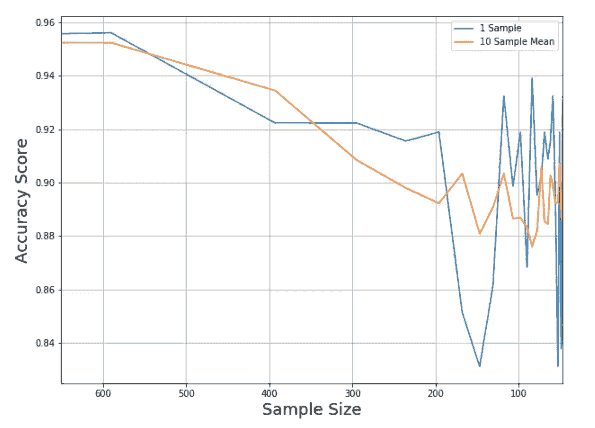
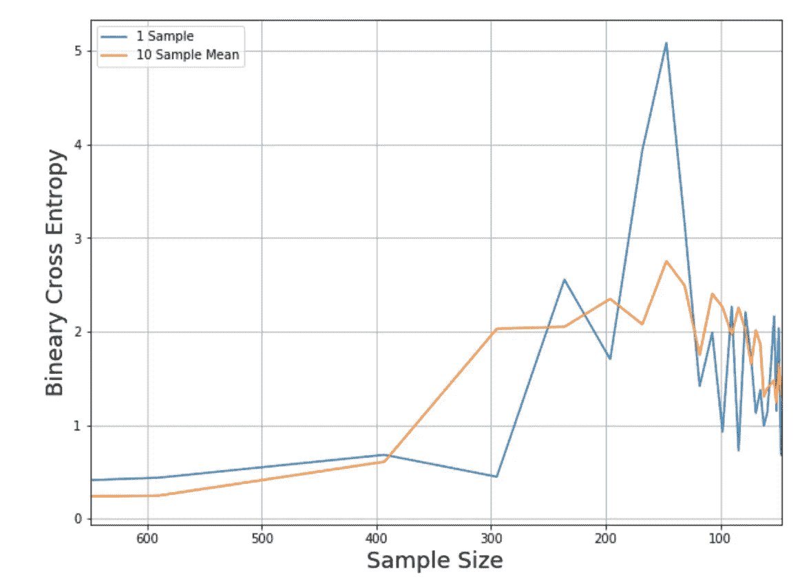
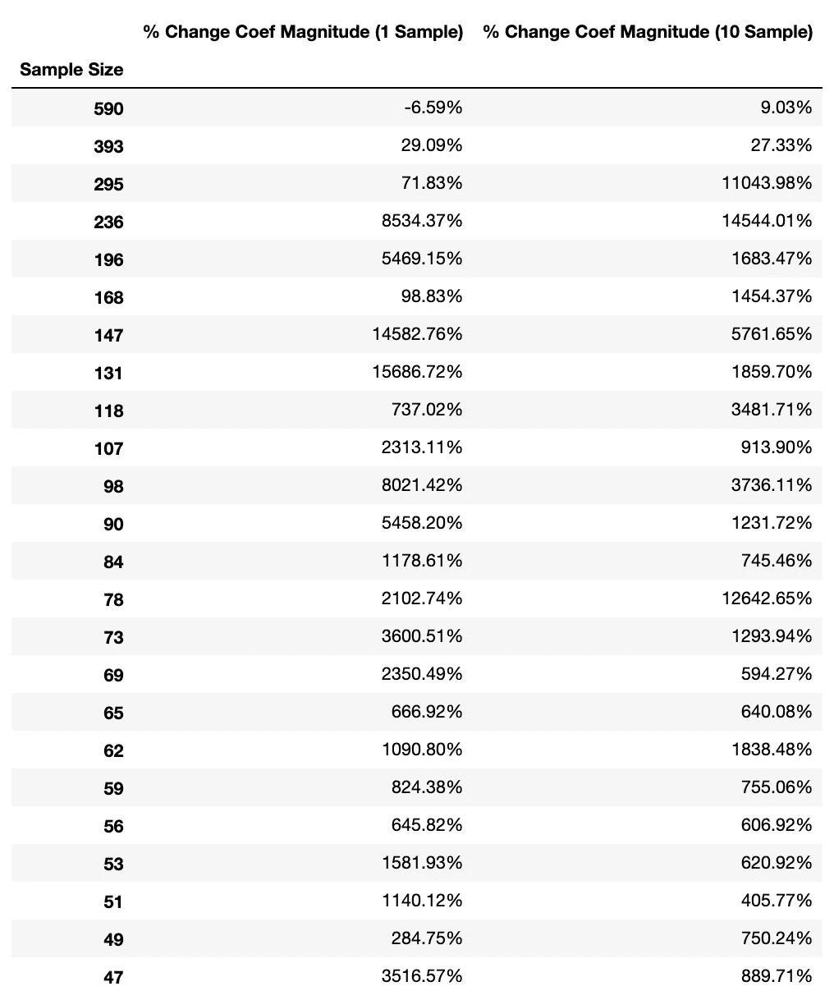
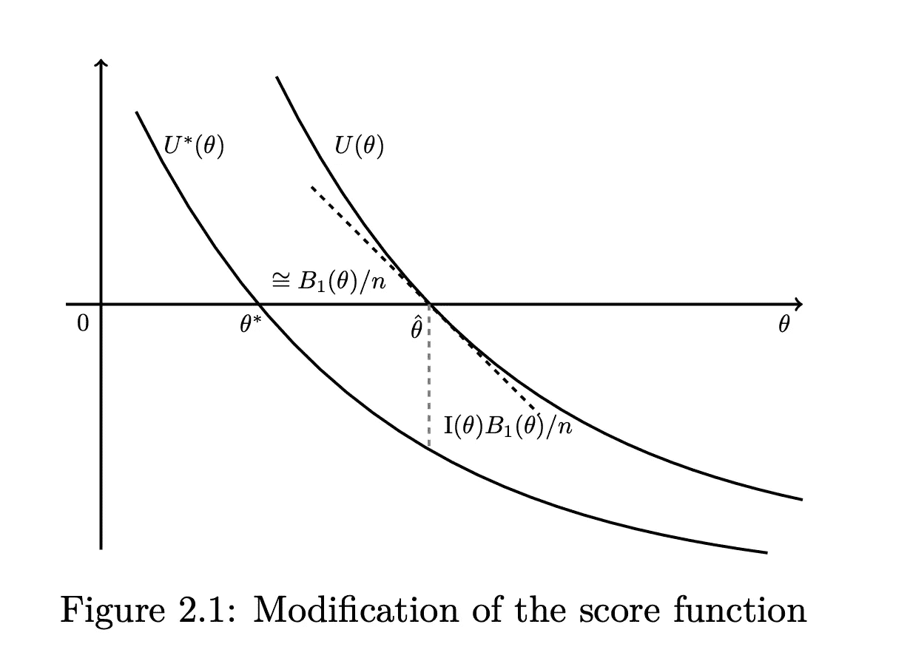

# 弗斯的逻辑回归:用小的、不平衡的或分离的数据集分类

> 原文：<https://medium.datadriveninvestor.com/firths-logistic-regression-classification-with-datasets-that-are-small-imbalanced-or-separated-49d7782a13f1?source=collection_archive---------0----------------------->

数据科学家有一系列巧妙编程的分类算法，当数据集相对较大且运行良好时，这些算法工作得非常好。不幸的是，大型、无问题的数据集是例外，而不是医学研究、经济分析、政治预测和许多其他领域的标准，在这些领域，定量见解特别有价值。

然而，这并不意味着为处理不太理想的数据集而设计的算法不存在，只是它们不为人所知。这是一系列文章中的第一篇，这些文章将阐明一系列基于惩罚最大似然估计的方法。

[](https://www.datadriveninvestor.com/2019/01/23/which-is-more-promising-data-science-or-software-engineering/) [## 数据科学和软件工程哪个更有前途？数据驱动的投资者

### 大约一个月前，当我坐在咖啡馆里为一个客户开发网站时，我发现了这个女人…

www.datadriveninvestor.com](https://www.datadriveninvestor.com/2019/01/23/which-is-more-promising-data-science-or-software-engineering/) 

我们今天的话题是**弗斯的逻辑。**弗斯的 logit 于 1993 年由华威大学教授大卫·费斯创建，旨在解决标准最大似然估计可能出现的问题，但已发展成为一种通用工具，用于减少分类模型中的偏差。它最常用于在处理三种有问题的数据集时获得更好的结果:

1.  **小型数据集**
2.  **不平衡数据集**
3.  **分离的数据集**

在接下来的部分中，我将介绍这些对分类提出的挑战的性质，深入研究 Firth 的 Logit 背后的理论，并解释如何用 Python 和 r。

([关于最佳小数据集分类算法的讨论，请参阅本系列的第二部分 Log-F(m，m)逻辑回归](https://medium.com/@remycanario17/log-f-m-m-logit-the-best-classification-algorithm-for-small-datasets-fc92fd95bc58))

# 问题是

## 小样本量

小样本量存在两个主要问题。首先，小样本不太可能准确反映人口分布，如果不这样，它们产生的模型就不能很好地概括。

其次，支撑许多主要机器学习分类算法的最大似然估计(MLE)技术是一种渐近一致的估计器，这意味着它只有在应用于大型数据集时才是无偏的。

这两个问题都会影响模型预测的质量。例如，看看 Kaggle 的信用卡欺诈数据集在不同样本量下的逻辑回归模型的结果。不仅准确性分数大幅下降，而且与几个小样本的平均值相比，差异也很大，这表明单个小样本的输出是多么不可靠。



如果你关心一个事件的概率，问题会变得更糟，比如在计算信用风险时。正如你所看到的，随着样本量减少到 300 以下，我们刚刚看到的相同模型的二元交叉熵增加了 10 到 70 倍。



然而，小样本量对模型最有害的影响与推理有关。小样本会产生系数绝对值过大的模型。看一下这个表，它显示了与大样本量基线相比，逻辑回归系数大小总和的百分比变化。



模型的边际效应表现出相似的行为，这意味着我们不能相信小样本能给我们一个 X 变量对预测的真实影响的准确估计。

我使用逻辑回归获得了这些结果，但根据经验研究，在处理小数据集时，其他标准机器学习工具(特别是神经网络、决策树、k-最近邻、支持向量机、随机森林)都没有逻辑回归提供一致的优势。

## 不平衡数据集

即使有大量的观察值，如果数据集的某一种结果比另一种结果多得多，您也不太可能从标准分类算法中获得有用的结果。这是因为当数据中有 0.0017%的少数类时，通过预测所有输入都属于多数类，正常 ML 算法使用的损失函数可能会最小化。

有几种处理不平衡数据集的更广为人知的技术，包括欠采样、使用合成少数过采样技术(SMOTE)进行数据扩充，以及按类对样本进行加权。这些可能是有效的，但是根据我的经验，Firth 的 logit 产生的好结果更稳定(尽管它通常比我将在下一篇文章中介绍的 Firth 的 logit 的修改要好)。

## 完全或准完全分离

完全分离和准完全分离是指您所拥有的数据可以完美预测样本中每个响应的情况。

(数学上，当你有一个预测因子β，使得所有事件的 x`β >为 0，所有非事件的 x`β <为 0 时，完全分离发生。准完全是≥/≤等价。)

您可以将完全分离视为一种特别严重的过度拟合情况:模型不会告诉您任何关于样本之外的数据的有用信息，因为它的系数趋向于(负)无穷大，并且每个预测要么是 1，要么是 0。那是如果你得到结果的话:当数据完全或准完全分离时，依赖迭代过程的算法通常根本不起作用(即不收敛)。

# 解决方案

这是逻辑回归的悠久历史使其优于其他分类器的一个例子:这些问题对 logit 的影响已经得到了广泛的研究，并且存在许多修正它们的修正。

对于逻辑回归，使用:

*   **小样本量:**系数太大，预测过于自信
*   **完全分离**:模型不收敛
*   **罕见事件**:预测偏向于零

那我们该怎么办？

一种解决方案是完全避免 MLE，并使用马尔可夫链蒙特卡罗来估计模型。这种被称为[精确逻辑](http://resource.heartonline.cn/20150528/1_3kOQSTg.pdf)的方法非常精确，但是对于超过 50 个观察值和/或超过少数几个特征的数据集来说，它的计算强度达到了不可行的程度。

另一种方法，惩罚最大似然估计(PMLE)，通过引入抵消偏差的惩罚来以毒攻毒。

标准逻辑回归通过最大化以下对数似然函数进行操作:

> ℓ(β)=σ[yᵢlog(πᵢ)+(1yᵢ)对数(1πᵢ)]

顾名思义，惩罚最大似然估计给该函数增加了一个惩罚:

> ℓ(β)=σ[yᵢlog(πᵢ)+(1yᵢ)对数(1πᵢ)]+罚分

眼熟吗？它应该是因为这是我们用来实现 L2(山脊)和 L1(拉索)正则化的相同的基本公式，事实上，L2 经常可以在处理我们正在谈论的偏见方面做得很好，特别是如果我们对准确性分数比对交叉熵更感兴趣的话。

也就是说，正则化只是我们问题的部分解决方案，因为除了缩小系数之外，我们还关心如何使预测更加保守，这就是弗斯的逻辑发挥作用的地方。它使用费希尔信息矩阵的行列式的平方根作为罚函数，当βs = 0 且预测值= 0.5(最大不确定性)时，罚函数最大。

> 弗斯(β) =ℓ(β) + 0.5log[det I(β)]

对这种选择惩罚(它从系数中去除了 O(n^−1 偏差)的频率主义论证是相当技术性的，但是贝叶斯解释是直观的:

0.5log[det I(β)]相当于 Jeffrey 的不变先验，可以认为是数据包含的信息量的倒数，所以把它加到对数似然函数中就意味着系数会随着我们的无知程度成比例缩小。



If the coefficients are too big, let’s make them smaller by using U* instead of U (figure from [*Penalized Logistic Regression in Case-Control Studies*](https://www.stat.sfu.ca/content/dam/sfu/stat/alumnitheses/2016/Wen%2C%20Jiying%20finalversion.pdf) *by Wen Jiying)*

为了将此付诸实践，我们替换正常的得分函数:

> u(β)=(yπ)x

使用:

> u *(β)=[yπ+h(0.5π)]x

其中:

*   π =模型的预测
*   h =帽子矩阵的对角线= √W X inv(I) X.t √W
*   W = diag[ π(1-π)]
*   I =费希尔信息矩阵= X.tWX

帽子矩阵的对角线代表每行观察对模型的影响(也称为其*杠杆)*。因此，除了最小化残差之外，我们还考虑每行对模型贡献的信息量，以及预测与 0.5 的距离。

现在，弗斯的逻辑并非没有问题。其中最主要的是它缩小了截距，这是不可取的，因为截距是其它系数值的直接函数，而且真实截距值很少接近零。此外，弗斯惩罚对优势比的影响是不透明的，这使得模型更难解释。

然而，毫无疑问，它成功地实现了为问题数据集生成更小的系数和更保守的预测的目标。我将在另一篇文章中对各种分类器的性能进行综合比较，但使用我们之前看到的 Kaggle 数据进行的快速后台比较显示，在二进制交叉熵和准确度分数开始衰减到 200 之前，弗斯的 logit 减少了所需的观察次数，之后它们下降得相当慢。与此同时，弗斯系数的大小以平均比标准逻辑回归低六倍的速度增长。

# 履行

r 有几个包可以为你实现 Firth 的 logit，包括 brglm 和 logistf。要使用 brglm 包实现这一点，只需在指定模型时将 pl 参数设置为 true。

```
brglm(formula, data = df, family=’binomial’, pl=True)
```

我还没有找到用 Python 实现 Firth 的 logit 的包，但是从头开始编码并不是特别难。下面是计算第一次预测的基本函数:

```
import pandas as pd
import numpy as npdef firth_logit(X,y,num_iter=5000,learning_rate=0.01): #I**nitialize weights**
    weights = np.ones(X.shape[1])

    #**Define get_predictions function** def get_predictions(X,weights):
        z = np.dot(X,weights)
        y_pred =  1/(1 + np.exp(-z)) #**Perform gradient descent**
    for i in range(num_iter):

        y_pred = get_predictions(X,weights)

        #**Calculate Fisher information matrix**
        Xt = X.transpose()
        W = np.diag(y_pred*(1-y_pred))
        I = np.linalg.multi_dot([Xt,W,X])

        #**Find diagonal of Hat Matrix**
        sqrtW = W**0.5
        H = np.linalg.multi_dot([sqrtW,X,np.linalg.inv(I),Xt,sqrtW])
        hat_diag = np.diag(H)

        #**Calculate U_star**
        U_star = np.matmul((y -y_pred + hat_diag*(0.5 - y_pred)),X)

        #**Update weights**
        weights += np.matmul(np.linalg.inv(I),U_star)*learning_rate

    #**Get final predictions**
    y_pred =  get_predictions(X,weights) return y_pred
```

瞧啊。如果你想要一个截距，你需要在你的数据集中添加一列 1，否则你就一切就绪了。

使用这段代码的一个重要注意事项是:该算法涉及的线性代数是计算密集型的，因此如果您计划将 Firth 的 logit 应用于一个大型不平衡/分离的数据集，我建议将您的数据分割成块，分别建模，并对输出进行平均。这些块应该有多大取决于你的电脑，但 15，000 行似乎是我的 16g 内存的极限。

现在你知道了。

[本系列的下一篇文章将讨论 Log-F(m，m)逻辑回归，](/(For a review of the best small dataset classification algorithm, head to pt. 2 of this series on the Log-F(m,m) Logistic Regression))小数据集的最佳分类算法，之后我将介绍弗斯逻辑回归的三个衍生版本，它们旨在更好地处理不平衡数据集/罕见事件。

_______

来源:

弗斯，大卫。"最大似然估计的偏差减少."*生物信息学*，第 80 卷，第 1 期，1993 年，第 27–38 页。

龙 j .斯科特。"分类和有限因变量的回归模型."Sage 出版公司，1997 年。

何晓乐，卡莱尔和凯利·麦卡斯基。"用小样本估计 Logit 模型."2017.