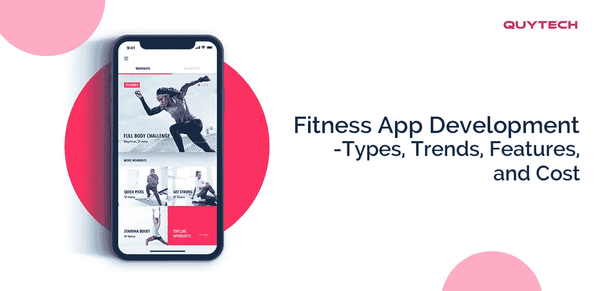
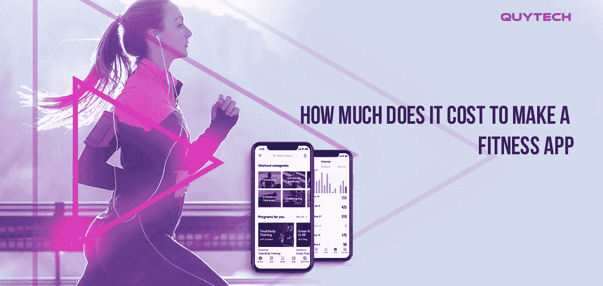
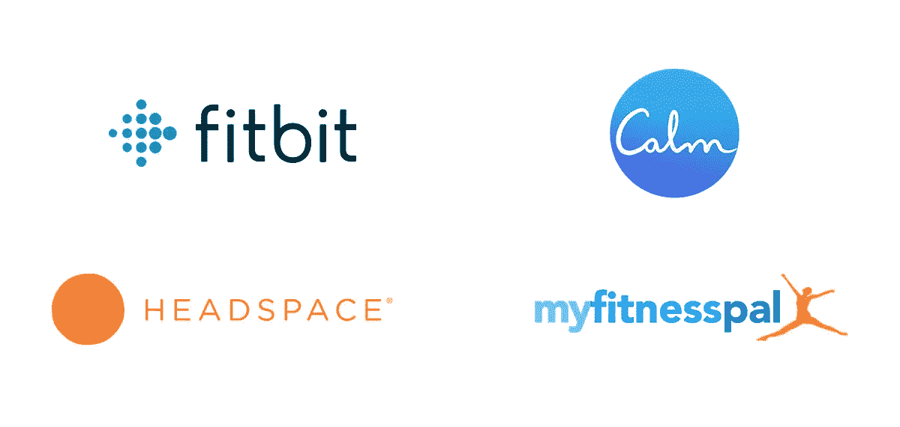

# 健身应用开发——类型、成本和理念

> 原文：<https://medium.datadriveninvestor.com/fitness-app-development-how-to-make-a-fitness-or-workout-app-3289c8e457f2?source=collection_archive---------9----------------------->

随着人们越来越意识到由肥胖和久坐不动的生活方式引起的越来越多的健康问题，已经观察到人们越来越倾向于采用健康的生活方式。然而，由于缺乏时间，许多人仍然很难去健身房和健身俱乐部。对于所有那些喜欢在家锻炼的人来说，健身应用程序绝对是一个福音。

由于人们喜欢健身行业的这一新趋势，在过去几年中，对这类应用的需求不断增加。如果你想给人们提供一个功能丰富和先进的健身应用，那么这篇文章是有趣的。在这里，我们提供了你想知道的关于健身应用的一切。阅读以下内容:

# **健身 app 开发的最新趋势有哪些？**

技术进步几乎正在给每个领域带来革命；健康健身行业也不例外。以下是[健身应用开发的当前和未来趋势](https://www.quytech.com/blog/fitness-and-gym-app-development/?utm_medium=Medium&utm_source=Fitnessapp):

*   基于人工智能的虚拟训练训练器
*   健身专业人士的现场训练
*   先进的可穿戴技术和智能服装来监测健身情况
*   使用[人工智能进行个性化膳食计划和锻炼](https://medium.com/@er.raturi5/how-to-build-a-home-workout-app-a560a160e29e)
*   利用机器学习和不同的运动识别技术进行智能锻炼
*   使用虚拟现实(VR)和增强现实(AR)

 [## 防范内部威胁:新方法|数据驱动的投资者

### 企业网络安全的一个关键问题是数据泄露的内部威胁。员工可以是数据的来源…

www.datadriveninvestor.com](https://www.datadriveninvestor.com/2020/07/30/protecting-against-insider-threat-a-novel-approach/) 

# **健身应用的类型**

健身应用程序可以分为不同的类型，以适应个人的不同健身需求。这些类型也为人们提供了一种选择保持健康的方式。以下是一些常见的健身应用类型:

*   健身追踪应用
*   基于人工智能的私人教练应用
*   瑜伽和冥想应用
*   饮食和营养应用
*   锻炼和运动应用程序

你可以考虑构建这些健身应用来获得巨大的成功。

# **健身应用的基本特性**

以下是我们建议您在为 Android 或 iOS 开发健身应用程序时考虑的功能:

*   **地理定位** -监控路线和位置。
*   **登录/注册-** 允许用户创建个人资料并从任何设备访问。
*   **社交媒体分享** -通过允许用户分享他们的健身旅程来增加用户参与度。
*   **推送通知** -发送关于新更新的通知。
*   **音乐流媒体**——让用户在锻炼时播放音乐。
*   **视频内容** -存储锻炼视频。
*   **基于人工智能的聊天机器人-** 自动回答用户的查询。

除了这些，你还可以通过集成最新的技术来添加其他特殊的功能，如 AR，VR，AI，ML 等等。然而，这可能会影响健身应用程序开发的总成本。

# **做一个健身 app 要多少钱？**

一个健身应用程序的开发成本可能在 35，000 到 50，000 美元之间。该成本可能会增加或减少，具体取决于您的特定应用需求和下述因素:

*   您希望发布应用的平台(Android 或 iOS)
*   应用程序的功能和复杂性
*   开发团队的规模和位置
*   健身应用开发者的经验
*   构建应用程序所需的技术堆栈

# **如何做一个健身 app？**

要构建一个功能丰富、UX 交互性强、界面友好的健身应用，可以联系健身应用开发公司，也可以聘请健身应用开发者。在这两种情况下，建议做彻底的研究，并检查投资组合。此外，检查反馈和客户的评价，了解开发人员或公司是如何工作的。

如果你计划为你的项目雇用健身应用程序开发人员，那么最好从一个值得信赖的移动应用程序开发公司雇用同样的人员，而不是自由职业者网站。这将向您保证开发人员只致力于您的项目。在移交您的项目之前，建议详细讨论您的应用程序需求。

# **最好的健身 app 有哪些？**

在开发一款能从目标受众那里获得巨大反响的健身应用之前，查看一下这些顶级健身应用是很重要的。查看他们的型号、功能和其他详细信息，决定你可以在健身应用程序中添加哪些内容，使其与众不同:

*   MyFitnessPal-卡路里计数器
*   平静——冥想、睡觉、放松
*   顶空-冥想和睡眠
*   Fitbit

***今天就为 Android 或 iOS 打造功能丰富的健身 app！***

**最后的想法**

随着 AR、VR、AI、ML 等技术的到来，健康和健身市场正以前所未有的速度增长。根据 Statista 的报告，截至 2020 年第二季度，健康和健身应用程序的下载量为 6.56 亿次。预计这一数字在未来一段时间内还会增加。考虑到健身应用程序的巨大普及和需求，开发一个健身应用程序肯定是一个好主意。

如果你打算这样做，那么看看这篇文章中健身应用的趋势、类型、特点和成本。在最终确定你的应用需求后，联系一家可靠的[移动应用开发公司](https://www.quytech.com/?utm_medium=Medium&utm_source=Fitnessapp)或者雇佣健身应用开发者开始开发你的项目。

**访问专家视图—** [**订阅 DDI 英特尔**](https://datadriveninvestor.com/ddi-intel)