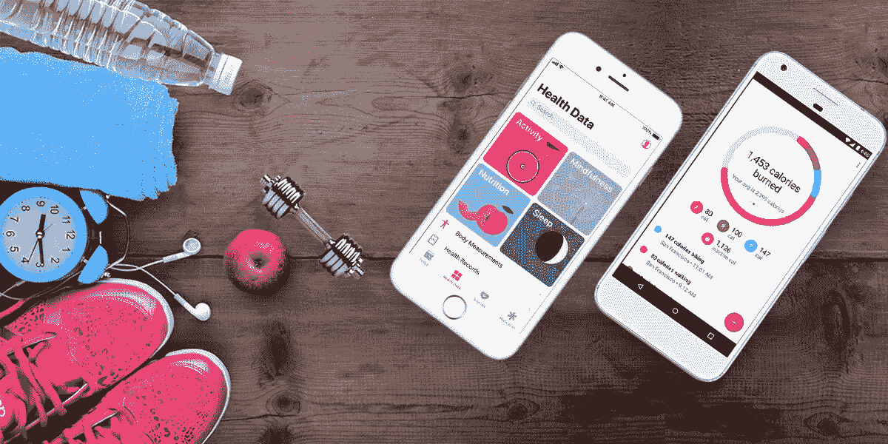

# 如何创建在市场上蓬勃发展的健身应用程序

> 原文：<https://medium.datadriveninvestor.com/fitness-app-how-to-create-fitness-app-that-thrives-in-the-market-dae71a92ac7d?source=collection_archive---------16----------------------->

我们正在见证一种健康生活方式的趋势。即使健身房被关闭，人们被要求呆在家里以防止冠状病毒的传播，我们仍然可以在 Instagram feed 上找到无尽的锻炼照片。瑜伽和冥想的流行，无麸质，健康饮食——一切都告诉我们健康是一种新的奢侈品。

健康和健身应用已经有了很高的参与度。此外，在冠状病毒的情况下，这类应用程序的用户参与度增加了许多倍。坐在家里的人们正在寻找可以帮助他们实现家庭健身和饮食计划的应用程序。超过 75%的用户每周至少访问健康和健身应用程序两次，而 25%的用户一周内访问该应用程序超过 10 次。

你有没有开发一款健身应用的想法，或者你拥有一家健身房，并且正在考虑开发一款应用，以便在封锁期间与你的客户保持联系？我们为客户设计了医疗保健和健身应用程序，我们希望通过本指南分享我们的经验，以帮助您打造出色的产品:

**如何创建健身 App？**

以下是构建健身应用程序时需要遵循的步骤:

1.  选择您想要构建的健身应用程序的类型。以下是不同类型的健身应用趋势。
2.  对市场进行分析。
3.  进行竞争分析
4.  为你的应用程序的 MVP 选择特性
5.  确保你添加的功能能让你的应用脱颖而出
6.  找一个热心可靠的软件开发公司
7.  对你的健身申请做一个详细的评估
8.  制定预算
9.  确保参与应用程序开发的规划阶段
10.  通过测试演示来检查应用程序的准备情况
11.  将应用程序发布到应用程序商店
12.  获取应用程序的源代码
13.  跟踪指标并制定促销策略
14.  定期更新您的应用并添加新功能

一旦你决定了你需要什么类型的医疗保健/健身应用程序，下一步就是找到热情和有经验的开发者，他们可以在不浪费时间的情况下提供你想要的应用程序。通过将项目外包给一个远程开发团队，你仍然可以在当前被锁定的场景中开发你的应用程序。

**App 开发流程的阶段** **粗略估算**

在这个阶段，你需要决定你想要创建的健身应用程序的类型，你认为应该出现在你的健身应用程序中的功能以及你想要包括的其他细节。通过提供您对应用程序的大致想法，您还可以询问您的团队对成本和时间的大致估计。

**规划阶段**

在此阶段，您雇佣的远程开发团队将创建一整套文档和材料，包括需求列表、基本设计和未来应用的原型。准备好这些细节后，离岸开发团队会告诉你开发一个健身应用所需的确切成本和时间。

**开发和测试**

当你将健身应用程序开发项目外包给一个远程团队时，请确保你雇佣的公司致力于敏捷软件开发方法和最新的 DevOps 原则。这使得开发人员可以同时开发和测试代码。

**发布和发布后支持**

除了产品开发，在发布后支持产品也很重要。当你在印度雇佣一个远程开发团队时，问问他们会提供多少天的产品支持。

**健身 App 开发费用**

嗯，开发 fitness 的成本取决于应用程序的复杂性和灵活性、持续时间、跨平台特性以及你所雇佣的公司的每小时开发成本。印度的应用程序开发费用从每小时 8 美元到 25 美元不等。

 [## 2019 年移动应用开发之路|数据驱动的投资者

### 任何在移动应用程序开发行业工作的人，无论他们是专注于在伦敦开发 iOS 应用程序还是…

www.datadriveninvestor.com](https://www.datadriveninvestor.com/2019/01/15/the-path-of-mobile-app-development-in-2019/) 

以下是开发一款普通健身应用程序时，不同活动的成本细分:

*   规格和设计原型(40 小时-1000 至 2000 美元)
*   前端和后端开发(400 小时-10，000 到 20，000 美元
*   用户界面设计(60 小时-1500 美元至 3000 美元)
*   测试(80 小时-2000 至 4000 美元)

因此，对于一个功能一般的理想 Android 健身应用程序，单个平台(Android 或 iOS)的基本估计值在 15，000 美元至 30，000 美元之间。而且，如果你选择的是跨平台，成本可能高达 5 万美元。

**分道扬镳**

在居家办公、封闭办公的现状下，健身 app 的需求正在上升。人们正在寻找可以在家学习锻炼的应用程序。现在，你有了分一杯羹的黄金机会。

决定正确的健身应用程序并为其选择功能是令人生畏的。请随时与我们联系，详细讨论您的需求。

*原载于 2020 年 4 月 24 日 https://graffersid.com**的* [*。*](https://graffersid.com/blogs/how-to-create-a-fitness-app-that-thrives-in-the-market/)