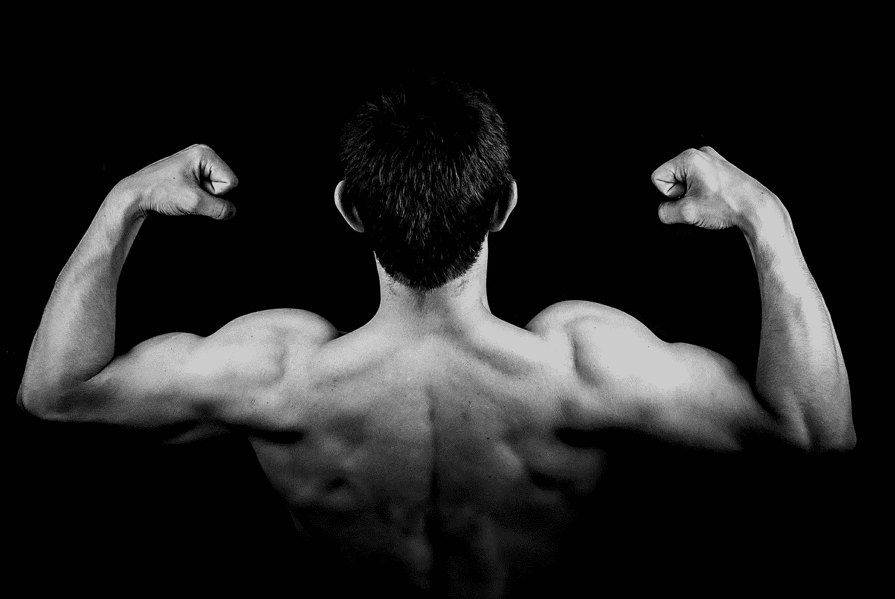
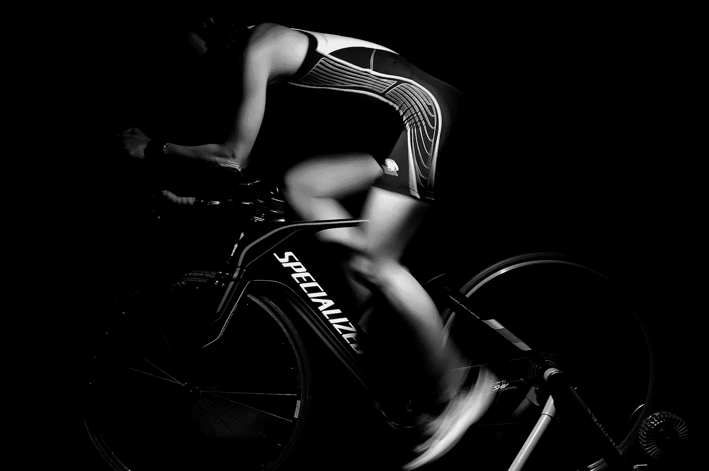

# 健身:你的健身蓝图二

> 原文：<https://medium.datadriveninvestor.com/fitness-your-fitness-blueprint-ii-6ad4eb44644b?source=collection_archive---------24----------------------->

Photo By Lukas Dylka Pixabay

## 今天呢？你已经在 HIIT 晨练之后喝了一杯绿茶，冲了一会冷水澡了吗？我打赌你没有。如果你想裸体看起来很棒，这是一个好的开始。

开始你的一天:尤其是当我睡得很沉的时候，我会在洗完 HIIT 和冷水澡后，马上去喝杯绿茶。我们都渴望看起来很好，感觉很棒。但首先，我们必须确保整合各种系统，正如我们在介绍[健身蓝图](https://medium.com/@Melichar/your-fitness-blueprint-497008e0bc50)时所描述的那样。

你可以把这看作自助餐。理想情况下，你可以将这些融入你的日常生活，但一般来说，它必须适合你和你的目标。

 [## 健康品牌从定位中成长

### 品牌定位是 Phemelo Segoe 的激情之一。她是一名企业家、健康教练和米尔部落的创始人…

www.datadriveninvestor.com](https://www.datadriveninvestor.com/2019/01/11/healthy-brands-grow-from-positioning/) 

在你开始这段健身/健康之旅之前，我建议你对自己非常诚实，用你的[健身年龄](https://www.businessinsider.com/whats-my-fitness-age-2016-7)来衡量你现在的状态。

> “健身年龄计算器”是由挪威科技大学的研究人员于 2013 年开发的，它根据你的身体健康状况来确定你的健身年龄，而不是你已经存在了多少年。

在我亲自做了测试后，我的健康水平似乎是一个比我年轻三到四岁的人。你可以看看 NTNU 对 HIIT 的建议。

> “这是关于提高生活质量，而不仅仅是关注年数。科学表明，当你锻炼时，你的寿命可能会增加，但你也会减少各种疾病的机会。”菲特巴德

> 显然，你想确保把你的营养和你的训练联系起来，你想适当地恢复。关于早餐、午餐和晚餐吃什么的有趣想法可以从莎拉的博客中获得一些灵感。

今天，我们来谈谈力量和肌肉比例，你准备好了吗？让我们继续我们的科学之旅，把我的想法和本·格林菲尔德的无垠的书结合起来。

# 力量与肌肉质量比

本说，你希望能够在小而紧密的肌肉纤维群中聚集大量的力量——换句话说，你希望拥有坚硬、结实、爆发力强的肌肉。肌肉大不一定好。相反，你应该专注于保持一些肌肉质量，同时确保肌肉尽可能地功能性和强健。

所以，一周做两次锻炼。

第一项训练是一项超级缓慢的举重训练，正如面团·麦加夫在他的书《科学的 T2 身体》中所描述的那样。进行 12 到 20 分钟的多关节练习，包括长时间的、有控制的提升(每次 30 到 60 秒)和相对较高的重量。该协议应包括:

上身推动(例如，头顶按压、俯卧撑、胸部按压)

上身划水(如弯曲或直立划水、后期下拉、引体向上)

下半身推动(如压腿、蹲下)

下体拉伸(如硬拉、罗马尼亚硬拉、下背部伸展、反向超伸)

**第二种锻炼**是一种高强度的体重循环程序，称为[七分钟锻炼](https://www.youtube.com/watch?v=mmq5zZfmIws)，由两位研究人员设计，旨在尽可能短的时间内保持力量和肌肉。做以下每个练习三十秒钟，然后在练习之间休息几秒钟。尽可能爆发性地做每个练习，尝试在 30 秒内完成尽可能多的重复(除了像平板一样的练习，这是一个等长的保持)。

Picture by Skeeze From Pixabay

**结论:**每周进行两次力量训练——一次是缓慢、可控的举重，另一次是高强度的体重运动。