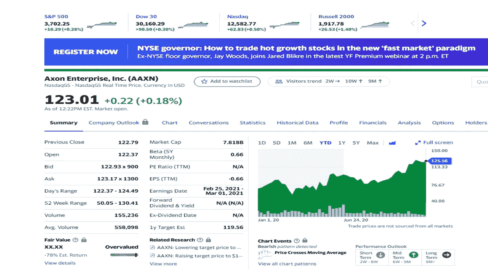
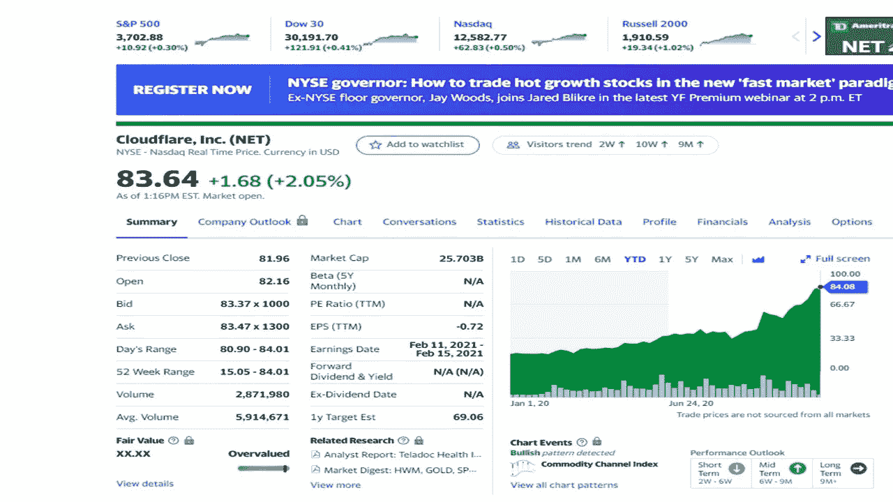
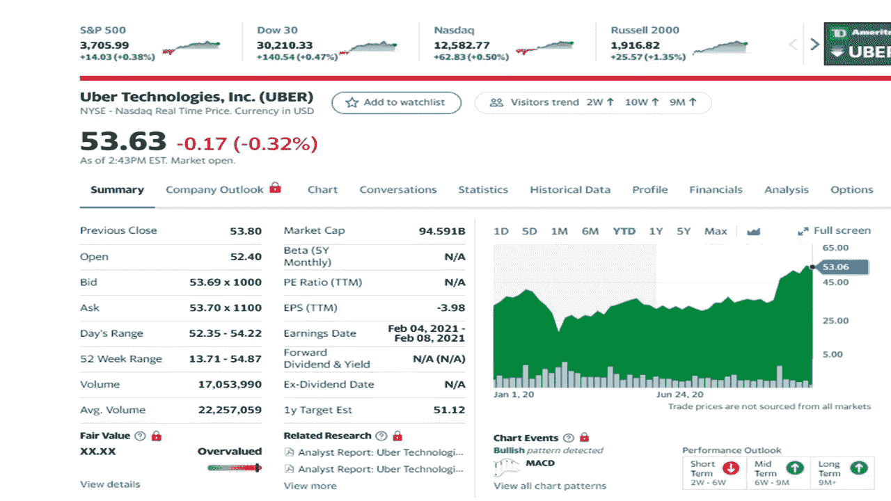
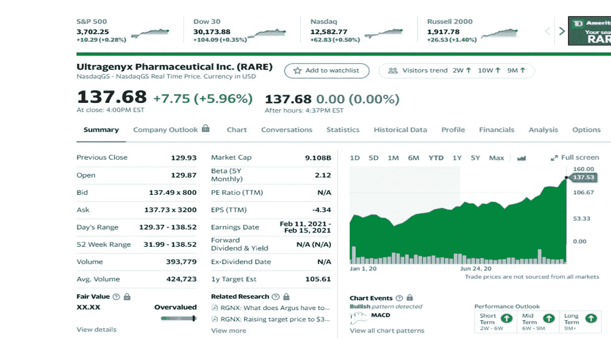
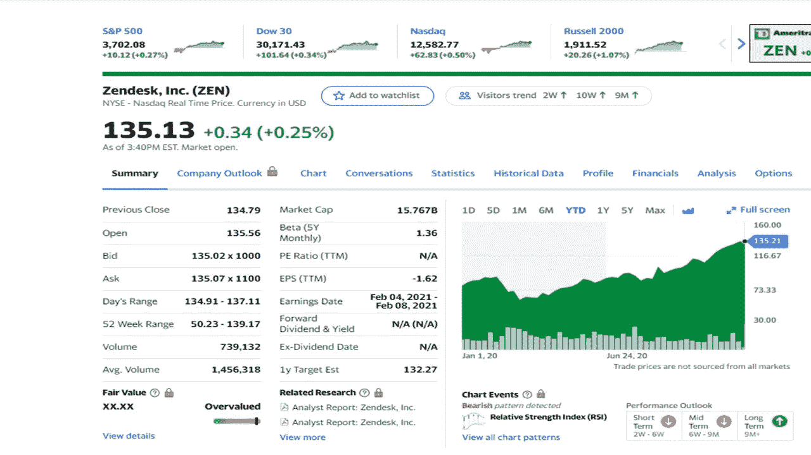

# 12 月投资的五大方法

> 原文：<https://medium.datadriveninvestor.com/five-great-ways-to-invest-in-december-c8dd6d0c89f?source=collection_archive---------8----------------------->

## 没人告诉你应该投资哪些股票

Photo by [MayoFi](https://www.pexels.com/@mayofi?utm_content=attributionCopyText&utm_medium=referral&utm_source=pexels) from [Pexels](https://www.pexels.com/photo/man-people-woman-laptop-5972325/?utm_content=attributionCopyText&utm_medium=referral&utm_source=pexels)

2020 年，有几只股票的表现超过了大盘。在分析市场的时候，你会发现这些在股市中表现不错的宝石。预计来年需求和增长会很高。随着经济放缓改善，这些股票将跟随。

我要讲的五只股票是:

*   **Axon 企业(AAXN)**
*   **云闪(网)**
*   **优步(妖孽)**
*   **Ultragenyx(稀有)**
*   **Zendesk (ZEN)**

股票价格记录在 2020 年 12 月 8 日收盘时。

# Axon Enterprise (AAXN)

Yahoo Finance

Axon 开发和销售传导能量武器(CEW)，包括泰瑟枪和软件传感器。这家公司的前身是 TASER International，Inc .，直到他们在 2017 年更名。该公司提供警官身体摄像机和 Axon fleet 车载视频系统。此外，他们通过 Evidence.com 提供基于云的数字证据管理系统。这使得执法部门能够捕获、存储、管理和分析视频证据。Axon Enterprises 通过其直销团队、合作伙伴、在线和第三方卖家销售产品。

**分析**。在过去的三个月里，销售额增长了 26%到 27%，股价也在上涨(第三季度上涨了 43%)。现金流和收入都在增加。Axon 在上个季度赢得了超过 1 亿美元的新合同。股价已经上涨，而且可能会继续上涨。

# 云闪(网)

Yahoo finance

该公司提供基于云的安全解决方案。该组织提供各种产品，包括公共云、私有云以及物联网(IoT)设备。Cloudflare 提供消费者虚拟专用网络(VPN ),帮助消费者保护和加速移动设备上的流量。该公司扩展了全球网络，覆盖全球 200 多个城市。此外，16%的财富 1000 强企业是 Cloudflare 的客户。

**分析**。这家基于订阅的公司表现出色，收入增长了 50%。Cloudflare 有 637 家公司每年支付至少 10 万美元，比一年前增长了 65%。随着越来越多的人在网上工作，股价可能会继续上涨。由于冠状病毒导致股票下跌，自市场调整以来，该股票的股价一直在攀升。

# 优步(优步)

Yahoo Finance

我相信你听说过优步。这项拼车服务在美国、加拿大、亚太地区、拉丁美洲、中东和欧洲运营技术。优步在更多领域开展工作，不仅仅是你可能用过的拼车服务。该公司将消费者与餐馆和送餐服务联系起来。优步也参与货运服务部门，因为他们连接承运人和托运人，并提供标准费率。

**分析**。第三季度，拼车需求下降了 18%，服务交付增长了 134%。在同一时期，Uber Eats 上涨了 125%。随着一些城市的预订量增加，优步的主要业务显示出复苏的迹象(在纽约，10 月份预订量上升了 63%)。第三季度乘坐收入下降了 53%，但 148 亿美元的总预订量超出了预期。管理层认为新的优步乘车应用程序也可以用于 Uber Eats。分析师预计，随着优步 Eats 在疫情期间带头收费，拼车请求将增加 40%。

 [## 另类投资——它们在后疫情时代的角色|数据驱动的投资者

### 全球疫情的经济影响继续波及全球各行各业。的…

www.datadriveninvestor.com](https://www.datadriveninvestor.com/2020/10/27/alternative-investments-their-role-in-the-post-pandemic-landscape/) 

# Ultragenyx(稀有)

Yahoo Finance

这家生物制药公司专注于治疗美国罕见和超罕见的遗传疾病。这个市场服务不足，因为罕见疾病的诊断可能需要长达 10 年的时间，而治愈是不存在的。Ultragenyx 提供了广泛的药物组合，用于治疗这一高需求领域的疾病。

**分析**。在财务方面，该公司在第三季度表现强劲，增长了 216%。2020 年总收入为 1.8 亿美元(增长 163%)，分析师预计未来两个季度将增长 90%至 100%。华尔街期望从这家公司获得更多收益。

# Zendesk(禅)

Yahoo Finance

这家领先的软件开发公司为美国、南美、欧洲、中东、非洲、澳大利亚和亚洲的组织提供服务软件解决方案和客户关系管理。该公司的主要产品是 Zendesk Support，这是一个用于跟踪和解决客户支持问题的系统。还提供了为其客户提供更多服务的其他系统。

**分析**。该公司的每股收益增长了 24%，需求强劲，本季度取消订单减少。Zendesk 在本季度实现了 10 亿美元的年收入，超出了他们的预期。他们的自由现金流增加了 2500 万美元(比 2019 年增加了 900 万美元)。今年，管理层预计将超过 10 亿美元的收入增长目标，这将显示 25%的增长。该公司的订阅收入和其他指标都在上升。

# 最后的想法

投资应该是你投资组合的一部分。这可能是股票、房地产、贵金属、加密货币或其他可投资资产。有时你必须着眼于你的未来，用你的一些收入来投资。

投资愉快！

有关投资的更多信息，请参见以下其他文章:

 [## 你要知道 11 月份的股票比肉桂卷更诱人

### 今天你应该考虑的五只股票

medium.com](https://medium.com/datadriveninvestor/you-need-to-know-november-stocks-are-more-tempting-than-a-cinnabon-a6e8bb9fc6da)  [## 我是如何在不到 10 年的时间里把 166 美元变成 6 位数的？

### 我达到六位数的大纲

medium.com](https://medium.com/makingofamillionaire/how-did-i-turn-166-into-six-figures-in-less-than-10-years-972d901891d2) 

**免责声明**。作者不拥有任何这些股票。

# 参考资料:

[卡博特财富网](https://cabotwealth.com/)

[雅虎财经](https://finance.yahoo.com/)

[**汤姆·汉迪**](https://medium.com/@tomhandy1) 是 Medium 上的顶级作家，前 Quora 作家，也是两个孩子的父亲。他从军队退役，并在几个非营利委员会任职。你可以在推特 [@tomhandy1](https://www.twitter.com/tomhandy1) 上找到他。

本文仅供参考。不应将其视为财务或法律建议。并非所有信息都是准确的。在做出任何重大财务决定之前，请咨询财务专家。

## 访问专家视图— [订阅 DDI 英特尔](https://datadriveninvestor.com/ddi-intel)