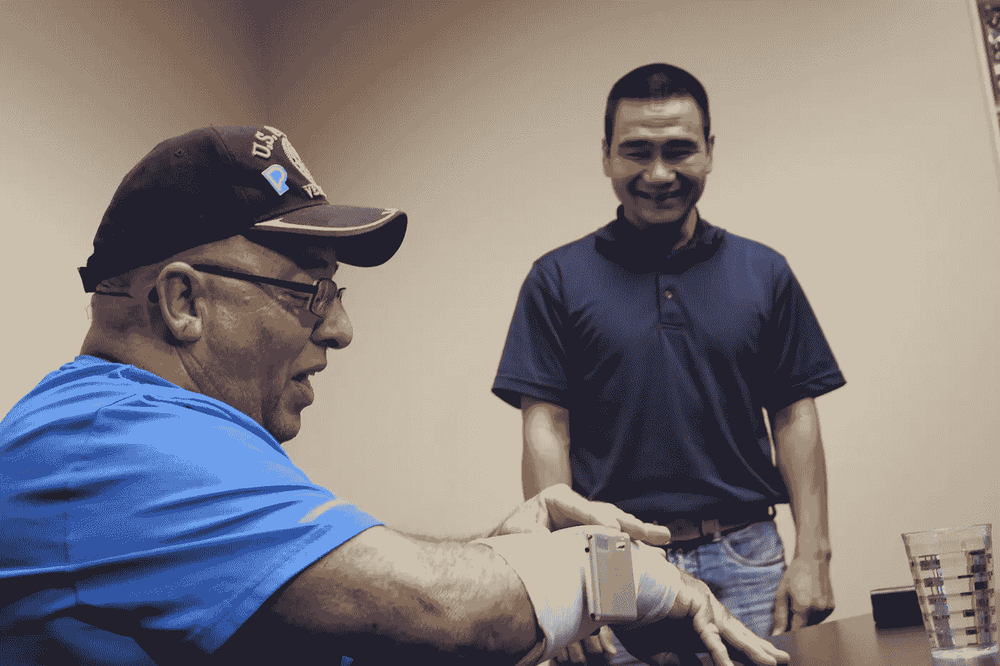

# 五微米讨论了它的启动任务，以减少震动

> 原文：<https://medium.datadriveninvestor.com/five-microns-discusses-its-startup-mission-to-reduce-tremors-9be782b531be?source=collection_archive---------30----------------------->

创始人 Leo Nguyen 博士讲述了五微米的故事，讲述了帮助震颤患者的热情如何导致弗雷斯诺州立大学校园内的实验室发明，现在是一种商业上可行的产品，称为 Tremelo，在美国各地销售。

在 www.fivemicrons.com 或 www.valleyinnovators.com[了解更多。](http://www.valleyinnovators.com.)

 [## 在创业之旅中，拥抱学习|数据驱动的投资者

### 好像建立一个数百万美元的公司还不够困难，企业家必须额外照顾他们的…

www.datadriveninvestor.com](https://www.datadriveninvestor.com/2018/10/16/on-the-entrepreneurial-trek-embrace-the-learning/)