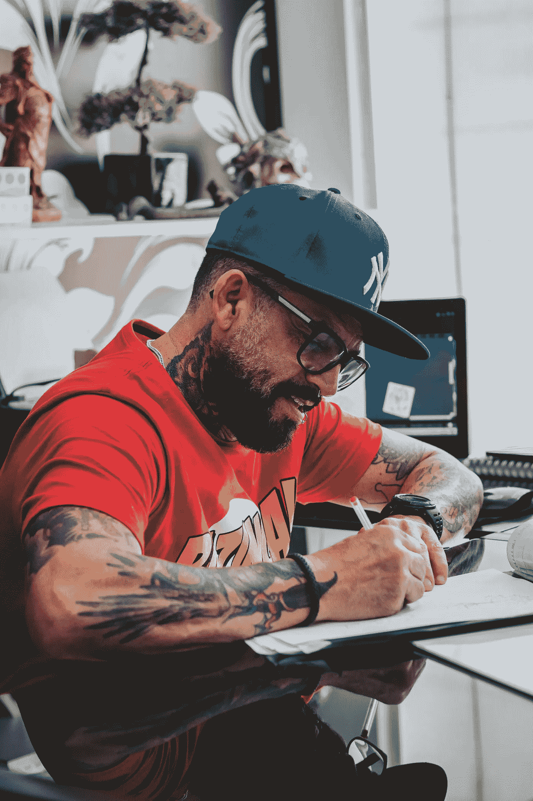

# 五句让我大吃一惊的话

> 原文：<https://medium.datadriveninvestor.com/five-quotes-that-kicked-me-in-the-butt-be5b48d520b0?source=collection_archive---------13----------------------->

以防万一你也需要一个正确方向的推动。

Photo by [Ketut Subiyanto](https://www.pexels.com/@ketut-subiyanto?utm_content=attributionCopyText&utm_medium=referral&utm_source=pexels) from [Pexels](https://www.pexels.com/photo/positive-black-male-freelancer-writing-ideas-while-standing-on-city-embankment-4559961/?utm_content=attributionCopyText&utm_medium=referral&utm_source=pexels)

像许多人一样，我也有过沮丧绝望的时候。

五年前就是其中之一。由于一些个人错误和糟糕的决定，我将自己的身份沉浸在怀疑和自我厌恶中太久了，以至于我觉得自己的内心已经腐烂了。

尽管沮丧和焦虑，我继续在我的事业上取得成就，参加演讲会，继续我的创造性写作努力，打篮球，和朋友一起去手工酿造酒吧。

我花了所有的精力假装什么都没发生。但我内心痛苦。

几个月后，我开始从我的头脑中爬出来。我开始阅读关于个人成长的书籍，其中一句话让我大吃一惊:

> “只有知道被打败是什么感觉的人才能触及他的灵魂深处，并在比赛公平时拿出赢得比赛所需的额外力量。”—穆罕默德·阿里

在走过场的时候，我把信心放错了地方，我感到进退两难。我移动得很快，但呆在同一个地方，永远忙碌，但从来没有完成任何事情。

从那以后，我成为了[出版的作者](https://www.amazon.com/Everything-Wrong-Feels-Adrian-Potter/dp/109519061X/ref=sr_1_4?qid=1560264651&refinements=p_27%3AAdrian+S.+Potter&s=books&sr=1-4&text=Adrian+S.+Potter&fbclid=IwAR1sK42MI2drdSI1VWJB-9pSq-lbUkoYBCWvSIKlmotVTllQ2hJ46DzqCn0)，出席会议，[撰写研究论文](http://www.dot.state.mn.us/research/reports/2017/201711.pdf)，并扩大了我在职业生涯中的影响领域，同时在完善我的育儿风格和个人使命方面取得了长足的进步。这不是一个完美的旅程，但我在需要赢得一些胜利的时候挤出了一些额外的力量。

我必须经历一些事情才能达到现在的水平。毫无疑问，我将不得不重启以应对未来的其他挑战——只是这次我有一个作弊代码。上，上，下，下，左，右，左，右，B，A，选择，开始。好吧，再来一遍。

说了这么多，下面是另外四个帮助我行动起来的引语。如果你需要在屁股下点火，我希望他们能给你一点火花。

> “不要找借口。让事情发生。做出改变。那就创造历史吧。”——道格·霍尔

借口是束缚你现状的锁链。

挣脱锁链，自由奔跑。不要让一堆错误的理由阻止你采取行动并努力实现你的目标。

行动是关键。你可能有一段倒霉的历史，但谁在乎呢？这并不意味着你不能让事情发生，即使面对逆境。

如果你想成为一个人或专业人士，那么你必须成熟起来，不再需要抓住借口这个安全毯。成功人士认识到这一点，无论他们是春风得意还是跌入谷底。

创造改变，你将创造你的历史。制造借口，别人会帮你写。

Photo by [Lucas Guimarães](https://www.pexels.com/@lucasgfotografia?utm_content=attributionCopyText&utm_medium=referral&utm_source=pexels) from [Pexels](https://www.pexels.com/photo/focused-bearded-man-drawing-tattoo-sketches-5131400/?utm_content=attributionCopyText&utm_medium=referral&utm_source=pexels)

> “如果你在做你真正关心的事情，你不必被逼着去做。愿景拉着你。”—史蒂夫·乔布斯

如果出于职责去做某件事，感觉很费力。你会犹豫地对待它，知道履行一项义务需要大量的精力和努力。

但是如果你做你有激情的事情，感觉毫不费力。你带着热情和投入工作的意愿去完成它，因为这个任务和你的使命是一致的。

你能避开所有你不感兴趣的事情吗？当然不是。洗衣房必须打扫，日常工作需要质量检查，有时你不得不耐着性子看完一部很烂的电视剧，因为你的孩子想看。

但是只要有可能，把注意力集中在那些与你的目标相吻合的活动上。你会惊讶于在你关心的事情上取得进展是多么容易。

> “我们坐着时会产生恐惧。我们用行动战胜它们。”—亨利·林克博士

对许多人来说，2020 年是我们面临的最深的情绪低谷。但是不要烦恼——是我们在低谷时的所作所为决定了我们随后的巅峰。但是除非我们继续前进，否则我们不会到达那里。

保持空闲为你的想象力提供了充足的时间来制造焦虑和不确定性。当你试图逃离自己的舒适区时，这些事情会一直困扰着你。但是一旦你开始前进，你会发现这条路并不像你脑海中想象的那样可怕。

> “没有人会写下一个破产、肥胖、懒惰或愚蠢的计划。当你没有计划时，就会发生这些事情。”拉里·温吉

没有计划本身就是计划，尽管是有缺陷的计划。如果你没有绘制出通往成功的路线，那么你实际上是在决定你想要失败。

没有朝着梦想前进意味着你只能原地踏步。如果你不在你想去的地方，制定一个到达那里的策略。实施它，如果需要的话改变路线，努力直到你找到回报。

阿德里安·s·波特是一名作家、工程师、顾问和演说家。他写[诗歌](https://baltimorereview.org/index.php/fall_2020/contributor/adrian-s-potter)、[短篇小说](https://aquietcourage.wordpress.com/tag/adrian-s-potter/)，以及各种主题的文章，包括创造力和个人成长。他是诗集《所有错的都觉得是对的》和散文集《至交手册》的作者。在 http://adrianspotter.com/[在线拜访他](http://adrianspotter.com/)。

# 附加文字

35 件你应该为自己做的有益的事情

[生产力的三步蓝图](https://medium.com/datadriveninvestor/a-3-step-blueprint-for-productivity-39a45e062616?sk=fd39bda59ed35f130b4e674db2f15a6f)

[没有动力的人的 5 个习惯](https://medium.com/an-idea/5-habits-of-unmotivated-people-dea1468d4768?source=friends_link&sk=3886eb72b7205ac5f1045e66808c6620)

**访问专家视图—** [**订阅 DDI 英特尔**](https://datadriveninvestor.com/ddi-intel)