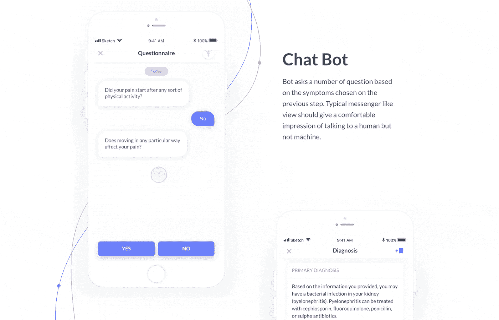
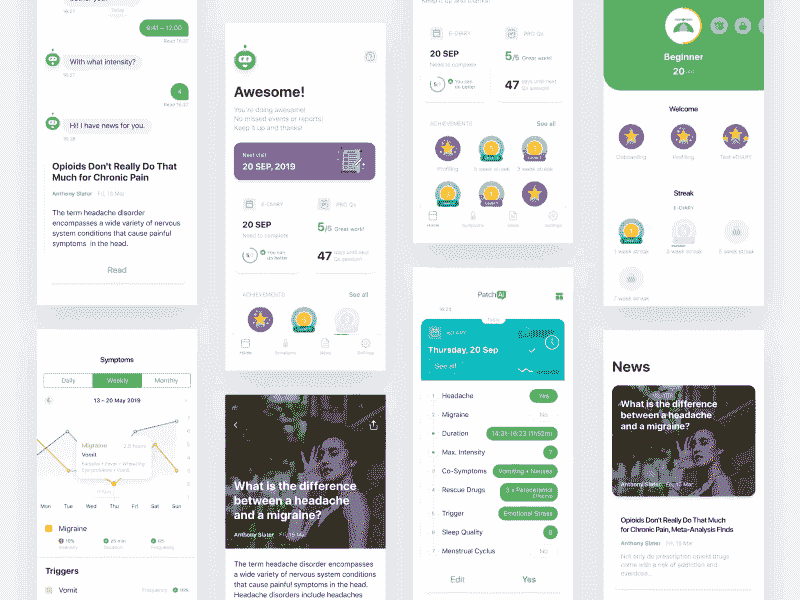
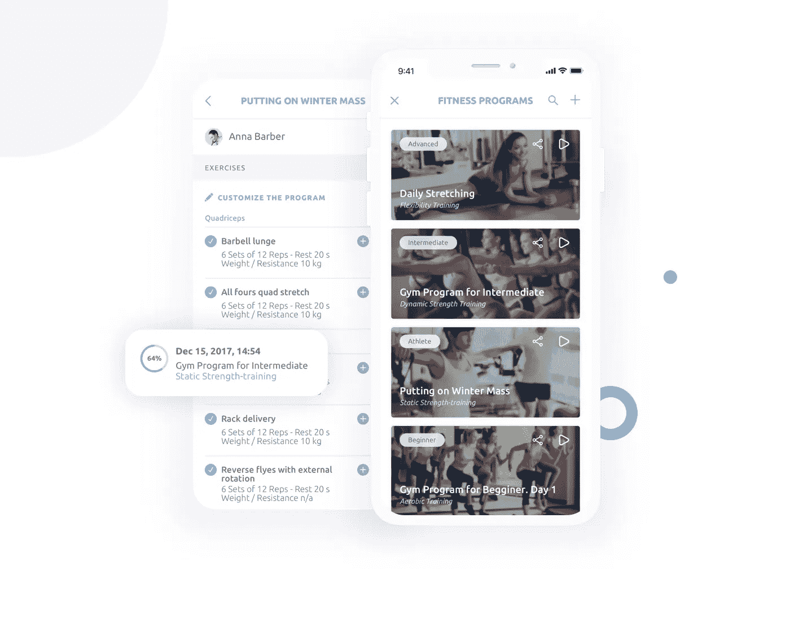
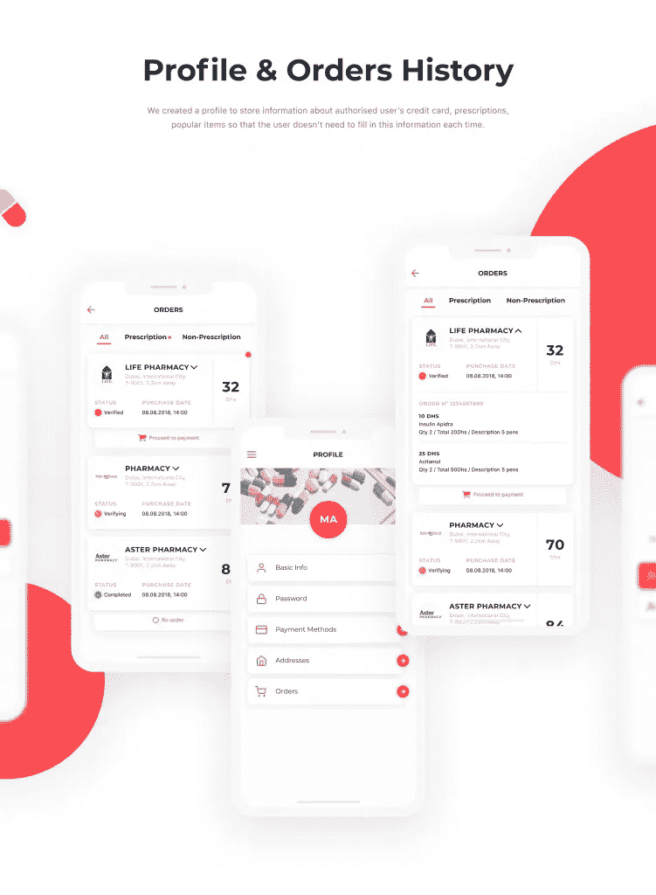

# 开发医疗保健应用程序的五条规则:Purrweb 的经验

> 原文：<https://medium.datadriveninvestor.com/five-rules-for-developing-healthcare-applications-purrwebs-experience-90b437919764?source=collection_archive---------22----------------------->

在 Purrweb，我们已经为海外市场开发了五年多的应用程序。 [*医疗保健移动应用开发*](https://www.purrweb.com/?utm_source=medium&utm_medium=five+rules+for+developing+healthcare+applications) *是我们提供的服务之一，这是有充分理由的。移动医疗(移动+健康)行业在美国和欧洲正经历着真正的繁荣。*

每天都有超过 200 种医疗保健服务在应用商店中发布。

尽管增长如此迅速，但市场仍远未饱和。此外，行业结构目前正在发生变化:例如，几年前，绝大多数应用程序实际上是针对睡眠、训练和营养的生活方式应用程序，但现在有越来越多的服务可以让你与医生沟通，监测身体状况和分析症状。此外，研究人员注意到，针对被诊断患有糖尿病、肥胖症和抑郁症的人的移动应用的利基市场仍然几乎无人问津。

这些情况使得医疗保健移动应用程序的开发对争夺用户注意力的企业家来说非常有吸引力。由于竞争是巨大的，每个细节对于应用程序的成功都变得至关重要:销售、营销，当然，还有项目实现所基于的技术、可靠性、便利性和视觉外观。最后四点我们公司负责。

在本文中，我们分享了为西方市场的客户提供医疗保健移动应用开发服务时遵循的核心原则。这些规则允许我们在短短 3 个月内交付可靠的医疗保健应用。

# 1.关注用户，而不是诊所

在俄罗斯及其他地区，医疗保健移动应用程序开发服务在诊所中需求量很大。这是合乎逻辑的，因为技术的使用是该组织提供的服务的专业性和质量的重要指标:根据调查，79%的患者更有可能选择在治疗期间提供“技术支持”的医疗保健提供商，一半的参与者甚至准备更换诊所和医生，以满足这一标准。

移动健康应用是吸引客户并开始与他们互动的有效方式，这就是为什么我们应该始终关注最终用户、他们的需求、问题和疑虑。

医疗保健移动应用程序开发是获得更多客户的有效途径——事实。但是这里有一个重要的细微差别。以用户为中心不仅仅是重复这句经典的“我们关心目标”的口号。在 MHealth，这是一个建立信任的系统化过程。要做到这一点，用户应该了解服务如何工作，清楚地看到结果，并确保机密信息是完全安全的。

在美国，医疗保健移动应用程序开发服务和应用程序必须符合 HIPAA(健康保险便携性和责任法案)标准，这是一套维护机密性和确保患者数据安全的规则。遵守这些要求可以保证用户的私人信息 100%安全。

在俄罗斯，医疗保健移动应用程序开发也有类似的规定——卫生部“关于批准接受医疗保健的人以及正在接受医疗检查的人的匿名信息的程序”的命令从法律的角度来看，遵守这个命令的要求是强制性的，但是如果你想让人们信任你的服务，你将需要额外的操作。例如，一旦我们实现了一个功能，允许用户决定他们的医生可以查看哪些数据，哪些数据应该隐藏。这似乎没什么新鲜的，但对大多数人来说，这是一个重要的细微差别。

# 2.具有“非医疗”外观和感觉的医疗服务

使国外医疗保健服务脱颖而出的主要区别是，它们实际上看起来不像医疗保健应用程序。极简主义、纯粹和平静的配色方案——这是决定它们外观的三个关键原则。

当试图解决健康问题时，我们习惯于涉水通过复杂的术语、复杂的过程和杂乱的描述。此外，有一个广为流传的神话，即所有这些复杂性是深厚专业知识和严肃性的良好指标。许多开发人员将这种复杂性带入界面中，并说“我们不是那样的，行业是那样的。”

是的，医疗保健是一个非常复杂的行业，在整个产品生产过程中需要牢记许多法律上的细微差别。但是这不应该影响界面、设计和用户场景。该应用程序是医生和没有受过医学教育的人之间的桥梁。使这座桥方便可靠是至关重要的。

由此得出几个值得注意的结论:数字服务不应该取代医生，因此它不应该在“专业”方面与医生竞争。通过使用复杂的术语和令人困惑的场景，你不会获得用户的信任，而这是至关重要的。移动医疗应用的主要目标是确保医患沟通尽可能顺畅，这并不像乍看上去那么难。

[**阅读更多 SCRUM、小狗和超过 5K 的 Google Play 下载:我们如何为德国的宠物主人开发一款应用**](https://www.purrweb.com/blog/app-development-for-petowners/)

例如，您可以自动化整个沟通过程的某个部分。我们的一个客户，美国初创公司 Lytic，使用聊天机器人自动收集病历(症状和投诉)。聊天机器人提出引导性问题，提供答案选项，如果怀疑有疾病，它会安排与特定医生的预约或进行特定测试。因此，当医生看到患者时，初始信息已经收集完毕，这大大减少了等待时间并简化了入院流程。

[我们在 Purrweb 创建的医疗保健系统](https://www.purrweb.com/portfolio/healthcare/)

聊天机器人看起来像一个标准的信使，帮助用户以一种非常简单和结构良好的方式描述他们的状况。

# 3.动机的游戏化

能够看到结果往往会激励人们。游戏化听起来是通过展示进步来管理动机的最佳方式。

但是移动健康应用需要平衡，因为关注健康仍然不是一个游戏:用户不喜欢太滑稽、卡通化的解决方案。游戏化应该引人入胜，有意义，但仍然足够严肃。

我们已经创建了特殊的仪表板，并将游戏化元素集成到应用程序中，允许医生给病人开药

通过在用户界面中集成游戏化元素，我们可以激励用户按时服药，而不会停止治疗。

# 4.越个性化越好

MHealth 应用程序的巨大问题是，大多数用户下载它们，打开一两次，然后就再也不会回来了。原因之一是建议和内容与他们的日常事务无关。

用户不希望为了将医疗保健融入他们的生活而过度劳累并改变他们的生活方式，他们希望以最小的努力将应用程序和医疗保健融入他们的日常生活方式。是的，这是一个有争议的愿望，但有一个重要的见解。

谈到医疗保健，目标受众不能被想象成“收入高于平均水平的 30 岁以上的活跃男性”。健康状态和身体状况因人而异，再加上每个人的口味、能力、习惯都不一样，况且这些因素都是在不断变化的。

有两种方法来应对目标受众的异质性。一种选择是尽可能定制服务，例如，为正在与抑郁症作斗争的某个社会阶层的人。

否则，服务应该有强大的个性化工具，如投票或聊天机器人。你可能有一个体面的体重控制解决方案，但如果你的应用程序不断地向一个不喜欢橙子的人提供橙子，而不是找到一个好的替代品——这个应用程序的未来将变得模糊。

FitForce，这是我们在 Purrweb 为运动教练开发的一款手机应用程序

在这个项目中，我们实现了一个功能，使培训师能够创建自己的培训系统并实时更新。

# 5.清除用户脚本

根据统计数据，用户最多尝试三次来理解应用程序是如何工作的。如果他们未能注册、预约医生或收到推荐，该应用程序很可能会被扔进垃圾箱。

为了防止这种情况，你必须考虑到医疗保健应用市场不仅包括千禧一代，还包括 40 岁以上和 50 岁以上的人。然而，即使你的服务是针对年纪较大的观众，这仍然不是一个理由去创造一个 21 世纪初的设计。

实践表明，在开发界面时，你仍然应该坚持整洁和极简主义的原则。然而，与此同时，添加工具提示向用户解释应用程序如何工作是至关重要的。

还有其他方法来简化与应用程序的交互，例如，保存操作的历史记录，为了减少未来的步骤数而重用以前输入的信息，等等。

由 Purrweb 设计的[药房 app](https://www.purrweb.com/portfolio/saidali/)

对于这个应用程序，我们创建了一个单独的个人资料页面，用于存储有关支付方式、处方和热门产品的信息。

# 包装东西

在医疗保健行业推出移动应用程序有许多细微差别，但这并不能取代一个主要的启动规则:你不应该推迟应用程序的发布。如果你对产品的第一个版本非常满意，很可能你发布的太晚了。最后，我们想分享一个(超级短的)Purrweb 规则列表，它将帮助你在紧迫的期限内启动医疗保健和健康相关的 MVP 也就是说，在 3 个月内。

首先，大多数 IT 团队在发布之前就已经精疲力尽了，尽管更合理的做法是节省精力，以便在人们开始使用应用程序后快速修复 bug。在这个阶段，你不应该害怕负面评论:开发人员和技术支持团队的快速反应可以将最激烈的批评者变成忠诚的用户。

其次，您必须记住，即使应用程序中的错误是可以接受的，但是关于用户数据的任何错误都是绝对不可接受的。同时，确保用户隐私不应该延长发布时间:有简单而可靠的技术可以保证符合法律要求。

第三，必须明智地确定优先事项。这意味着没有借口在设计、安全和 QA 测试人员身上偷工减料。然而，即使你有一个无限的项目开发预算，你可以摆脱不必要的功能，不要在昂贵的技术上超支。例如，创业公司开发原生应用毫无意义:现在跨平台开发的水平已经显著增长，因此用户甚至不会注意到差异。