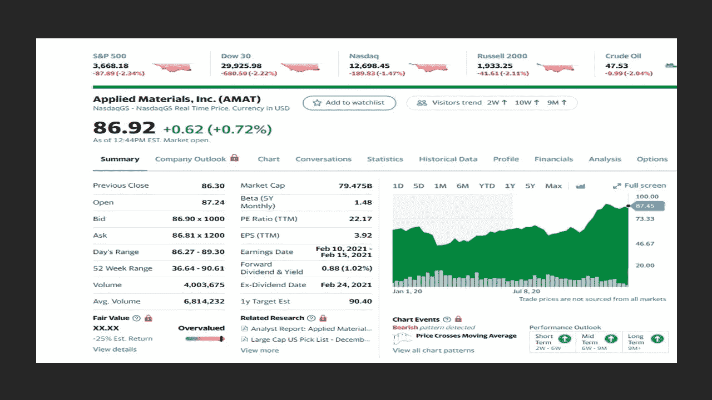
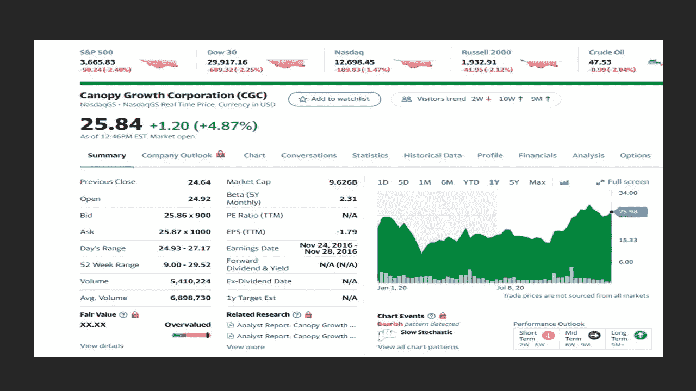
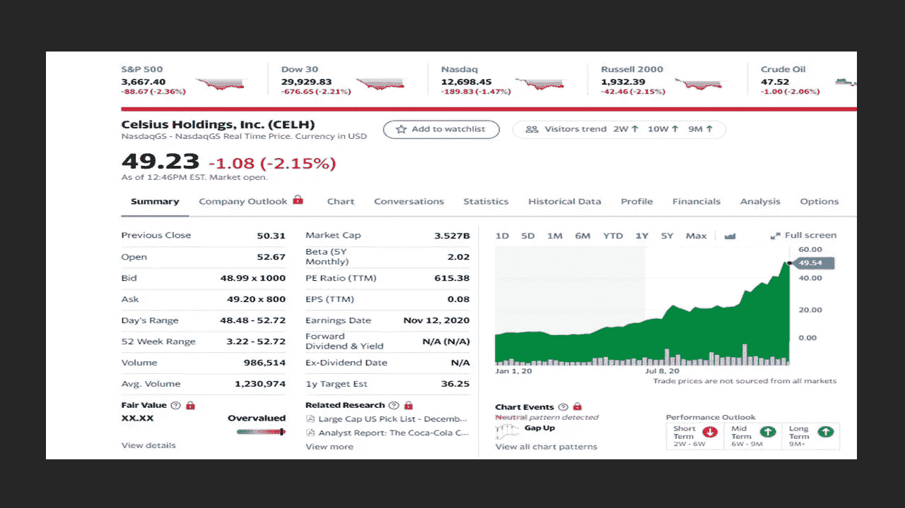
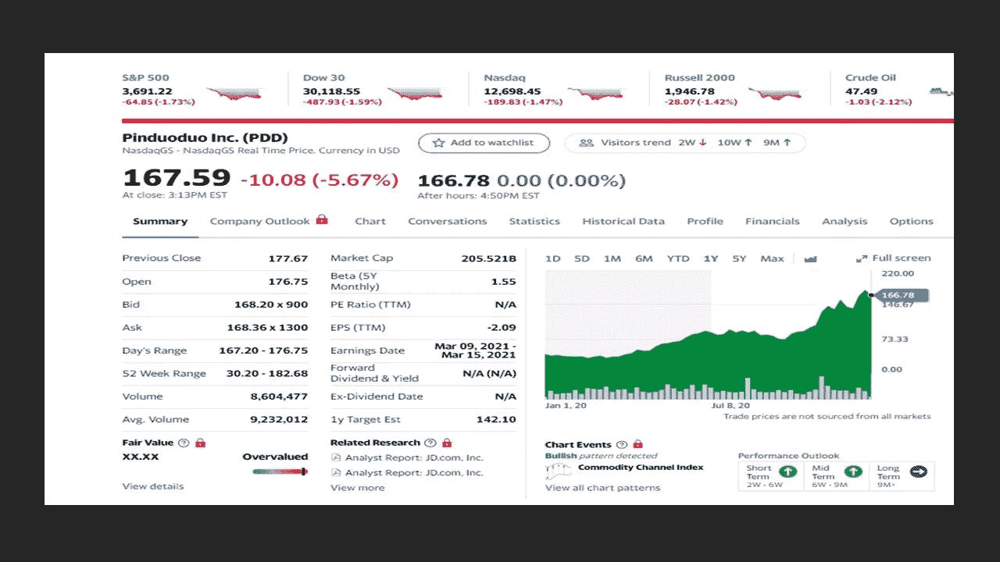
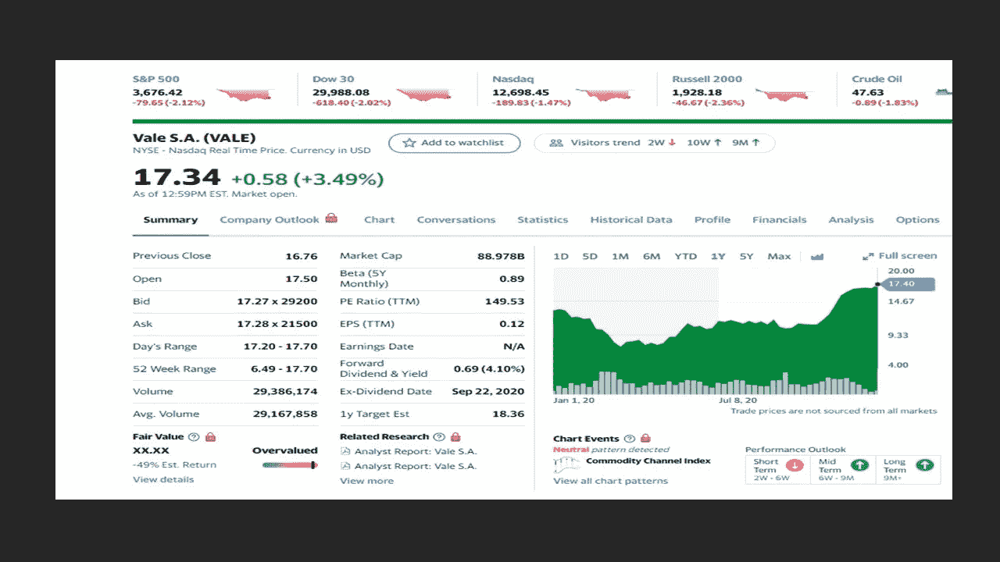

# 一月股市你应该考虑的五只股票

> 原文：<https://medium.datadriveninvestor.com/five-stocks-you-should-consider-in-the-january-stock-market-ddd574e1bfc0?source=collection_archive---------13----------------------->

## 新的一年给你带来新的市场机会

Photo by [Ketut Subiyanto](https://www.pexels.com/@ketut-subiyanto?utm_content=attributionCopyText&utm_medium=referral&utm_source=pexels) from [Pexels](https://www.pexels.com/photo/focused-couple-browsing-laptop-on-cardboard-box-4245926/?utm_content=attributionCopyText&utm_medium=referral&utm_source=pexels)

2020 年，有几只股票的表现超过了大盘。在分析市场的时候，你会发现这些在股市中表现不错的宝石。预计来年需求和增长会很高。随着经济放缓改善，这些股票将跟随。

这些股票涵盖了几个不同的经济部门，经受住了目睹的变化。在即将到来的一年里，这些股票的前景一片光明。

# 我要讲的五只股票是:

*   应用材料公司(AMAT)
*   树冠生长(CGC)
*   摄氏控股公司
*   品多多
*   淡水河谷

股票价格记录在 2021 年 1 月 4 日收盘时。

> 你越早开始投资，你在以后的生活中就会有越多的钱。你越晚开始投资，你的钱就越少。
> 
> 尽早投资。

# 应用材料公司(AMAT)

Yahoo Finance

**公司简介**。应用材料公司为半导体和显示器行业以及太阳能电池板提供服务。该公司开发、制造和销售半导体芯片或集成电路的制造设备。该公司在美国、欧洲、中国、韩国、台湾、日本和东南亚国家开展全球业务。

**分析**。在成功通过 COVID 障碍后，第四季度报告显示收入增长 25%，每股收益为 1.25 美元(增长 56%)。该公司连续四个季度销售额和利润增长。分析师预计这一进程将会继续。在特朗普总统领导下的贸易中断后，该公司预计中美关系将得到改善。中国为应用材料提供了 29%的收入。这家公司希望在材料工程，尤其是人工智能方面做得更好。

# 树冠生长(CGC)

Yahoo Finance

**公司简介**。Canopy Growth 在美国、加拿大、英国和德国从事医疗和娱乐用大麻的生产和销售。该公司提供干大麻花、油、浓缩物和软胶囊。Canopy 以多个品牌提供服务，如 Bean & Bud、BioSteel、Deep Space、DNA Genetics CraftGrow、DOJA、First & Free、Quatreau、Spectrum Therapeutics、Tweed、TWD、This Works、Tokyo Smoke 和 Van der Pop。

**分析**。最近美国选举中的一个亮点是，包括亚利桑那州、蒙大拿州、新泽西州和南达科他州在内的四个州批准了娱乐用途，而 50 个州中有 14 个州仍然禁止该产品。最近一个季度，娱乐增长了 377%。Canopy 正在推出新产品，如玛莎·斯图尔特(Martha Stewart)的 CBD Wellness Gummies 采样器和 CBD 灌注饮料。随着拜登的获胜，大麻监管在美国看起来是积极的，因为金融机构将被合法允许与大麻公司做生意，并且大麻可能合法化。Canopy 已经准备好进军美国，预计未来几年杂草行业将会蓬勃发展。

# 摄氏控股公司

Yahoo Finance

**公司简介**。Celsius 在美国和世界范围内开发、分销和销售燃烧卡路里的健身饮料。Celsius 提供无糖饮料，不含防腐剂、人工香料或色素，由健康成分制成。提供几种口味，包括各种口味，包括碳酸橙，可乐，葡萄，绿茶/葡萄柚瓜，绿茶/桃芒果，野生浆果，猕猴桃番石榴；非碳酸绿茶树莓/巴西莓，西瓜浆果，草莓和奶油，以及起泡葡萄柚，黄瓜酸橙和橙石榴。该公司还提供碳酸口味的膳食补充剂。

**分析**。能量饮料比软饮料更受年轻人的欢迎，因为软饮料通常含糖量更高。该公司正在发展壮大，最近与百事可乐、Keurig、Dr. Pepper、Anheuser Busch 和 Miller Coors 达成了分销协议。美国的分销覆盖了 74，000 个地点，他们是亚马逊上第三大能量饮料销售商。美国铝罐短缺可能会影响到 2021 年的增长利润率，这给摄氏温度带来了一点伤害。该公司正在努力推广他们的流动粉状饮料棒和快速品牌的蛋白质棒。在第三季度，Celsius 在现金流方面创下了多项纪录，包括收入、毛利率和净收入在内的关键指标。第三季度的一个亮点是分销增长了 60%,现有客户实现了两位数的增长。在亚马逊销售的帮助下，本季度电子商务渠道的增长也超过了 100%。分析师预计下一季度增长将超过 30%。

# 品多多

Yahoo Finance

**公司简介**。如果你想涉足电子商务业务，但不从事实际销售，那么品多多可能是你要找的公司。这家民国公司运营电子商务移动平台。品多多提供广泛的产品，包括服装、鞋、包、儿童用品、电子电器、家具和家庭用品、运动和健身设备以及汽车配件。

**分析**。拼多多是顶级电子商务公司之一，市值 1700 亿美元。第三季度每月用户数达到 6.43 亿，高于第二季度的 5.69 亿。他们在中国电子商务行业的市场份额预计将在 2023 年超过 6.5 万亿美元。该公司进军在线生鲜杂货平台，为用户提供次日送达服务。与阿里巴巴和 JD.com 等其他在线平台不同的是，拼多多与当地农场合作，减少了运输时间，同时最大限度地减少了浪费和物流成本。第三季度，品道道首次实现季度盈利，收入为 21 亿美元，同比增长 99%。

# 淡水河谷

Yahoo Finance

**公司简介**。淡水河谷在巴西和其他国家生产和销售用于炼钢的铁矿石。该公司经营贱金属、煤炭和黑色矿物。含铁矿物生产和提取铁矿石。贱金属提取和生产镍和其他副产品，如金、银、铜和其他贵金属。淡水河谷是巴西最大的公司之一，也是全球第二大铁矿石和镍生产商。

**分析**。随着铁矿石价格上涨，随着中国对这种金属的需求增长，生产商再次成为焦点。该公司预计，今年铜和镍的产量将会增长，这两种商品的价格也会上涨。铁矿石是该公司股价上涨的主要原因，占其收入的 85%。第三季度收益为 57 美分(比一年前增长 78%)。分析师预计今年每股收益为 1.82 美元，明年为 2.60 美元。

有关投资的更多信息，请参见以下其他文章:

 [## 12 月投资的五大方法

### 没人告诉你应该投资哪些股票

medium.com](https://medium.com/datadriveninvestor/five-great-ways-to-invest-in-december-c8dd6d0c89f)  [## 我是如何在不到 10 年的时间里把 166 美元变成 6 位数的？

### 我达到六位数的大纲

medium.com](https://medium.com/makingofamillionaire/how-did-i-turn-166-into-six-figures-in-less-than-10-years-972d901891d2) 

**免责声明**。作者不拥有任何这些股票。

# 参考资料:

[卡伯特财富网](https://cabotwealth.com/)

[雅虎财经](https://finance.yahoo.com/)

[**汤姆·汉迪**](https://medium.com/@tomhandy1) 是 Medium 上的顶级作家，前 Quora 作家，也是两个孩子的父亲。他从军队退役，并在几个非营利委员会任职。你可以在推特 [@tomhandy1](https://www.twitter.com/tomhandy1) 上找到他。

本文仅供参考。不应将其视为财务或法律建议。并非所有信息都是准确的。在做出任何重大财务决定之前，请咨询财务专家。

**进入专家视角—** [**订阅 DDI 英特尔**](https://datadriveninvestor.com/ddi-intel)